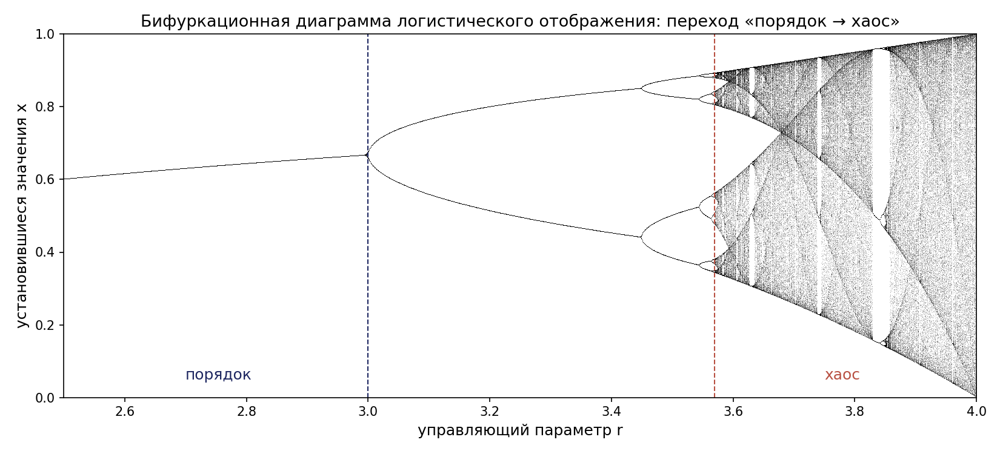
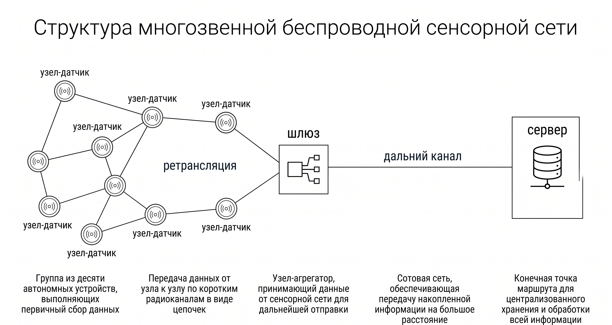
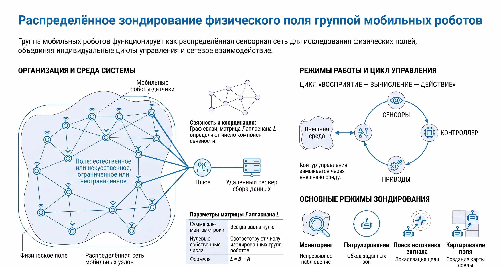

# Глава 1. Введение в распределённые робототехнические системы

Настоящая глава закладывает понятийный фундамент курса. В ней рассматривается теория сложных систем как методологическая основа изучения коллективной робототехники, вводится строгое определение распределённой робототехнической системы (РРТС), анализируются её отличия от централизованных архитектур, обсуждаются области применения и реальные промышленные и исследовательские проекты. Завершает главу введение в математический аппарат описания РРТС: графовые модели коммуникационных топологий, динамические модели агентов и базовый протокол согласования (консенсуса), который служит «строительным блоком» большинства алгоритмов коллективного управления, изучаемых в последующих главах.

## 1.1. Сложные системы как методологическая основа коллективной робототехники

### 1.1.1. Понятие сложной системы

Под сложной системой понимается система, состоящая из большого числа взаимодействующих компонентов (агентов, элементов, подсистем), коллективное поведение которой не может быть полностью выведено или предсказано на основе знания свойств отдельных компонентов и парных взаимодействий между ними. Ключевым в этом определении является не количественный признак (число элементов), а качественный: наличие нетривиальных, как правило нелинейных, взаимодействий, порождающих на уровне системы свойства, отсутствующие на уровне её частей.

Следует различать понятия «сложная система» (complex system) и «усложнённая система» (complicated system). Современный авиалайнер содержит миллионы деталей и является чрезвычайно усложнённой системой, однако его поведение в целом детерминировано, иерархически декомпозируемо и предсказуемо: система спроектирована так, чтобы целое было в точности суммой функций частей. Напротив, муравейник, состоящий из сравнительно простых особей, является сложной системой: маршрутные сети фуражировки, терморегуляция гнезда и коллективная оборона не заложены ни в одну отдельную особь, а возникают из локальных взаимодействий. Именно этот второй тип организации служит образцом для распределённой робототехники.

### 1.1.2. Фундаментальные свойства сложных систем

Анализ литературы по теории сложности позволяет выделить пять взаимосвязанных свойств, характеризующих сложные системы и непосредственно значимых для робототехнических приложений.

Эмерджентность — возникновение на уровне системы качественно новых свойств, функций или структур, не присущих отдельным компонентам и не сводимых к их сумме. Классический пример из робототехники: способность группы простых роботов, каждый из которых умеет лишь измерять расстояние до соседей и двигаться, коллективно формировать заданную геометрическую фигуру. Свойство «образовывать фигуру» не принадлежит ни одному роботу в отдельности — оно эмерджентно.

Нелинейность — непропорциональность отклика системы величине воздействия. В нелинейных системах принцип суперпозиции не выполняется: удвоение входного воздействия не приводит к удвоению выхода, а малые возмущения могут вызывать качественные перестройки поведения (бифуркации). Для РРТС нелинейность означает, в частности, что добавление одного агента или разрыв одного канала связи способны кардинально изменить коллективную динамику — например, разбить единую группу на несогласованные кластеры.

Адаптивность — способность системы изменять своё поведение и внутреннюю организацию в ответ на изменения внешней среды, сохраняя при этом функциональность. Адаптивность сложных систем, как правило, реализуется без внешнего «перепроектирования»: система перестраивается за счёт локальных механизмов обратной связи.

Децентрализованность управления — отсутствие единого центра, обладающего полной информацией о состоянии системы и принимающего решения за все компоненты. Решения принимаются на локальном уровне, на основе локально доступной информации. Важно подчеркнуть, что децентрализация не означает отсутствие координации: согласованность достигается через взаимодействие, а не через подчинение.

Самоорганизация — способность системы спонтанно, без внешнего управляющего воздействия и без предопределённого глобального шаблона, формировать упорядоченные пространственные, временные или функциональные структуры. Механизм самоорганизации обычно опирается на положительные обратные связи (усиление случайных флуктуаций), отрицательные обратные связи (стабилизация), многократные взаимодействия и стохастичность.

### 1.1.3. Примеры сложных систем различной природы

Сложные системы встречаются во всех сферах природы и техники, и их сопоставительный анализ полезен для переноса принципов организации в робототехнику.

Биологические системы дают наиболее богатый материал. Стаи скворцов, насчитывающие тысячи птиц, выполняют согласованные манёвры без лидера: как показали этологические исследования, каждая птица отслеживает лишь шесть-семь ближайших соседей. Колонии муравьёв решают задачи поиска кратчайших путей посредством стигмергии — непрямой коммуникации через модификацию среды (феромонные метки). Пчелиный рой коллективно выбирает место для нового гнезда посредством процедуры, математически эквивалентной распределённому голосованию. Эти механизмы легли в основу целого направления — роевой робототехники (swarm robotics).

Физические системы: турбулентные течения, климатическая система Земли, процессы кристаллизации и образования диссипативных структур (ячейки Бенара, реакция Белоусова–Жаботинского) демонстрируют самоорганизацию в неживой природе и изучаются синергетикой (Г. Хакен) и теорией диссипативных структур (И. Пригожин).

Социально-экономические системы: финансовые рынки, транспортные потоки мегаполисов, динамика мнений в социальных сетях. Показательно, что математические модели согласования мнений (модели Де Гроота, Хегсельмана–Краузе) формально совпадают с протоколами консенсуса, применяемыми в мультиагентной робототехнике.

Технические системы: Интернет (маршрутизация без центрального диспетчера), электроэнергетические системы (синхронизация генераторов), пиринговые и блокчейн-сети. Эти системы доказывают практическую реализуемость крупномасштабной децентрализованной координации в инженерной практике.

### 1.1.4. Динамика самоорганизующихся систем: равновесие и переход «порядок — хаос»

Поведение самоорганизующейся системы удобно описывать как эволюцию её состояния x во времени под действием фиксированного правила. Для систем дискретного времени, к которым относятся и клеточные автоматы, и многие алгоритмы коллективного управления, эволюция задаётся отображением xₜ₊₁ = f(xₜ), где xₜ — вектор состояния (например, позиции и скорости всех агентов) в момент t. Точкой равновесия (неподвижной точкой) называется состояние x*, удовлетворяющее x* = f(x*): попав в него, система остаётся там неизменно. В терминах коллективной робототехники равновесия соответствуют содержательным согласованным состояниям — достигнутому строю, установившемуся распределению задач, стабильному покрытию территории.

Равновесия различаются по устойчивости. Устойчивое равновесие возвращает систему к себе после малого возмущения; неустойчивое — усиливает любое отклонение; седловое устойчиво по одним направлениям и неустойчиво по другим. Для одномерного отображения устойчивость неподвижной точки определяется производной правила: равновесие x* асимптотически устойчиво при |f′(x*)| < 1 и неустойчиво при |f′(x*)| > 1. Общим инструментом анализа служит метод функций Ляпунова: если удаётся построить неотрицательную функцию V(x), убывающую вдоль траекторий системы, равновесие устойчиво; количественной мерой чувствительности к начальным условиям является старший показатель Ляпунова λ, характеризующий среднюю скорость экспоненциального расхождения близких траекторий (δ(t) ≈ δ(0)·e^{λt}). Отрицательный показатель означает сходимость траекторий и предсказуемую динамику, положительный — экспоненциальную чувствительность к начальным условиям, то есть детерминированный хаос.

Переход системы от упорядоченного поведения к хаотическому при плавном изменении управляющего параметра — фундаментальное явление, значимое и для РРТС. Классической иллюстрацией служит логистическое отображение xₙ₊₁ = r·xₙ·(1 − xₙ), моделирующее рост популяции с насыщением. При r < 3 система сходится к единственному устойчивому равновесию (порядок); при переходе r через 3 равновесие теряет устойчивость и возникает устойчивый цикл периода 2, затем 4, 8, … — каскад бифуркаций удвоения периода; при r ≈ 3,57 период становится бесконечным и динамика делается хаотической (рис. 1.1). Аналогичные сценарии наблюдаются в группах роботов: при чрезмерном усилении сил взаимодействия или при слишком большом числе тесно связанных агентов согласованное движение может смениться нерегулярным, «дрожащим» поведением. Практический вывод двойствен: с одной стороны, проектировщик распределённой системы должен удерживать её параметры в области устойчивости (ограничивая коэффициенты связи, вводя иерархию и демпфирование); с другой — управляемый переход к «краю хаоса» повышает исследовательскую способность роя и помогает выходить из локальных оптимумов, что используется в стохастических и эволюционных алгоритмах коллективного поведения.



## 1.2. Распределённые технические системы

Прежде чем переходить к собственно робототехническим системам, рассмотрим более широкий класс распределённых технических систем, из которого РРТС заимствуют архитектурные решения, протоколы и алгоритмы.

### 1.2.1. Сенсорные сети

Беспроводная сенсорная сеть (Wireless Sensor Network, WSN) — совокупность пространственно распределённых автономных сенсорных узлов, осуществляющих совместный сбор, первичную обработку и передачу данных о параметрах окружающей среды. Каждый узел содержит сенсоры, микроконтроллер, приёмопередатчик и источник питания; данные передаются по многозвенным (multi-hop) маршрутам. Характерные задачи — распределённое оценивание поля физической величины (температуры, концентрации), обнаружение и локализация событий, слежение за подвижными объектами. Области применения включают экологический мониторинг, промышленную телеметрию, системы охраны периметра и «умные» здания. С точки зрения теории управления сенсорная сеть — это РРТС без исполнительных механизмов: узлы неподвижны, однако задачи распределённой фильтрации (например, распределённый фильтр Калмана) и синхронизации в WSN математически идентичны задачам согласования в группах роботов.

Ключевым проектным ограничением WSN является энергия: радиосвязь — главный потребитель, причём потери мощности в канале растут пропорционально квадрату расстояния (закон Фрииса). Поэтому вместо передачи данных на удалённый шлюз одним длинным (и энергозатратным) прыжком применяют многозвенную топологию: узлы ретранслируют пакеты по цепочке коротких звеньев к стоку (sink), от которого данные по дальнему каналу (например, GPRS) поднимаются на сервер. Такая организация расширяет пространственное покрытие, обеспечивает несколько маршрутов до стока и самоконфигурируемость сети ценой усложнения протоколов (обнаружение соседей, маршрутизация, синхронизация, управление радиоциклом).



Дальнейшее развитие концепции — мобильные сенсорные сети, в которых датчики устанавливаются на подвижные носители. Мобильность позволяет тем же числом узлов охватить существенно бо́льшую территорию и снимает энергетические ограничения, если носитель имеет собственный источник питания. Показательный пример — проект OpenSense (EPFL) по мониторингу качества городского воздуха: комплекты датчиков газов (CO, NO₂, O₃, CO₂) и мелкодисперсных частиц размещались на десяти городских автобусах Лозанны, а собранные данные по каналу GPRS передавались на сервер для построения карт загрязнения статистическими моделями. За около трёх лет эксплуатации был собран один из крупнейших в мире наборов данных о качестве городского воздуха.


Если оснастить подвижные узлы собственными приводами, сенсорная сеть превращается в группу мобильных роботов, ведущих распределённое зондирование физического поля. В отличие от неподвижной WSN, роботизированная сеть обеспечивает быструю развёртываемость, адаптивную пространственную плотность измерений и бо́льшее покрытие; характерные миссии — мониторинг, патрулирование, поиск источника, картирование распределения и инспекция. Именно этот переход от неподвижных узлов к подвижным роботам ведёт к собственно распределённым робототехническим системам, рассматриваемым далее.



### 1.2.2. Распределённые вычислительные системы

Кластерные и облачные вычислительные системы объединяют тысячи вычислительных узлов для решения задач, недоступных отдельной машине. Ключевые проблемы — балансировка нагрузки, отказоустойчивость, согласованность реплицированных данных — решаются распределёнными алгоритмами (Paxos, Raft), концептуально родственными робототехническим протоколам координации. Блокчейн-сети представляют собой предельный случай децентрализации: глобально согласованное состояние (реестр) поддерживается тысячами равноправных узлов без какого-либо доверенного центра, посредством распределённого консенсуса. Опыт распределённых вычислений важен для РРТС ещё и потому, что современные группы роботов всё чаще опираются на облачную робототехнику (cloud robotics): часть вычислений выносится в облако, а бортовые контроллеры решают лишь задачи реального времени.

### 1.2.3. Автономные транспортные системы

Интеллектуальные транспортные системы образуют промежуточное звено между «чистыми» вычислительными сетями и робототехникой. Беспилотные автомобили, оснащённые средствами связи V2V (Vehicle-to-Vehicle) и V2I (Vehicle-to-Infrastructure), обмениваются данными о скорости, положении и дорожной обстановке, что позволяет реализовать кооперативное адаптивное управление дистанцией (CACC), движение в плотных колоннах (platooning) и согласованное прохождение перекрёстков без светофоров. Группы беспилотных летательных аппаратов (БПЛА) коллективно выполняют аэрофотосъёмку, мониторинг протяжённых объектов и доставку грузов. Транспортные приложения наглядно демонстрируют главный выигрыш распределённости: суммарная пропускная способность и безопасность системы растут не за счёт совершенствования отдельной машины, а за счёт информационного взаимодействия между машинами.

## 1.3. Распределённые робототехнические системы: определение, структура, классификация

### 1.3.1. Определение РРТС

Распределённая робототехническая система — это совокупность автономных или полуавтономных роботов (агентов), пространственно распределённых в рабочей среде, взаимодействующих между собой и со средой посредством локальных измерений и коммуникации и совместно выполняющих общую задачу при отсутствии обязательного централизованного управления.

Развёрнутое определение фиксирует четыре существенных признака. Во-первых, множественность: система содержит не менее двух роботов, а типично — от десятков до тысяч. Во-вторых, автономность агентов: каждый робот обладает собственными сенсорами, вычислителем и исполнительными механизмами и способен принимать решения самостоятельно. В-третьих, взаимодействие: агенты обмениваются информацией явно (по каналам связи) или неявно (через наблюдение друг друга и модификацию среды). В-четвёртых, общность цели: критерий качества определён на уровне коллектива, а не отдельного робота.

РРТС является конкретным инженерным воплощением сложной системы. Все пять свойств, перечисленных в п. 1.1.2, находят в РРТС прямое отражение: простые локальные правила порождают сложное коллективное поведение (эмерджентность); взаимодействия агентов нелинейны и могут приводить к качественным перестройкам динамики; система адаптируется к изменениям среды и к выходу агентов из строя; управление распределено; упорядоченные строи и роевые структуры возникают путём самоорганизации. Такое соотнесение имеет не только терминологическое, но и практическое значение: оно легитимирует применение к РРТС аппарата теории сложных систем — спектральной теории графов, статистической физики, теории фазовых переходов, нелинейной динамики — наряду с классической теорией автоматического управления.

### 1.3.2. Компоненты РРТС

В структуре любой РРТС выделяются три обязательных компонента.

Агенты (роботы) — материальные носители сенсорики, вычислений и действия. Формально агент i описывается кортежем ⟨Xᵢ, Uᵢ, Yᵢ, fᵢ, hᵢ⟩, где Xᵢ ⊂ ℝⁿ — пространство состояний, Uᵢ — множество допустимых управлений, Yᵢ — пространство измерений, fᵢ — модель динамики (ẋᵢ = fᵢ(xᵢ, uᵢ)), hᵢ — модель наблюдений (yᵢ = hᵢ(xᵢ, среда, соседи)). Агенты могут быть однородными (гомогенная система) или различаться конструктивно и функционально (гетерогенная система).

Средства коммуникации определяют, кто с кем и какой информацией может обмениваться. Физический уровень реализуется радиоканалами (Wi-Fi, Bluetooth, Zigbee, специализированные mesh-протоколы), оптическими или акустическими каналами (для подводных систем). На логическом уровне коммуникационная структура описывается графом взаимодействий (см. п. 1.7.1), который может быть статическим или динамическим — изменяющимся при движении роботов из-за ограниченного радиуса связи.

Окружающая среда — физическое пространство, в котором действуют роботы, включая препятствия, целевые объекты и других участников. Среда выступает не только «ареной», но и каналом непрямой коммуникации: робот, изменивший состояние среды (переместивший объект, оставивший виртуальную метку), передаёт информацию другим агентам — это робототехнический аналог стигмергии.

### 1.3.3. Сравнение централизованных и распределённых архитектур

В централизованной архитектуре единый управляющий центр собирает информацию со всех агентов, решает глобальную задачу планирования и рассылает команды исполнителям. В распределённой архитектуре каждый агент вычисляет своё управление сам, используя лишь локальную информацию. Систематическое сопоставление приведено в таблице 1.1.

Таблица 1.1 — Сравнение централизованной и распределённой архитектур управления группой роботов

| Критерий | Централизованная архитектура | Распределённая архитектура |
|---|---|---|
| Оптимальность решений | Глобально оптимальные (при полной информации) | Как правило, субоптимальные |
| Единая точка отказа | Есть (центральный узел) | Отсутствует |
| Масштабируемость | Ограничена: вычислительная нагрузка и трафик растут быстрее, чем линейно по числу агентов N | Высокая: нагрузка на агента определяется числом соседей, а не N |
| Требования к связи | Устойчивый канал каждого агента с центром | Достаточно локальной связи с соседями |
| Задержки управления | Растут с ростом N и удалённостью | Малы, определяются локальным контуром |
| Адаптация к отказам агентов | Требует перепланирования центром | Естественная: система перестраивается локально |
| Предсказуемость и верификация | Высокая | Затруднена (эмерджентное поведение) |
| Типичный масштаб | Единицы — десятки роботов | Десятки — тысячи роботов |

Из таблицы видно, что ни одна из архитектур не доминирует абсолютно: централизация выгодна при малом числе агентов, надёжной связи и жёстких требованиях к оптимальности; распределённость — при больших масштабах, ненадёжной связи и работе в недетерминированной среде. На практике широко применяются гибридные (иерархические) архитектуры, в которых локальная координация распределена, а стратегические решения принимаются на верхнем уровне.

### 1.3.4. Преимущества РРТС и их классификация

Три ключевых преимущества распределённого подхода формулируются следующим образом. Масштабируемость: алгоритмы, опирающиеся только на локальную информацию, не требуют модификации при добавлении или удалении агентов; сложность вычислений и объём связи на одного агента остаются ограниченными при росте N. Отказоустойчивость: выход из строя отдельных агентов приводит лишь к постепенной (graceful) деградации качества, а не к отказу системы; говорят, что распределённые системы обладают избыточностью на уровне агентов. Гибкость: одна и та же группа роботов способна перестраиваться под разные задачи и адаптироваться к изменениям среды без перепроектирования.

РРТС классифицируют по ряду оснований. По составу: гомогенные (идентичные агенты) и гетерогенные (например, связка «БПЛА-разведчик + наземные роботы-исполнители»). По типу координации: явная коммуникация, неявная координация через наблюдение, стигмергия. По степени централизации: полностью распределённые, иерархические, централизованные с распределённым исполнением. По масштабу: малые группы (2–10 роботов, «multi-robot systems»), рои (сотни и тысячи простых агентов, «swarm robotics»). По среде функционирования: наземные, воздушные, надводные, подводные и смешанные группировки. Роевая робототехника как подкласс РРТС характеризуется дополнительными требованиями: большим числом агентов, их простотой и дешевизной, строго локальным характером сенсорики и связи, отсутствием глобальной информации и любых выделенных ролей.

## 1.4. Актуальность и области применения РРТС

Практическая значимость РРТС определяется тем, что распределённый подход эффективен именно там, где задача сама пространственно распределена, среда динамична, а требования к надёжности и времени выполнения высоки.

Логистика и складские системы. Современный складской комплекс обслуживают сотни мобильных роботов, транспортирующих стеллажи и контейнеры между зонами хранения и станциями комплектации. Задачи распределения заказов между роботами, маршрутизации без взаимных блокировок и разрешения конфликтов на перекрёстках являются классическими задачами мультиагентной координации. Дополняют картину автономные грузовые колонны на магистралях и дроны последней мили.

Сельское хозяйство. Точное земледелие предполагает согласованную работу групп автономных тракторов и комбайнов (совместная уборка с перегрузкой на ходу), а также связок «воздух–земля»: БПЛА строят карты состояния посевов (индексы вегетации, влажность), наземные роботы адресно вносят удобрения и средства защиты растений. Распределённость здесь диктуется огромной площадью обрабатываемых территорий.

Поисково-спасательные операции. В зоне бедствия (землетрясение, техногенная авария) группа разнородных роботов способна параллельно обследовать большую территорию: БПЛА выполняют быструю аэроразведку и ретрансляцию связи, наземные и шагающие роботы проникают в завалы для поиска пострадавших. Критичны именно свойства РРТС: параллелизм сокращает время поиска, определяющее выживаемость, а отказоустойчивость позволяет продолжать миссию при потере части машин в агрессивной среде.

Охрана и мониторинг. Патрулирование протяжённых периметров и акваторий, обнаружение вторжений, радиационная и химическая разведка, мониторинг лесных пожаров. Формально эти задачи сводятся к задачам распределённого покрытия (coverage), патрулирования графа и распределённого обнаружения событий, для которых разработан развитый математический аппарат.

Перспективными областями являются также экологический мониторинг океана (флотилии автономных надводных и подводных аппаратов), строительство (коллективная сборка конструкций), космические приложения (группировки малых спутников, планетарные исследовательские группы) и медицина будущего (микро- и наноробототехнические ансамбли).

## 1.5. Практические примеры распределённых робототехнических систем

### 1.5.1. Amazon Robotics (Kiva Systems)

Наиболее коммерчески успешным примером РРТС является складская система Amazon Robotics, созданная на основе технологии компании Kiva Systems (основана в 2003 г., приобретена Amazon в 2012 г. за 775 млн долларов). Идея системы — инверсия традиционной логистики: не человек идёт к товару, а товар едет к человеку. Низкопрофильные мобильные роботы подъезжают под мобильные стеллажи (pods), приподнимают их и доставляют к станциям комплектации, где операторы отбирают товары для заказов.

Навигация роботов осуществляется по сетке двумерных штрих-кодовых меток на полу; центральная система управления складом распределяет задания и резервирует ячейки сетки, однако локальное исполнение — движение, разрешение конфликтов на перекрёстках, объезд, зарядка — распределено между роботами. Таким образом, архитектура является гибридной. На складах Amazon эксплуатируются сотни тысяч роботов; внедрение системы позволило сократить время цикла обработки заказа с часов до десятков минут и повысить плотность хранения за счёт отказа от широких проходов для людей. Система демонстрирует ключевые преимущества РРТС в промышленном масштабе: линейную масштабируемость (производительность склада наращивается добавлением роботов) и отказоустойчивость (остановка отдельного робота не останавливает склад).

### 1.5.2. Kilobot: исследовательский рой из тысячи роботов

Проект Kilobot (лаборатория самоорганизующихся систем Гарвардского университета, руководитель Р. Нагпал) стал первой экспериментальной демонстрацией управляемой самоорганизации в рое из более чем тысячи физических роботов. Kilobot — предельно простой и дешёвый робот диаметром 33 мм: перемещается вибрацией двух эксцентриковых моторов, связывается с соседями в радиусе около 10 см посредством инфракрасного канала, отражённого от поверхности стола, и измеряет расстояние до соседей по силе ИК-сигнала. В знаменитом эксперименте, опубликованном в журнале Science в 2014 г. (M. Rubenstein, A. Cornejo, R. Nagpal), 1024 килобота самостоятельно формировали заданные двумерные фигуры (звезду, букву «K», гаечный ключ), используя лишь три распределённых примитива: движение вдоль границы группы, распределённую локализацию относительно затравочных роботов и градиентную нумерацию. Эксперимент доказал, что алгоритмы роевого управления, до того исследовавшиеся преимущественно в моделировании, реализуемы на реальном «железе» с его шумами, отказами и неидеальной связью, и что стоимость отдельного агента может быть снижена до уровня, делающего рои из тысяч роботов экономически осмысленными.

### 1.5.3. Рои беспилотных летательных аппаратов

Световые шоу дронов — наиболее зрелищная демонстрация группового управления БПЛА. Компания Intel в рамках проекта Shooting Star довела численность одновременно управляемых квадрокоптеров с 500 (2016 г.) до 1218 на церемонии открытия зимних Олимпийских игр 2018 г. в Пхёнчхане и более 2000 в последующих показах. Строго говоря, такие шоу используют централизованное планирование траекторий (все траектории рассчитываются заранее, позиционирование — по GNSS), однако задачи бесконфликтного планирования тысяч траекторий и устойчивости к отказам отдельных аппаратов решаются методами мультиагентного планирования.

Полноценно распределённые рои БПЛА демонстрируются в исследовательских проектах: рои, выполняющие согласованный полёт в лесу без GNSS и внешней инфраструктуры (группа под руководством С. Скарамуццы; лаборатория Fei Gao, Чжэцзянский университет, Китай — рой из десяти микродронов, автономно летящий сквозь бамбуковый лес, публикация в Science Robotics, 2022 г.), а также программы военного и двойного назначения (Perdix — рой из 103 микро-БПЛА, выпущенных с истребителей, продемонстрировавший коллективное принятие решений и самовосстановление строя). Технической основой распределённых роёв служат алгоритмы взаимной локализации, децентрализованного избегания столкновений (например, метод взаимных скоростных препятствий ORCA) и согласования траекторий по локальной связи.

### 1.5.4. Кооперативные беспилотные автомобили

Взаимодействующие беспилотные автомобили образуют РРТС городского масштаба. Протоколы V2V (стандарты DSRC/IEEE 802.11p и сотовый C-V2X) обеспечивают обмен сообщениями о положении, скорости и манёврах с частотой до 10 Гц. На этой основе реализуются кооперативное следование в колонне с малыми дистанциями (экономия топлива грузовых колонн достигает 5–10 % за счёт аэродинамики), кооперативное предупреждение столкновений на нерегулируемых перекрёстках и согласованное перестроение. Эксперименты (европейские проекты SARTRE, Grand Cooperative Driving Challenge) показали, что информационное связывание автомобилей повышает пропускную способность дороги на десятки процентов без строительства новой инфраструктуры — типичный пример эмерджентного системного эффекта.

## 1.6. Принципы функционирования РРТС

### 1.6.1. Коммуникация между агентами

Обмен информацией — «кровеносная система» РРТС. По топологическому признаку различают локальную коммуникацию (обмен с соседями в ограниченном радиусе; масштабируется на произвольное N, но информация распространяется по сети с задержкой) и глобальную (широковещание, общая шина, облако; проста в использовании, но ограничивает масштабируемость и создаёт уязвимость). По способу различают явную коммуникацию (передача сообщений по каналу связи), неявную (наблюдение состояния соседей бортовыми сенсорами) и стигмергию (обмен через модификацию среды). Физическая реализация опирается на стандартные протоколы (Wi-Fi — высокая скорость при большом энергопотреблении; Bluetooth Low Energy и Zigbee — низкое энергопотребление при малой дальности; LoRa — большая дальность при низкой скорости) и специализированные mesh-сети, самостоятельно поддерживающие связность при движении узлов. Проектировщик РРТС обязан учитывать несовершенства связи: ограниченную полосу, задержки, потери пакетов и разрывы топологии — все они непосредственно влияют на устойчивость алгоритмов координации.

### 1.6.2. Координация и децентрализованное принятие решений

Координацией называется процесс согласования действий агентов, обеспечивающий достижение общесистемной цели. В децентрализованной постановке каждый агент вычисляет управление uᵢ как функцию только собственного состояния и информации, полученной от соседей: uᵢ = kᵢ(xᵢ, {xⱼ : j ∈ Nᵢ}), где Nᵢ — множество соседей агента i. Центральный вопрос теории РРТС формулируется так: какие глобальные поведения достижимы локальными правилами и как синтезировать эти правила? Показательным историческим примером служит модель Рейнольдса (boids, 1987 г.): три локальных правила — отталкивание от слишком близких соседей (separation), выравнивание скорости по соседям (alignment) и притяжение к центру масс соседей (cohesion) — порождают реалистичное стайное движение. Эта эвристика была впоследствии строго формализована в теории управления (алгоритмы флокинга Ольфати-Сабера, Таннера и др.).

### 1.6.3. Адаптация и обучение

Помимо «жёстко» синтезированных законов управления, современные РРТС используют методы машинного обучения. Обучение с подкреплением (reinforcement learning) позволяет агенту улучшать стратегию поведения по скалярному сигналу награды; его мультиагентное обобщение (MARL) учитывает, что среда для каждого агента нестационарна из-за одновременного обучения остальных. Практически значимы парадигма «централизованное обучение — децентрализованное исполнение» (CTDE), при которой политика обучается в симуляторе с доступом к глобальной информации, а исполняется каждым роботом по локальным наблюдениям, а также федеративное обучение, позволяющее агентам совместно улучшать общую модель без передачи сырых данных. Методы обучения подробно рассматриваются в заключительных главах пособия.

### 1.6.4. Масштабируемость и отказоустойчивость как проектные требования

Формально алгоритм координации называется масштабируемым, если вычислительная сложность и объём коммуникации в расчёте на одного агента ограничены величиной, не зависящей от общего числа агентов N (или растущей не быстрее, чем логарифмически). Отказоустойчивость количественно характеризуется, например, максимальным числом отказавших агентов, при котором система гарантированно выполняет задачу, либо зависимостью показателя качества от доли отказов. Хорошо спроектированная РРТС демонстрирует плавную деградацию: качество снижается пропорционально потерям, без катастрофических обрушений. Обеспечение этих свойств достигается локальностью правил, отсутствием выделенных ролей (или механизмами их динамического перевыбора, как выборы лидера в распределённых системах) и избыточностью покрытия задачи агентами.

## 1.7. Математические модели РРТС

### 1.7.1. Графовые модели коммуникационных топологий

Естественным языком описания структуры взаимодействий в РРТС является теория графов. Коммуникационная топология системы из N агентов задаётся графом G = (V, E), где V = {1, 2, …, N} — множество вершин, соответствующих агентам, а E ⊆ V × V — множество рёбер: ребро (j, i) ∈ E означает, что агент i получает информацию от агента j. Если все каналы двунаправленные, граф неориентированный; в общем случае (различная мощность передатчиков, сенсорные ограничения) граф ориентированный (орграф). Множеством соседей агента i называется Nᵢ = {j ∈ V : (j, i) ∈ E}.

Графу сопоставляются следующие матрицы. Матрица смежности A = [aᵢⱼ] ∈ ℝᴺˣᴺ: aᵢⱼ > 0, если (j, i) ∈ E, и aᵢⱼ = 0 иначе; веса aᵢⱼ могут кодировать качество канала. Матрица степеней D = diag(d₁, …, d_N), где dᵢ = Σⱼ aᵢⱼ — (взвешенная) степень вершины i. Лапласиан графа L = D − A, то есть lᵢᵢ = Σⱼ≠ᵢ aᵢⱼ и lᵢⱼ = −aᵢⱼ при i ≠ j. Лапласиан играет в теории РРТС центральную роль, аналогичную роли передаточной функции в классической теории управления.

Перечислим ключевые свойства лапласиана неориентированного графа. Сумма элементов каждой строки равна нулю, поэтому L·1 = 0, где 1 = (1, …, 1)ᵀ: вектор из единиц всегда является собственным вектором с собственным числом 0. Матрица L симметрична и положительно полуопределена, её собственные числа вещественны и упорядочиваются как 0 = λ₁ ≤ λ₂ ≤ … ≤ λ_N. Фундаментальная теорема алгебраической теории графов (М. Фидлер, 1973 г.) гласит: граф связен тогда и только тогда, когда λ₂(L) > 0. Число λ₂ называется алгебраической связностью (или числом Фидлера) и количественно характеризует «прочность» связности сети: чем больше λ₂, тем быстрее распространяется информация по сети и тем быстрее сходятся распределённые алгоритмы. Для ориентированных графов аналогичную роль играет наличие остовного ориентированного дерева (directed spanning tree) — вершины-корня, из которой достижимы все остальные вершины.

Поскольку роботы подвижны, а радиус связи ограничен, топология реальных РРТС динамична: G = G(t). Типовая модель — граф близости (proximity graph): (i, j) ∈ E(t) тогда и только тогда, когда ‖xᵢ(t) − xⱼ(t)‖ ≤ R, где R — радиус связи. Анализ систем с переключающейся топологией существенно сложнее и опирается на понятие совместной связности (связности объединения графов на скользящем интервале времени).

### 1.7.2. Динамические модели агентов

Иерархия моделей движения агента строится по возрастанию сложности. Интегратор первого порядка: ẋᵢ = uᵢ, где xᵢ ∈ ℝⁿ — вектор положения, uᵢ — командная скорость. Модель адекватна для роботов с быстрыми внутренними контурами скорости и является основной «рабочей лошадкой» теоретического анализа. Интегратор второго порядка: ẋᵢ = vᵢ, v̇ᵢ = uᵢ — учитывает инерцию, управление имеет смысл ускорения. Неголономные модели, например уницикл: ẋᵢ = vᵢ·cos θᵢ, ẏᵢ = vᵢ·sin θᵢ, θ̇ᵢ = ωᵢ — описывают колёсные платформы с дифференциальным приводом. Общая нелинейная модель ẋᵢ = fᵢ(xᵢ, uᵢ) охватывает манипуляторы, БПЛА и подводные аппараты. Методологически важен принцип разделения: коллективные алгоритмы обычно синтезируются для простых моделей (одиночный или двойной интегратор), а затем «спускаются» на реальную динамику через внутренние контуры стабилизации; условия корректности такого разделения исследуются теорией каскадных и сингулярно возмущённых систем.

Состояние всей системы описывается составным вектором x = (x₁ᵀ, …, x_Nᵀ)ᵀ ∈ ℝᴺⁿ, и коллективная динамика при линейных локальных правилах компактно записывается через лапласиан: ẋ = −(L ⊗ Iₙ)x, где ⊗ — кронекерово произведение, Iₙ — единичная матрица.

### 1.7.3. Протокол консенсуса (согласования)

Задача согласования (консенсуса) — базовая задача распределённого управления: привести состояния всех агентов к общему значению, xᵢ(t) → x* при t → ∞ для всех i, используя только локальные взаимодействия. Согласуемой величиной может быть физическая координата (сбор группы в точке), скорость (выравнивание в строю), фаза (синхронизация), оценка измеряемой величины (распределённое усреднение данных сенсоров) или логическая переменная (выбор общего плана).

Для агентов-интеграторов первого порядка классический протокол консенсуса имеет вид:

ẋᵢ(t) = uᵢ(t) = Σⱼ∈Nᵢ aᵢⱼ(xⱼ(t) − xᵢ(t)), i = 1, …, N.

Интуитивный смысл правила прозрачен: каждый агент движется в сторону взвешенного среднего состояний своих соседей; агент, «отставший» от соседей, притягивается к ним, и наоборот. В матричной форме система записывается как ẋ = −Lx.

Сформулируем основной результат (Ольфати-Сабер, Мюррей, 2004; Рен, Бирд, 2005). Пусть граф G неориентированный и связный (λ₂(L) > 0). Тогда протокол консенсуса обеспечивает экспоненциальную сходимость всех состояний к среднему арифметическому начальных значений: xᵢ(t) → x* = (1/N)·Σᵢ xᵢ(0), причём скорость сходимости определяется алгебраической связностью: ‖x(t) − x*·1‖ ≤ ‖x(0) − x*·1‖·e^(−λ₂t). Доказательство опирается на два наблюдения: сумма состояний является инвариантом движения (d/dt(Σᵢ xᵢ) = −1ᵀLx = 0), а функция несогласованности V(x) = ½·Σ₍ᵢ,ⱼ₎∈E aᵢⱼ(xⱼ − xᵢ)² убывает вдоль траекторий, играя роль функции Ляпунова. Для ориентированных графов сходимость гарантируется при наличии остовного ориентированного дерева, однако предельное значение равно среднему начальных состояний лишь для сбалансированных графов.

На практике алгоритм реализуется в дискретном времени:

xᵢ(k+1) = xᵢ(k) + ε·Σⱼ∈Nᵢ aᵢⱼ(xⱼ(k) − xᵢ(k)),

где ε > 0 — шаг итерации. Условие сходимости: 0 < ε < 1/d_max, где d_max — максимальная степень вершины графа. Слишком большой шаг приводит к колебаниям и расходимости — дискретный аналог потери устойчивости при большом коэффициенте усиления.

Протокол консенсуса является строительным блоком множества прикладных алгоритмов: управление строем сводится к консенсусу по смещённым переменным zᵢ = xᵢ − δᵢ, где δᵢ — желаемое смещение агента в строю; распределённое усреднение сенсорных данных — прямое применение консенсуса к измерениям; синхронизация часов, распределённая оптимизация и распределённое оценивание также строятся на консенсусных итерациях.

### 1.7.4. Численный пример: консенсус трёх агентов

Рассмотрим систему из трёх агентов со скалярными состояниями (например, высоты трёх БПЛА, которые требуется выровнять без командного центра). Топология — цепочка: агент 1 связан с агентом 2, агент 2 — с агентами 1 и 3 (граф 1—2—3), все веса aᵢⱼ = 1.

Матрицы графа имеют вид:

A = [[0, 1, 0], [1, 0, 1], [0, 1, 0]], D = diag(1, 2, 1),

L = D − A = [[1, −1, 0], [−1, 2, −1], [0, −1, 1]].

Собственные числа лапласиана: λ₁ = 0, λ₂ = 1, λ₃ = 3. Так как λ₂ = 1 > 0, граф связен и консенсус достижим. Максимальная степень d_max = 2, следовательно, дискретный шаг должен удовлетворять условию ε < 1/2; примем ε = 0.4.

Пусть начальные высоты равны x(0) = (0, 3, 9), в метрах. Инвариантное среднее: x* = (0 + 3 + 9)/3 = 4. Выполним итерации по формуле xᵢ(k+1) = xᵢ(k) + 0.4·Σⱼ∈Nᵢ (xⱼ(k) − xᵢ(k)).

Итерация 1: x₁ = 0 + 0.4·(3 − 0) = 1.2; x₂ = 3 + 0.4·(0 − 3) + 0.4·(9 − 3) = 3 − 1.2 + 2.4 = 4.2; x₃ = 9 + 0.4·(3 − 9) = 6.6. Состояние: (1.2, 4.2, 6.6); сумма 12 сохранена.

Итерация 2: x₁ = 1.2 + 0.4·(4.2 − 1.2) = 2.4; x₂ = 4.2 + 0.4·(1.2 − 4.2) + 0.4·(6.6 − 4.2) = 4.2 − 1.2 + 0.96 = 3.96; x₃ = 6.6 + 0.4·(4.2 − 6.6) = 5.64. Состояние: (2.4, 3.96, 5.64).

Итерация 3: x₁ = 2.4 + 0.4·(3.96 − 2.4) = 3.024; x₂ = 3.96 + 0.4·(2.4 − 3.96) + 0.4·(5.64 − 3.96) = 4.008; x₃ = 5.64 + 0.4·(3.96 − 5.64) = 4.968. Состояние: (3.024, 4.008, 4.968).

Максимальное отклонение от консенсусного значения x* = 4 сократилось за три шага с 5 м до менее чем 1 м; продолжение итераций даёт геометрическое убывание рассогласования, и уже после десятка шагов агенты выравниваются с сантиметровой точностью. Обратим внимание на две особенности. Во-первых, ни один агент не знал ни числа участников, ни целевого значения 4 — оно возникло эмерджентно как инвариант коллективной динамики. Во-вторых, агенты 1 и 3 непосредственно не связаны: информация между ними распространялась через агента 2, что и объясняет конечную скорость согласования, ограниченную величиной λ₂.

### 1.7.5. Псевдокод распределённого алгоритма консенсуса

Ниже приведён псевдокод программы, исполняемой каждым агентом независимо; глобального координатора в системе нет.

```
Алгоритм: Дискретный протокол консенсуса (код агента i)
Вход:  начальное состояние x_i, шаг ε (0 < ε < 1/d_max),
       порог остановки δ, радиус связи R
Выход: согласованное состояние x_i ≈ x*

1:  k ← 0
2:  повторять
3:      // Фаза коммуникации
4:      передать x_i всем агентам в радиусе R
5:      принять {x_j} от всех соседей j ∈ N_i(k)
6:      // Фаза вычисления
7:      Δ_i ← Σ_{j ∈ N_i(k)} a_ij · (x_j − x_i)
8:      x_i ← x_i + ε · Δ_i
9:      // Фаза действия (для физических величин)
10:     отработать приводами новое значение x_i
11:     k ← k + 1
12: пока |Δ_i| > δ  или  получены обновления от соседей
13: вернуть x_i
```

Алгоритм иллюстрирует канонический цикл работы агента РРТС «связь — вычисление — действие» и обладает всеми обсуждавшимися свойствами: локальностью (используются только данные соседей), масштабируемостью (сложность итерации O(|Nᵢ|), не зависит от N) и отказоустойчивостью (исчезновение соседа j просто исключает его слагаемое из суммы; при сохранении связности оставшегося графа консенсус по-прежнему достигается).

### 1.7.6. Сравнительные характеристики базовых коммуникационных топологий

Скорость и надёжность согласования существенно зависят от топологии. В таблице 1.2 сопоставлены типовые топологии для N агентов с единичными весами.

Таблица 1.2 — Влияние топологии связи на свойства протокола консенсуса (N агентов)

| Топология | Число рёбер | λ₂ (алгебраическая связность) | Скорость сходимости | Устойчивость к отказам связей | Стоимость коммуникации |
|---|---|---|---|---|---|
| Цепь (путь) | N − 1 | ≈ π²/N² (мала) | Медленная, падает как 1/N² | Низкая: любой разрыв делит сеть | Минимальная |
| Кольцо | N | ≈ 4π²/N² | Медленная | Умеренная: выдерживает один разрыв | Низкая |
| Звезда | N − 1 | 1 | Средняя | Критична к отказу центра | Низкая, но центр перегружен |
| Полный граф | N(N−1)/2 | N | Максимальная | Максимальная | Максимальная, O(N²) |
| Случайный геометрический (граф близости) | зависит от R | растёт с плотностью | Средняя | Средняя | Регулируется радиусом R |

Таблица демонстрирует фундаментальный проектный компромисс РРТС: между скоростью распространения информации (растёт с числом связей) и коммуникационными затратами и энергопотреблением (также растут с числом связей). Практические системы работают в промежуточных режимах — разреженных, но хорошо связанных топологиях; отдельным направлением исследований является максимизация λ₂ при ограниченном числе рёбер и даже управление движением роботов ради поддержания связности сети.

## Выводы по главе

1. Сложные системы характеризуются эмерджентностью, нелинейностью, адаптивностью, децентрализованностью управления и способностью к самоорганизации; их коллективное поведение несводимо к свойствам отдельных компонентов.

2. Распределённая робототехническая система — совокупность автономных роботов, взаимодействующих локально для достижения общей цели без обязательного центрального управления; РРТС является инженерным воплощением сложной системы, что обосновывает применение к ней методов теории сложных систем и спектральной теории графов.

3. Распределённая архитектура выигрывает у централизованной по масштабируемости, отказоустойчивости и гибкости, проигрывая в глобальной оптимальности и предсказуемости; выбор архитектуры (включая гибридные варианты) определяется масштабом системы, надёжностью связи и требованиями задачи.

4. Ключевые области применения РРТС — складская логистика, точное земледелие, поисково-спасательные операции, охрана и мониторинг — объединены пространственной распределённостью задачи и высокими требованиями к надёжности и времени выполнения.

5. Промышленные и исследовательские системы (Amazon Robotics, Kilobot, рои БПЛА, кооперативные автомобили) подтверждают практическую реализуемость РРТС в масштабах от десятков до тысяч агентов.

6. Структура взаимодействий РРТС адекватно описывается графом; лапласиан графа L = D − A и его второе собственное число λ₂ (алгебраическая связность) определяют принципиальную достижимость и скорость распределённого согласования: консенсус достижим тогда и только тогда, когда λ₂(L) > 0 (для неориентированных графов).

7. Протокол консенсуса ẋᵢ = Σⱼ∈Nᵢ aᵢⱼ(xⱼ − xᵢ) обеспечивает экспоненциальную сходимость состояний связной сети к среднему начальных значений и служит базовым строительным блоком алгоритмов управления строем, распределённого оценивания и синхронизации.

8. Проектирование РРТС есть поиск компромисса между плотностью связей (скоростью согласования) и затратами на коммуникацию и энергопотребление; локальность правил — цена, которую платят субоптимальностью за масштабируемость и отказоустойчивость.

## Вопросы для самопроверки

1. Чем сложная система (complex system) отличается от усложнённой (complicated system)? Приведите по одному техническому примеру каждого типа.

2. Дайте определения эмерджентности и самоорганизации. Какую роль в механизме самоорганизации играют положительные и отрицательные обратные связи?

3. Сформулируйте определение распределённой робототехнической системы и перечислите её четыре существенных признака.

4. По каким критериям распределённая архитектура управления группой роботов превосходит централизованную, а по каким уступает ей? В каких условиях целесообразна гибридная архитектура?

5. Чем роевая робототехника как подкласс РРТС отличается от «малых» мультироботных систем?

6. Опишите архитектуру системы Amazon Robotics. Какие функции в ней централизованы, а какие распределены между роботами?

7. Какие три распределённых примитива использовались в эксперименте Kilobot для коллективного формирования фигур из тысячи роботов?

8. Запишите определения матрицы смежности, матрицы степеней и лапласиана графа. Докажите, что вектор из единиц является собственным вектором лапласиана с нулевым собственным числом.

9. Что такое алгебраическая связность λ₂(L) и как она связана: а) со связностью графа; б) со скоростью сходимости протокола консенсуса?

10. Запишите протокол консенсуса для агентов-интеграторов первого порядка в непрерывном и дискретном времени. К какому значению сходятся состояния агентов связного неориентированного графа и почему это значение является инвариантом?

## Задания

1. Аналитический обзор. Выберите один реальный проект РРТС (складская система, рой БПЛА, группа сельскохозяйственных или подводных роботов) и подготовьте обзор объёмом 3–4 страницы: цели проекта, число и тип агентов, архитектура управления (централизованная/распределённая/гибридная), средства коммуникации и локализации, достигнутые показатели. Отдельно проанализируйте, какие свойства сложных систем (п. 1.1.2) проявляются в выбранном проекте.

2. Расчётное задание. Для системы из пяти агентов с топологией «кольцо» (1—2—3—4—5—1, все веса единичные): а) постройте матрицы A, D и L; б) найдите собственные числа лапласиана и убедитесь, что λ₂ > 0; в) определите допустимый диапазон шага ε дискретного протокола консенсуса; г) для начальных состояний x(0) = (10, 2, 6, 0, 7) вычислите вручную или в любой вычислительной среде первые пять итераций при ε = 0.2 и постройте график сходимости; д) укажите значение, к которому сходятся состояния, и проверьте инвариантность суммы. Сравните скорость сходимости с топологией «цепь» на тех же данных.

3. Программное задание. Реализуйте на любом языке программирования (рекомендуются Python или MATLAB) моделирование дискретного протокола консенсуса для N = 50 агентов на случайном геометрическом графе в единичном квадрате. Исследуйте зависимость числа итераций до согласования (с точностью δ = 10⁻³) от радиуса связи R и сопоставьте её с величиной λ₂(L). Отразите в отчёте случай несвязного графа.

4. Эссе-дискуссия. Сопоставьте механизмы координации в колонии муравьёв (стигмергия) и в складской системе Amazon Robotics. Какие биологические принципы перенесены в техническую систему непосредственно, какие заменены инженерными решениями и почему? Объём — до двух страниц.

## Литература

1. Ren W., Beard R. W. Distributed Consensus in Multi-vehicle Cooperative Control: Theory and Applications. — London: Springer, 2008.

2. Mesbahi M., Egerstedt M. Graph Theoretic Methods in Multiagent Networks. — Princeton: Princeton University Press, 2010.

3. Bullo F., Cortés J., Martínez S. Distributed Control of Robotic Networks: A Mathematical Approach to Motion Coordination Algorithms. — Princeton: Princeton University Press, 2009.

4. Shoham Y., Leyton-Brown K. Multiagent Systems: Algorithmic, Game-Theoretic, and Logical Foundations. — Cambridge: Cambridge University Press, 2009.

5. Olfati-Saber R., Murray R. M. Consensus problems in networks of agents with switching topology and time-delays // IEEE Transactions on Automatic Control. — 2004. — Vol. 49, No. 9. — P. 1520–1533.

6. Olfati-Saber R., Fax J. A., Murray R. M. Consensus and cooperation in networked multi-agent systems // Proceedings of the IEEE. — 2007. — Vol. 95, No. 1. — P. 215–233.

7. Rubenstein M., Cornejo A., Nagpal R. Programmable self-assembly in a thousand-robot swarm // Science. — 2014. — Vol. 345, No. 6198. — P. 795–799.

8. Brambilla M., Ferrante E., Birattari M., Dorigo M. Swarm robotics: a review from the swarm engineering perspective // Swarm Intelligence. — 2013. — Vol. 7, No. 1. — P. 1–41.

9. Reynolds C. W. Flocks, herds and schools: A distributed behavioral model // Computer Graphics (SIGGRAPH '87). — 1987. — Vol. 21, No. 4. — P. 25–34.

10. Дорф Р., Бишоп Р. Современные системы управления: пер. с англ. — М.: Лаборатория базовых знаний, 2004.

11. Каляев И. А., Гайдук А. Р., Капустян С. Г. Модели и алгоритмы коллективного управления в группах роботов. — М.: Физматлит, 2009.

12. Городецкий В. И., Грушинский М. С., Хабалов А. В. Многоагентные системы (обзор) // Новости искусственного интеллекта. — 1998. — № 2. — С. 64–116.
