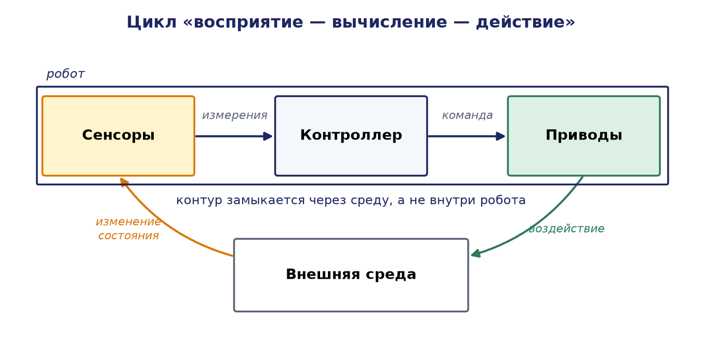
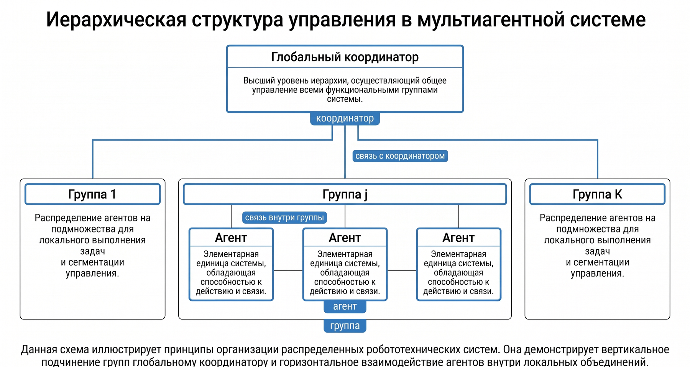

# Глава 3. Архитектуры систем управления распределёнными робототехническими системами

## 3.1. Понятие архитектуры системы управления РРТС

### 3.1.1. Определение и роль архитектуры

Архитектура системы управления распределённой робототехнической системой (РРТС) — это организационная структура системы, определяющая состав её компонентов, распределение между ними функций принятия решений, направления и интенсивность информационных потоков, а также способы координации действий отдельных агентов для достижения общесистемных целей. Если отдельный робот характеризуется прежде всего своей кинематикой, сенсорикой и локальными алгоритмами управления, то РРТС как целое характеризуется именно архитектурой: тем, «кто, что и на основании какой информации решает».

Прежде чем рассматривать архитектуру коллектива, полезно вспомнить, как устроен отдельный агент. Поведение любого робота организуется вокруг замкнутого цикла «восприятие — вычисление — действие»: сенсоры воспринимают состояние робота и среды, бортовой контроллер преобразует показания в управляющие команды, а приводы (актуаторы) изменяют состояние робота и окружения. Контур замыкается через саму среду — действие меняет будущие показания сенсоров. Именно из таких агентов-«кирпичей», каждый со своим циклом восприятия и действия, и собирается распределённая система, а архитектура РРТС определяет, как эти циклы связываются в согласованное коллективное поведение.



Формально РРТС удобно описывать кортежем

S = ⟨A, C, G, Π⟩,

где A = {a₁, a₂, …, aₙ} — множество агентов (роботов); C — множество управляющих узлов (контроллеров), которое может быть пустым, совпадать с A или образовывать отдельный уровень; G = (V, E) — коммуникационный граф, вершины V которого соответствуют агентам и контроллерам, а рёбра E — допустимым каналам обмена информацией; Π — совокупность протоколов и алгоритмов координации, определённых на графе G. Тип архитектуры при таком описании задаётся структурой графа G и распределением функции принятия решений между элементами множеств A и C.

Выбор архитектуры является одним из первых и наиболее ответственных проектных решений при создании РРТС, поскольку он определяет:

- эффективность работы системы — качество достигаемых решений (оптимальность траекторий, распределения задач, использования ресурсов);
- масштабируемость — способность системы сохранять работоспособность и приемлемую производительность при росте числа агентов;
- отказоустойчивость — устойчивость к выходу из строя отдельных агентов, контроллеров и каналов связи;
- сложность реализации и обслуживания — трудоёмкость разработки алгоритмов координации, стоимость аппаратуры и коммуникационной инфраструктуры.

Важно подчеркнуть, что архитектура — это не бинарный выбор «центр или его отсутствие», а точка в непрерывном спектре степеней централизации. На одном краю спектра находится полностью централизованная система, в которой агенты являются лишь исполнителями команд; на другом — полностью децентрализованный ансамбль автономных агентов, взаимодействующих только с соседями; между ними располагается широкий класс гибридных и иерархических решений.

### 3.1.2. Классификация архитектур

В теории и практике распределённой робототехники принято выделять три основных типа архитектур систем управления:

1. централизованные архитектуры, в которых все решения принимает единственный управляющий узел;
2. децентрализованные (распределённые) архитектуры, в которых решения принимаются каждым агентом автономно на основе локальной информации;
3. гибридные (в том числе иерархические) архитектуры, сочетающие элементы первых двух подходов.

Последующие разделы главы посвящены систематическому рассмотрению каждого типа: формальным моделям, оценкам коммуникационной сложности, анализу отказоустойчивости, а также практическим примерам реализации.

## 3.2. Централизованные архитектуры

### 3.2.1. Структура и формальная модель

В централизованной архитектуре все функции наблюдения за состоянием системы, планирования и принятия решений сосредоточены в едином центральном контроллере c₀. Каждый агент aᵢ периодически передаёт в центр вектор своего состояния xᵢ (координаты, скорость, уровень заряда, статус выполнения задачи, показания сенсоров), а центр, обладая полной картиной состояния системы x = (x₁, x₂, …, xₙ), вычисляет и рассылает агентам управляющие команды u₁, u₂, …, uₙ. Коммуникационный граф такой системы имеет топологию «звезда»: E = {(aᵢ, c₀) : i = 1, …, n}, рёбра между агентами отсутствуют.

Задача центрального контроллера в общем виде формулируется как задача глобальной оптимизации:

min по (u₁, u₂, …, uₙ) от Σᵢ₌₁ⁿ fᵢ(xᵢ, uᵢ) при ограничениях g(x, u) ≤ 0,

где fᵢ(xᵢ, uᵢ) — функция стоимости (затрат) i-го агента, а ограничения g(x, u) ≤ 0 описывают связи между агентами: требования бесстолкновительности, ограничения пропускной способности проходов, взаимоисключающий доступ к разделяемым ресурсам. Принципиальное достоинство такой постановки состоит в том, что центр решает единую задачу над полным вектором состояния и потому способен, при достаточных вычислительных ресурсах, находить глобально оптимальные или близкие к ним решения.

### 3.2.2. Коммуникационная и вычислительная сложность

Оценим нагрузку на систему связи. Если каждый из n агентов на каждом такте управления отправляет в центр одно сообщение о состоянии и получает одно сообщение с командой, суммарное число сообщений за такт составляет 2n, то есть коммуникационная сложность растёт линейно: O(n). Однако вся эта нагрузка концентрируется на одном узле: центральный контроллер должен принять, обработать и отправить O(n) сообщений за такт, поэтому его канал связи и вычислитель становятся «узким местом» (bottleneck) системы.

Вычислительная сложность центра растёт, как правило, значительно быстрее, чем линейно. Так, задача совместного планирования бесстолкновительных траекторий n роботов в общей рабочей среде требует учёта попарных ограничений, число которых составляет n(n − 1)/2 = O(n²); задача оптимального назначения n задач n роботам решается венгерским алгоритмом за O(n³); а совместное планирование движения в общем случае принадлежит классу PSPACE-трудных задач, и его точное решение экспоненциально по размерности объединённого конфигурационного пространства. Таким образом, при росте n централизованная система упирается сначала в вычислительный, а затем и в коммуникационный предел.

Ещё один существенный фактор — задержка контура управления. Полный цикл «измерение → передача в центр → вычисление → передача команды → исполнение» имеет длительность

T_цикла = T_передачи↑ + T_вычисления(n) + T_передачи↓,

причём слагаемое T_вычисления(n) растёт с числом агентов. Если динамика среды требует реакции за время, меньшее T_цикла, централизованное управление в чистом виде становится неприменимым; на практике это ограничение обходят, оставляя за центром медленные стратегические решения и делегируя быстрые рефлекторные реакции самим агентам, — что уже является шагом к гибридной архитектуре.

### 3.2.3. Отказоустойчивость: единая точка отказа

Главный структурный недостаток централизованной архитектуры — наличие единой точки отказа (single point of failure). Пусть p₀ — вероятность безотказной работы центрального контроллера в течение заданного интервала времени, а pₐ — вероятность безотказной работы отдельного агента. Тогда вероятность того, что система в целом сохраняет управляемость (работает центр и хотя бы k из n агентов), не превышает p₀: при отказе центра система теряет работоспособность полностью, независимо от состояния агентов. Для повышения надёжности применяют резервирование центра (горячий или холодный резерв): при m независимых резервированных контроллерах вероятность отказа управляющего ядра снижается с (1 − p₀) до (1 − p₀)^m, однако резервирование увеличивает стоимость и порождает собственную нетривиальную задачу — согласованное переключение на резерв без потери состояния (проблема выбора лидера и репликации состояния, известная из теории распределённых вычислений).

### 3.2.4. Преимущества, недостатки и область применения

Сильные стороны централизованной архитектуры: глобальная оптимальность решений; простота и прозрачность логики координации (все решения принимаются в одном месте); удобство мониторинга, диагностики и сертификации; отсутствие необходимости в сложных распределённых протоколах согласования. Слабые стороны: единая точка отказа; ограниченная масштабируемость по вычислениям и связи; рост задержек контура управления с числом агентов; зависимость от устойчивого покрытия связью всей рабочей зоны.

Централизованные архитектуры целесообразны, когда: число агентов умеренно (единицы — сотни); среда структурирована и хорошо наблюдаема; имеется надёжная коммуникационная инфраструктура; критична глобальная оптимизация (пропускная способность склада, суммарный пробег); последствия кратковременной остановки системы приемлемы и центр может быть зарезервирован.

## 3.3. Децентрализованные архитектуры

### 3.3.1. Структура и формальная модель

В децентрализованной архитектуре центральный контроллер отсутствует: C = ∅, и каждый агент aᵢ самостоятельно принимает решения на основе (а) собственного состояния xᵢ, (б) локальных наблюдений среды и (в) информации, полученной от соседей — агентов из множества Nᵢ = {j : (aᵢ, aⱼ) ∈ E}. Коммуникационный граф G здесь, в отличие от звезды, является в общем случае произвольным связным графом, топология которого часто определяется физически — радиусом действия связи: (aᵢ, aⱼ) ∈ E тогда и только тогда, когда ‖qᵢ − qⱼ‖ ≤ R, где qᵢ, qⱼ — координаты агентов, R — радиус связи.

Решение агента i формализуется как локальная задача оптимизации:

uᵢ = arg min по uᵢ от [ fᵢ(xᵢ, uᵢ) + Σ по j ∈ Nᵢ от gᵢⱼ(xᵢ, xⱼ, uᵢ, uⱼ) ],

где fᵢ — собственная функция стоимости агента, а gᵢⱼ — функция парного взаимодействия с соседом j (штраф за сближение, рассогласование скоростей, дублирование задач и т. п.). Глобальное поведение системы при этом не программируется явно, а возникает (эмерджентно) как результат множества локальных взаимодействий — это фундаментальное свойство самоорганизации, роднящее децентрализованные РРТС с природными роевыми системами (стаями птиц, колониями муравьёв).

### 3.3.2. Алгоритмы консенсуса как базовый механизм координации

Ключевым инструментом децентрализованной координации являются алгоритмы консенсуса (согласования), позволяющие группе агентов прийти к общему значению некоторой величины — усреднённой оценке, общему направлению движения, единому моменту начала действия — обмениваясь данными только с соседями. Классический протокол усредняющего консенсуса в дискретном времени имеет вид:

xᵢ(k+1) = xᵢ(k) + ε · Σ по j ∈ Nᵢ от ( xⱼ(k) − xᵢ(k) ),

где xᵢ(k) — согласуемая величина агента i на шаге k, ε > 0 — шаговый коэффициент. Из теории алгебраической теории графов известно, что при связном графе G и 0 < ε < 1/d_max (d_max — максимальная степень вершины) все xᵢ(k) сходятся к среднему арифметическому начальных значений: lim при k→∞ xᵢ(k) = (1/n) · Σⱼ xⱼ(0). Скорость сходимости определяется вторым по величине собственным числом лапласиана графа λ₂(L), называемым алгебраической связностью: чем «плотнее» граф связи, тем больше λ₂ и тем быстрее консенсус. Это даёт проектировщику количественный инструмент: увеличивая радиус связи или плотность группировки, можно ускорять согласование, расплачиваясь энергопотреблением радиоканала.

На основе консенсуса строятся более сложные распределённые примитивы: формирование строя (formation control), где агенты согласуют не сами координаты, а отклонения от заданных смещений; распределённая оценка (distributed estimation), где агенты совместно уточняют оценку общего параметра среды; распределённое покрытие территории (coverage control) на основе разбиений Вороного; распределённые аукционы для назначения задач.

### 3.3.3. Коммуникационная сложность и масштабируемость

Оценим коммуникационную нагрузку. Если каждый агент обменивается сообщениями со всеми соседями, суммарное число сообщений за такт равно Σᵢ |Nᵢ| = 2|E|. В полносвязной сети (каждый с каждым) |E| = n(n − 1)/2, и сложность составляет O(n²) — хуже, чем у централизованной звезды. Однако принципиальное свойство физически обусловленных сетей состоит в том, что число соседей ограничено геометрией: в круге радиуса R при ограниченной плотности размещения агентов помещается не более d_max агентов, где d_max — константа, не зависящая от n. Тогда суммарная нагрузка составляет O(n · d_max) = O(n), а нагрузка на каждый отдельный узел — O(d_max) = O(1), то есть не растёт с ростом системы вовсе. Именно это свойство — постоянная нагрузка на узел — обеспечивает практически неограниченную масштабируемость децентрализованных архитектур: добавление тысячного агента к рою нагружает систему не больше, чем добавление десятого.

Платой за масштабируемость является скорость распространения информации: сведения от агента i до агента j доходят за число тактов, пропорциональное расстоянию между ними в графе, которое в худшем случае равно диаметру графа D(G). Для «цепочки» из n агентов D = n − 1 = O(n); для плотных двумерных группировок D = O(√n). Следовательно, глобальные согласования в децентрализованной системе принципиально медленнее локальных реакций, и алгоритмы следует проектировать так, чтобы критичные по времени решения опирались только на локальную информацию.

### 3.3.4. Отказоустойчивость и живучесть

Децентрализованная архитектура не имеет единой точки отказа: выход из строя агента aᵢ приводит лишь к удалению вершины i из графа G, и, если оставшийся граф остаётся связным, система продолжает функционировать с пропорционально уменьшенной производительностью. Такое свойство называют плавной деградацией (graceful degradation). Количественной мерой структурной живучести служит вершинная связность графа κ(G) — минимальное число агентов, удаление которых разрывает сеть: система гарантированно переживает отказ любых κ(G) − 1 агентов. При проектировании роевых систем стремятся поддерживать κ(G) ≥ 2–3 за счёт управления плотностью и топологией группировки.

Отдельный класс угроз составляют не отказы, а неверные или враждебные данные (байзантийские отказы): агент, передающий соседям искажённую информацию, может «отравить» консенсус всей группы. Известный результат теории отказоустойчивого консенсуса гласит, что для устойчивости к f байзантийским агентам требуется не менее 3f + 1 участников и достаточная связность сети; на практике применяются робастные протоколы (например, W-MSR), в которых агент отбрасывает f наибольших и f наименьших значений, полученных от соседей, прежде чем усреднять остальные.

### 3.3.5. Преимущества, недостатки и область применения

Сильные стороны: высокая отказоустойчивость и живучесть; масштабируемость с постоянной нагрузкой на узел; малые задержки локальных реакций; независимость от внешней инфраструктуры связи. Слабые стороны: сложность проектирования и верификации алгоритмов координации; субоптимальность глобального поведения (локальные решения в общем случае не складываются в глобальный оптимум); возможность конфликтов, циклов и тупиков при недостаточно продуманных протоколах; трудность внешнего мониторинга и вмешательства оператора; медленное распространение глобальной информации.

Децентрализованные архитектуры предпочтительны, когда: агентов много (сотни — тысячи); среда неструктурирована, связь с инфраструктурой ненадёжна или отсутствует (подводные, подземные, боевые, спасательные операции); критична живучесть при отказах и потерях; допустима субоптимальность, но недопустима остановка системы.

## 3.4. Гибридные и иерархические архитектуры

### 3.4.1. Принцип разделения решений по уровням

Гибридная архитектура сочетает централизованные и децентрализованные элементы, распределяя решения между ними по принципу временных и пространственных масштабов: медленные, глобальные, стратегические решения (распределение задач, планирование маршрутов высокого уровня, управление ресурсами) принимает центральный или региональный контроллер, а быстрые, локальные, тактические решения (объезд препятствий, стабилизация движения, взаимное расхождение) агенты принимают автономно. Такой принцип естественно приводит к иерархической структуре управления:

- стратегический уровень (центр): горизонт планирования минуты—часы, глобальная оптимизация, взаимодействие с внешними системами (ERP, диспетчерскими службами);
- тактический уровень (координаторы групп, кластеров): горизонт секунды—минуты, координация внутри группы, разрешение конфликтов между соседними агентами;
- исполнительный (рефлекторный) уровень (борт агента): горизонт миллисекунды—секунды, управление приводами, экстренное торможение, локальное избегание столкновений.

Рефлекторный уровень наследует идеи классических реактивных архитектур управления одиночным роботом, в которых восприятие связано с действием напрямую, без построения плана. Простейший пример — транспортные средства Брайтенберга: скорость каждого мотора задаётся знаковой линейной комбинацией показаний датчиков (возбуждающие и тормозящие связи), и уже такая элементарная схема порождает содержательное поведение вроде избегания препятствий. Более структурированный подход даёт субсумпционная архитектура Р. Брукса, в которой параллельно работающие поведенческие слои конкурируют за управление приводами: слой более высокого приоритета (например, «избегание препятствий») подавляет и замещает выход нижележащего слоя («блуждание»). Обе схемы иллюстрируют ключевое свойство исполнительного уровня РРТС — быструю локальную реакцию, не требующую обращения к центру.


Формально иерархическая модель описывается двухуровневой задачей оптимизации. Верхний уровень решает глобальную задачу над агрегированными переменными:

min по U от Σᵢ₌₁ⁿ Fᵢ(x̄ᵢ, U),

где U — вектор глобальных решений (назначения задач, опорные маршруты, целевые зоны), x̄ᵢ — агрегированное (упрощённое) состояние агента или группы. Нижний уровень каждого агента, получив свою компоненту глобального решения Uᵢ как параметр, решает локальную задачу:

uᵢ = arg min по uᵢ от [ fᵢ(xᵢ, uᵢ; Uᵢ) + Σ по j ∈ Nᵢ от gᵢⱼ(xᵢ, xⱼ, uᵢ, uⱼ) ].

Существенно, что верхний уровень оперирует агрегированными величинами и обновляется редко, поэтому его вычислительная и коммуникационная нагрузка растёт мягко, а нижний уровень наследует от децентрализованной архитектуры постоянную нагрузку на узел и быструю локальную реакцию.

Наглядно многоуровневую организацию системы управления РРТС иллюстрирует рис. 3.4. Верхний уровень образует управляющий центр, связанный с человеком-оператором и включающий коммуникационную систему, блок формирования команд, базу данных и блок обработки информации; ниже располагаются коммуникационные подсистемы и блоки декомпозиции задач отдельных роботов, затем — блоки формирования траекторий и обработки навигационной информации, и, наконец, исполнительный уровень с сенсорной системой, приводами и навигационными датчиками, замыкающийся на внешнюю среду. Каждый уровень решает задачи своего масштаба и передаёт нижележащему уровню лишь необходимую ему часть решения.


При большом числе агентов исполнительный и тактический уровни укрупняют, объединяя роботов в группы (кластеры) во главе с локальными координаторами, которые, в свою очередь, подчиняются глобальному координатору. Такая федеративная организация (рис. 3.5) ограничивает объём межгрупповой коммуникации и локализует разрешение конфликтов внутри групп, сохраняя единство цели на верхнем уровне.



### 3.4.2. Кластеризация и коммуникационная сложность иерархий

Классический приём построения масштабируемых гибридных систем — кластеризация: n агентов разбиваются на m групп по n/m агентов, в каждой группе выделяется (или избирается) координатор, а координаторы взаимодействуют с центром или между собой. Нагрузка на центр при этом снижается с O(n) до O(m) сообщений за такт, нагрузка на координатора составляет O(n/m), и при выборе m = √n обе величины балансируются на уровне O(√n). Многоуровневая иерархия из L уровней с коэффициентом ветвления b обслуживает n = b^L агентов при нагрузке O(b) на каждый узел и глубине распространения команд O(L) = O(log_b n) — логарифмической по размеру системы. Именно поэтому иерархические структуры являются стандартным ответом инженерии на проблему масштабирования: они сочетают почти централизованную управляемость с почти децентрализованной масштабируемостью.

Отказоустойчивость гибридной системы определяется её слабейшими централизованными элементами, однако последствия отказов локализуются: выход из строя координатора группы парализует лишь одну группу (до переизбрания координатора), а отказ центра переводит систему в режим автономной работы нижних уровней — деградированный, но работоспособный. Проектирование «безопасного поведения при потере центра» (например, продолжение текущих задач и последующий уход в зоны ожидания) является обязательным элементом гибридных архитектур.

### 3.4.3. Преимущества, недостатки и область применения

Сильные стороны: баланс глобальной оптимальности и живучести; хорошая масштабируемость (O(log n) глубина управления при кластеризации); гибкость — граница между централизованной и децентрализованной частями может смещаться в зависимости от условий. Слабые стороны: наибольшая сложность проектирования и отладки (нужно верифицировать и уровни по отдельности, и их взаимодействие); необходимость согласования моделей разных уровней; риск противоречий между глобальными командами и локальными решениями; повышенные требования к протоколам связи между уровнями.

Гибридные архитектуры являются фактическим стандартом для больших промышленных и транспортных РРТС: автономные транспортные системы, крупные складские комплексы, флоты сервисных и сельскохозяйственных роботов, группировки БПЛА с наземным пунктом управления.

## 3.5. Сравнительный анализ и критерии выбора архитектуры

### 3.5.1. Сводное сравнение архитектур

Систематизируем свойства трёх типов архитектур в виде таблицы.

| Критерий | Централизованная | Децентрализованная | Гибридная |
|---|---|---|---|
| Топология связи | Звезда (агент ↔ центр) | Локальная сеть соседей | Иерархия: центр ↔ координаторы ↔ агенты |
| Сообщений за такт (всего) | O(n) | O(n) при ограниченной степени; O(n²) в полносвязной сети | O(n), концентрация O(√n)–O(log n) на узел |
| Нагрузка на самый загруженный узел | O(n) — центр | O(1) — константа | O(√n) или O(b) при кластеризации |
| Качество решений | Глобальный оптимум (потенциально) | Локальный оптимум, эмерджентное поведение | Близко к глобальному оптимуму |
| Единая точка отказа | Есть (центр) | Нет | Частично (локализуется уровнем) |
| Отказ одного агента | Центр перепланирует | Плавная деградация | Плавная деградация + перепланирование |
| Задержка реакции на локальное событие | T_цикла через центр | Минимальная (на борту) | Минимальная (на борту) |
| Скорость глобального согласования | Высокая (один такт центра) | Низкая, O(D(G)) тактов | Средняя, O(log n) уровней |
| Сложность разработки | Низкая — средняя | Высокая | Наивысшая |
| Мониторинг и диагностика | Простые | Затруднены | Умеренные |
| Типичный масштаб | 10–10³ агентов | 10²–10⁵ агентов | 10²–10⁴ агентов |

### 3.5.2. Критерии выбора

Выбор архитектуры представляет собой многокритериальную задачу, в которой необходимо учитывать по меньшей мере следующие группы факторов.

1. Требования к надёжности: допустимы ли остановки системы при отказе управляющего узла; каковы последствия сбоев отдельных агентов; требуется ли работа при потере связи с инфраструктурой.
2. Масштабируемость: планируемое число агентов сейчас и в перспективе; допустима ли модернизация архитектуры при росте парка.
3. Скорость принятия решений: характерные времена изменений среды; допустимые задержки контура управления; соотношение доли стратегических и рефлекторных решений.
4. Уровень требуемой координации: нужна ли жёсткая синхронизация действий и глобальная оптимизация или достаточно согласованного, но субоптимального поведения.
5. Сложность реализации и обслуживания: доступные компетенции команды; возможность верификации распределённых алгоритмов; стоимость сопровождения.
6. Стоимость: бюджет на бортовые вычислители (децентрализация требует «умных» агентов), на центральную инфраструктуру и систему связи.
7. Безопасность: защита каналов управления от перехвата и подмены; устойчивость к компрометации отдельных агентов; требования сертификации.
8. Гибкость и адаптивность: изменчивость состава задач и условий эксплуатации; необходимость взаимодействия с другими системами.

Практическое правило выбора можно сформулировать так: структурированная среда + надёжная связь + потребность в глобальной оптимизации → централизация; неструктурированная среда + ненадёжная связь + приоритет живучести → децентрализация; большой масштаб + смешанные требования → гибридная иерархия. В реальных проектах итоговое решение почти всегда оказывается гибридным, а проектный вопрос состоит не в выборе «чистого» типа, а в проведении границы между централизованной и децентрализованной частями.

### 3.5.3. Численный пример: сравнение нагрузки на систему связи

Рассмотрим складскую РРТС из n = 400 мобильных роботов с тактом управления Δt = 0,1 с (10 тактов в секунду). Пусть сообщение о состоянии и команда имеют размер по 200 байт = 1600 бит.

Вариант А. Централизованная архитектура. За такт центр принимает 400 сообщений и отправляет 400 команд, итого 800 сообщений. Поток через центральный узел: 800 сообщений/такт × 10 тактов/с × 1600 бит = 12,8 Мбит/с. Такая нагрузка реализуема (например, по проводной магистрали к точкам доступа Wi-Fi), но заметим её рост: при n = 4000 поток составит уже 128 Мбит/с через один логический узел, а вычислительная задача назначения — при кубической сложности O(n³) — станет в 1000 раз тяжелее, что вынудит перейти к субоптимальным эвристикам или декомпозиции.

Вариант Б. Децентрализованная архитектура. Пусть радиус связи подобран так, что каждый робот имеет в среднем d = 6 соседей. Каждый робот отправляет за такт 6 сообщений и принимает 6. Нагрузка на один узел: 12 × 10 × 1600 = 192 кбит/с — постоянная величина, не зависящая от n. Суммарный трафик системы: 400 × 6 × 10 × 1600 ≈ 38,4 Мбит/с, однако он распределён по пространству и не проходит через общий узел. Диаметр графа при плотной двумерной упаковке составит порядка √400 = 20 «прыжков», то есть глобальное согласование займёт не менее 20 тактов = 2 с — приемлемо для перераспределения задач, но не для экстренных реакций (которые и не требуют глобального согласования).

Вариант В. Гибридная архитектура с кластеризацией. Разобьём роботов на m = 20 зон по 20 роботов; в каждой зоне — координатор. Нагрузка на координатора: 2 × 20 × 10 × 1600 = 640 кбит/с; нагрузка на центр: 2 × 20 × 10 × 1600 = 640 кбит/с (центр обменивается только с 20 координаторами агрегированными данными). Обе величины умеренны и при росте n до 4000 (m = 63 зоны по 63 робота при балансировке m ≈ √n) вырастут лишь до ≈ 2 Мбит/с на узел. Пример наглядно демонстрирует главный выигрыш иерархии: замену линейной по n нагрузки на самый загруженный узел величиной порядка √n.

## 3.6. Алгоритмы управления в различных архитектурах

### 3.6.1. Централизованное планирование: распределение задач

Типичная задача центра — назначение n задач n роботам с минимизацией суммарной стоимости (например, суммарного пробега). При матрице стоимостей c[i][j] («стоимость выполнения задачи j роботом i») оптимальное назначение находится венгерским алгоритмом за O(n³). Для крупных систем применяют жадные и аукционные приближения. Ниже приведён псевдокод централизованного цикла управления с жадным назначением.

```
АЛГОРИТМ ЦентрализованныйЦиклУправления
Вход: множество роботов R, множество задач T
Повторять каждый такт Δt:
    // 1. Сбор состояния
    для каждого робота r ∈ R:
        принять сообщение (позиция r, статус r, заряд r)
    // 2. Формирование матрицы стоимостей
    для каждого свободного r ∈ R, для каждой неназначенной t ∈ T:
        c[r][t] ← оценка_стоимости(маршрут(позиция r, позиция t))
    // 3. Назначение задач (жадное приближение)
    пока есть свободные роботы и неназначенные задачи:
        (r*, t*) ← arg min по (r, t) от c[r][t]
        назначить t* роботу r*; исключить r* и t* из рассмотрения
    // 4. Планирование маршрутов с учётом конфликтов
    для каждого r с новым назначением:
        маршрут r ← A*(карта, позиция r, цель r,
                        зарезервированные_ячейки_времени)
        зарезервировать пространственно-временные ячейки маршрута r
    // 5. Рассылка команд
    для каждого r ∈ R: отправить(r, следующий_сегмент(маршрут r))
    // 6. Контроль отказов
    для каждого r, не приславшего состояние за τ тактов:
        пометить r отказавшим; вернуть его задачу в T;
        освободить его резервирования
```

Обратим внимание на шаг 4: применяемое здесь резервирование пространственно-временных ячеек (по существу — кооперативный A* с таблицей резервирований) возможно только потому, что центр видит все маршруты одновременно; в децентрализованной системе аналогичная гарантия бесконфликтности потребовала бы распределённого протокола взаимного исключения.

### 3.6.2. Децентрализованное согласование: консенсус и поведение роя

В децентрализованных системах базовым строительным блоком служит итеративный локальный алгоритм, исполняемый идентично на каждом агенте. Классический пример — управление роем по модели «разделение — выравнивание — сплочение» (модель Рейнольдса), в которой команда агента складывается из трёх слагаемых: отталкивания от слишком близких соседей, согласования вектора скорости со средним по соседям (это в точности консенсус по скоростям) и притяжения к центру масс локальной группы. Каждое слагаемое вычисляется по данным только из Nᵢ, поэтому алгоритм имеет сложность O(|Nᵢ|) = O(1) на агента и масштабируется неограниченно. Аналогично устроены распределённые аукционы назначения задач: агент, обнаруживший задачу, объявляет торги среди соседей, ставки распространяются по сети, и задача достаётся агенту с лучшей ставкой; глобальная субоптимальность таких аукционов ограничена теоретически (алгоритмы типа CBBA гарантируют не менее 50 % от оптимума при субмодулярных функциях полезности).

### 3.6.3. Гибридные алгоритмы: иерархическое разложение

В гибридных системах верхний уровень периодически (например, раз в несколько секунд) решает агрегированную задачу — распределяет зоны ответственности, потоки задач между кластерами, опорные маршруты, — а нижние уровни непрерывно отрабатывают назначения с локальным избеганием столкновений (алгоритмы семейства velocity obstacles, потенциальные поля, MPC на борту). Локальное избегание на основе потенциальных полей восходит к реактивной архитектуре моторных схем Р. Аркина: каждое элементарное поведение («избегать препятствие», «двигаться к цели») порождает вектор действия, а итоговая команда получается их взвешенным суммированием и нормировкой. Известная слабость подхода — застревание в локальных минимумах векторного поля, что на практике компенсируют добавлением шума или применением гармонических потенциальных функций. Ключевое проектное требование — согласованность уровней: глобальный план должен быть реализуем локальными регуляторами (условие рекурсивной осуществимости), а локальные отклонения — наблюдаемы верхним уровнем для своевременного перепланирования.


## 3.7. Программные платформы: ROS и ROS 2

### 3.7.1. ROS как коммуникационный каркас РРТС

Robot Operating System (ROS) — де-факто стандартная программная платформа робототехники — представляет собой не операционную систему в строгом смысле, а связующее программное обеспечение (middleware): набор библиотек и инструментов, организующих вычисления робота в виде графа узлов (nodes), обменивающихся сообщениями через именованные топики (publish/subscribe), сервисы (запрос—ответ) и действия (длительные задачи с обратной связью). Для РРТС принципиально, что граф узлов ROS может быть распределён по многим машинам: узлы разных роботов взаимодействуют по сети прозрачно для прикладного кода.

Архитектурно классический ROS 1 сам тяготел к централизации: обнаружение узлов обеспечивал единственный мастер-процесс (roscore), являвшийся единой точкой отказа всей системы — что делало ROS 1 малопригодным для по-настоящему децентрализованных многороботных систем без дополнительных надстроек (multimaster-решений).

### 3.7.2. ROS 2 и децентрализованное обнаружение

ROS 2 устранил этот структурный дефект: в качестве транспортного слоя используется стандарт DDS (Data Distribution Service), в котором обнаружение участников выполняется распределённо, без выделенного мастера, а обмен данными идёт напрямую между узлами (peer-to-peer). Настраиваемые политики качества обслуживания (QoS) — надёжность доставки (reliable/best effort), история, срок жизни сообщений, приоритеты — позволяют адаптировать связь к ненадёжным беспроводным каналам, характерным для мобильных РРТС. Дополнительно ROS 2 предоставляет средства защиты коммуникаций (SROS 2: аутентификация узлов, шифрование трафика), поддержку систем реального времени и жизненный цикл узлов для управляемой деградации.

С точки зрения материала данной главы существенно, что ROS 2 не навязывает архитектуру управления, а служит нейтральным каркасом для любой из них: централизованная РРТС реализуется как центральный узел-планировщик, подписанный на состояния всех роботов и публикующий им цели (по такой схеме построены типовые решения управления флотом на базе Nav2 и Open-RMF); децентрализованная — как одинаковые узлы на каждом роботе, обменивающиеся сообщениями в общем DDS-домене или через ограниченные по дальности каналы; гибридная — как комбинация того и другого с разделением пространств имён и доменов по уровням иерархии. Таким образом, выбор архитектуры остаётся содержательным проектным решением, а платформа лишь снимает инфраструктурные барьеры его реализации.

## 3.8. Практические примеры реализации архитектур

### 3.8.1. Централизованная архитектура: складские системы Amazon Robotics

Складские роботизированные комплексы Amazon Robotics (исторически — Kiva Systems) — классический пример преимущественно централизованного управления. Сотни и тысячи мобильных роботов перемещают стеллажи с товарами к станциям комплектования; центральная система управления флотом получает поток заказов, назначает задачи роботам, планирует бесконфликтные маршруты по дискретной сетке склада и резервирует ячейки пространства-времени. Централизация здесь оправдана всеми критериями раздела 3.5: среда полностью структурирована (разметка пола, известная карта), связь обеспечена инфраструктурой здания, а экономика склада прямо зависит от глобальной оптимизации (пропускная способность, плотность хранения, суммарный пробег). Недостатки проявляются предсказуемо: система требует резервирования вычислительного ядра, а рост числа роботов вынуждает применять зонирование склада — то есть фактически вводить элементы иерархии, смещая архитектуру к гибридной.

### 3.8.2. Децентрализованная архитектура: рой БПЛА для мониторинга

Противоположный полюс — рой беспилотных летательных аппаратов, выполняющий мониторинг обширной территории (поиск очагов возгорания, обследование сельскохозяйственных угодий, поисково-спасательные операции). Связь с наземной станцией эпизодична или отсутствует; каждый дрон принимает решения автономно, обмениваясь с соседями по радиоканалу позициями, векторами скоростей и локальными результатами наблюдений. Согласование направлений и распределение секторов обзора реализуются консенсусными протоколами и алгоритмами покрытия; потеря отдельных аппаратов приводит лишь к перераспределению зон между оставшимися. Экспериментальные работы по автономным роям (в частности, полевые эксперименты группы Г. Важа и Т. Вичека с десятками дронов на открытом воздухе) подтвердили практическую реализуемость самоорганизующегося полёта строем без центрального управления. Основные трудности — верификация эмерджентного поведения, предотвращение конфликтов и деградация связности роя при больших разлётах.

### 3.8.3. Гибридная архитектура: автономные транспортные системы

Интеллектуальные транспортные системы с автономными автомобилями демонстрируют зрелую гибридную организацию. Инфраструктурный уровень (облачные и придорожные сервисы, V2I-коммуникации) решает стратегические задачи: агрегирует данные о трафике, рекомендует маршруты, координирует потоки на перекрёстках и в узких местах. Бортовой уровень каждого автомобиля полностью автономен в тактическом контуре: восприятие, локальное планирование, удержание полосы, экстренное торможение — все критичные по времени решения принимаются на борту за миллисекунды и не зависят от связи. Промежуточный уровень V2V-коммуникаций позволяет соседним автомобилям согласовывать манёвры (перестроения, проезд нерегулируемых пересечений, движение в плотных колоннах — platooning) децентрализованно, по консенсусным протоколам. Отказ инфраструктурного уровня не останавливает движение — автомобили лишь теряют глобальную оптимизацию маршрутов; это и есть проектируемая плавная деградация гибридной системы.

## 3.9. Проблемы реализации и направления их решения

### 3.9.1. Коммуникационные задержки и потери данных

Беспроводные каналы РРТС подвержены задержкам, джиттеру и потерям пакетов, что приводит к рассогласованию представлений агентов о состоянии системы и, как следствие, к несогласованным действиям. Основные подходы к решению: проектирование алгоритмов, устойчивых к задержкам (доказательства сходимости консенсуса при ограниченных задержках и переменной топологии связи); использование подтверждений и повторной передачи для критичных сообщений при передаче некритичных в режиме best effort (в ROS 2 это напрямую выражается политиками QoS); прогнозирование состояния партнёров между приёмами сообщений; проектирование безопасного поведения при потере связи (остановка, возврат, автономное продолжение миссии).

### 3.9.2. Информационная безопасность

РРТС уязвимы к перехвату и подмене команд, компрометации отдельных агентов, атакам на протоколы согласования и глушению каналов. Меры защиты выстраиваются эшелонированно: криптографическая защита каналов (шифрование и аутентификация, в экосистеме ROS 2 — механизмы SROS 2 на базе средств безопасности DDS); взаимная аутентификация агентов и контроль целостности программного обеспечения; робастные к байзантийским отказам протоколы консенсуса (см. п. 3.3.4); обнаружение аномалий поведения агентов средствами взаимного наблюдения. Заметим, что архитектура влияет на профиль угроз: в централизованной системе главная цель атаки — центр, в децентрализованной злоумышленнику достаточно внедрить или скомпрометировать «рядового» агента, поэтому децентрализация сама по себе не тождественна защищённости.

### 3.9.3. Конфликты между агентами

Конкуренция за разделяемые ресурсы (пространство, зарядные станции, задачи) порождает конфликты, а при неудачных протоколах — взаимные блокировки (deadlock) и голодание (starvation). В централизованных системах конфликты предотвращаются на этапе планирования (резервирование, п. 3.6.1); в децентрализованных применяются протоколы локального разрешения: правила приоритетов (по идентификатору, по срочности задачи), распределённые аукционы, взаимные уступки на основе переговоров, а также геометрические методы взаимного избегания (reciprocal velocity obstacles), гарантирующие расхождение без обмена сообщениями вообще — только по наблюдениям. Обязательной практикой является верификация протоколов на отсутствие тупиков (методами теории конечных автоматов и модельной проверки, к которым мы обратимся в следующей главе).

## Выводы по главе

1. Архитектура системы управления РРТС определяет распределение функции принятия решений между центральными узлами и агентами и формально задаётся структурой коммуникационного графа G = (V, E) и протоколами координации; выделяют централизованный, децентрализованный и гибридный типы, образующие непрерывный спектр степеней централизации.
2. Централизованная архитектура обеспечивает глобальную оптимальность и простоту координации, но обладает единой точкой отказа и ограниченной масштабируемостью: нагрузка на центр растёт как O(n) по связи и быстрее (до O(n³) и выше) по вычислениям.
3. Децентрализованная архитектура обеспечивает живучесть, плавную деградацию при отказах и постоянную нагрузку O(1) на агента при физически ограниченном числе соседей, расплачиваясь субоптимальностью глобального поведения и медленным (O(D(G)) тактов) распространением глобальной информации.
4. Базовым механизмом децентрализованной координации являются алгоритмы консенсуса; их сходимость гарантируется связностью коммуникационного графа, а скорость определяется алгебраической связностью λ₂(L).
5. Гибридные иерархические архитектуры разделяют решения по временным масштабам (стратегические — центру, тактические — координаторам, рефлекторные — борту агента) и посредством кластеризации снижают нагрузку на самый загруженный узел до O(√n) или O(log n), сочетая управляемость с масштабируемостью.
6. Выбор архитектуры — многокритериальная задача, учитывающая надёжность, масштабируемость, требуемую скорость реакций, степень координации, сложность, стоимость, безопасность и адаптивность; практический выбор состоит в проведении границы между централизованной и децентрализованной частями системы.
7. Современные программные платформы (ROS 2 с транспортом DDS, децентрализованным обнаружением узлов и настраиваемым QoS) архитектурно нейтральны и позволяют реализовать любой тип архитектуры; централизованность ROS 1 (единый мастер-процесс) исторически иллюстрирует риски единой точки отказа на уровне middleware.
8. Реальные крупномасштабные системы (складские комплексы Amazon Robotics, рои БПЛА, автономные транспортные системы) подтверждают закономерность: с ростом масштаба и неопределённости среды архитектуры эволюционируют от централизованных к гибридным и децентрализованным.

## Вопросы для самопроверки

1. Дайте определение архитектуры системы управления РРТС и опишите её формальную модель в виде кортежа S = ⟨A, C, G, Π⟩. Какую роль играет коммуникационный граф G?
2. Какова топология коммуникационного графа централизованной архитектуры? Оцените число сообщений за такт управления и нагрузку на центральный узел как функции числа агентов n.
3. Почему вычислительная сложность центрального контроллера обычно растёт быстрее, чем линейно, с ростом числа агентов? Приведите примеры задач со сложностью O(n²) и O(n³).
4. Что такое единая точка отказа? Как резервирование центрального контроллера влияет на вероятность отказа управляющего ядра и какие новые проблемы оно порождает?
5. Запишите протокол усредняющего консенсуса и сформулируйте условия его сходимости. Какая характеристика графа определяет скорость сходимости?
6. Объясните, почему нагрузка на отдельного агента в децентрализованной системе с физически ограниченным радиусом связи составляет O(1) и как это связано с масштабируемостью роевых систем.
7. Что такое плавная деградация и вершинная связность κ(G)? Сколько байзантийских агентов может выдержать сеть из N участников согласно классическому результату теории отказоустойчивого консенсуса?
8. Опишите принцип разделения решений по уровням в гибридной иерархической архитектуре. Почему кластеризация с m = √n групп балансирует нагрузку на центр и координаторов?
9. Сравните ROS 1 и ROS 2 с точки зрения централизации механизма обнаружения узлов. Какие возможности ROS 2 (DDS, QoS, SROS 2) существенны для распределённых многороботных систем?
10. Для каждой из трёх архитектур укажите реальную систему-пример и обоснуйте, почему выбранная архитектура соответствует условиям её эксплуатации.

## Задания

1. Аналитическое задание. Для системы из n = 900 роботов с тактом управления 0,05 с и размером сообщения 300 байт рассчитайте: (а) нагрузку на центральный узел при централизованной архитектуре; (б) нагрузку на одного агента при децентрализованной архитектуре со средним числом соседей d = 8; (в) нагрузку на центр и на координатора при гибридной архитектуре с m = 30 кластерами. Постройте график зависимости нагрузки на самый загруженный узел от n (n = 100…10 000) для всех трёх вариантов и определите, при каком n централизованный вариант превысит пропускную способность канала 100 Мбит/с.
2. Программное задание. Реализуйте (на Python или MATLAB) протокол усредняющего консенсуса для n = 50 агентов, случайно размещённых в квадрате 100 × 100 м, с радиусом связи R. Исследуйте зависимость числа итераций до сходимости (с точностью 1 %) от радиуса R и сопоставьте её с алгебраической связностью λ₂ лапласиана графа. Продемонстрируйте отказоустойчивость: удалите 10 % агентов на середине процесса и покажите, что консенсус достигается оставшимися.
3. Проектное задание. Выберите реальную РРТС (автономный склад, рой БПЛА, флот роботов-доставщиков, группа сельскохозяйственных роботов). Определите используемую архитектуру управления, обоснуйте её выбор по критериям раздела 3.5.2, выявите узкие места по масштабируемости и отказоустойчивости и предложите модификацию архитектуры для увеличения парка в 10 раз. Оформите результат в виде технической записки (3–5 страниц) со схемой коммуникационного графа.
4. Практикум по ROS 2. Разверните в симуляторе (Gazebo/Webots) три мобильных робота под управлением ROS 2. Реализуйте два варианта координации: (а) централизованный узел-диспетчер, назначающий цели всем роботам; (б) децентрализованный обмен позициями между роботами с локальным правилом разрешения конфликтов при сближении. Сравните поведение обоих вариантов при принудительном отключении диспетчера (для варианта «а») и одного из роботов (для варианта «б»); опишите наблюдаемую деградацию.

## Литература

1. Shoham Y., Leyton-Brown K. Multiagent Systems: Algorithmic, Game-Theoretic, and Logical Foundations. — Cambridge: Cambridge University Press, 2009.
2. Weiss G. (ed.). Multiagent Systems. — 2nd ed. — Cambridge, MA: MIT Press, 2013.
3. Mesbahi M., Egerstedt M. Graph Theoretic Methods in Multiagent Networks. — Princeton: Princeton University Press, 2010.
4. Bullo F., Cortés J., Martínez S. Distributed Control of Robotic Networks. — Princeton: Princeton University Press, 2009.
5. Olfati-Saber R., Fax J. A., Murray R. M. Consensus and Cooperation in Networked Multi-Agent Systems // Proceedings of the IEEE. — 2007. — Vol. 95, No. 1. — P. 215–233.
6. Brambilla M., Ferrante E., Birattari M., Dorigo M. Swarm Robotics: A Review from the Swarm Engineering Perspective // Swarm Intelligence. — 2013. — Vol. 7, No. 1. — P. 1–41.
7. Yan Z., Jouandeau N., Cherif A. A. A Survey and Analysis of Multi-Robot Coordination // International Journal of Advanced Robotic Systems. — 2013. — Vol. 10, No. 12. — P. 399.
8. Wurman P. R., D'Andrea R., Mountz M. Coordinating Hundreds of Cooperative, Autonomous Vehicles in Warehouses // AI Magazine. — 2008. — Vol. 29, No. 1. — P. 9–20.
9. Vásárhelyi G., Virágh C., Somorjai G. et al. Optimized Flocking of Autonomous Drones in Confined Environments // Science Robotics. — 2018. — Vol. 3, No. 20. — eaat3536.
10. Choi H.-L., Brunet L., How J. P. Consensus-Based Decentralized Auctions for Robust Task Allocation // IEEE Transactions on Robotics. — 2009. — Vol. 25, No. 4. — P. 912–926.
11. Macenski S., Foote T., Gerkey B., Lalancette C., Woodall W. Robot Operating System 2: Design, Architecture, and Uses in the Wild // Science Robotics. — 2022. — Vol. 7, No. 66. — eabm6074.
12. Lynch N. A. Distributed Algorithms. — San Francisco: Morgan Kaufmann, 1996.
