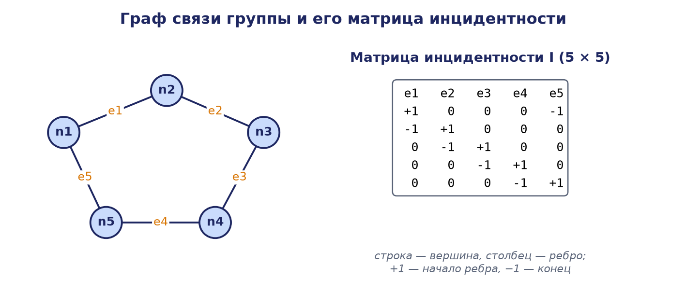
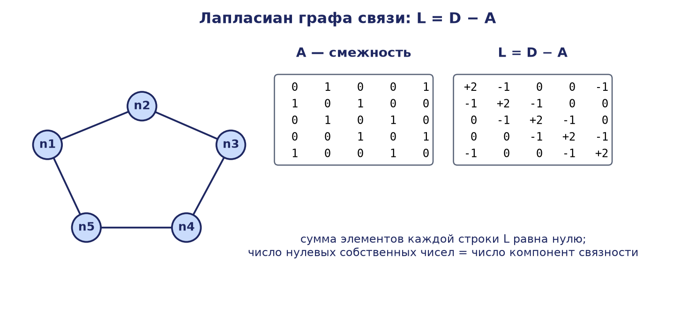
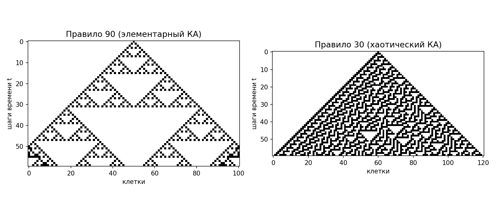
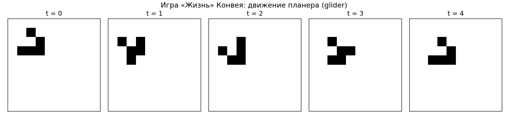

# Глава 4. Математические методы описания распределённых робототехнических систем

Анализ, синтез и управление распределёнными робототехническими системами (РРТС) невозможны без строгого математического аппарата, позволяющего единообразно описывать как индивидуальную динамику отдельных агентов, так и структуру информационных связей между ними. Особенность распределённых систем состоит в том, что их коллективное поведение определяется не только уравнениями движения каждого робота, но и топологией сети обмена информацией: одна и та же группа агентов с одними и теми же локальными законами управления может демонстрировать принципиально различное поведение в зависимости от того, кто с кем обменивается данными. Поэтому центральное место в математическом описании РРТС занимает соединение двух классических дисциплин — теории графов, описывающей структуру взаимодействий, и теории динамических систем, описывающей эволюцию состояний во времени. В настоящей главе последовательно излагаются графовые модели коммуникационных топологий и их матричные представления, спектральная теория лапласиана и понятие алгебраической связности, модели агентов в пространстве состояний, непрерывные и дискретные протоколы консенсуса с условиями сходимости, связь дискретного консенсуса со стохастическими матрицами и марковскими цепями, а также прикладные модели координации: формирование строя, кооперативная транспортировка груза и избегание столкновений. Изложение сопровождается разобранными численными примерами и псевдокодом базового алгоритма.

## 4.1. Графовые модели коммуникационных топологий

### 4.1.1. Основные определения теории графов

Графом называется упорядоченная пара G = (V, E), где V = {v₁, v₂, …, vₙ} — конечное множество вершин, а E ⊆ V × V — множество рёбер, соединяющих пары вершин. В контексте РРТС вершины графа отождествляются с агентами (роботами), а рёбра — с каналами обмена информацией или сенсорными связями: ребро (vᵢ, vⱼ) означает, что агент j получает информацию о состоянии агента i (либо, в неориентированном случае, что обмен взаимен). Число вершин n = |V| называется порядком графа, число рёбер m = |E| — его размером.

Различают несколько классов графов, каждый из которых соответствует определённому типу коммуникационной архитектуры. В неориентированном графе рёбра не имеют направления: если пара {vᵢ, vⱼ} принадлежит E, то информационная связь симметрична, что типично для двусторонних радиоканалов равной мощности. В ориентированном графе (орграфе) каждое ребро есть упорядоченная пара (vᵢ, vⱼ), и информация передаётся только от i к j; такая модель адекватна, например, ситуации, когда один робот наблюдает другого бортовой камерой, а обратное наблюдение отсутствует, или когда передатчики агентов имеют различный радиус действия. Во взвешенном графе каждому ребру приписан вес aᵢⱼ > 0, отражающий интенсивность связи, её надёжность, пропускную способность канала либо величину, обратную расстоянию между агентами.

Для описания локального окружения агента вводится понятие окрестности: множеством соседей вершины vᵢ называется Nᵢ = {vⱼ ∈ V : (vⱼ, vᵢ) ∈ E}, то есть множество агентов, от которых агент i получает информацию. Степенью вершины dᵢ в неориентированном графе называется число инцидентных ей рёбер, dᵢ = |Nᵢ|; в орграфе различают полустепень захода (число входящих рёбер) и полустепень исхода (число исходящих). Именно локальность окрестности — тот факт, что каждый агент оперирует лишь данными соседей, а не всей системы, — является формальным выражением распределённости алгоритмов управления.

Ключевую роль в анализе РРТС играют свойства связности. Неориентированный граф называется связным, если между любыми двумя вершинами существует путь — последовательность попарно смежных вершин. Ориентированный граф называется сильно связным, если для любой упорядоченной пары вершин существует ориентированный путь из первой во вторую. Более слабое, но часто достаточное для сходимости распределённых алгоритмов условие — наличие ориентированного остовного дерева (spanning tree): существование вершины-корня, из которой ориентированные пути ведут во все остальные вершины. Содержательно это означает, что в системе есть хотя бы один агент, информация которого прямо или опосредованно достигает всех участников.

### 4.1.2. Матричные представления: матрицы смежности, степеней и инцидентности

Алгебраизация графовых моделей осуществляется посредством ряда матриц. Матрицей смежности взвешенного графа G с n вершинами называется матрица A ∈ ℝⁿˣⁿ с элементами aᵢⱼ, где aᵢⱼ > 0, если (vⱼ, vᵢ) ∈ E, и aᵢⱼ = 0 в противном случае; для невзвешенного графа полагают aᵢⱼ = 1 при наличии ребра. Для неориентированного графа матрица смежности симметрична: A = Aᵀ. Диагональные элементы aᵢᵢ обычно полагаются равными нулю (петли отсутствуют: агенту не требуется канал связи с самим собой).

Матрицей степеней называется диагональная матрица D = diag(d₁, d₂, …, dₙ), где dᵢ = Σⱼ aᵢⱼ — взвешенная степень (для орграфа — взвешенная полустепень захода) вершины vᵢ. Матрица степеней аккумулирует информацию о суммарной интенсивности связей каждого агента.

Матрицей инцидентности неориентированного графа с произвольно назначенной ориентацией рёбер называется матрица B ∈ ℝⁿˣᵐ, столбцы которой соответствуют рёбрам: если ребро eₖ ориентировано от vᵢ к vⱼ, то в k-м столбце элемент bᵢₖ = −1, элемент bⱼₖ = +1, остальные элементы столбца нулевые. Матрица инцидентности устанавливает связь между «вершинным» и «рёберным» описаниями сети: её ядро и образ характеризуют циклы и разрезы графа, а произведение B Bᵀ, как будет показано ниже, порождает лапласиан. В задачах управления формациями матрица инцидентности естественно возникает при переходе от абсолютных координат агентов к относительным смещениям вдоль рёбер графа.



### 4.1.3. Лапласиан графа и его фундаментальные свойства

Матрицей Лапласа (лапласианом) графа называется матрица

L = D − A,

то есть матрица с элементами lᵢᵢ = Σⱼ aᵢⱼ и lᵢⱼ = −aᵢⱼ при i ≠ j. Для неориентированного графа справедливо также представление L = B Bᵀ, откуда немедленно следует симметричность и положительная полуопределённость лапласиана: для любого вектора x ∈ ℝⁿ выполняется

xᵀ L x = Σ₍ᵢ,ⱼ₎∈E aᵢⱼ (xᵢ − xⱼ)² ≥ 0.

Эта квадратичная форма имеет прозрачный физический смысл: она измеряет суммарное «рассогласование» значений xᵢ на концах рёбер графа и обращается в нуль тогда и только тогда, когда значения совпадают на каждой компоненте связности.



Перечислим фундаментальные свойства лапласиана неориентированного графа, лежащие в основе всей спектральной теории распределённых систем. Во-первых, сумма элементов каждой строки L равна нулю, поэтому вектор из единиц 𝟙 = (1, 1, …, 1)ᵀ всегда является собственным вектором с собственным значением 0: L𝟙 = 0. Во-вторых, все собственные значения лапласиана вещественны и неотрицательны, и их принято упорядочивать: 0 = λ₁ ≤ λ₂ ≤ … ≤ λₙ. В-третьих, кратность нулевого собственного значения равна числу компонент связности графа; в частности, граф связен тогда и только тогда, когда λ₂ > 0. В-четвёртых, наибольшее собственное значение ограничено сверху удвоенной максимальной степенью: λₙ ≤ 2·dₘₐₓ. Наконец, по матричной теореме Кирхгофа произведение ненулевых собственных значений связного графа равно n·τ(G), где τ(G) — число остовных деревьев графа; это свойство удобно использовать для проверки вычислений.

Для ориентированного графа лапласиан определяется аналогично, L = D − A с полустепенями захода на диагонали, однако он, вообще говоря, несимметричен, его спектр может быть комплексным (с неотрицательными вещественными частями), и нулевое собственное значение просто тогда и только тогда, когда граф содержит ориентированное остовное дерево. Это различие существенно: для орграфов алгебраический анализ сходимости опирается не на симметричную спектральную теорию, а на теорию неотрицательных матриц и теорему Перрона — Фробениуса, обсуждаемую в разделе 4.3.

### 4.1.4. Алгебраическая связность и теорема Фидлера

Второе наименьшее собственное значение лапласиана λ₂(L) занимает в теории распределённых систем исключительное положение и носит название алгебраической связности графа; этот термин ввёл М. Фидлер в 1973 г. Классический результат Фидлера устанавливает цепочку неравенств

λ₂(G) ≤ κ(G) ≤ η(G),

где κ(G) — вершинная связность (минимальное число вершин, удаление которых нарушает связность), а η(G) — рёберная связность графа. Таким образом, алгебраическая связность является нижней оценкой «структурной прочности» сети: чем больше λ₂, тем труднее разорвать граф удалением узлов или каналов связи. Кроме того, λ₂ монотонна относительно добавления рёбер: включение нового канала связи не может уменьшить алгебраическую связность.

Собственный вектор, отвечающий λ₂, называется вектором Фидлера; знаки его компонент задают естественное разбиение графа на два слабо связанных кластера, что используется в задачах спектральной кластеризации и декомпозиции больших робототехнических группировок. Однако главная причина внимания к λ₂ в теории управления иная: как будет показано в разделах 4.3 и 4.4, алгебраическая связность непосредственно определяет скорость сходимости протоколов консенсуса — экспоненциальная скорость согласования состояний агентов в связной неориентированной сети равна в точности λ₂(L). Тем самым сугубо комбинаторная характеристика топологии приобретает смысл динамического показателя качества коллективного управления, а задача проектирования коммуникационной сети группировки роботов сводится к задаче максимизации λ₂ при ограничениях на число и дальность связей.

### 4.1.5. Численный пример 1: вычисление лапласиана и алгебраической связности

Рассмотрим неориентированный невзвешенный граф G из четырёх вершин с множеством рёбер E = {{1,2}, {2,3}, {2,4}, {3,4}}: вершина 1 соединена «хвостом» с треугольником, образованным вершинами 2, 3, 4. Степени вершин равны d₁ = 1, d₂ = 3, d₃ = 2, d₄ = 2. Выпишем матрицу смежности, матрицу степеней и лапласиан:

```
A = ⎡0 1 0 0⎤     D = ⎡1 0 0 0⎤     L = D − A = ⎡ 1 −1  0  0⎤
    ⎢1 0 1 1⎥         ⎢0 3 0 0⎥                 ⎢−1  3 −1 −1⎥
    ⎢0 1 0 1⎥         ⎢0 0 2 0⎥                 ⎢ 0 −1  2 −1⎥
    ⎣0 1 1 0⎦         ⎣0 0 0 2⎦                 ⎣ 0 −1 −1  2⎦
```

Найдём спектр лапласиана. Характеристический многочлен det(L − λI) после раскрытия определителя по первой строке приводится к виду

p(λ) = λ⁴ − 8λ³ + 19λ² − 12λ = λ(λ − 1)(λ − 3)(λ − 4).

Корректность разложения легко проверить по инвариантам: сумма корней 0 + 1 + 3 + 4 = 8 совпадает со следом tr L = 1 + 3 + 2 + 2 = 8; произведение ненулевых корней 1·3·4 = 12 совпадает с величиной n·τ(G) = 4·3, поскольку граф содержит ровно три остовных дерева (ребро {1,2} входит в каждое из них, а из трёх рёбер треугольника выбираются любые два). Итак, спектр лапласиана есть

λ₁ = 0, λ₂ = 1, λ₃ = 3, λ₄ = 4.

Алгебраическая связность λ₂ = 1. Заметим, что вершинная связность графа κ(G) = 1 (удаление вершины 2 изолирует вершину 1), так что неравенство Фидлера λ₂ ≤ κ выполняется как равенство. Полезно убедиться и в справедливости отдельных собственных пар: например, для вектора v = (0, 0, 1, −1)ᵀ прямое умножение даёт Lv = (0, 0, 3, −3)ᵀ = 3v, что подтверждает собственное значение λ₃ = 3, отвечающее «противофазному» колебанию вершин 3 и 4 при неподвижных вершинах 1 и 2. Если данный граф описывает сеть связи четырёх роботов, выполняющих согласование состояний по протоколу ẋ = −Lx, то рассогласование будет затухать как e^(−λ₂t) = e^(−t): узким местом является единственная связь периферийного робота 1 с остальной группой, и именно добавление ребра {1, 3} или {1, 4} дало бы наибольший прирост скорости сходимости.

## 4.2. Модели динамики агентов в пространстве состояний

### 4.2.1. Непрерывные и дискретные модели агента

Индивидуальная динамика i-го агента в непрерывном времени описывается системой обыкновенных дифференциальных уравнений в пространстве состояний

ẋᵢ(t) = fᵢ(xᵢ(t), uᵢ(t)),  yᵢ(t) = hᵢ(xᵢ(t)),

где xᵢ(t) ∈ ℝᵖ — вектор состояния (координаты, скорости, ориентация, заряд аккумулятора и т. п.), uᵢ(t) ∈ ℝᵍ — вектор управляющих воздействий, yᵢ(t) — вектор измеряемых выходов, а fᵢ и hᵢ — функции динамики и наблюдения. В дискретном времени, естественном для цифровых систем управления с тактом Δt, аналогичная модель имеет вид xᵢ(k+1) = fᵢ(xᵢ(k), uᵢ(k)), где k — номер такта.

В теории распределённого управления широко используются три канонические линейные модели. Модель одиночного интегратора ẋᵢ = uᵢ описывает агента, скоростью которого можно управлять непосредственно; она адекватна колёсным платформам с быстрым внутренним контуром скорости и служит базовой моделью при анализе протоколов консенсуса. Модель двойного интегратора ẍᵢ = uᵢ, или в форме пространства состояний ẋᵢ = vᵢ, v̇ᵢ = uᵢ, учитывает инерционность: управлением является ускорение (сила, делённая на массу), что характерно для мультикоптеров и космических аппаратов. Наконец, общая линейная модель ẋᵢ = Ãxᵢ + B̃uᵢ с матрицами Ã ∈ ℝᵖˣᵖ и B̃ ∈ ℝᵖˣᵍ охватывает линеаризованную динамику произвольного робота в окрестности рабочего режима.

### 4.2.2. Линейные системы, спектр и устойчивость

Для линейной автономной системы ẋ = Ãx фундаментальную роль играет спектр матрицы Ã. Решение имеет вид x(t) = e^(Ãt)x(0), и его асимптотическое поведение определяется собственными значениями sᵢ матрицы Ã: система асимптотически устойчива тогда и только тогда, когда Re sᵢ < 0 для всех i; наличие собственного значения с положительной вещественной частью означает неустойчивость; собственные значения на мнимой оси отвечают незатухающим модам. Для дискретной системы x(k+1) = Ãx(k) критерием асимптотической устойчивости служит расположение всех собственных значений строго внутри единичного круга комплексной плоскости: |sᵢ| < 1.

Особенность задач согласования состоит в том, что замкнутая система консенсуса заведомо не является асимптотически устойчивой в классическом смысле: как показано ниже, матрица −L имеет нулевое собственное значение, отвечающее целому подпространству равновесий span{𝟙}. Поэтому анализируется не устойчивость нулевого решения, а сходимость к многообразию согласия — сжатие всех траекторий к прямой x₁ = x₂ = … = xₙ, и роль «наименее устойчивой моды» играет собственное значение λ₂.

### 4.2.3. Составная модель группы агентов

Объединяя состояния всех агентов в общий вектор X = (x₁ᵀ, x₂ᵀ, …, xₙᵀ)ᵀ ∈ ℝⁿᵖ и управления в вектор U, получаем составную модель группы

Ẋ(t) = 𝒜X(t) + ℬU(t),

где блочные матрицы 𝒜 и ℬ имеют блочно-диагональную структуру при отсутствии физического взаимодействия агентов. Распределённый закон управления, при котором uᵢ зависит лишь от состояний соседей по графу G, порождает в замкнутой системе матрицу, структура ненулевых блоков которой повторяет структуру матрицы смежности графа. Для скалярных агентов-интеграторов с линейной диффузионной связью замкнутая матрица есть в точности −L; для векторных состояний xᵢ ∈ ℝᵖ она записывается через кронекерово произведение −L ⊗ Iₚ, что позволяет свести спектральный анализ группы размерности np к анализу лапласиана размерности n. Таким образом, свойства коллективной динамики факторизуются: индивидуальная динамика определяет поведение вдоль каждой моды, а топология сети — набор мод и скорости их затухания.

## 4.3. Протоколы консенсуса

### 4.3.1. Непрерывный протокол консенсуса и условия сходимости

Задача консенсуса (согласования) формулируется следующим образом: агенты, обладающие скалярными состояниями xᵢ ∈ ℝ (обобщение на векторные состояния тривиально), должны, обмениваясь информацией только с соседями, привести свои состояния к общему значению: xᵢ(t) → x* при t → ∞ для всех i. Содержательными интерпретациями являются синхронизация бортовых часов, выравнивание скоростей в строю, согласование распределённых оценок координат цели, распределённое вычисление среднего значения сенсорных измерений.

Базовый непрерывный протокол консенсуса имеет вид локального диффузионного закона

ẋᵢ(t) = −Σⱼ∈Nᵢ aᵢⱼ (xᵢ(t) − xⱼ(t)),  i = 1, …, n,

то есть каждый агент смещает своё состояние в сторону взвешенного среднего состояний соседей. В векторно-матричной форме протокол записывается предельно компактно:

ẋ(t) = −L x(t),  x ∈ ℝⁿ,

где L — лапласиан коммуникационного графа. Решение x(t) = e^(−Lt)x(0) полностью определяется спектром лапласиана. Разложим начальное условие по ортонормированному базису собственных векторов w₁ = 𝟙/√n, w₂, …, wₙ симметричного лапласиана связного неориентированного графа: x(0) = Σᵢ cᵢwᵢ. Тогда

x(t) = c₁w₁ + Σᵢ₌₂ⁿ cᵢ e^(−λᵢt) wᵢ,

и, поскольку λᵢ ≥ λ₂ > 0 при i ≥ 2, все слагаемые, кроме первого, экспоненциально затухают. Отсюда вытекает основной результат: если неориентированный граф связен, то протокол консенсуса сходится из любых начальных условий, причём предельное значение равно среднему арифметическому начальных состояний,

x* = (1/n) Σᵢ xᵢ(0),

а скорость сходимости определяется алгебраической связностью: ‖x(t) − x*𝟙‖ ≤ ‖x(0) − x*𝟙‖·e^(−λ₂t). Сохранение среднего следует из того, что 𝟙ᵀL = 0 и, значит, d/dt (𝟙ᵀx) = −𝟙ᵀLx = 0: сумма состояний является первым интегралом движения. Протоколы с этим свойством называются протоколами усреднения (average consensus).

Для ориентированных графов картина богаче. Если орграф сильно связен и сбалансирован (взвешенная полустепень захода каждой вершины равна полустепени исхода), то по-прежнему достигается консенсус на среднем значении. Если орграф лишь содержит ориентированное остовное дерево, консенсус достигается, однако предельное значение есть выпуклая комбинация x* = Σᵢ γᵢxᵢ(0), где веса γᵢ ≥ 0, Σᵢ γᵢ = 1, образуют левый собственный вектор лапласиана при нулевом собственном значении; вклад в итог вносят лишь агенты, являющиеся «корнями» остовных деревьев. Если же остовного дерева нет, сеть распадается на информационно изолированные подгруппы, каждая из которых сходится к собственному значению, и глобальный консенсус невозможен. Этим подчёркивается принципиальный факт: сходимость распределённого алгоритма есть свойство топологии, а не только закона управления.

### 4.3.2. Дискретный консенсус и стохастические матрицы

В цифровой реализации протокол консенсуса выполняется тактами. Дискретный протокол получается методом Эйлера из непрерывного:

xᵢ(k+1) = xᵢ(k) + ε Σⱼ∈Nᵢ aᵢⱼ (xⱼ(k) − xᵢ(k)),

где ε > 0 — шаг алгоритма (произведение такта дискретизации на коэффициент усиления). В матричной форме

x(k+1) = P x(k),  P = I − εL,

и поведение системы определяется степенями матрицы P: x(k) = Pᵏx(0). Матрица P называется матрицей Перрона графа. При выполнении условия

0 < ε < 1/dₘₐₓ,

где dₘₐₓ = maxᵢ dᵢ — максимальная взвешенная степень, матрица P неотрицательна, имеет положительную диагональ, и суммы её строк равны единице, то есть P является стохастической матрицей по строкам. Собственные значения P связаны со спектром лапласиана простым соотношением μᵢ = 1 − ελᵢ, поэтому μ₁ = 1, а остальные собственные значения при указанном ограничении на ε лежат строго внутри единичного круга. Отсюда следует критерий сходимости: для связного неориентированного графа при 0 < ε < 1/dₘₐₓ дискретный протокол сходится к среднему начальных состояний из любых начальных условий, причём скорость сходимости геометрическая, с показателем

ρ = max{|1 − ελ₂|, |1 − ελₙ|} < 1,

называемым фактором сходимости. Минимизация ρ по ε даёт оптимальный шаг ε* = 2/(λ₂ + λₙ), при котором ρ* = (λₙ − λ₂)/(λₙ + λ₂); таким образом, и в дискретном случае качество алгоритма определяется соотношением крайних ненулевых собственных значений лапласиана. Если ε ≥ 1/dₘₐₓ, монотонность теряется, а при ε > 2/λₙ алгоритм расходится — типичная для явных разностных схем плата за слишком крупный шаг.

Общая теория дискретного консенсуса формулируется в терминах стохастических матриц безотносительно к конструкции P = I − εL. Пусть x(k+1) = Px(k), где P — произвольная стохастическая по строкам матрица, согласованная с графом G (pᵢⱼ > 0 лишь при j ∈ Nᵢ ∪ {i}). Тогда сходимость к консенсусу равносильна сходимости степеней Pᵏ к матрице ранга один вида 𝟙γᵀ, где γ — левый собственный вектор P при собственном значении 1, нормированный условием γᵀ𝟙 = 1. По теореме Перрона — Фробениуса для этого достаточно, чтобы матрица P была примитивной, что в графовых терминах обеспечивается сильной связностью орграфа и положительностью хотя бы одного диагонального элемента (апериодичность). Если P дважды стохастична (суммы и строк, и столбцов равны единице), то γ = 𝟙/n и достигается консенсус на среднем.

### 4.3.3. Марковские модели и переключающиеся топологии

Между дискретным консенсусом и теорией цепей Маркова существует точная двойственность. Однородная цепь Маркова с конечным множеством состояний {1, …, n} и матрицей переходных вероятностей P эволюционирует по закону πᵀ(k+1) = πᵀ(k)P, где π(k) — распределение вероятностей; итерация консенсуса x(k+1) = Px(k) есть та же линейная динамика, записанная для правых, а не левых векторов. Классические результаты эргодической теории переносятся на консенсус дословно: неприводимость цепи соответствует сильной связности коммуникационного графа, апериодичность — наличию «самопетель» (учёту агентом собственного текущего состояния), а сходимость распределения эргодической цепи к единственному стационарному распределению π* (πᵀ* = πᵀ*P) соответствует сходимости состояний агентов к консенсусному значению x* = π*ᵀx(0). Скорость сходимости в обоих случаях задаётся вторым по модулю собственным значением матрицы P, а величина 1 − |μ₂(P)| называется спектральным зазором.

Марковский формализм оказывается незаменим при анализе переключающихся топологий, неизбежных в мобильной робототехнике: по мере движения роботов радиосвязи возникают и пропадают, и граф G(k) меняется от такта к такту. Динамика принимает вид x(k+1) = P(k)x(k), и вопрос сходимости сводится к сходимости бесконечных произведений стохастических матриц P(k)⋯P(1)P(0). Фундаментальный результат (Джадбабаи, Лин, Морс, 2003; в непрерывном варианте — Ольфати-Сабер и Мюррей, 2004) гласит: если существует такое T, что объединение графов на каждом окне [k, k+T] содержит ориентированное остовное дерево, а веса отделены от нуля, то консенсус достигается, несмотря на то что ни один из мгновенных графов в отдельности может не быть связным. Содержательно достаточно, чтобы информация от некоторого агента «просачивалась» ко всем остальным не постоянно, а лишь периодически. Если последовательность топологий случайна (например, каналы пропадают независимо с известными вероятностями), сходимость анализируется в вероятностных терминах: консенсус почти наверное имеет место, когда граф, отвечающий математическому ожиданию матрицы P(k), связен. Такие модели описывают работу группировок в условиях ненадёжной связи и составляют мост между детерминированной теорией консенсуса и стохастическим анализом сетей.

### 4.3.4. Численный пример 2: итерации дискретного консенсуса

Рассмотрим четырёх агентов, соединённых в цепочку (граф-путь P₄ с рёбрами {1,2}, {2,3}, {3,4}); такая топология моделирует, например, колонну роботов, каждый из которых связан лишь с ближайшими соседями. Степени вершин равны 1, 2, 2, 1, так что dₘₐₓ = 2 и допустимы шаги ε < 1/2. Возьмём ε = 0,25. Лапласиан и матрица Перрона P = I − εL имеют вид

```
L = ⎡ 1 −1  0  0⎤        P = ⎡0,75 0,25 0    0   ⎤
    ⎢−1  2 −1  0⎥            ⎢0,25 0,50 0,25 0   ⎥
    ⎢ 0 −1  2 −1⎥            ⎢0    0,25 0,50 0,25⎥
    ⎣ 0  0 −1  1⎦            ⎣0    0    0,25 0,75⎦
```

Матрица P неотрицательна, симметрична и дважды стохастична, следовательно, итерации сходятся к среднему начальных состояний. Пусть начальные состояния (например, локальные оценки некоторой измеряемой величины) равны x(0) = (0; 4; 8; 12)ᵀ; их среднее x* = 6. Выполним итерации x(k+1) = Px(k), округляя до четырёх значащих цифр:

x(1) = (1,000; 4,000; 8,000; 11,000)ᵀ;
x(2) = (1,750; 4,250; 7,750; 10,250)ᵀ;
x(3) = (2,375; 4,500; 7,500; 9,625)ᵀ.

Проиллюстрируем первый шаг подробно: агент 2 вычисляет x₂(1) = x₂(0) + 0,25·[(x₁(0) − x₂(0)) + (x₃(0) − x₂(0))] = 4 + 0,25·[(0 − 4) + (8 − 4)] = 4, тогда как агент 1 получает x₁(1) = 0 + 0,25·(4 − 0) = 1. На каждом шаге сумма состояний остаётся равной 24 (свойство сохранения среднего дважды стохастичной матрицы), а разброс монотонно сокращается: максимальное рассогласование уменьшается с 12 при k = 0 до 7,25 при k = 3. Скорость сходимости предсказывается спектрально: собственные значения лапласиана пути P₄ равны λ = 2 − 2cos(kπ/4), k = 0, …, 3, то есть 0; 0,586; 2; 3,414, откуда собственные значения P равны 1; 0,854; 0,5; 0,146. Фактор сходимости ρ = 0,854, так что ошибка убывает примерно на 15 % за такт и для уменьшения рассогласования в 100 раз потребуется порядка ln(100)/ln(1/0,854) ≈ 29 итераций. Для сравнения: при той же четвёрке агентов, замкнутых в кольцо, λ₂ = 2 и при оптимальном ε сходимость была бы существенно быстрее, а в полном графе K₄ консенсус с шагом ε = 1/4 достигается за одну итерацию, поскольку P = 𝟙𝟙ᵀ/4. Пример наглядно демонстрирует цену «бедной» топологии.

### 4.3.5. Псевдокод распределённого алгоритма усреднения

Приведём псевдокод дискретного протокола усреднения, исполняемого каждым агентом независимо; глобальные величины (весь вектор x, матрица L) агенту недоступны, что и делает алгоритм распределённым.

```
Алгоритм 4.1. Распределённый дискретный консенсус (код агента i)
Вход:  начальное состояние xi ← xi(0);
       множество соседей Ni; веса aij > 0, j ∈ Ni;
       шаг ε, 0 < ε < 1/dmax;  порог останова δ; лимит итераций K
Выход: согласованная оценка xi ≈ x*

1:  для k = 0, 1, 2, …, K − 1 выполнять
2:      передать xi всем агентам j ∈ Ni
3:      принять xj от всех агентов j ∈ Ni
4:      Δi ← Σ_{j∈Ni} aij · (xj − xi)          // локальная невязка
5:      xi ← xi + ε · Δi                        // шаг усреднения
6:      если |Δi| < δ для всех агентов          // распределённая
7:          то завершить                        // проверка останова
8:  конец цикла
9:  вернуть xi
```

Каждая итерация требует от агента O(|Nᵢ|) операций и одного цикла обмена с соседями, то есть алгоритм масштабируется на группировки произвольного размера. Проверка условия останова в строках 6–7 сама по себе является распределённой задачей (необходимо убедиться, что невязка мала у всех агентов) и на практике реализуется либо фиксированным числом итераций, рассчитанным по оценке ρ, либо вспомогательным протоколом обнаружения сходимости.

## 4.4. Анализ устойчивости и скорости сходимости

### 4.4.1. Метод функций Ляпунова в задаче консенсуса

Спектральный анализ предыдущего раздела применим к линейным протоколам со статической топологией. Универсальным инструментом, работающим и для нелинейных, и для переключающихся систем, является второй метод Ляпунова. Функцией Ляпунова называется скалярная функция V(x) ≥ 0, обращающаяся в нуль лишь на желаемом множестве равновесий и убывающая вдоль траекторий системы; если V̇(x) ≤ 0 всюду, а множество, на котором V̇ = 0, не содержит целых траекторий вне равновесия, то траектории сходятся к равновесию (принцип инвариантности Ла-Салля).

Для протокола консенсуса естественным кандидатом служит дисперсия состояний — суммарное квадратичное отклонение от текущего среднего x̄ = (1/n)Σᵢxᵢ:

V(x) = ½ Σᵢ₌₁ⁿ (xᵢ − x̄)².

Дифференцируя вдоль траекторий системы ẋ = −Lx и учитывая, что среднее x̄ постоянно, получаем

V̇(x) = Σᵢ (xᵢ − x̄)ẋᵢ = −xᵀLx = −Σ₍ᵢ,ⱼ₎∈E aᵢⱼ (xᵢ − xⱼ)² ≤ 0.

Производная строго отрицательна всюду, кроме множества согласия {x : x₁ = … = xₙ}, на котором она обращается в нуль; для связного графа это множество совпадает с span{𝟙}, и по принципу инвариантности все траектории сходятся к согласию. Более того, для симметричного лапласиана справедлива оценка xᵀLx ≥ λ₂·2V(x) на подпространстве, ортогональном 𝟙 (неравенство Куранта — Фишера), откуда V̇ ≤ −2λ₂V и V(t) ≤ V(0)e^(−2λ₂t) — ляпуновское подтверждение того, что λ₂ есть точная экспоненциальная скорость сходимости. Ценность метода Ляпунова состоит в его переносимости: та же функция V с минимальными модификациями обслуживает нелинейные протоколы вида ẋᵢ = Σⱼ aᵢⱼφ(xⱼ − xᵢ) с монотонной нечётной функцией φ, протоколы с насыщением управления и системы с переключающимися графами, где V выступает общей функцией Ляпунова для всего семейства топологий.

### 4.4.2. Влияние топологии: сравнительный анализ

Сведём воедино влияние структуры коммуникационного графа на характеристики консенсуса. В таблице 4.1 приведены точные значения алгебраической связности классических топологий для n = 4 агентов и общие асимптотики для произвольного n; число рёбер характеризует коммуникационные затраты.

Таблица 4.1. Алгебраическая связность типовых топологий

| Топология | Рёбер (n = 4) | λ₂ при n = 4 | λ₂ при произвольном n | Диаметр |
|---|---|---|---|---|
| Путь (цепочка) Pₙ | 3 | 2 − √2 ≈ 0,586 | 2(1 − cos(π/n)) ≈ π²/n² | n − 1 |
| Кольцо Cₙ | 4 | 2 | 2(1 − cos(2π/n)) ≈ 4π²/n² | ⌊n/2⌋ |
| Звезда K₁,ₙ₋₁ | 3 | 1 | 1 | 2 |
| Полный граф Kₙ | 6 | 4 | n | 1 |

Из таблицы видны характерные компромиссы распределённых архитектур. Полный граф обеспечивает максимальную скорость сходимости (λ₂ = n растёт с размером группы), но требует n(n−1)/2 каналов связи и нереализуем для больших группировок. Путь и кольцо предельно экономны, однако их алгебраическая связность убывает как 1/n², то есть время согласования растёт квадратично с числом агентов — крупная колонна с только локальными связями согласуется мучительно медленно. Звезда сочетает малое число рёбер с независимой от n связностью, но её вершинная связность равна единице: отказ центрального узла разрушает сеть, что противоречит самой идее децентрализации. На практике поэтому используются регулярные решётки, графы «малого мира» и случайные геометрические графы, балансирующие λ₂, отказоустойчивость и энергетику связи; задача оптимального размещения «дальних» рёбер, максимизирующего λ₂ при заданном их числе, является классической задачей проектирования сетей группового управления.

Полезно также сопоставить непрерывную и дискретную формы протокола (таблица 4.2).

Таблица 4.2. Непрерывный и дискретный протоколы консенсуса

| Характеристика | Непрерывный протокол | Дискретный протокол |
|---|---|---|
| Уравнение | ẋ = −Lx | x(k+1) = (I − εL)x(k) |
| Системная матрица | −L, спектр {−λᵢ} | P = I − εL, спектр {1 − ελᵢ} |
| Условие сходимости | связность (остовное дерево) | связность и 0 < ε < 1/dₘₐₓ |
| Скорость сходимости | e^(−λ₂t) | ρᵏ, ρ = max\|1 − ελᵢ\|, i ≥ 2 |
| Предел (неориентир. граф) | среднее начальных состояний | среднее начальных состояний |
| Математический аппарат | спектр лапласиана, Ляпунов | стохастические матрицы, Перрон — Фробениус |

## 4.5. Прикладные модели координации

### 4.5.1. Управление формациями

Задача формирования строя (formation control) состоит в выводе группы на заданную геометрическую конфигурацию — линию, клин, окружность, решётку — и её поддержании при движении. Конфигурация задаётся набором желаемых относительных смещений dᵢⱼ ∈ ℝ² (или ℝ³) для рёбер графа формации, согласованных условием антисимметрии dᵢⱼ = −dⱼᵢ. Протокол формации получается из протокола консенсуса сдвигом переменных:

uᵢ = −Σⱼ∈Nᵢ aᵢⱼ (xᵢ − xⱼ − dᵢⱼ).

Заменой ξᵢ = xᵢ − rᵢ, где rᵢ — опорные позиции, реализующие заданные смещения (dᵢⱼ = rᵢ − rⱼ), система сводится к чистому консенсусу ξ̇ = −Lξ, и вся развитая выше теория переносится без изменений: при связном графе агенты экспоненциально, со скоростью λ₂, сходятся к конфигурации, совпадающей с желаемой с точностью до общего переноса (положение центра формации определяется начальными условиями). Управление на основе относительных смещений требует общей ориентации систем координат агентов; в альтернативных дистанционных постановках, где заданы лишь желаемые расстояния ‖xᵢ − xⱼ‖ = δᵢⱼ, динамика становится нелинейной, а условия достижимости конфигурации формулируются в терминах жёсткости графа формации — ещё одно свидетельство глубокой связи задач управления со структурной теорией графов.

### 4.5.2. Кооперативная транспортировка объекта

Рассмотрим сценарий, в котором n роботов совместно переносят жёсткий объект в целевую точку x_d; такая задача требует согласования усилий во избежание внутренних напряжений и повреждения груза. Примем упрощённую модель, в которой позиция объекта совпадает с центром масс точек захвата:

x_o(t) = (1/n) Σᵢ₌₁ⁿ xᵢ(t).

Пусть каждый робот массы m реализует силовое управление по пропорционально-дифференциальному (ПД) закону, использующему общую для всех информацию о рассогласовании объекта:

m ẍᵢ(t) = uᵢ(t) = −k_p (x_o(t) − x_d) − k_d ẋ_o(t),

где k_p > 0 — коэффициент позиционной жёсткости, k_d > 0 — коэффициент демпфирования. Суммируя уравнения по всем агентам и деля на n, получаем замкнутое уравнение движения объекта

m ẍ_o + k_d ẋ_o + k_p (x_o − x_d) = 0

— линейное дифференциальное уравнение второго порядка, эквивалентное осциллятору с вязким трением. Его характеристическое уравнение ms² + k_d s + k_p = 0 имеет корни

s₁,₂ = (−k_d ± √(k_d² − 4mk_p)) / (2m),

вещественные части которых отрицательны при любых положительных k_p, k_d; следовательно, объект асимптотически приходит в целевую точку. Выбор коэффициентов определяет характер переходного процесса: при k_d² > 4mk_p — апериодический (перезатухающий) режим, при k_d² = 4mk_p — критическое затухание, обеспечивающее наибыстрейший приход без перерегулирования, при k_d² < 4mk_p — колебательный режим с частотой ω = √(4mk_p − k_d²)/(2m), нежелательный при переноске хрупких грузов. В реалистичной распределённой постановке величины x_o и ẋ_o не измеряются каждым роботом непосредственно, а оцениваются запуском вспомогательного протокола усреднения по локальным позициям захвата — характерный приём каскадирования: «быстрый» консенсус-оцениватель работает внутри «медленного» контура транспортировки, и условием корректности каскада служит достаточный спектральный зазор, то есть снова величина λ₂ коммуникационного графа.

### 4.5.3. Избегание столкновений: метод потенциальных полей

Согласующие и формационные слагаемые управления притягивают агентов друг к другу и потому должны дополняться механизмом предотвращения столкновений — между собой и с препятствиями. Классический подход основан на искусственных потенциальных полях: вводится суммарный потенциал

U(x) = Σᵢ Σⱼ≠ᵢ k_r / ‖xᵢ − xⱼ‖ + Σᵢ Σₒ₌₁ᴹ k_o / ‖xᵢ − oₒ‖,

где первое слагаемое создаёт взаимное отталкивание агентов с коэффициентом k_r > 0, второе — отталкивание от M препятствий с позициями oₒ и коэффициентом k_o > 0. Управление строится как градиентный спуск uᵢ = −∇ₓᵢU(x), дополняющий формационное слагаемое; отталкивающая сила растёт неограниченно при сближении, что при точной модели гарантирует несоударение. Композиция «притягивающего» лапласианова слагаемого и «отталкивающих» градиентов анализируется единой функцией Ляпунова — суммой формационной ошибки и потенциала U, — однако сумма потенциалов, вообще говоря, невыпукла и обладает локальными минимумами, в которых группа может «застрять», не достигнув цели; преодоление этого эффекта (навигационные функции, случайные возмущения, перепланирование) относится к материалу последующих глав. Отметим, что в совокупности три рассмотренных слагаемых — согласование, формация, отталкивание — образуют каноническую триаду боидоподобных моделей роевого поведения: выравнивание, притяжение, разделение, и весь аппарат данной главы служит их строгим обоснованием.

## 4.6. Клеточные автоматы как модель пространственно-распределённой динамики

Наряду с графовыми и дифференциальными моделями важный класс дискретных пространственно-временных моделей распределённых систем образуют клеточные автоматы (cellular automata, CA). Клеточный автомат — это регулярная решётка ячеек, каждая из которых в дискретные моменты времени принимает состояние из конечного множества и обновляет его по единому локальному правилу, зависящему только от состояний ячейки и её окрестности. Формально клеточный автомат задаётся кортежем CA = ⟨L, S, N, f⟩, где L — решётка ячеек (одномерная линия, двумерная сетка и т.д.), S — конечное множество состояний ячейки, N — шаблон соседства (например, окрестность фон Неймана из 4 соседей или окрестность Мура из 8 соседей), f: S^{|N|+1} → S — локальная функция перехода. Все ячейки обновляются синхронно:

sᵢ(t+1) = f( sᵢ(t), {sⱼ(t) : j ∈ Nᵢ} ).

Клеточный автомат — предельно чистая формализация идей, лежащих в основе всей коллективной робототехники: глобальное поведение системы полностью определяется одинаковым локальным правилом и локальными взаимодействиями, без какого-либо центрального управления. Несмотря на простоту правила, автоматы способны порождать чрезвычайно сложную, в том числе непредсказуемую динамику; это делает их удобным инструментом для изучения самоорганизации, распространения информации по среде и стигмергии.

Классификация одномерных (элементарных) клеточных автоматов принадлежит С. Вольфраму. Ячейка принимает два состояния (0 или 1) и обновляется по состоянию троек «левый сосед — сама ячейка — правый сосед»; поскольку троек всего 2³ = 8, а каждой сопоставляется новое состояние, всего существует 2⁸ = 256 элементарных правил, нумеруемых числом от 0 до 255 (номер — двоичная запись выходов правила). Правило 90 реализует сложение соседей по модулю два (sᵢ(t+1) = sᵢ₋₁(t) ⊕ sᵢ₊₁(t)) и из одной ненулевой ячейки строит самоподобную фрактальную структуру — треугольник Серпинского, тогда как правило 30 из той же начальной конфигурации порождает апериодическую, статистически хаотическую картину и применяется как генератор псевдослучайных последовательностей (рис. 4.3). Вольфрам разделил все автоматы на четыре класса поведения: сходящиеся к однородному состоянию, выходящие на периодические структуры, хаотические и, наконец, «сложные» автоматы на границе порядка и хаоса, способные к универсальным вычислениям.



Наиболее известный двумерный клеточный автомат — игра «Жизнь» Дж. Конвея (1970) на квадратной решётке с окрестностью Мура и правилом: живая ячейка выживает при двух или трёх живых соседях (иначе гибнет от «одиночества» или «перенаселения»), мёртвая оживает ровно при трёх живых соседях. Эти простые правила порождают богатый набор устойчивых, осциллирующих и движущихся конфигураций; каноническим примером последних служит планёр (glider) — конфигурация из пяти ячеек, которая каждые четыре шага воспроизводит себя со сдвигом на одну клетку по диагонали, то есть переносит «сигнал» по среде (рис. 4.4). Доказано, что игра «Жизнь» полна по Тьюрингу, то есть на её поле можно реализовать произвольные вычисления. Для распределённой робототехники клеточные автоматы служат моделью коллективного поведения на решётке (модульные и роящиеся на плоскости роботы, программируемая материя), инструментом моделирования распространения феромонных меток и фронтов в задачах покрытия и картирования, а также удобной вычислительной средой для проверки гипотез о связи локальных правил с эмерджентными глобальными паттернами.



## Выводы по главе

Математическое описание распределённой робототехнической системы строится на двух взаимодополняющих уровнях: структурном и динамическом. Структурный уровень формализуется графом G = (V, E), вершины которого соответствуют агентам, а рёбра — информационным связям; алгебраизация графа осуществляется матрицами смежности A, степеней D, инцидентности B и лапласианом L = D − A = BBᵀ. Спектр лапласиана кодирует ключевые свойства сети: кратность нулевого собственного значения равна числу компонент связности, а второе собственное значение λ₂ — алгебраическая связность Фидлера — количественно измеряет структурную прочность сети и ограничена сверху вершинной и рёберной связностью.

Динамический уровень задаётся моделями агентов в пространстве состояний — от одиночного интегратора до общих линейных систем — и локальными законами управления, использующими лишь информацию соседей. Базовым распределённым алгоритмом является протокол консенсуса ẋ = −Lx: при связном неориентированном графе состояния экспоненциально, со скоростью λ₂(L), сходятся к среднему начальных значений; для орграфов достаточным условием служит наличие ориентированного остовного дерева. Дискретная форма x(k+1) = (I − εL)x(k) сходится при 0 < ε < 1/dₘₐₓ, когда матрица итерации становится стохастической; общий анализ дискретного консенсуса опирается на теорию неотрицательных матриц, теорему Перрона — Фробениуса и двойственность с эргодическими цепями Маркова, распространяющуюся и на переключающиеся топологии. Метод функций Ляпунова с дисперсией состояний в качестве V(x) даёт независимое доказательство сходимости, переносимое на нелинейные и нестационарные протоколы. Наконец, показано, что задачи формирования строя, кооперативной транспортировки и избегания столкновений сводятся к рассмотренному аппарату заменой переменных, агрегированием уравнений и добавлением потенциальных слагаемых, так что алгебраическая связность коммуникационного графа выступает универсальным показателем качества коллективного управления.

## Вопросы для самопроверки

1. Дайте определения матриц смежности, степеней и инцидентности графа. Как через них выражается лапласиан и почему для неориентированного графа L является симметричной положительно полуопределённой матрицей?
2. Что утверждает теорема Фидлера о соотношении алгебраической, вершинной и рёберной связности? Почему λ₂ > 0 равносильно связности неориентированного графа?
3. Запишите непрерывный протокол консенсуса в поагентной и в матричной формах. Почему вектор из единиц всегда является собственным вектором лапласиана?
4. К какому значению сходятся состояния агентов при консенсусе на связном неориентированном графе и почему сумма состояний сохраняется во времени?
5. Чем различаются условия сходимости консенсуса для сильно связного сбалансированного орграфа и орграфа, лишь содержащего ориентированное остовное дерево? Что происходит при отсутствии остовного дерева?
6. Выведите ограничение 0 < ε < 1/dₘₐₓ на шаг дискретного протокола. Каким свойством обладает матрица P = I − εL при выполнении этого условия?
7. Сформулируйте связь между дискретным консенсусом и цепями Маркова. Чему соответствуют неприводимость и апериодичность цепи в терминах коммуникационного графа?
8. Какое условие на последовательность переключающихся графов достаточно для достижения консенсуса, если ни один из мгновенных графов не связен?
9. Постройте функцию Ляпунова для протокола консенсуса, вычислите её производную вдоль траекторий и объясните, как из оценки V̇ ≤ −2λ₂V следует экспоненциальная сходимость.
10. Как протокол формирования строя сводится к протоколу консенсуса заменой переменных? С точностью до какого преобразования определяется предельная конфигурация формации?

## Задания

1. Для графа «звезда» из пяти вершин (центр — вершина 1, рёбра {1,2}, {1,3}, {1,4}, {1,5}) выпишите матрицы A, D и L, найдите характеристический многочлен лапласиана и все его собственные значения. Убедитесь, что λ₂ = 1, проверьте результат по следу матрицы и по формуле n·τ(G) для произведения ненулевых собственных значений. Сравните λ₂ звезды и кольца C₅ и объясните различие с точки зрения скорости консенсуса и отказоустойчивости.
2. Для цепочки из четырёх агентов (пример 2 данной главы) с начальными состояниями x(0) = (0; 4; 8; 12)ᵀ вычислите вручную итерации дискретного консенсуса при ε = 0,4 и покажите, что монотонность сходимости нарушается (сравните максимальные рассогласования при ε = 0,25 и ε = 0,4 на первых пяти шагах). Найдите оптимальный шаг ε* = 2/(λ₂ + λ₄) и соответствующий фактор сходимости ρ*.
3. Реализуйте на Python или MATLAB протокол ẋ = −Lx для пяти агентов методом Эйлера с малым шагом для трёх топологий: путь P₅, кольцо C₅, полный граф K₅. Для каждой топологии вычислите λ₂, постройте графики xᵢ(t) при одинаковых случайных начальных условиях и определите время достижения рассогласования 1 % от начального. Сопоставьте измеренные времена с теоретической оценкой t ≈ ln(100)/λ₂.
4. Три робота массой m = 2 кг каждый переносят груз по модели раздела 4.5.2. Подберите коэффициенты k_p и k_d, обеспечивающие критическое затухание при времени переходного процесса (по уровню 5 %) не более 3 с. Вычислите корни характеристического уравнения, постройте переходный процесс x_o(t) при x_o(0) − x_d = 1 м, ẋ_o(0) = 0 и проверьте выполнение требований. Как изменится динамика, если один из роботов откажет и уравнение агрегированной динамики будет содержать суммарное усилие лишь двух агентов?

## Литература

1. Mesbahi M., Egerstedt M. Graph Theoretic Methods in Multiagent Networks. — Princeton: Princeton University Press, 2010. — 424 p.
2. Ren W., Beard R. W. Distributed Consensus in Multi-vehicle Cooperative Control: Theory and Applications. — London: Springer, 2008. — 319 p.
3. Bullo F. Lectures on Network Systems. — Ed. 1.6. — Kindle Direct Publishing, 2022. — 313 p.
4. Olfati-Saber R., Fax J. A., Murray R. M. Consensus and cooperation in networked multi-agent systems // Proceedings of the IEEE. — 2007. — Vol. 95, No. 1. — P. 215–233.
5. Olfati-Saber R., Murray R. M. Consensus problems in networks of agents with switching topology and time-delays // IEEE Transactions on Automatic Control. — 2004. — Vol. 49, No. 9. — P. 1520–1533.
6. Jadbabaie A., Lin J., Morse A. S. Coordination of groups of mobile autonomous agents using nearest neighbor rules // IEEE Transactions on Automatic Control. — 2003. — Vol. 48, No. 6. — P. 988–1001.
7. Ren W., Beard R. W., Atkins E. M. Information consensus in multivehicle cooperative control // IEEE Control Systems Magazine. — 2007. — Vol. 27, No. 2. — P. 71–82.
8. Fiedler M. Algebraic connectivity of graphs // Czechoslovak Mathematical Journal. — 1973. — Vol. 23, No. 2. — P. 298–305.
9. Харари Ф. Теория графов / пер. с англ. — М.: Мир, 1973. — 300 с.
10. Гантмахер Ф. Р. Теория матриц. — 5-е изд. — М.: Физматлит, 2010. — 560 с.
11. Shoham Y., Leyton-Brown K. Multiagent Systems: Algorithmic, Game-Theoretic, and Logical Foundations. — Cambridge: Cambridge University Press, 2009. — 483 p.
12. Bullo F., Cortés J., Martínez S. Distributed Control of Robotic Networks. — Princeton: Princeton University Press, 2009. — 320 p.
