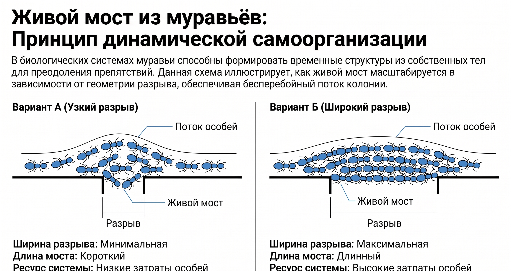
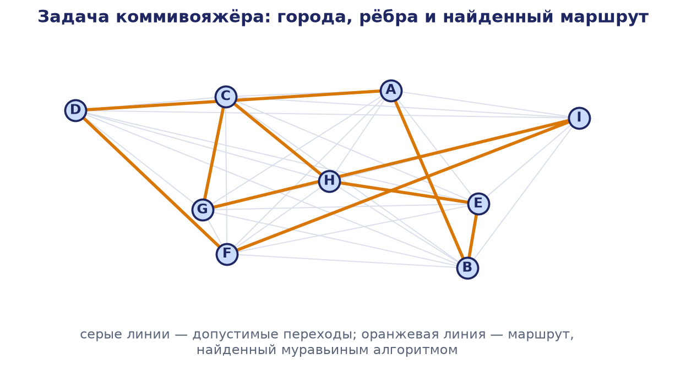

# Глава 5. Роевые системы и био-инспирированные алгоритмы

## 5.1. Введение в роевые системы

Управление распределёнными робототехническими системами (РРТС) сталкивается с фундаментальной проблемой: как обеспечить согласованное и устойчивое коллективное поведение большого числа автономных агентов без опоры на единый вычислительный центр. Классические архитектуры централизованного управления теряют работоспособность при масштабировании: узкое место коммуникаций, уязвимость к отказу управляющего узла и комбинаторный рост сложности планирования делают их непригодными для систем из сотен и тысяч роботов. Ответом на этот вызов стала концепция роевого интеллекта (swarm intelligence), заимствованная из наблюдений за коллективным поведением социальных насекомых, стай птиц и косяков рыб.

Настоящая глава посвящена теоретическим основам роевых систем и семейству био-инспирированных алгоритмов, обеспечивающих самоорганизацию и оптимизацию в распределённых системах. Рассматриваются механизмы стигмергии и самоорганизации, формальные модели коллективного движения (правила Рейнольдса), важнейшие метаэвристики поисковой оптимизации — муравьиный алгоритм (ACO), метод роя частиц (PSO), пчелиный и светлячковый алгоритмы, — а также практические платформы роевой робототехники: Kilobot, Swarm-bots и SMAVNET. Материал сопровождается математическими выкладками, псевдокодом, разобранным численным примером и сравнительным анализом.

### 5.1.1. Определение и признаки роевых систем

Роевая система — это распределённая система из большого числа сравнительно простых агентов (роботов), которые взаимодействуют между собой и со средой на основе локальных правил, порождая при этом сложное целесообразное коллективное поведение, недостижимое для отдельного агента. Ключевым свойством является то, что глобальный порядок возникает «снизу вверх» — из множества локальных взаимодействий, а не задаётся управляющим центром.

Выделяют пять фундаментальных признаков роевых систем. Децентрализованное управление: центральный контроллер отсутствует, каждое решение принимается локально на основе доступной агенту информации. Простота правил: поведение отдельного агента описывается небольшим набором несложных правил, что снижает требования к его вычислительным и сенсорным ресурсам. Эмерджентность: сложное системное поведение является результатом взаимодействий и не запрограммировано явно ни в одном из агентов. Масштабируемость: система сохраняет работоспособность при значительном изменении числа агентов, поскольку опирается на локальные операции. Отказоустойчивость: выход из строя части агентов не приводит к отказу всей системы, так как функции распределены и избыточны.

### 5.1.2. Природные прообразы

Идеи роевого интеллекта черпаются из наблюдений за биологическими сообществами. Колонии муравьёв находят кратчайшие пути к источникам пищи и строят сложные гнёзда без центрального руководства, координируясь через химические следы — феромоны. Пчелиные семьи распределяют фуражиров между источниками нектара и коллективно выбирают новое место для роя посредством «танцевальной» сигнализации. Стаи птиц и косяки рыб перемещаются как единое целое при полном отсутствии лидера — каждая особь ориентируется лишь на ближайших соседей. Общим для всех примеров является то, что сложное адаптивное поведение возникает из простых локальных взаимодействий множества особей; именно этот принцип инженеры переносят в РРТС.

## 5.2. Принципы роевого интеллекта

### 5.2.1. Самоорганизация

Самоорганизация — это процесс, в котором глобальная упорядоченная структура возникает из локальных взаимодействий между компонентами системы без внешнего управления. Она опирается на четыре взаимосвязанных механизма. Положительная обратная связь усиливает выгодные варианты поведения (наращивание феромонного следа на удачном маршруте). Отрицательная обратная связь стабилизирует систему и предотвращает её застревание (испарение феромонов, исчерпание источника пищи). Флуктуации — случайные вариации поведения — обеспечивают исследование пространства решений и позволяют находить новые варианты. Множественность взаимодействий: самоорганизация требует достаточно большого числа агентов, многократно обменивающихся информацией. Совместное действие положительной и отрицательной обратных связей на фоне случайных флуктуаций приводит к спонтанному возникновению устойчивых коллективных структур.

### 5.2.2. Стигмергия

Стигмергия (термин введён П.-П. Грассе в 1959 году при изучении термитов) — это форма непрямой координации агентов через модификацию окружающей среды. Агент, совершая действие, оставляет в среде след, изменяющий условия для последующих действий — как своих, так и других агентов. Таким образом среда выступает в роли общей «памяти» и коммуникационного канала, что снимает необходимость в прямой адресной связи. Классическим примером служит феромонная коммуникация муравьёв: нашедший пищу муравей оставляет на обратном пути химический след, повышающий вероятность выбора этого маршрута другими; чем больше муравьёв прошло, тем сильнее и привлекательнее след. Стигмергия чрезвычайно привлекательна для РРТС, поскольку позволяет координировать большие группы роботов при минимальной коммуникационной инфраструктуре, используя вместо адресного обмена «цифровые феромоны» или физическую разметку среды.

### 5.2.3. Эмерджентность и локальность

Эмерджентное поведение означает, что свойства системы как целого качественно отличаются от суммы свойств её частей и не могут быть выведены анализом поведения одного агента в отрыве от коллектива. Формирование стаи, коллективный перенос груза, распределение по территории — эмерджентные феномены. Оборотная сторона эмерджентности — трудность проектирования: поскольку глобальное поведение не задаётся напрямую, инженер вынужден подбирать локальные правила так, чтобы желаемый результат возникал как их следствие. Принцип локальности, при котором агент опирается лишь на информацию о ближайших соседях и окружающей среде, является одновременно источником масштабируемости и причиной сложности верификации.

## 5.3. Модели коллективного движения: правила Рейнольдса (Boids)

### 5.3.1. Три правила

В 1987 году Крейг Рейнольдс предложил вычислительную модель Boids («bird-oid objects»), воспроизводящую реалистичное стайное движение тремя простыми локальными правилами, применяемыми к каждому агенту относительно множества его соседей Nᵢ. Модель стала фундаментом как для компьютерной анимации, так и для алгоритмов управления формациями роботов и роями дронов.

Правило разделения (separation) заставляет агента избегать столкновений, отталкиваясь от слишком близко расположенных соседей; составляющая скорости обратно пропорциональна расстоянию:

vᵢˢᵉᵖ = c₂ · Σⱼ∈Nᵢ (xᵢ − xⱼ) / ‖xᵢ − xⱼ‖²

Правило выравнивания (alignment) побуждает согласовывать направление и скорость движения со средней скоростью соседей:

vᵢᵃˡⁱ = c₃ · ( (1/N) · Σⱼ∈Nᵢ vⱼ − vᵢ )

Правило сближения (cohesion) заставляет агента стремиться к центру масс соседей, удерживая стаю целостной:

vᵢᶜᵒʰ = c₁ · ( (1/N) · Σⱼ∈Nᵢ xⱼ − xᵢ )

Здесь xᵢ и vᵢ — позиция и скорость i-го агента, N = |Nᵢ| — число соседей в радиусе восприятия, коэффициенты c₁, c₂, c₃ задают относительный вес каждого правила.


### 5.3.2. Интеграция правил

Результирующее обновление состояния агента есть суперпозиция трёх составляющих:

vᵢ(t+1) = vᵢ(t) + vᵢᶜᵒʰ + vᵢˢᵉᵖ + vᵢᵃˡⁱ
xᵢ(t+1) = xᵢ(t) + vᵢ(t+1)

На практике модуль скорости ограничивают максимумом vₘₐₓ. Баланс коэффициентов принципиален: доминирование сближения приводит к схлопыванию стаи в точку, доминирование разделения — к её распаду, чрезмерное выравнивание делает стаю нечувствительной к препятствиям. Правила Рейнольдса иллюстрируют главную идею роевого интеллекта: три элементарных локальных закона порождают сложное устойчивое коллективное движение без центрального управления. В робототехнике модель дополняют правилами движения к цели (goal seeking) и обхода препятствий (obstacle avoidance).

## 5.4. Общая формализация роевых алгоритмов

Единый формальный каркас представляет каждого агента точкой в пространстве состояний, эволюция которой описывается правилом обновления, зависящим от собственного состояния агента и состояний соседей:

xᵢ(t+1) = xᵢ(t) + fᵢ( xᵢ(t), x_{Nᵢ}(t) )

где xᵢ(t) — состояние агента i, x_{Nᵢ}(t) — состояния соседних агентов, fᵢ — функция локального обновления. Различные роевые алгоритмы отличаются формой fᵢ, определением соседства Nᵢ и способом кодирования информации (сообщение, феромон, наблюдаемая скорость). Такой взгляд позволяет рассматривать модель Boids, PSO, ACO и пчелиный алгоритм как частные случаи единой схемы распределённой итеративной динамики.

## 5.5. Муравьиный алгоритм (Ant Colony Optimization, ACO)

### 5.5.1. Принцип работы

Муравьиный алгоритм, предложенный Марко Дориго в начале 1990-х годов, моделирует фуражировку муравьёв и предназначен прежде всего для задач комбинаторной оптимизации на графах — задачи коммивояжёра (TSP) и маршрутизации. Принцип основан на стигмергии: искусственные муравьи строят решения, перемещаясь по рёбрам графа, и откладывают на пройденных рёбрах «феромон», интенсивность которого пропорциональна качеству решения. Испарение феромона предотвращает преждевременную сходимость к субоптимальным путям.

Биологической основой алгоритма служат классические эксперименты Ж.-Л. Дёнёбура с «двойным мостом»: гнездо аргентинских муравьёв (*Linepithema humile*) соединяли с источником пищи двумя ветвями разной длины. Первоначально муравьи выбирали ветви случайно, однако вернувшиеся по более короткой ветви особи успевали отложить феромон раньше; возникавшая положительная обратная связь приводила к тому, что большинство колонии в итоге сходилось на кратчайшем пути.




### 5.5.2. Математическая модель

Вероятность перехода муравья из узла i в узел j определяется комбинацией накопленного феромона τᵢⱼ и эвристической информации ηᵢⱼ (обычно ηᵢⱼ = 1/dᵢⱼ, где dᵢⱼ — длина ребра):

Pᵢⱼ = (τᵢⱼ^α · ηᵢⱼ^β) / Σ_{k∈Nᵢ} (τᵢₖ^α · ηᵢₖ^β)

Здесь α и β задают относительную важность феромонного следа и эвристики; Nᵢ — множество ещё не посещённых узлов. При α = 0 алгоритм вырождается в жадный поиск, при β = 0 — в поиск, ведомый только феромоном.

Классической тестовой задачей для ACO служит задача коммивояжёра (TSP): по заданному графу городов требуется найти кратчайший замкнутый маршрут, посещающий каждый город ровно один раз. Задача является NP-трудной, поэтому для больших размерностей применяют метаэвристики (ACO, генетические алгоритмы), дающие решения, близкие к оптимальным, за приемлемое время.



После того как все муравьи построили решения, феромон на каждом ребре обновляется:

τᵢⱼ ← (1 − ρ) · τᵢⱼ + Δτᵢⱼ

где ρ ∈ (0, 1) — коэффициент испарения, Δτᵢⱼ = Σ_k Δτᵢⱼ^k — суммарный феромон, отложенный всеми прошедшими по ребру муравьями. Вклад муравья k обычно равен Δτᵢⱼ^k = Q / Lₖ, если муравей использовал ребро (i, j), и нулю иначе; Q — константа, Lₖ — длина маршрута муравья k. Короткие маршруты получают более сильное подкрепление, что реализует положительную обратную связь.

### 5.5.3. Псевдокод ACO

```
Инициализировать τᵢⱼ = τ₀ для всех рёбер (i, j)
Задать параметры α, β, ρ, Q, число муравьёв m, число итераций T

для t = 1 .. T:
    для каждого муравья k = 1 .. m:
        поместить муравья в случайный стартовый узел
        пока маршрут не построен полностью:
            выбрать узел j по вероятности
                Pᵢⱼ = (τᵢⱼ^α · ηᵢⱼ^β) / Σ (τᵢₖ^α · ηᵢₖ^β)
            добавить j в маршрут, пометить как посещённый
        вычислить длину маршрута Lₖ
    для всех рёбер (i, j):            # испарение
        τᵢⱼ ← (1 − ρ) · τᵢⱼ
    для каждого муравья k:           # отложение
        для каждого ребра (i, j) в маршруте k:
            τᵢⱼ ← τᵢⱼ + Q / Lₖ
    обновить лучшее найденное решение

вернуть лучшее решение
```

Известны усовершенствованные варианты: Ant Colony System (с локальным обновлением феромона и псевдослучайным выбором) и MAX-MIN Ant System (с ограничением феромона диапазоном [τₘᵢₙ, τₘₐₓ] и отложением только лучшим муравьём). В робототехнике ACO применяется для маршрутизации групп роботов, планирования покрытия территории и распределения задач; «феромон» реализуется как разделяемая цифровая карта либо как физические метки в среде.

## 5.6. Метод роя частиц (Particle Swarm Optimization, PSO)

### 5.6.1. Принцип работы

Метод роя частиц предложен Джеймсом Кеннеди и Расселом Эберхартом в 1995 году как модель социального поведения стай, адаптированная к оптимизации в непрерывном пространстве. Каждая частица — потенциальное решение, точка xᵢ, обладающая скоростью vᵢ. Частица помнит лучшее из посещённых ею положений pᵢ (personal best) и осведомлена о лучшем положении, найденном роем g (global best). Движение определяется тремя составляющими: инерцией текущего движения, притяжением к собственному лучшему опыту (когнитивная компонента) и притяжением к коллективному лучшему опыту (социальная компонента).

Наглядно работа метода показана на рис. 5.5: частицы, изначально случайно разбросанные по пространству поиска, под действием когнитивной и социальной составляющих постепенно стягиваются к области глобального оптимума целевой функции (области приспособленности показаны оттенками). Такое коллективное поведение — самоорганизующийся поиск экстремума без вычисления градиента — типично для роевых методов оптимизации.


### 5.6.2. Математическая модель

Обновление скорости и позиции частицы i на каждой итерации:

vᵢ(t+1) = ω·vᵢ(t) + c₁·r₁·(pᵢ − xᵢ(t)) + c₂·r₂·(g − xᵢ(t))
xᵢ(t+1) = xᵢ(t) + vᵢ(t+1)

где ω — инерционный вес (баланс исследования и уточнения), c₁ и c₂ — когнитивный и социальный коэффициенты обучения (типично c₁ = c₂ ≈ 2), r₁ и r₂ — независимые случайные числа из [0, 1], генерируемые заново на каждом шаге. Большое ω способствует глобальному исследованию, малое — локальному уточнению; часто ω линейно снижают от 0.9 до 0.4.

### 5.6.3. Псевдокод PSO

```
Задать размер роя n, коэффициенты ω, c₁, c₂, число итераций T
для каждой частицы i = 1 .. n:
    инициализировать позицию xᵢ случайно, скорость vᵢ (часто нулём)
    pᵢ ← xᵢ
g ← argmin f(pᵢ)

для t = 1 .. T:
    для каждой частицы i = 1 .. n:
        сгенерировать r₁, r₂ ~ U(0,1)
        vᵢ ← ω·vᵢ + c₁·r₁·(pᵢ − xᵢ) + c₂·r₂·(g − xᵢ)
        xᵢ ← xᵢ + vᵢ
        если f(xᵢ) < f(pᵢ): pᵢ ← xᵢ
        если f(xᵢ) < f(g):  g  ← xᵢ
вернуть g
```

### 5.6.4. Разобранный численный пример

Рассмотрим минимизацию одномерной функции f(x) = x² с двумя частицами. Параметры: ω = 0.5, c₁ = 1.5, c₂ = 1.5. Для наглядности зафиксируем r₁ = r₂ = 1 (в реальном алгоритме они случайны).

Начальное состояние. Частица 1: x₁ = 4, v₁ = 0; частица 2: x₂ = −3, v₂ = 0. Значения: f(4) = 16, f(−3) = 9. Личные лучшие p₁ = 4, p₂ = −3. Глобальный лучший g = −3 (9 < 16).

Итерация 1. Частица 1:
v₁ = 0.5·0 + 1.5·1·(4 − 4) + 1.5·1·(−3 − 4) = −10.5;  x₁ = 4 − 10.5 = −6.5,  f(−6.5) = 42.25.
Так как 42.25 > 16, личный лучший p₁ остаётся равным 4.
Частица 2:
v₂ = 0.5·0 + 1.5·1·(−3 − (−3)) + 1.5·1·(−3 − (−3)) = 0;  x₂ = −3,  f(−3) = 9.  p₂ = −3.
После итерации 1 глобальный лучший g = −3. Частица 1 «проскочила» минимум — типичное явление при большом шаге.

Итерация 2. Частица 1 (x₁ = −6.5, v₁ = −10.5, p₁ = 4, g = −3):
v₁ = 0.5·(−10.5) + 1.5·(4 − (−6.5)) + 1.5·(−3 − (−6.5)) = −5.25 + 15.75 + 5.25 = 15.75;
x₁ = −6.5 + 15.75 = 9.25,  f(9.25) = 85.56.
Частица 2 остаётся в x₂ = −3 (обе разности нулевые), f = 9.

Пример иллюстрирует особенности PSO: при завышенных c₁, c₂ и малой инерции частица совершает большие колебания вокруг оптимума (осцилляции), поэтому на практике применяют коэффициент сжатия χ или ограничение скорости vₘₐₓ. Глобальный лучший монотонно не ухудшается — рой запоминает лучшее решение. При корректных параметрах (например, ω = 0.7, c₁ = c₂ = 1.5 со случайными r₁, r₂) обе частицы за несколько итераций сходятся к окрестности точки x = 0.

### 5.6.5. Применение в робототехнике

PSO используется для настройки параметров регуляторов (коэффициентов ПИД-контроллеров), калибровки моделей, планирования траекторий и распределённого поиска источников (запаха, излучения, температуры). В варианте физически воплощённого PSO каждая частица — реальный робот; личный лучший опыт хранится в его памяти, а глобальный лучший распространяется по локальной сети связи, что превращает метаэвристику в алгоритм коллективного поиска экстремума пространственного поля.

## 5.7. Пчелиный алгоритм (Bee Colony Optimization)

Пчелиные алгоритмы (Artificial Bee Colony, ABC, предложен Д. Карабогой в 2005 году) моделируют фуражировку медоносных пчёл. Популяция делится на три группы. Рабочие пчёлы закреплены за конкретными источниками нектара (решениями) и исследуют их окрестности. Пчёлы-наблюдатели остаются в улье и выбирают источник для разработки на основе информации от рабочих пчёл (виляющий танец), причём вероятность выбора пропорциональна качеству источника. Пчёлы-разведчики случайно ищут новые источники, заменяя истощившиеся. Такое разделение труда балансирует эксплуатацию известных хороших решений и исследование новых.

Вероятность выбора наблюдателем источника i пропорциональна его пригодности fᵢ:

Pᵢ = fᵢ / Σ_{k=1}^{N} fₖ

Новое решение в окрестности источника генерируется по формуле:

vᵢⱼ = xᵢⱼ + φᵢⱼ · (xᵢⱼ − xₖⱼ)

где k — случайно выбранный другой источник, j — случайная координата, φᵢⱼ — случайное число из [−1, 1]. Если vᵢ лучше xᵢ, оно замещает исходное (жадный отбор). Если источник не улучшается заданное число попыток (параметр limit), он покидается, а рабочая пчела становится разведчиком. В робототехнике пчелиные алгоритмы применяются для оптимизации маршрутов сбора данных, распределения роботов по зонам обследования и планирования задач.

## 5.8. Светлячковый алгоритм (Firefly Algorithm)

Светлячковый алгоритм, предложенный Синь-Ше Янгом в 2008 году, основан на модели свечения и взаимного притяжения светлячков. Каждый светлячок соответствует решению, а яркость его свечения — значению целевой функции: чем ярче, тем лучше решение. Менее яркие светлячки притягиваются к более ярким, причём привлекательность убывает с расстоянием из-за поглощения света средой.

Привлекательность описывается функцией β(r) = β₀ · exp(−γ·r²), где β₀ — привлекательность при нулевом расстоянии, γ — коэффициент поглощения, r — расстояние. Перемещение светлячка i к более яркому светлячку j:

xᵢ(t+1) = xᵢ(t) + β₀·exp(−γ·rᵢⱼ²)·(xⱼ − xᵢ) + α·εᵢ

где α — коэффициент случайного шага, εᵢ — вектор случайных возмущений. Первое слагаемое сохраняет текущее положение, второе реализует притяжение к лучшему решению, третье обеспечивает исследование. Алгоритм особенно эффективен для многоэкстремальных (мультимодальных) задач: экспоненциальное затухание привлекательности с расстоянием позволяет рою автоматически разбиваться на подгруппы, сходящиеся к разным локальным оптимумам.

## 5.9. Алгоритм серого волка и другие метаэвристики

Алгоритм серого волка (Grey Wolf Optimizer, GWO, С. Мирджалили, 2014) моделирует иерархию стаи (альфа, бета, дельта, омега) и коллективную охоту. Положения трёх лучших особей X₁, X₂, X₃ (альфа-, бета- и дельта-волки) задают предполагаемое положение добычи, а обновление позиции остальных волков есть их усреднение:

X(t+1) = (X₁ + X₂ + X₃) / 3

где каждая составляющая вычисляется через векторы D = |C·X_best − X| и X = X_best − A·D; коэффициенты A и C убывают по мере итераций, обеспечивая переход от исследования к уточнению. К тому же семейству относятся алгоритм летучих мышей (Bat Algorithm), кукушкиного поиска (Cuckoo Search) и бактериальной оптимизации. Все они разделяют общую метаэвристическую структуру: инициализация популяции, итеративное обновление решений по природоподобным правилам и постепенный переход от глобального исследования к локальному уточнению.

## 5.10. Сравнительный анализ алгоритмов

**Таблица 5.1. Сравнение основных роевых алгоритмов**

| Алгоритм | Природный прообраз | Тип задач | Пространство поиска | Основные параметры |
|----------|--------------------|-----------|---------------------|--------------------|
| ACO | Фуражировка муравьёв | Комбинаторная оптимизация (графы) | Дискретное | α, β, ρ, Q, m |
| PSO | Стаи птиц / рыб | Непрерывная оптимизация | Непрерывное | ω, c₁, c₂, n |
| ABC (пчёлы) | Фуражировка пчёл | Непрерывная и дискретная | Оба | N, limit |
| Firefly | Свечение светлячков | Мультимодальная оптимизация | Непрерывное | β₀, γ, α |
| GWO | Охота волков | Непрерывная оптимизация | Непрерывное | a (убывает), n |

**Таблица 5.2. Сильные и слабые стороны алгоритмов**

| Алгоритм | Преимущества | Недостатки |
|----------|--------------|------------|
| ACO | Естествен для задач на графах; динамическое перестроение маршрутов; выраженная положительная обратная связь | Медленная сходимость; риск застревания; много параметров |
| PSO | Простота реализации; мало параметров; быстрая сходимость | Преждевременная сходимость в мультимодальных задачах; чувствительность к ω, c₁, c₂ |
| ABC | Хороший баланс исследования и эксплуатации; мало параметров | Медленная сходимость; слабое использование информации о лучшем решении |
| Firefly | Эффективен для мультимодальных задач; автоматическое разбиение на подгруппы | Высокая стоимость (попарные расстояния); чувствительность к γ |
| GWO | Мало параметров; хорошая сбалансированность | Может застревать в локальных оптимумах на сложных ландшафтах |

Общей чертой всех метаэвристик является отсутствие гарантии нахождения глобального оптимума и зависимость качества результата от настройки параметров. Выбор алгоритма определяется природой задачи (дискретная или непрерывная, унимодальная или мультимодальная), доступными вычислительными ресурсами и требованиями к скорости сходимости.

## 5.11. Роевая робототехника: аппаратные платформы

Роевая робототехника (swarm robotics) — раздел РРТС, изучающий координацию больших групп относительно простых физических роботов. В отличие от чисто алгоритмических метаэвристик, здесь агенты обладают телом, ограниченными сенсорами, локальной связью и энергоресурсом, что накладывает жёсткие ограничения на реализуемые правила. Э. Шахин (Erol Şahin) в основополагающей работе 2004 года выделил критерии, отличающие роевую робототехнику: автономность роботов, большое их число, малое разнообразие (однородность), ограниченность возможностей отдельного робота и локальность его восприятия и связи.

### 5.11.1. Kilobot

Kilobot — миниатюрный робот, разработанный в Гарвардском университете (лаборатория Radhika Nagpal, 2012) для экспериментов с очень большими роями при низкой стоимости единицы. Робот перемещается за счёт вибромоторов (скользящее движение по гладкой поверхности), общается с соседями через отражённый инфракрасный свет и измеряет расстояние по интенсивности сигнала. Ключевое достоинство — масштабируемость управления: заряд, программирование и запуск всего роя выполняются одновременно через инфракрасный контроллер. В 2014 году коллектив под руководством М. Рубенштейна продемонстрировал самосборку заданных форм роем из 1024 роботов Kilobot — эталонная иллюстрация масштабируемой распределённой самоорганизации.

### 5.11.2. Swarm-bots (s-bot)

Проект Swarm-bots (европейский консорциум под руководством М. Дориго, 2001–2005) исследовал физическую кооперацию роботов. Робот s-bot оснащён захватом, позволяющим ему физически соединяться с другими роботами в единую структуру — «swarm-bot». Способность к агрегации позволяет группе решать задачи, недоступные одиночному роботу: преодоление широких провалов, совместный перенос тяжёлых объектов, взаимную поддержку на неровной местности. Продолжение проекта Swarmanoid распространило идею на гетерогенные рои из наземных, лазающих и летающих роботов.

### 5.11.3. SMAVNET

Проект SMAVNET (Swarming Micro Air Vehicle Network, лаборатория Д. Флореано в EPFL) посвящён роям лёгких летающих роботов, образующих в воздухе беспроводную коммуникационную сеть. Небольшие пенопластовые самолёты с автопилотом развёртывают в зоне бедствия временную ad-hoc сеть связи для спасателей, координируя движение на основе локальных правил без GPS и централизованного управления. Проект демонстрирует применение принципов роевого интеллекта к воздушным РРТС и к задаче создания инфраструктуры связи там, где стационарная инфраструктура разрушена.

## 5.12. Задачи и области применения

Роевые алгоритмы и роевая робототехника применяются в широком спектре задач РРТС. Поисково-спасательные операции требуют быстрого обследования больших территорий; рой параллельно покрывает зону бедствия и адаптируется к потере отдельных агентов. Мониторинг окружающей среды предполагает распределённый сбор данных о состоянии экосистем и картирование полей концентрации веществ. Оптимизация маршрутов и логистика опираются на муравьиные и пчелиные алгоритмы. Задачи покрытия и картографирования, формирования и удержания строя, коллективного переноса объектов и распределения задач также решаются роевыми методами. Отдельным классом применений стали световые шоу роёв дронов — массовая демонстрация зрелой технологии синхронного управления сотнями летательных аппаратов.

## 5.13. Вызовы и перспективы

Роевые системы сталкиваются с рядом принципиальных вызовов. Проблема масштабируемости состоит в нелинейном росте объёма коммуникаций с числом агентов; решением служат алгоритмы с локальными правилами постоянной или логарифмической сложности на агента. Проблема надёжности требует сохранения функциональности при отказах; ответом являются механизмы самовосстановления, избыточности и переназначения ролей. Проблема энергоэффективности особенно остра для миниатюрных роботов и решается энергосберегающими протоколами и аппаратными решениями. Коммуникационные ограничения преодолеваются переходом к локальной коммуникации, стигмергии и минимизации объёма передаваемых данных.

Отдельную трудность представляет проектирование локальных правил под заданное глобальное поведение: обратная задача (от желаемой эмерджентности к правилам агента) в общем случае не имеет аналитического решения, что стимулирует применение эволюционных методов и обучения с подкреплением для автоматического синтеза правил. Перспективными направлениями являются интеграция роевого интеллекта с машинным обучением, теорией игр и формальной верификацией, гетерогенные рои, а также приложения в промышленности, сельском хозяйстве, медицине (микророботы) и освоении космоса.

## Выводы по главе

Роевые системы представляют собой парадигму управления РРТС, в которой сложное целесообразное коллективное поведение возникает из локальных взаимодействий множества простых автономных агентов без централизованного управления. Ключевыми механизмами являются самоорганизация (сочетание положительной и отрицательной обратных связей с флуктуациями) и стигмергия (непрямая координация через модификацию среды). Модель Boids Рейнольдса демонстрирует, что три элементарных правила — разделение, выравнивание и сближение — порождают устойчивое стайное движение.

Био-инспирированные метаэвристики — муравьиный алгоритм, метод роя частиц, пчелиный, светлячковый алгоритмы и алгоритм серого волка — образуют мощный инструментарий для решения задач оптимизации, маршрутизации и распределения ресурсов; их объединяет общая итеративная структура с переходом от глобального исследования к локальному уточнению, а различает форма правил обновления и область применения. Практические платформы роевой робототехники — Kilobot, Swarm-bots, SMAVNET — доказали физическую реализуемость масштабируемых отказоустойчивых роёв. Вместе с тем сохраняются открытые проблемы масштабируемости, надёжности, энергоэффективности, коммуникации и проектирования правил, определяющие направления дальнейших исследований.

## Вопросы для самопроверки

1. Дайте определение роевой системы и перечислите пять её фундаментальных признаков.
2. В чём различие между самоорганизацией и стигмергией? Приведите пример каждого механизма.
3. Сформулируйте три правила Рейнольдса и запишите соответствующие формулы обновления скорости. К чему приводит дисбаланс их коэффициентов?
4. Запишите формулу вероятности перехода в муравьином алгоритме и поясните роль параметров α и β.
5. Как выполняется обновление феромона в ACO и какую роль играет коэффициент испарения ρ?
6. Запишите формулы обновления скорости и позиции в PSO. Что означают инерционный вес и когнитивный/социальный коэффициенты?
7. Чем отличаются роли рабочих пчёл, наблюдателей и разведчиков в пчелином алгоритме?
8. В чём преимущество светлячкового алгоритма для мультимодальных задач и как этому способствует экспоненциальное затухание привлекательности?
9. Сформулируйте критерии Шахина, отличающие роевую робототехнику от других мультиагентных систем.
10. Опишите платформу Kilobot и объясните, за счёт чего достигается управляемость роя из тысячи роботов.

## Задания

1. Реализуйте на Python или MATLAB метод роя частиц (PSO) для поиска минимума функции Растригина в двумерном пространстве. Исследуйте влияние инерционного веса ω и коэффициентов c₁, c₂ на скорость и качество сходимости; постройте графики сходимости для не менее чем трёх наборов параметров.

2. Реализуйте муравьиный алгоритм (ACO) для решения задачи коммивояжёра на 10–20 городах. Сравните качество решения при разных значениях α, β и ρ. Визуализируйте изменение лучшего маршрута и суммарного феромона по итерациям.

3. Смоделируйте движение стаи из 20–50 агентов по правилам Рейнольдса (Boids) в двумерной среде с препятствиями. Добавьте правила движения к цели и обхода препятствий, подберите коэффициенты c₁, c₂, c₃ для устойчивого стайного движения.

4. Проведите сравнительное исследование двух метаэвристик (например, PSO и ABC) на наборе тестовых функций (сфера, Розенброка, Экли). Оформите отчёт с таблицами усреднённых результатов по нескольким запускам и статистическим анализом различий.

## Литература

1. Bonabeau E., Dorigo M., Theraulaz G. Swarm Intelligence: From Natural to Artificial Systems. — New York: Oxford University Press, 1999. — 307 p.
2. Dorigo M., Stützle T. Ant Colony Optimization. — Cambridge, MA: MIT Press, 2004. — 305 p.
3. Kennedy J., Eberhart R. Particle Swarm Optimization // Proceedings of IEEE International Conference on Neural Networks. — 1995. — Vol. 4. — P. 1942–1948.
4. Şahin E. Swarm Robotics: From Sources of Inspiration to Domains of Application // Swarm Robotics. Lecture Notes in Computer Science, vol. 3342. — Berlin, Heidelberg: Springer, 2005. — P. 10–20.
5. Reynolds C. W. Flocks, Herds, and Schools: A Distributed Behavioral Model // Computer Graphics (SIGGRAPH '87 Proceedings). — 1987. — Vol. 21, No. 4. — P. 25–34.
6. Karaboga D., Basturk B. A Powerful and Efficient Algorithm for Numerical Function Optimization: Artificial Bee Colony (ABC) Algorithm // Journal of Global Optimization. — 2007. — Vol. 39, No. 3. — P. 459–471.
7. Yang X.-S. Nature-Inspired Metaheuristic Algorithms. — Frome: Luniver Press, 2008. — 128 p.
8. Mirjalili S., Mirjalili S. M., Lewis A. Grey Wolf Optimizer // Advances in Engineering Software. — 2014. — Vol. 69. — P. 46–61.
9. Rubenstein M., Cornejo A., Nagpal R. Programmable Self-Assembly in a Thousand-Robot Swarm // Science. — 2014. — Vol. 345, No. 6198. — P. 795–799.
10. Brambilla M., Ferrante E., Birattari M., Dorigo M. Swarm Robotics: A Review from the Swarm Engineering Perspective // Swarm Intelligence. — 2013. — Vol. 7, No. 1. — P. 1–41.
11. Clerc M. Particle Swarm Optimization. — London: ISTE Ltd, 2006. — 244 p.
12. Карпенко А. П. Современные алгоритмы поисковой оптимизации. Алгоритмы, вдохновлённые природой. — М.: Изд-во МГТУ им. Н. Э. Баумана, 2014. — 446 с.
