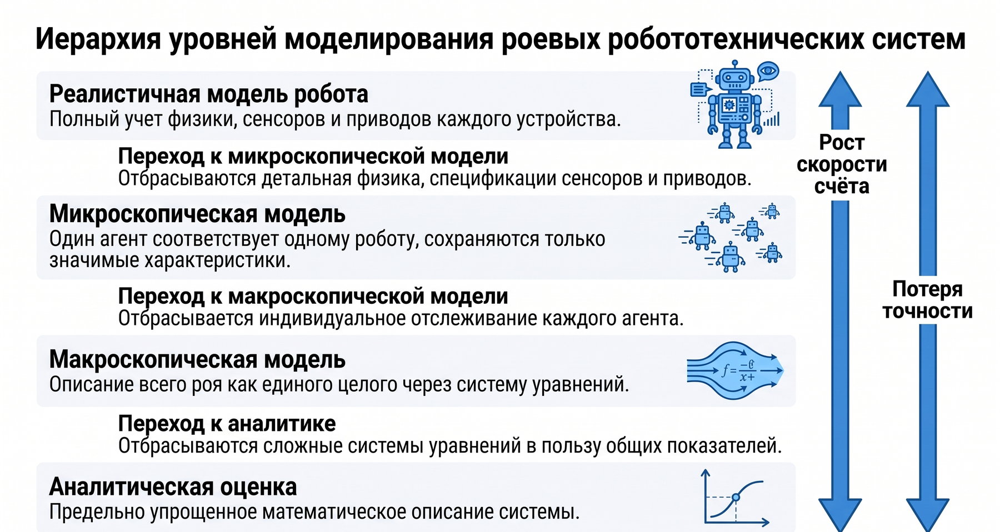
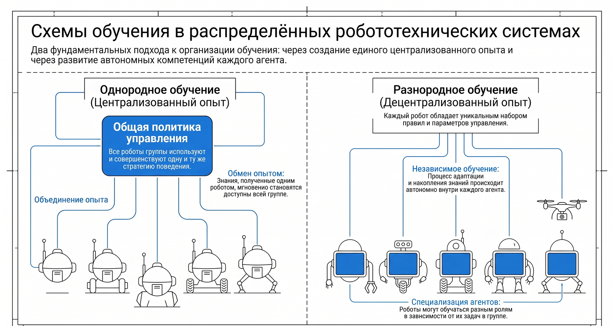

# Глава 7. Обучение с подкреплением в распределённых робототехнических системах

В предыдущих главах стратегия поведения агентов распределённой робототехнической системы (РРТС) задавалась разработчиком явно — в виде алгоритмов координации, правил роевого поведения или протоколов распределения задач. Однако во многих практических ситуациях среда заранее неизвестна, изменчива или настолько сложна, что аналитический синтез управляющих законов невозможен или неоправданно трудоёмок. Естественным подходом становится обучение: агенты самостоятельно формируют стратегию поведения на основе опыта взаимодействия со средой. Настоящая глава посвящена обучению с подкреплением (Reinforcement Learning, RL) — разделу машинного обучения, наиболее близкому по постановке к задачам управления, — и его распространению на многоагентный случай, характерный для РРТС.

## 7.1. Основы обучения с подкреплением

### 7.1.1. Постановка задачи и базовые понятия

Обучение с подкреплением — парадигма машинного обучения, в которой обучающаяся система (агент) взаимодействует с окружающей средой методом проб и ошибок. В отличие от обучения с учителем, где для каждого примера известен правильный ответ, здесь агент не получает готовых указаний: после каждого действия среда сообщает ему числовой сигнал — вознаграждение (подкрепление), — оценивающий, насколько удачным оказалось действие с точки зрения конечной цели. Задача агента — максимизировать суммарное вознаграждение, накопленное за всё время взаимодействия, а не сиюминутную выгоду на отдельном шаге.

Цикл взаимодействия агента со средой организован следующим образом. В дискретный момент времени $t$ агент наблюдает состояние среды $s_t$, выбирает и выполняет действие $a_t$, после чего среда переходит в новое состояние $s_{t+1}$ и возвращает агенту вознаграждение $r_{t+1}$. Затем цикл повторяется. Основными компонентами задачи обучения с подкреплением являются:

- агент — обучающаяся сущность, принимающая решения (в робототехнике — система управления робота);
- среда — всё, что находится вне агента и с чем он взаимодействует (физический мир, другие роботы, объекты манипулирования);
- множество состояний $S$ — совокупность возможных ситуаций, в которых может находиться агент;
- множество действий A — совокупность доступных агенту управляющих воздействий;
- вознаграждение $R$ — скалярная оценка качества действия, формируемая средой (или, точнее, задаваемая разработчиком функция, кодирующая цель системы);
- политика $\pi$ — стратегия поведения агента, то есть правило выбора действия в каждом состоянии; в общем случае политика стохастична и записывается как $\pi(a \mid s)$ — вероятность выбора действия $a$ в состоянии $s$.

Принципиальной особенностью обучения с подкреплением является проблема отложенного вознаграждения: последствия действия могут проявиться спустя много шагов (неудачный манёвр робота в начале маршрута приводит к тупику лишь через десятки тактов управления), поэтому агент должен оценивать долгосрочную ценность действий, а не только немедленный отклик среды. Вторая фундаментальная особенность — дилемма исследования и использования (exploration vs. exploitation): агент должен, с одной стороны, использовать накопленные знания для получения вознаграждения, а с другой — пробовать новые действия, чтобы обнаружить, возможно, более выгодные варианты поведения.

### 7.1.2. Марковский процесс принятия решений

Математической моделью задачи обучения с подкреплением служит марковский процесс принятия решений (Markov Decision Process, MDP). MDP определяется кортежем $\langle S, A, P, R, \gamma \rangle$, где:

- $S$ — множество состояний среды;
- A — множество действий агента;
- $P(s' \mid s, a)$ — функция переходных вероятностей, задающая вероятность перехода среды в состояние $s'$ при выполнении действия $a$ в состоянии $s$;
- $R(s, a)$ — функция вознаграждения, определяющая ожидаемое вознаграждение за выполнение действия $a$ в состоянии $s$;
- $\gamma \in [0, 1]$ — коэффициент дисконтирования, определяющий, насколько сильно будущие вознаграждения обесцениваются по сравнению с немедленными.

Ключевым предположением модели является марковское свойство: распределение следующего состояния и вознаграждения зависит только от текущего состояния и действия, но не от всей предыстории процесса; иными словами, состояние $s$ содержит всю информацию, существенную для принятия решения. В робототехнике это предположение выполняется лишь приближённо: бортовые сенсоры дают неполную и зашумлённую картину мира, и агент наблюдает не состояние, а его частичное отображение. Такие задачи формализуются как частично наблюдаемые MDP (POMDP), к которым мы вернёмся при обсуждении многоагентного случая.

Целевым критерием агента служит доходность (return) — дисконтированная сумма будущих вознаграждений:

```math
G_t = r_{t+1} + \gamma \cdot r_{t+2} + \gamma^2\cdot r_{t+3} + \ldots = \sum_{k=0}^{\infty} \gamma^k\cdot r_{t+k+1}.
```

Коэффициент дисконтирования $\gamma$ играет двоякую роль. Во-первых, при $\gamma < 1$ бесконечная сумма гарантированно сходится, если вознаграждения ограничены. Во-вторых, $\gamma$ выражает «горизонт планирования» агента: при $\gamma$, близком к нулю, агент близорук и максимизирует немедленное вознаграждение; при $\gamma$, близком к единице, он придаёт почти равный вес отдалённым последствиям своих действий. В задачах управления роботами обычно используют значения $\gamma$ в диапазоне 0,9–0,99.

Задача агента формулируется так: найти политику $\pi^{*}$, максимизирующую ожидаемую доходность из любого начального состояния.

### 7.1.3. Функции ценности и уравнения Беллмана

Центральную роль в теории обучения с подкреплением играют функции ценности, оценивающие «выгодность» состояний и действий при заданной политике.

Функция ценности состояния $V\pi(s)$ — это ожидаемая доходность при старте из состояния $s$ и дальнейшем следовании политике $\pi$:

```math
V\pi(s) = E_\pi [G_t \mid s_t = s].
```

Функция ценности действия ($Q$-функция) $Q\pi(s, a)$ — это ожидаемая доходность при старте из состояния $s$, выполнении действия $a$ и последующем следовании политике $\pi$:

```math
Q\pi(s, a) = E_\pi [G_t \mid s_t = s, a_t = a].
```

Функции ценности удовлетворяют рекуррентным соотношениям, известным как уравнения Беллмана. Для функции ценности состояния уравнение Беллмана имеет вид:

```math
V\pi(s) = \sum_a \pi(a\lvert s) \cdot \sum_s' P(s'\rvert s, a) \cdot [R(s, a) + \gamma \cdot V\pi(s')].
```

Смысл этого уравнения прозрачен: ценность состояния равна ожидаемому немедленному вознаграждению плюс дисконтированная ценность следующего состояния, усреднённые по действиям политики и по стохастике переходов среды. Аналогичное соотношение справедливо для $Q$-функции:

```math
Q\pi(s, a) = \sum_s' P(s'\lvert s, a) \cdot [R(s, a) + \gamma \cdot \sum_a' \pi(a'\rvert s')\cdot Q\pi(s', a')].
```

Оптимальные функции ценности определяются как максимум по всем политикам: $V^{*}(s) = \max_\pi V\pi(s)$ и $Q^{*}(s, a) = \max_\pi Q\pi(s, a)$. Они удовлетворяют уравнениям оптимальности Беллмана, в которых усреднение по политике заменяется максимизацией:

```math
V^{*}(s) = \max_a \sum_s' P(s' \mid s, a) \cdot [R(s, a) + \gamma \cdot V^{*}(s')];
```

```math
Q^{*}(s, a) = \sum_s' P(s' \mid s, a) \cdot [R(s, a) + \gamma \cdot \max_a' Q^{*}(s', a')].
```

Знание оптимальной $Q$-функции немедленно даёт оптимальную политику: в каждом состоянии достаточно выбирать действие с максимальной ценностью:

```math
\pi^{*}(s) = \arg\max_a Q^{*}(s, a).
```

Именно поэтому значительная часть алгоритмов обучения с подкреплением направлена на оценивание $Q^{*}$. Если модель среды (функции $P$ и $R$) известна, уравнения Беллмана можно решать методами динамического программирования — итерацией ценности или итерацией политики. Однако в робототехнике модель среды, как правило, недоступна, и на первый план выходят методы, обучающиеся непосредственно на опыте взаимодействия, — методы временных разностей.

## 7.2. Табличные алгоритмы обучения с подкреплением

### 7.2.1. Q-обучение

$Q$-обучение (Q-learning), предложенное К. Уоткинсом в 1989 году, — исторически один из важнейших алгоритмов обучения с подкреплением и до сих пор основа многих современных методов. Алгоритм хранит таблицу оценок $Q(s, a)$ для всех пар «состояние — действие» и после каждого перехода $(s_t, a_t, r_{t+1}, s_{t+1})$ обновляет соответствующую ячейку по правилу:

```math
Q(s, a) \leftarrow Q(s, a) + \alpha \cdot [r + \gamma \cdot \max_a' Q(s', a') - Q(s, a)],
```

где $\alpha \in$ (0, 1] — скорость обучения (шаг обучения). Выражение в квадратных скобках называется ошибкой временной разности (TD-ошибкой): это расхождение между текущей оценкой $Q(s, a)$ и её «улучшенной» оценкой $r + \gamma \cdot \max_a' Q(s', a')$, построенной по фактически полученному вознаграждению и ценности лучшего действия в следующем состоянии. Правило обновления, таким образом, представляет собой стохастическую аппроксимацию уравнения оптимальности Беллмана.

Важнейшее свойство $Q$-обучения — оно является алгоритмом вне политики (off-policy): в целевой оценке используется максимум по действиям следующего состояния независимо от того, какое действие агент фактически выберет. Это означает, что агент может вести себя исследовательски (в том числе случайно), но при этом оценивать именно оптимальную политику. Доказано, что при посещении всех пар (s, a) бесконечное число раз и надлежащем убывании $\alpha$ таблица $Q$ сходится к $Q^{*}$ с вероятностью единица.

Ниже приведён псевдокод табличного $Q$-обучения с $\varepsilon$-жадной стратегией исследования.

```
Инициализировать Q(s, a) произвольно (например, нулями)
     для всех s ∈ S, a ∈ A; Q(терминальное, ·) = 0
Для каждого эпизода:
    Инициализировать начальное состояние s
    Повторять до достижения терминального состояния:
        # ε-жадный выбор действия
        Если случайное число ξ ∈ [0, 1] < ε:
            a ← случайное действие из A
        Иначе:
            a ← argmax_a Q(s, a)
        Выполнить действие a; наблюдать вознаграждение r
            и следующее состояние s′
        # обновление оценки
        Q(s, a) ← Q(s, a) + α·[r + γ·max_a′ Q(s′, a′) − Q(s, a)]
        s ← s′
    Уменьшить ε (например, ε ← max(ε_min, ε·k), 0 < k < 1)
```

### 7.2.2. SARSA и сравнение с Q-обучением

Алгоритм SARSA (название образовано последовательностью величин $s_t, a_t, r_{t+1}, s_{t+1}, a_{t+1}$, участвующих в обновлении) отличается от $Q$-обучения тем, что в целевой оценке используется не максимум по действиям, а ценность действия, фактически выбранного текущей политикой в следующем состоянии:

```math
Q(s, a) \leftarrow Q(s, a) + \alpha \cdot [r + \gamma \cdot Q(s', a') - Q(s, a)].
```

SARSA — алгоритм на политике (on-policy): он оценивает ту самую политику (включая исследовательскую компоненту), которой агент следует. Это различие существенно для робототехники: $Q$-обучение стремится к оптимуму, игнорируя риски исследования, тогда как SARSA учитывает, что агент время от времени действует случайно, и формирует более «осторожные» траектории — например, обходит опасные зоны с запасом. Там, где ошибки при обучении дорого обходятся (реальный робот вблизи препятствий), SARSA нередко предпочтительнее. Сравнение алгоритмов приведено в таблице 7.1.

Таблица 7.1. Сравнение алгоритмов $Q$-обучения и SARSA

| Критерий | $Q$-обучение | SARSA |
|---|---|---|
| Тип алгоритма | Вне политики (off-policy) | На политике (on-policy) |
| Целевая оценка | $r + \gamma \cdot \max_a' Q(s', a')$ | $r + \gamma \cdot Q(s', a')$ |
| Оцениваемая политика | Оптимальная (жадная) | Текущая (с исследованием) |
| Поведение при обучении | Более рискованное | Более осторожное |
| Сходимость | К $Q^{*}$ при стандартных условиях | К $Q$-функции текущей политики; к $Q^{*}$ при постепенном уменьшении $\varepsilon$ |
| Типичное применение | Симуляция, обучение по чужому опыту | Обучение на реальном роботе, задачи с риском |

### 7.2.3. Стратегии исследования

Обе схемы требуют механизма исследования среды. Наиболее распространена $\varepsilon$-жадная стратегия: с вероятностью $\varepsilon$ агент выбирает случайное действие (исследование), с вероятностью $1 - \varepsilon$ — действие с максимальной текущей оценкой $Q(s, a)$ (использование). Параметр $\varepsilon$ постепенно уменьшают по ходу обучения: вначале, пока оценки ненадёжны, полезно интенсивное исследование, а по мере накопления опыта агент всё чаще действует жадно.

Альтернативой служит softmax-стратегия (стратегия Больцмана), при которой вероятность выбора действия пропорциональна экспоненте его ценности:

```math
\pi(a \mid s) = \exp(Q(s, a)/\tau) / \sum_b \exp(Q(s, b)/\tau),
```

где $\tau > 0$ — температурный параметр. При большой температуре выбор почти равновероятен, при малой — почти детерминированно жадный. Преимущество softmax-стратегии в том, что она различает «почти одинаково хорошие» и «заведомо плохие» действия, тогда как $\varepsilon$-жадная стратегия при исследовании выбирает их с равной вероятностью.

### 7.2.4. Численный пример: Q-обучение в сеточном мире

Проиллюстрируем работу $Q$-обучения на простейшем сеточном мире. Пусть среда представляет собой коридор из четырёх клеток $s_1-s_2-s_3-s_4$. Робот стартует в клетке $s_1$; клетка $s_4$ — терминальная цель. В каждой нетерминальной клетке доступны два действия: Л (шаг влево) и П (шаг вправо); шаг в стену оставляет робота на месте. За каждый шаг, не приводящий в цель, начисляется вознаграждение $-1$ (штраф за расход времени), за достижение $s_4$ — вознаграждение +10. Примем $\alpha = 0{,}5, \gamma = 0{,}9$; все значения $Q$ инициализированы нулями. Для наглядности будем считать, что при равенстве оценок и при жадном выборе агент двигается вправо.

Эпизод 1. Робот проходит путь $s_1 \to s_2 \to s_3 \to s_4$, и после каждого перехода выполняется обновление.

Шаг 1: переход ($s_1$, П, $-1, s_2$). Поскольку $\max_a' Q(s_2, a') = 0$, получаем:
$Q(s_1$, П) $\leftarrow 0 + 0{,}5\cdot [-1 + 0{,}9\cdot 0 - 0] = -0{,}5$.

Шаг 2: переход ($s_2$, П, $-1, s_3$); $\max_a' Q(s_3, a') = 0$:
$Q(s_2$, П) $\leftarrow 0 + 0{,}5\cdot [-1 + 0{,}9\cdot 0 - 0] = -0{,}5$.

Шаг 3: переход ($s_3$, П, $+10, s_4$); состояние $s_4$ терминальное, его ценность равна нулю:
$Q(s_3$, П) $\leftarrow 0 + 0{,}5\cdot [10 + 0 - 0] = 5$.

Обратим внимание: после первого эпизода «знание» о награде появилось только в клетке, непосредственно предшествующей цели.

Эпизод 2. Робот повторяет тот же путь.

Шаг 1: переход ($s_1$, П, $-1, s_2$). Теперь $\max_a' Q(s_2, a') = \max(-0{,}5; 0) = 0$ (ценность действия Л в $s_2$ всё ещё нулевая):
$Q(s_1$, П) $\leftarrow -0{,}5 + 0{,}5\cdot [-1 + 0{,}9\cdot 0 - (-0{,}5)] = -0{,}5 + 0{,}5\cdot(-0{,}5) = -0{,}75$.

Шаг 2: переход ($s_2$, П, $-1, s_3$). Здесь $\max_a' Q(s_3, a') = \max(5; 0) = 5$, и информация о цели начинает распространяться назад:
$Q(s_2$, П) $\leftarrow -0{,}5 + 0{,}5\cdot [-1 + 0{,}9\cdot 5 - (-0{,}5)] = -0{,}5 + 0{,}5\cdot 4{,}0 = 1{,}5$.

Шаг 3: переход ($s_3$, П, $+10, s_4$):
$Q(s_3$, П) $\leftarrow 5 + 0{,}5\cdot [10 + 0 - 5] = 7{,}5$.

Эпизод 3. Шаг 1: переход ($s_1$, П, $-1, s_2$); $\max_a' Q(s_2, a') = 1{,}5$:
$Q(s_1$, П) $\leftarrow -0{,}75 + 0{,}5\cdot [-1 + 0{,}9\cdot 1{,}5 - (-0{,}75)] = -0{,}75 + 0{,}5\cdot 1{,}1 = -0{,}2$.

Динамика оценок сведена в таблице 7.2. Хорошо видна характерная черта метода временных разностей: ценность цели «просачивается» назад по цепочке состояний со скоростью один шаг за эпизод, а оценки монотонно приближаются к оптимальным значениям $Q^{*}(s_3$, П) $= 10; Q^{*}(s_2$, П) $= -1 + 0{,}9\cdot 10 = 8; Q^{*}(s_1$, П) $= -1 + 0{,}9\cdot 8 = 6{,}2$.

Таблица 7.2. Эволюция оценок Q(s, П) в примере $(\alpha = 0{,}5; \gamma = 0{,}9)$

| Оценка | Начало | После эпизода 1 | После эпизода 2 | После эпизода 3 | Оптимум $Q^{*}$ |
|---|---|---|---|---|---|
| $Q(s_1$, П) | 0 | $-0{,}50$ | $-0{,}75$ | $-0{,}20$ | 6,2 |
| $Q(s_2$, П) | 0 | $-0{,}50$ | 1,50 | 4,03 | 8,0 |
| $Q(s_3$, П) | 0 | 5,00 | 7,50 | 8,75 | 10,0 |

(Значения эпизода 3 для $s_2$ и $s_3$ вычисляются аналогично: $Q(s_2$, П) $\leftarrow 1{,}5 + 0{,}5\cdot [-1 + 0{,}9\cdot 7{,}5 - 1{,}5] = 4{,}025; Q(s_3$, П) $\leftarrow 7{,}5 + 0{,}5\cdot [10 - 7{,}5] = 8{,}75$.)

## 7.3. Обучение с приближением функций

### 7.3.1. Ограничения табличных методов и линейное приближение

Табличные методы применимы лишь при небольших множествах состояний и действий. В робототехнике состояние обычно описывается непрерывными величинами — координатами, скоростями, показаниями дальномеров, изображениями камер, — и число различимых состояний астрономически велико. Тогда $Q$-функцию представляют параметрической моделью $Q(s, a; \theta)$ и обучают её параметры $\theta$.

Простейший вариант — линейное приближение: $Q(s, a; \theta) = \theta^T\cdot \varphi(s, a)$, где $\varphi(s, a)$ — вектор признаков, построенный по состоянию и действию (например, расстояния до цели и препятствий), а $\theta$ — вектор настраиваемых весов. Обновление параметров выполняется градиентным шагом в направлении уменьшения TD-ошибки. Линейные модели просты, вычислительно дёшевы и обладают относительно хорошими гарантиями сходимости, однако их выразительная сила ограничена качеством вручную сконструированных признаков.

### 7.3.2. Глубокое Q-обучение (DQN)

Глубокая $Q$-сеть (Deep Q-Network, DQN), предложенная В. Мнихом и соавторами в 2015 году, аппроксимирует $Q$-функцию глубокой нейронной сетью и обучает её минимизацией квадратичной функции потерь:

```math
L(\theta) = E[(r + \gamma \cdot \max_a' Q(s', a'; \theta^-) - Q(s, a; \theta))^2],
```

где $\theta^-$ — параметры так называемой целевой сети. Наивное соединение $Q$-обучения с нейронной сетью неустойчиво, поэтому в DQN введены два стабилизирующих механизма. Во-первых, буфер воспроизведения опыта (experience replay): переходы $(s, a, r, s')$ сохраняются в памяти, а обучение ведётся на случайных мини-выборках из неё, что разрушает корреляции между последовательными примерами и позволяет многократно использовать накопленный опыт. Во-вторых, целевая сеть: параметры $\theta^-$, используемые при вычислении целевой оценки, замораживаются и лишь периодически копируются из основной сети, что предотвращает «погоню за движущейся мишенью». DQN и её многочисленные усовершенствования (Double DQN, Dueling DQN, приоритетное воспроизведение) широко применяются в задачах с дискретным множеством действий, включая дискретизированное управление мобильными роботами.

### 7.3.3. Методы градиента политики

Альтернативное семейство методов оптимизирует политику напрямую, не строя $Q$-функцию как промежуточный объект (либо используя её лишь как вспомогательную оценку). Политика задаётся параметрической моделью $\pi(a \mid s; \theta)$, а её параметры сдвигаются по градиенту ожидаемой доходности $J(\theta)$:

```math
\theta \leftarrow \theta + \alpha \cdot \nabla J(\theta), \text{ где } \nabla J(\theta) = E[\nabla \ln \pi(a \mid s; \theta) \cdot Q\pi(s, a)].
```

Содержательно правило означает: увеличивать вероятность действий, приводящих к высокой доходности, и уменьшать вероятность неудачных. Методы градиента политики (REINFORCE, actor–critic, PPO, DDPG) особенно важны для робототехники, поскольку естественно работают с непрерывными пространствами действий — усилиями приводов, скоростями колёс, углами рулевых механизмов. В архитектуре «актор — критик» актор представляет политику, а критик — оценку функции ценности, используемую для снижения дисперсии градиента. Алгоритм DDPG (Deep Deterministic Policy Gradient) сочетает детерминированную политику-актора с $Q$-критиком и служит основой многоагентного алгоритма MADDPG, рассматриваемого ниже.

## 7.4. Многоагентное обучение с подкреплением

### 7.4.1. Специфика многоагентной постановки и модель Dec-POMDP

В распределённой робототехнической системе обучается не один агент, а коллектив, и это качественно меняет задачу. Во-первых, состояние среды и вознаграждение зависят от совместных действий всех агентов. Во-вторых, каждый робот наблюдает лишь локальную часть обстановки. В-третьих, интересы агентов могут совпадать (кооперативные задачи), противоречить друг другу (соревновательные задачи) или сочетать то и другое.

Стандартной моделью кооперативной многоагентной задачи с частичной наблюдаемостью является децентрализованный частично наблюдаемый марковский процесс принятия решений (Dec-POMDP). Он задаётся кортежем $\langle N, S, \lbrace A_i \rbrace, P, R, \lbrace \Omega_i \rbrace, O, \gamma \rangle$, где $N$ — множество из $n$ агентов; $S$ — множество глобальных состояний; $A_i$ — множество действий агента $i$ (совместное действие $a = (a_1, \ldots, a_n)$); $P(s' \mid s, a)$ — переходные вероятности, зависящие от совместного действия; $R(s, a)$ — общая (командная) функция вознаграждения; $\Omega_i$ — множество наблюдений агента i; O — функция наблюдений, задающая вероятности локальных наблюдений агентов; $\gamma$ — коэффициент дисконтирования. Каждый агент строит свою политику на основе истории собственных наблюдений и действий, не имея прямого доступа к глобальному состоянию. Известно, что точное решение Dec-POMDP имеет крайне высокую вычислительную сложность (задача NEXP-полна), поэтому на практике применяются приближённые обучаемые методы.

Две проблемы многоагентного обучения заслуживают особого внимания.

Проблема нестационарности. С точки зрения отдельного агента среда включает в себя остальных агентов. Пока те обучаются, их политики меняются, а значит, меняются и переходные вероятности «среды», наблюдаемой данным агентом. Марковское свойство нарушается, и теоретические гарантии сходимости одноагентных алгоритмов перестают действовать: оценка $Q(s, a)$, верная вчера, сегодня может оказаться ошибочной не из-за стохастики среды, а из-за того, что соседний робот изменил своё поведение.

Проблема распределения заслуг (credit assignment). При общем командном вознаграждении каждый агент получает один и тот же скалярный сигнал, из которого невозможно непосредственно понять, чей вклад был полезным, а чей — вредным. Робот, простоявший весь эпизод на месте, получит ту же награду, что и робот, выполнивший всю работу. Без специальных механизмов это ведёт к «ленивым агентам» и медленному, ненадёжному обучению.

### 7.4.2. Независимое обучение и обучение по совместным действиям

Простейший подход к многоагентному обучению — независимое обучение (Independent Learning, IL): каждый агент запускает собственный экземпляр одноагентного алгоритма (например, независимое $Q$-обучение, IQL), рассматривая остальных как часть среды. Достоинства подхода — простота, полная децентрализация и линейный рост вычислительных затрат с числом агентов. Недостаток принципиален: из-за нестационарности отсутствуют гарантии сходимости, и на практике обучение может расходиться или циклически колебаться. Тем не менее в задачах со слабой связностью агентов (например, когда роботы редко взаимодействуют) независимое обучение нередко даёт приемлемые результаты и служит базовой линией для сравнения.

Противоположный полюс — обучение по совместным действиям (Joint Action Learning): агенты (или центральный обучатель) оценивают совместную $Q$-функцию $Q(s, a_1, \ldots, a_n)$. Такая постановка восстанавливает стационарность, однако наталкивается на экспоненциальный рост: при $n$ агентах с $m$ действиями у каждого совместное пространство действий содержит $m^n$ элементов — уже для десяти роботов с пятью действиями это около десяти миллионов комбинаций. Кроме того, исполнение политики, зависящей от совместного действия, требует постоянной связи между всеми агентами, что противоречит самой идее распределённой системы.

### 7.4.3. Централизованное обучение с децентрализованным исполнением

Компромисс между двумя крайностями даёт парадигма централизованного обучения с децентрализованным исполнением (Centralized Training with Decentralized Execution, CTDE), доминирующая в современном многоагентном RL. Идея опирается на то, что обучение и эксплуатация — разные режимы. На этапе обучения (обычно в симуляторе или на полигоне) доступна глобальная информация — состояния, наблюдения и действия всех агентов, — и её можно использовать для стабилизации и ускорения обучения. На этапе исполнения каждый робот действует автономно, опираясь только на локальные наблюдения. Тем самым CTDE снимает нестационарность (централизованный обучатель «видит» всех) и сохраняет децентрализованность итоговой системы.

В рамках CTDE развиваются два основных семейства методов: декомпозиция функции ценности (для кооперативных задач с общим вознаграждением) и актор-критик с централизованным критиком (для смешанных задач).

Декомпозиция функции ценности. Сети декомпозиции ценности (Value Decomposition Networks, VDN) представляют совместную $Q$-функцию суммой индивидуальных «полезностей»: $Q_{\mathrm{tot}}(s, a) = \sum_i Q_i(o_i, a_i)$, где $o_i$ — локальное наблюдение агента $i$. Обучается сумма (по командному вознаграждению), а исполняется каждая компонента отдельно: агент $i$ жадно максимизирует свою $Q_i$. Аддитивная декомпозиция автоматически решает и задачу децентрализации, и отчасти задачу распределения заслуг, но она слишком груба: далеко не всякая командная ценность разложима в сумму.

Алгоритм QMIX (Рашид и др., 2018) обобщает VDN: совместная функция $Q_{\mathrm{tot}}$ строится из индивидуальных $Q_i$ не суммированием, а обучаемой смешивающей нейронной сетью, веса которой генерируются по глобальному состоянию и принудительно неотрицательны. Тем самым обеспечивается монотонность: $\partial Q_{\mathrm{tot}}/\partial Q_i \ge 0$ для всех $i$. Монотонность гарантирует ключевое свойство согласованности argmax: совместное действие, максимизирующее $Q_{\mathrm{tot}}$, совпадает с набором действий, каждое из которых максимизирует свою $Q_i$. Следовательно, децентрализованное жадное исполнение по индивидуальным функциям реализует централизованно обученную совместную политику. QMIX показал высокую эффективность в сложных кооперативных задачах и стал стандартным эталонным методом кооперативного MARL.

Централизованный критик. Алгоритм MADDPG (Multi-Agent Deep Deterministic Policy Gradient; Лоу и др., 2017) переносит на многоагентный случай архитектуру «актор — критик». Каждый агент $i$ имеет собственного актора $\pi_i(o_i)$ — детерминированную политику, зависящую только от локального наблюдения, — и собственного централизованного критика $Q_i(x, a_1, \ldots, a_n)$, который на этапе обучения получает расширенную информацию $x$ (наблюдения всех агентов или глобальное состояние) и действия всех агентов. Поскольку критик обусловлен действиями всех участников, его обучающая задача стационарна: изменение чужих политик отражается во входах критика, а не в скрытой динамике среды. На этапе исполнения критики отбрасываются, и работают только децентрализованные акторы. Важное достоинство MADDPG — применимость не только к кооперативным, но и к соревновательным и смешанным задачам: каждый агент может иметь собственное вознаграждение и собственного критика.

Проблему распределения заслуг адресно решает алгоритм COMA (Counterfactual Multi-Agent Policy Gradients; Фёрстер и др., 2018): единый централизованный критик вычисляет контрфактическую базовую линию — разность между ценностью фактического совместного действия и усреднённой ценностью при замене действия агента $i$ на альтернативы при фиксированных действиях остальных. Такое преимущество показывает, что изменилось бы, поступи агент иначе, и даёт каждому индивидуализированный обучающий сигнал при общем командном вознаграждении.

Сводное сравнение подходов приведено в таблице 7.3.

Таблица 7.3. Подходы к многоагентному обучению с подкреплением

| Подход | Что обучается | Информация при обучении | Исполнение | Основные проблемы |
|---|---|---|---|---|
| Независимое обучение (IQL) | $Q_i(o_i, a_i)$ у каждого агента | Только локальная | Децентрализованное | Нестационарность, нет гарантий сходимости |
| Обучение по совместным действиям | $Q(s, a_1, \ldots, a_n)$ | Глобальная | Требует связи всех агентов | Экспоненциальный рост пространства действий |
| VDN | $Q_{\mathrm{tot}} = \sum Q_i$ | Глобальное вознаграждение | Децентрализованное | Ограниченная выразительность (аддитивность) |
| QMIX | Монотонная смесь $Q_i$ | Глобальное состояние (в микшере) | Децентрализованное | Ограничение монотонности |
| MADDPG | Акторы $\pi_i +$ централизованные критики | Наблюдения и действия всех агентов | Децентрализованные акторы | Рост входа критика с числом агентов |
| COMA | Акторы + общий критик с контрфактической базой | Глобальное состояние | Децентрализованное | Вычислительная стоимость контрфактических оценок |

### 7.4.4. Коммуникация и стабилизация обучения

Отдельное направление MARL — обучаемая коммуникация: агенты обучаются не только действовать, но и обмениваться сообщениями, причём содержание и моменты передачи формируются самим процессом обучения как часть политики. Система самостоятельно вырабатывает «протокол» обмена, адаптированный к задаче, однако должна учитывать реальные ограничения каналов связи — пропускную способность, задержки, ненадёжность. Практический компромисс — лимитированная коммуникация: объём и частота сообщений искусственно ограничиваются, и обучение вынуждает агентов передавать лишь наиболее ценную информацию.

Для стабилизации многоагентного обучения применяются и другие приёмы: поочерёдное обучение (политики всех агентов, кроме одного, замораживаются на интервал времени); импортанс-коррекция или отбрасывание устаревшего опыта в буфере воспроизведения (опыт, накопленный при старых политиках партнёров, вводит систематическую ошибку); совместное использование параметров (parameter sharing) — все однотипные роботы используют одну и ту же сеть, что резко сокращает число обучаемых параметров и улучшает масштабируемость; формирование учебного плана (curriculum learning) — постепенное усложнение задачи и наращивание числа агентов.

### 7.4.5. Гомогенное и гетерогенное обучение, анализ коллективного обучения

Отдельного внимания заслуживают инструменты анализа коллективного обучения. В методологии многоуровневого моделирования роевых систем поведение коллектива описывается на нескольких уровнях абстракции: от целевой физической системы и субмикроскопической модели отдельного робота (точное воспроизведение сенсоров, приводов и физики) к микроскопической многоагентной модели (один агент — один робот, с учётом лишь релевантных характеристик) и, наконец, к макроскопической модели всего роя (обычно система дифференциальных уравнений). Микроскопический уровень удобен для изучения вопросов разнообразия и специализации обучающихся роботов, а комбинация модели с методами машинного обучения позволяет систематически исследовать, какие параметры поведения выгодно настраивать обучением на каждом уровне абстракции.



Важный вопрос коллективного обучения — должны ли все роботы настраивать одну и ту же политику (гомогенное обучение) или каждый обучается индивидуально (гетерогенное обучение). Гомогенное обучение эквивалентно совместному использованию параметров: настраивается единственный общий набор параметров для всей группы, что резко сокращает размерность задачи. Гетерогенное обучение допускает специализацию отдельных роботов — например, формирование каст с различными параметрами поведения, — но сложнее и не всегда оправданно: выигрыш от разнообразия зависит от размера группы и от способа оценки производительности — глобальной (по результату всей группы) или локальной (по индивидуальному вкладу каждого робота). Как показывают исследования на модельном примере совместного вытягивания палочек, специализация особенно ценна для малочисленных групп, а при неудачном согласовании размера группы и числа каст навязанная гетерогенность может, напротив, снижать эффективность.



## 7.5. Применение обучения с подкреплением в распределённых робототехнических системах

### 7.5.1. Обучение навигации мобильных роботов

Навигация — классическое приложение RL в робототехнике. В одноагентной постановке состояние формируется из показаний дальномеров, локальной карты и относительного положения цели; действия — команды скоростей или дискретные манёвры; вознаграждение сочетает прогресс к цели (положительная составляющая), штрафы за столкновения и за расход времени. Обученные политики дополняют классические методы планирования: они устойчивы к шуму сенсоров и способны вырабатывать реактивные манёвры уклонения, которые трудно запрограммировать явно.

В многоагентной постановке — например, для флота складских роботов-курьеров — задача усложняется взаимными помехами: роботы конкурируют за узкие проезды и перекрёстки. Здесь эффективна схема CTDE: в симуляторе склада централизованно обучаются политики (QMIX или MADDPG), учитывающие взаимное расположение роботов, после чего каждый робот исполняет свою политику автономно, ориентируясь на локальные наблюдения и краткие сообщения соседей. Функция вознаграждения обычно включает командную составляющую (суммарная производительность склада) и индивидуальные штрафы за столкновения и блокировки, что смягчает проблему распределения заслуг. Практика показывает, что на начальных стадиях обучения роботы активно мешают друг другу, и лишь постепенно формируются согласованные «правила движения» — устойчивые приоритеты проезда, обгонные манёвры, разведение потоков по разным коридорам.

### 7.5.2. Коллективный поиск и покрытие территории

Вторая характерная область — коллективный поиск: поисково-спасательные операции, экологический мониторинг, патрулирование группой беспилотных летательных аппаратов. Особенности задачи — неизвестная динамичная среда, ограниченная и ненадёжная связь, баланс между исследованием новых районов и повторным осмотром обследованных. Состояние агента включает локальную карту обследованности и позиции ближайших соседей; вознаграждение начисляется за прирост обследованной площади и обнаружение целей, штрафы — за дублирование зон и потерю связности группы. Обучение с подкреплением позволяет группе самостоятельно выработать стратегию пространственного разделения труда — неявное разбиение территории на зоны ответственности — без явного централизованного планировщика. Для группы БПЛА к этому добавляются требования избегания столкновений и оптимизации покрытия при ограниченном запасе энергии; удачным оказывается иерархическое разделение: верхний уровень (обучаемый) распределяет районы, нижний (классические регуляторы) отрабатывает траектории.

### 7.5.3. Координация действий и распределение задач

Обучение с подкреплением применяется и в задачах тесной координации, где действия агентов физически связаны: совместная транспортировка крупногабаритного объекта несколькими роботами, кооперативная манипуляция, футбол роботов. В таких задачах критична синхронизация усилий: успех определяется именно совместным действием, и методы с централизованным критиком (MADDPG, COMA) имеют здесь явное преимущество перед независимым обучением. Футбол роботов представляет собой показательный полигон смешанной кооперативно-соревновательной задачи, требующей одновременно командной координации, противодействия сопернику и стратегического планирования.

Наконец, RL используется для распределения задач: агенты обучаются выбирать задания из общего пула с учётом собственного положения, загрузки и возможностей, максимизируя суммарную эффективность системы. По сравнению с аукционными протоколами обучаемый подход не требует явного конструирования функций ставок и улавливает сложные закономерности потока заданий, но уступает в предсказуемости и интерпретируемости — типичный компромисс между обучаемыми и аналитическими методами.

### 7.5.4. Практические аспекты и открытые проблемы

Реализация RL в реальных РРТС сопряжена с рядом трудностей, определяющих направления текущих исследований.

Вычислительная сложность и перенос из симуляции. Многоагентное обучение требует миллионов эпизодов взаимодействия, что осуществимо только в симуляции с параллельным исполнением множества сред на графических процессорах. Возникает разрыв «симуляция — реальность» (sim-to-real gap): политики, обученные в идеализированной модели, деградируют на реальных роботах; применяются рандомизация параметров симулятора, обучение на разнообразных средах и дообучение на объекте.

Масштабируемость. С ростом числа агентов растут и пространство совместных действий, и вход централизованного критика. Помимо совместного использования параметров, применяются иерархические архитектуры, разбиение коллектива на подгруппы и механизмы внимания, позволяющие агенту учитывать лишь релевантных соседей.

Безопасность и надёжность. Обучаемая политика — статистический объект без формальных гарантий поведения, что неприемлемо для роботов, работающих рядом с людьми. Развиваются методы безопасного RL: постановка с ограничениями (constrained MDP), защитные оболочки (shielding), фильтрующие недопустимые действия политики, и формальная верификация обученных сетей в критических режимах.

## Выводы по главе

1. Обучение с подкреплением формализует задачу выработки стратегии поведения агента через взаимодействие со средой методом проб и ошибок; математической основой служит марковский процесс принятия решений $\langle S, A, P, R, \gamma \rangle$, а целевым критерием — максимизация дисконтированной суммарной доходности.
2. Функции ценности $V\pi(s)$ и $Q\pi(s, a)$ связаны рекуррентными уравнениями Беллмана; знание оптимальной $Q$-функции даёт оптимальную политику $\pi^{*}(s) = \arg\max_a Q^{*}(s, a)$.
3. Табличные алгоритмы $Q$-обучения (вне политики) и SARSA (на политике) оценивают $Q$-функцию по опыту через ошибку временной разности; для исследования среды применяются $\varepsilon$-жадная и softmax-стратегии. В больших и непрерывных пространствах используются приближения: линейные модели, глубокие $Q$-сети (DQN) с буфером воспроизведения и целевой сетью, методы градиента политики.
4. Многоагентная постановка (модель Dec-POMDP) порождает две ключевые проблемы: нестационарность среды с точки зрения отдельного агента и распределение заслуг при общем вознаграждении. Независимое обучение просто, но лишено гарантий; обучение по совместным действиям корректно, но экспоненциально сложно.
5. Доминирующей парадигмой является централизованное обучение с децентрализованным исполнением (CTDE): методы декомпозиции ценности (VDN, QMIX) и централизованного критика (MADDPG, COMA) используют глобальную информацию только на этапе обучения, сохраняя автономность роботов при эксплуатации.
6. В распределённых робототехнических системах RL применяется для навигации в общей рабочей зоне, коллективного поиска и покрытия территории, тесной координации и распределения задач; основные практические трудности — перенос из симуляции в реальность, масштабируемость и обеспечение безопасности обученных политик.

## Вопросы для самопроверки

1. Чем обучение с подкреплением принципиально отличается от обучения с учителем? В чём состоит дилемма исследования и использования?
2. Дайте определение марковского процесса принятия решений $\langle S, A, P, R, \gamma \rangle$ и поясните роль каждого элемента кортежа. Какова двоякая роль коэффициента дисконтирования $\gamma$?
3. Запишите уравнение Беллмана для функции ценности состояния $V\pi(s)$ и уравнение оптимальности Беллмана для Q*(s, a). Поясните их содержательный смысл.
4. Запишите правило обновления $Q$-обучения. Что такое ошибка временной разности и почему $Q$-обучение называют алгоритмом вне политики?
5. В чём различие между $Q$-обучением и SARSA? Почему для обучения на реальном роботе вблизи опасных зон SARSA может оказаться предпочтительнее?
6. Опишите $\varepsilon$-жадную стратегию и стратегию softmax. Зачем параметр $\varepsilon$ уменьшают по ходу обучения?
7. Какие два механизма обеспечивают устойчивость обучения в DQN и какие проблемы «наивного» соединения $Q$-обучения с нейронной сетью они решают?
8. Что такое проблема нестационарности в многоагентном обучении и почему она разрушает гарантии сходимости независимого $Q$-обучения? Что такое проблема распределения заслуг?
9. Сформулируйте идею централизованного обучения с децентрализованным исполнением. Какое свойство смешивающей сети QMIX гарантирует согласованность децентрализованного жадного исполнения с централизованно обученной совместной функцией ценности?
10. Сравните QMIX и MADDPG: какие классы задач (кооперативные, соревновательные, смешанные) охватывает каждый метод и какая информация требуется их критикам на этапе обучения?

## Задания

1. Продолжите численный пример из подраздела 7.2.4: выполните вручную обновления $Q$-обучения для эпизодов 4 и 5 (маршрут $s_1 \to s_2 \to s_3 \to s_4, \alpha = 0{,}5, \gamma = 0{,}9$) и оцените, насколько оценки приблизились к оптимальным значениям 6,2; 8,0; 10,0. Затем повторите эпизоды 1–3 по правилу SARSA (считая, что на каждом шаге выбиралось действие П) и сравните таблицы.
2. Реализуйте табличное $Q$-обучение для сеточного мира $5\times 5$ с препятствиями и терминальной целью. Исследуйте влияние $\alpha \in \lbrace 0{,}1; 0{,}5; 0{,}9 \rbrace, \gamma \in \lbrace 0{,}5; 0{,}9; 0{,}99 \rbrace$ и закона убывания $\varepsilon$ на сходимость; постройте кривые обучения и объясните наблюдаемые эффекты.
3. Расширьте среду из задания 2 до двух агентов, которые должны одновременно достичь своих целей, не сталкиваясь (столкновение — штраф и завершение эпизода). Реализуйте независимое $Q$-обучение (IQL) и вариант с общим командным вознаграждением; сравните устойчивость и качество итоговых политик, продемонстрируйте на графиках проявление нестационарности (немонотонность кривых обучения).
4. (Повышенной сложности.) Используя открытую реализацию MADDPG или QMIX (например, в средах PettingZoo), обучите группу из трёх агентов задаче кооперативной навигации с покрытием целевых точек. Сравните результат с независимым обучением при одинаковом бюджете взаимодействий; проанализируйте скорость обучения, итоговое качество и чувствительность к гиперпараметрам.

## Литература

1. Sutton R. S., Barto A. G. Reinforcement Learning: An Introduction. — 2-е изд. — Cambridge, MA: MIT Press, 2018. — 552 с. (Рус. пер.: Саттон Р. С., Барто Э. Г. Обучение с подкреплением: Введение. — М.: ДМК Пресс, 2020.)
2. Busoniu L., Babuska R., De Schutter B. A Comprehensive Survey of Multiagent Reinforcement Learning // IEEE Transactions on Systems, Man, and Cybernetics, Part C. — 2008. — Vol. 38, № 2. — P. 156–172.
3. Watkins C. J. C. H., Dayan P. Q-learning // Machine Learning. — 1992. — Vol. 8, № 3–4. — P. 279–292.
4. Mnih V., Kavukcuoglu K., Silver D. et al. Human-level Control through Deep Reinforcement Learning // Nature. — 2015. — Vol. 518, № 7540. — P. 529–533.
5. Lillicrap T. P., Hunt J. J., Pritzel A. et al. Continuous Control with Deep Reinforcement Learning // Proc. of the 4th International Conference on Learning Representations (ICLR). — 2016.
6. Lowe R., Wu Y., Tamar A., Harb J., Abbeel P., Mordatch I. Multi-Agent Actor-Critic for Mixed Cooperative-Competitive Environments // Advances in Neural Information Processing Systems (NIPS). — 2017. — Vol. 30. — P. 6379–6390.
7. Rashid T., Samvelyan M., Schroeder de Witt C., Farquhar G., Foerster J., Whiteson S. QMIX: Monotonic Value Function Factorisation for Deep Multi-Agent Reinforcement Learning // Proc. of the 35th International Conference on Machine Learning (ICML). — 2018. — P. 4295–4304.
8. Foerster J., Farquhar G., Afouras T., Nardelli N., Whiteson S. Counterfactual Multi-Agent Policy Gradients // Proc. of the 32nd AAAI Conference on Artificial Intelligence. — 2018. — P. 2974–2982.
9. Sunehag P., Lever G., Gruslys A. et al. Value-Decomposition Networks for Cooperative Multi-Agent Learning Based on Team Reward // Proc. of the 17th International Conference on Autonomous Agents and Multiagent Systems (AAMAS). — 2018. — P. 2085–2087.
10. Oliehoek F. A., Amato C. A Concise Introduction to Decentralized POMDPs. — Cham: Springer, 2016. — 134 p.
11. Tan M. Multi-Agent Reinforcement Learning: Independent vs. Cooperative Agents // Proc. of the 10th International Conference on Machine Learning (ICML). — 1993. — P. 330–337.
12. Hernandez-Leal P., Kartal B., Taylor M. E. A Survey and Critique of Multiagent Deep Reinforcement Learning // Autonomous Agents and Multi-Agent Systems. — 2019. — Vol. 33, № 6. — P. 750–797.
