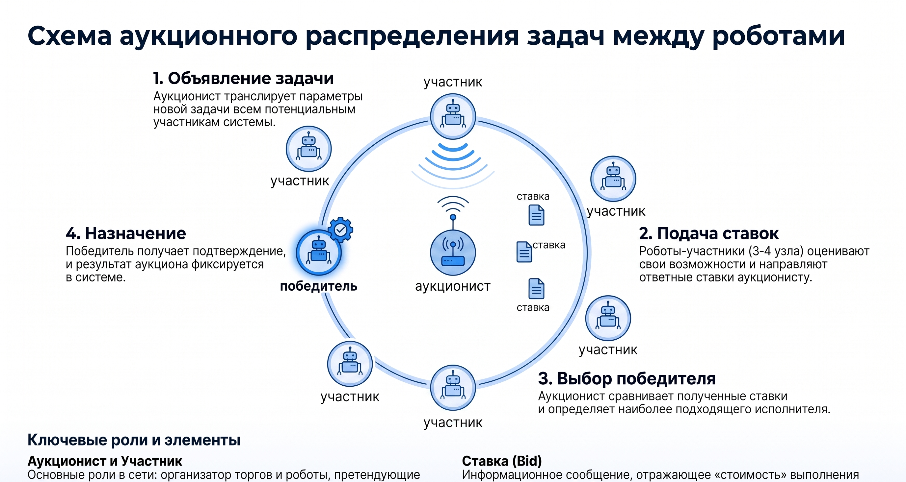
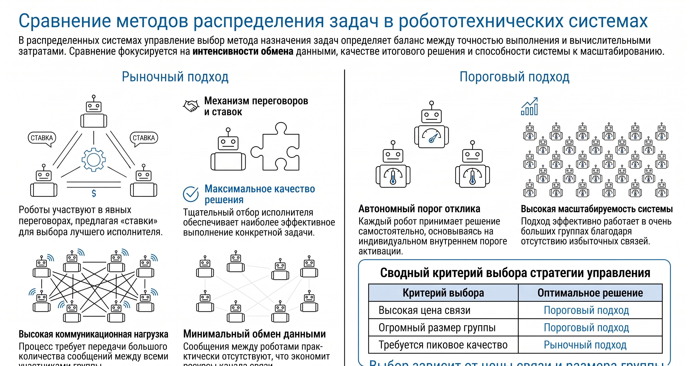
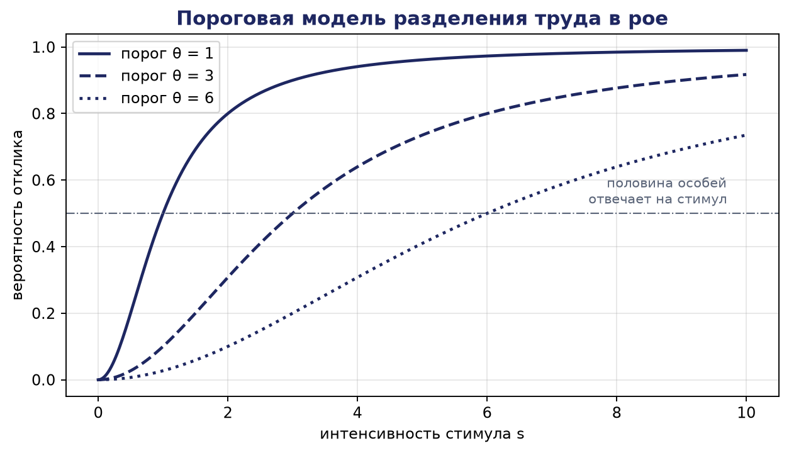

# Глава 10. Алгоритмы распределения задач и ресурсов в распределённых робототехнических системах

Распределение задач и ресурсов относится к числу центральных проблем управления распределёнными робототехническими системами (РРТС). Каким бы совершенным ни был отдельный робот, эффективность коллектива в целом определяется прежде всего тем, насколько рационально между его участниками распределена работа: кто, какую задачу, в каком порядке и какой ценой будет выполнять. Настоящая глава посвящена систематическому изложению теории и алгоритмов распределения задач в мультиробототехнических системах. Рассматриваются формальная постановка задачи MRTA (multi-robot task allocation) и её каноническая таксономия, классическая задача о назначениях и венгерский алгоритм, аукционные и рыночные механизмы (протокол контрактных сетей, последовательные и комбинаторные аукционы, архитектура TraderBots), консенсусные аукционы (алгоритм CBBA), оптимизационные постановки на основе целочисленного программирования, эвристические и метаэвристические методы, а также вопросы динамического перераспределения задач в изменяющейся среде.

## 10.1. Задача распределения задач в мультиробототехнических системах

### 10.1.1. Содержательная и формальная постановка задачи MRTA

Задача распределения задач в коллективе роботов (MRTA) состоит в отыскании такого отображения множества задач на множество роботов, при котором заданный критерий качества функционирования системы принимает экстремальное значение с соблюдением всех ограничений на ресурсы, возможности и время. Содержательно задача возникает всякий раз, когда число подлежащих выполнению работ и число исполнителей больше единицы, а исполнители неравноценны: транспортный робот, находящийся ближе к грузу, выполнит доставку быстрее; робот с манипулятором большей грузоподъёмности справится с тяжёлой деталью, а лёгкий разведывательный аппарат — нет.

Введём базовые обозначения. Пусть задано множество роботов (агентов) A = {a₁, a₂, …, aₙ} и множество задач T = {t₁, t₂, …, tₘ}. Способность и «цена» выполнения задач описываются матрицей стоимостей C = [cᵢⱼ], где элемент cᵢⱼ ≥ 0 выражает затраты (время, энергию, пройденный путь, риск) на выполнение задачи tⱼ роботом aᵢ. В ряде постановок вместо стоимостей используется двойственная величина — полезность (utility) uᵢⱼ, отражающая выгоду системы от назначения; переход между постановками осуществляется заменой uᵢⱼ = U_max − cᵢⱼ, где U_max — достаточно большая константа. Если робот в принципе не способен выполнить задачу, соответствующей паре приписывается бесконечная стоимость (или нулевая полезность).

Решение задачи распределения описывается булевыми переменными назначения xᵢⱼ ∈ {0, 1}: xᵢⱼ = 1, если задача tⱼ назначена роботу aᵢ, и xᵢⱼ = 0 в противном случае. Совокупность значений X = [xᵢⱼ] называется планом назначения. На план накладываются структурные ограничения, вид которых зависит от класса задачи: например, «каждая задача назначается ровно одному роботу» записывается как Σᵢ xᵢⱼ = 1 для всех j, а «каждый робот получает не более одной задачи» — как Σⱼ xᵢⱼ ≤ 1 для всех i.

Важно подчеркнуть отличие задачи распределения от задачи планирования действий отдельного робота. Планирование отвечает на вопрос «как выполнить задачу», распределение — на вопрос «кто должен её выполнять». В реальных системах обе задачи взаимосвязаны: стоимость cᵢⱼ сама является результатом планирования (например, длиной маршрута, построенного планировщиком), а порядок выполнения нескольких задач одним роботом влияет на суммарные затраты. Эта взаимосвязь порождает значительную часть вычислительной сложности проблемы.

### 10.1.2. Критерии оптимальности и ограничения

Выбор критерия оптимальности определяется целевым назначением системы. Наиболее употребительны следующие критерии.

Минимизация суммарной стоимости (критерий MinSum): требуется минимизировать величину

J₁(X) = Σᵢ₌₁ⁿ Σⱼ₌₁ᵐ cᵢⱼ·xᵢⱼ → min.

Этот критерий естественен для задач, в которых важны совокупные затраты ресурса, например суммарный расход энергии парка роботов или суммарный пробег транспортных средств.

Минимизация максимальной нагрузки (критерий MinMax, или критерий времени завершения — makespan): минимизируется наибольшая из индивидуальных затрат,

J₂(X) = maxᵢ Σⱼ cᵢⱼ·xᵢⱼ → min.

Критерий MinMax применяется, когда важно как можно раньше завершить всю совокупность работ: время окончания миссии определяется самым загруженным роботом. Характерно, что оптимальные по J₁ и по J₂ планы, вообще говоря, не совпадают: минимизация суммарной стоимости может привести к тому, что почти вся работа достанется одному «дешёвому» исполнителю, что резко ухудшит время завершения.

Максимизация суммарной полезности (MaxSum): J₃(X) = Σᵢ Σⱼ uᵢⱼ·xᵢⱼ → max — двойственная к MinSum постановка, распространённая в аукционных методах. Используются также средний критерий MinAve (минимизация средней задержки выполнения задач, важная в сервисных приложениях) и многокритериальные постановки, в которых ищется компромисс, например, между временем, энергией и риском.

Ограничения задачи распределения делятся на несколько групп: ограничения назначения (сколько роботов может или должно выполнять задачу, сколько задач может принять робот), ресурсные ограничения (ёмкость аккумулятора, грузоподъёмность, наличие требуемого оборудования — сенсоров, манипуляторов), временные ограничения (директивные сроки, временные окна доступности задач, отношения предшествования между задачами) и пространственные ограничения (зоны достижимости, запретные области). Наличие отношений предшествования и временных окон переводит задачу из класса «чистого» распределения в класс совместного распределения и календарного планирования (task allocation and scheduling), существенно более трудный в вычислительном отношении.

Наконец, при выборе алгоритма всегда присутствует компромисс между качеством решения и затратами на его получение. Точные методы гарантируют оптимум, но их время работы может расти экспоненциально с размером задачи; эвристики работают быстро, но дают лишь приближённое решение; децентрализованные схемы устойчивы к отказам, но платят за это дополнительным обменом сообщениями и, как правило, потерей глобальной оптимальности.

### 10.1.3. Таксономия Gerkey — Matarić

Многообразие постановок MRTA упорядочивает таксономия, предложенная Б. Джерки и М. Матарич (2004). Она классифицирует задачи по трём независимым осям.

Первая ось характеризует роботов: однозадачные (ST, single-task) роботы выполняют в каждый момент времени не более одной задачи; многозадачные (MT, multi-task) способны выполнять несколько задач одновременно (например, транспортный робот, попутно ведущий картографирование). Вторая ось характеризует задачи: однороботные (SR, single-robot) задачи требуют ровно одного исполнителя; многороботные (MR, multi-robot) требуют одновременного участия нескольких роботов (совместная переноска крупногабаритного груза, охват периметра). Третья ось характеризует горизонт назначения: при мгновенном назначении (IA, instantaneous assignment) распределяются только текущие задачи без прогноза будущих; при назначении с расширенным горизонтом (TA, time-extended assignment) каждому роботу назначается упорядоченная последовательность задач с учётом будущих поступлений.

Комбинации значений по трём осям дают восемь классов задач, свойства которых существенно различаются (табл. 10.1).

Таблица 10.1. Таксономия задач MRTA по Gerkey — Matarić

| Класс | Расшифровка | Эквивалентная задача теории оптимизации | Сложность | Типовые методы |
|---|---|---|---|---|
| ST-SR-IA | Один робот — одна задача, мгновенное назначение | Линейная задача о назначениях | Полиномиальная, O(n³) | Венгерский алгоритм, аукционный алгоритм Бертсекаса |
| ST-SR-TA | Последовательности задач для однозадачных роботов | Задача маршрутизации (mTSP, VRP), scheduling | NP-трудная | Последовательные аукционы, метаэвристики, CBBA |
| ST-MR-IA | Формирование коалиций под многороботные задачи | Задача о покрытии множеств, coalition formation | NP-трудная | Комбинаторные аукционы, жадные эвристики |
| ST-MR-TA | Коалиции + расписания | Расширенное расписание с коалициями | NP-трудная | Метаэвристики, декомпозиционные схемы |
| MT-SR-IA | Многозадачные роботы, одиночные задачи | Обобщённая задача о назначениях | NP-трудная | ЦЛП, эвристики |
| MT-SR-TA | То же с горизонтом планирования | Обобщённое расписание | NP-трудная | Метаэвристики |
| MT-MR-IA | Многозадачные роботы, коалиции | Покрытие множеств с пересечениями | NP-трудная | Эвристики, приближённые алгоритмы |
| MT-MR-TA | Наиболее общий класс | Комбинированное расписание | NP-трудная | Декомпозиция, метаэвристики |

Из таблицы видно принципиальное обстоятельство: лишь простейший класс ST-SR-IA допускает точное полиномиальное решение — он сводится к классической линейной задаче о назначениях. Все остальные классы NP-трудны, и для задач практического размера приходится довольствоваться приближёнными решениями. Позднее Корсах, Стенц и Диас (2013) расширили таксономию, введя дополнительную ось взаимозависимости стоимостей (independent tasks — cross-schedule dependencies — complex dependencies), что позволило точнее классифицировать задачи с отношениями предшествования и совместным использованием ресурсов.

## 10.2. Задача о назначениях и венгерский алгоритм

### 10.2.1. Линейная задача о назначениях

Линейная задача о назначениях (linear assignment problem, LAP) формулируется следующим образом. Даны n роботов и n задач и квадратная матрица стоимостей C = [cᵢⱼ] размера n × n. Требуется найти взаимно однозначное соответствие роботов и задач (перестановку φ множества {1, …, n}), минимизирующее суммарную стоимость:

Σᵢ₌₁ⁿ c_{i,φ(i)} → min.

В терминах переменных назначения задача записывается как задача целочисленного линейного программирования:

минимизировать Σᵢ Σⱼ cᵢⱼ·xᵢⱼ
при условиях Σⱼ xᵢⱼ = 1 (i = 1, …, n); Σᵢ xᵢⱼ = 1 (j = 1, …, n); xᵢⱼ ∈ {0, 1}.

Замечательное свойство этой задачи состоит в том, что матрица ограничений вполне унимодулярна, поэтому релаксация условия целочисленности (замена xᵢⱼ ∈ {0, 1} на 0 ≤ xᵢⱼ ≤ 1) не меняет оптимума: задача о назначениях решается методами линейного программирования точно. Однако специализированные алгоритмы работают эффективнее универсальных; классическим среди них является венгерский алгоритм, предложенный Г. Куном в 1955 г. и названный так в честь венгерских математиков Д. Кёнига и Э. Эгервари, на результатах которых он основан. Дж. Манкрес позднее показал, что алгоритм реализуем за строго полиномиальное время; современные реализации имеют трудоёмкость O(n³).

Прямоугольный случай (число роботов не равно числу задач) сводится к квадратному добавлением фиктивных строк или столбцов с нулевыми (или одинаковыми большими) стоимостями: «фиктивный робот», получивший задачу, означает, что задача осталась нераспределённой, а «фиктивная задача» — что робот остался свободным.

### 10.2.2. Схема венгерского алгоритма

Идея алгоритма опирается на два факта. Во-первых, прибавление константы ко всем элементам строки или столбца матрицы стоимостей не меняет множества оптимальных назначений (изменяется лишь значение целевой функции на одну и ту же величину для всех планов). Во-вторых, если в преобразованной матрице с неотрицательными элементами удаётся выбрать n нулей, по одному в каждой строке и каждом столбце (систему независимых нулей), то соответствующее назначение оптимально: его стоимость в преобразованной матрице равна нулю, а меньше нуля она быть не может. Критерий существования такой системы даёт теорема Кёнига: максимальное число независимых нулей равно минимальному числу линий (строк и столбцов), покрывающих все нули матрицы.

Алгоритм состоит из следующих шагов.

Шаг 1 (редукция строк). Из каждой строки матрицы вычитается её минимальный элемент.

Шаг 2 (редукция столбцов). Из каждого столбца полученной матрицы вычитается его минимальный элемент. После шагов 1–2 матрица неотрицательна и содержит хотя бы один нуль в каждой строке и каждом столбце.

Шаг 3 (проверка оптимальности). Все нули матрицы покрываются минимально возможным числом горизонтальных и вертикальных линий. Если потребовалось n линий, система из n независимых нулей существует — выполняется шаг 5. Если линий меньше n, выполняется шаг 4.

Шаг 4 (модификация матрицы). Находится минимальный непокрытый элемент k > 0. Величина k вычитается из всех непокрытых элементов и прибавляется ко всем элементам, покрытым дважды (стоящим на пересечении линий); элементы, покрытые одной линией, не изменяются. Это преобразование эквивалентно вычитанию k из всех непокрытых строк и прибавлению k ко всем покрытым столбцам, т. е. сохраняет множество оптимальных планов. Далее — возврат к шагу 3.

Шаг 5 (построение назначения). В матрице выбирается система из n независимых нулей (это удобно делать, начиная со строк и столбцов, содержащих единственный нуль); пары (строка, столбец) выбранных нулей и образуют оптимальное назначение.

### 10.2.3. Численный пример: венгерский алгоритм для матрицы 4 × 4

Пусть четыре робота a₁–a₄ должны выполнить четыре задачи t₁–t₄, а матрица стоимостей (например, времена достижения целей в секундах) имеет вид:

C =
| 82  83  69  92 |
| 77  37  49  92 |
| 11  69   5  86 |
|  8   9  98  23 |

Шаг 1. Минимумы строк равны 69, 37, 5 и 8. После вычитания:

| 13  14   0  23 |
| 40   0  12  55 |
|  6  64   0  81 |
|  0   1  90  15 |

Шаг 2. Минимумы столбцов равны 0, 0, 0 и 15. После вычитания из четвёртого столбца:

| 13  14   0   8 |
| 40   0  12  40 |
|  6  64   0  66 |
|  0   1  90   0 |

Шаг 3. Нули расположены в позициях (1,3), (2,2), (3,3), (4,1), (4,4). Все они покрываются тремя линиями: вертикальной линией по третьему столбцу (закрывает нули (1,3) и (3,3)), горизонтальной по второй строке (нуль (2,2)) и горизонтальной по четвёртой строке (нули (4,1) и (4,4)). Поскольку 3 < 4, оптимальное назначение пока невозможно — переходим к шагу 4.

Шаг 4. Непокрытыми остались элементы первой и третьей строк в столбцах 1, 2 и 4: числа 13, 14, 8, 6, 64, 66. Минимальный из них k = 6. Вычитаем 6 из всех непокрытых элементов и прибавляем 6 к элементам на пересечениях линий — позициям (2,3) и (4,3):

|  7   8   0   2 |
| 40   0  18  40 |
|  0  58   0  60 |
|  0   1  96   0 |

Шаг 3 (повторно). Нули теперь занимают позиции (1,3), (2,2), (3,1), (3,3), (4,1), (4,4). Покрыть их менее чем четырьмя линиями невозможно (в этом легко убедиться перебором), следовательно, оптимальное назначение существует.

Шаг 5. Строим систему независимых нулей. Во второй строке единственный нуль — (2,2): назначаем a₂ → t₂. В первой строке единственный нуль — (1,3): назначаем a₁ → t₃. После этого в четвёртой строке из нулей (4,1) и (4,4) выбор нуля (4,1) заблокировал бы третью строку (у неё остался бы только вычеркнутый столбец), поэтому берём a₄ → t₄, и тогда для третьей строки остаётся a₃ → t₁.

Итоговое назначение: a₁ → t₃, a₂ → t₂, a₃ → t₁, a₄ → t₄. Его стоимость по исходной матрице равна 69 + 37 + 11 + 23 = 140. Проверим согласованность: сумма всех вычтенных констант равна (69 + 37 + 5 + 8) + 15 + 6 = 140, что и должно совпадать со стоимостью оптимального плана, поскольку в финальной матрице стоимость выбранных клеток нулевая.

### 10.2.4. Область применения и ограничения

Венгерский алгоритм — эталонный инструмент для класса ST-SR-IA: он гарантирует глобальный оптимум за время O(n³) и при современных вычислительных мощностях справляется с матрицами из тысяч строк за доли секунды. Его принципиальные ограничения связаны не со сложностью, а с архитектурой: алгоритм централизован и требует, чтобы полная матрица стоимостей была собрана в одном месте. В распределённой системе это означает наличие выделенного узла-диспетчера, канала связи со всеми роботами и уязвимость к отказу центра. Кроме того, при изменении стоимостей (роботы движутся, задачи появляются и исчезают) назначение приходится пересчитывать. Поэтому в РРТС венгерский алгоритм используется либо на верхнем уровне централизованных архитектур, либо как «эталон оптимума» при оценке качества децентрализованных методов, к рассмотрению которых мы переходим.

## 10.3. Аукционные и рыночные методы распределения задач

### 10.3.1. Экономическая метафора и её преимущества

Аукционные (рыночные) методы переносят в робототехнику механизм рыночного ценообразования: задачи выступают в роли товаров, роботы — в роли покупателей (или подрядчиков), а ставка робота на задачу отражает его индивидуальную оценку затрат или выгоды. Ключевое достоинство подхода в том, что глобальная информация (полная матрица стоимостей) нигде не собирается: каждый робот вычисляет только собственные ставки, а аукционист лишь сравнивает поступившие предложения. Тем самым вычисления естественно распараллеливаются, объём передаваемых данных снижается, а система приобретает устойчивость к отказам отдельных участников: робот, вышедший из строя, просто перестаёт делать ставки, и его задачи достаются другим.

### 10.3.2. Протокол контрактных сетей (Contract Net Protocol)

Исторически первым и до сих пор широко применяемым рыночным механизмом является протокол контрактных сетей (CNP), предложенный Р. Смитом в 1980 г. для распределённого решения задач в сетях вычислительных узлов. Протокол определяет роли менеджера (узла, у которого возникла задача) и подрядчиков (узлов, способных её выполнить) и четырёхфазный цикл переговоров:

1) объявление (task announcement): менеджер рассылает описание задачи — требования к исполнителю, критерий оценки предложений, срок подачи заявок;
2) подача заявок (bidding): каждый подрядчик, удовлетворяющий требованиям, оценивает свои затраты и отправляет менеджеру ставку;
3) заключение контракта (awarding): по истечении срока менеджер сравнивает заявки и присуждает контракт лучшему претенденту;
4) исполнение и отчёт: победитель выполняет задачу и сообщает менеджеру результат; при невозможности выполнения контракт расторгается, и задача объявляется повторно.

Существенно, что роли не закреплены: получивший контракт робот может декомпозировать задачу на подзадачи и сам выступить менеджером для их распределения, что порождает иерархию субподрядов. Псевдокод протокола приведён ниже.

```
// Протокол контрактных сетей (CNP)

процедура МЕНЕДЖЕР(задача t):
    разослать ANNOUNCE(t, критерий, срок T_bid) всем роботам
    B ← ∅                              // множество заявок
    пока не истёк срок T_bid:
        при получении BID(a_i, c_i):  B ← B ∪ {(a_i, c_i)}
    если B = ∅:
        повторить объявление (или расширить круг адресатов)
    иначе:
        a* ← argmin по (a_i, c_i) из B величины c_i
        отправить AWARD(t) роботу a*;  отправить REJECT остальным
        ожидать REPORT(a*, результат)
        если отчёт = НЕУДАЧА: вернуть t в очередь и объявить заново

процедура ПОДРЯДЧИК(робот a_i):
    при получении ANNOUNCE(t, критерий, T_bid):
        если a_i удовлетворяет требованиям t и имеет ресурсы:
            c_i ← оценка собственных затрат на t
            отправить BID(a_i, c_i) менеджеру
    при получении AWARD(t):
        включить t в план; выполнить t
        отправить REPORT(a_i, результат) менеджеру
```

Разберём численный пример одного раунда CNP. Пусть диспетчерский узел объявляет транспортную задачу t₁ «доставить контейнер из точки P в точку Q», критерий — минимальное время выполнения. Заявки подают три робота: a₁ находится в 40 м от точки P и движется со скоростью 1 м/с, его оценка (с учётом пути P→Q длиной 60 м) составляет 40 + 60 = 100 с; a₂ находится в 10 м от P, но уже везёт груз и сможет приступить через 70 с, его ставка 70 + 10 + 60 = 140 с; a₃ находится в 25 м от P и свободен, его ставка 25 + 60 = 85 с. По истечении срока подачи заявок менеджер сравнивает ставки {100, 140, 85} и присуждает контракт роботу a₃; роботам a₁ и a₂ рассылаются отказы, и они остаются доступными для следующих объявлений. Если a₃ в ходе выполнения обнаружит непроходимость маршрута, он вернёт задачу менеджеру, и раунд повторится с обновлёнными ставками.



Достоинства CNP — простота, гибкость и естественная поддержка динамики: новые задачи просто объявляются по мере поступления. Недостатки — «жадный» характер решений (каждый контракт присуждается локально наилучшему претенденту без учёта последствий для будущих задач, поэтому суммарный план может быть далёк от оптимума), чувствительность к порядку объявления задач и накладные расходы на связь при большом числе участников.

### 10.3.3. Аукционный алгоритм Бертсекаса и последовательные аукционы

Для класса ST-SR-IA существует аукционная процедура, сходящаяся к оптимуму задачи о назначениях, — аукционный алгоритм Д. Бертсекаса (1988). Каждой задаче j приписывается цена pⱼ (вначале нулевая). Свободный робот i вычисляет чистую выгоду каждой задачи bᵢⱼ = vᵢⱼ − pⱼ, где vᵢⱼ — его собственная оценка полезности, выбирает наилучшую задачу j* = argmaxⱼ (vᵢⱼ − pⱼ) и поднимает её цену до уровня, при котором она становится для него почти безразличной по сравнению со второй по выгодности задачей: новая цена pⱼ* увеличивается на величину (bᵢⱼ* − b′ᵢ) + ε, где b′ᵢ — вторая по величине выгода, а ε > 0 — минимальный шаг ставки. Задача переназначается новому претенденту, прежний её обладатель становится свободным, и процесс повторяется. Доказано, что алгоритм завершается за конечное число шагов и находит назначение, отличающееся от оптимального не более чем на n·ε; при ε < 1/n для целочисленных стоимостей достигается точный оптимум. Параметр ε управляет компромиссом «скорость — точность»: большие значения ускоряют сходимость, малые повышают качество; практикой выработан приём ε-масштабирования — многократный запуск с постепенно уменьшающимся ε.

Для класса ST-SR-TA, где роботам назначаются последовательности задач, широко применяются последовательные аукционы (sequential single-item auctions, SSI): задачи выставляются на торги по одной, и на каждом раунде каждый робот делает ставку, равную приросту стоимости его текущего маршрута при включении новой задачи (так называемая маржинальная ставка). Задача достаётся роботу с минимальным приростом. Лагудакис, Кёниг и соавторы (2005) показали, что для целевой функции MinSum последовательный аукцион с маржинальными ставками гарантирует решение, не более чем в 2 раза худшее оптимального, — редкий для децентрализованных методов теоретический результат.

### 10.3.4. Комбинаторные аукционы

Последовательные аукционы игнорируют синергию задач: две точки, расположенные рядом, выгодно посетить одному роботу, но при раздельных торгах они могут достаться разным исполнителям. Комбинаторные аукционы устраняют этот недостаток, позволяя делать ставки на пакеты (bundles) задач: робот заявляет цену за подмножество S ⊆ T целиком, и эта цена может быть меньше суммы цен отдельных задач (субаддитивность за счёт объединения маршрутов). Аукционист решает задачу определения победителей (winner determination problem, WDP): выбрать непересекающиеся пакеты, покрывающие все задачи, с минимальной суммарной ценой. Плата за выразительность высока: число возможных пакетов растёт как 2^m, а сама WDP эквивалентна задаче о покрытии множеств и NP-трудна. На практике применяют ограничение множества допустимых пакетов (например, только пары и тройки геометрически близких задач) и приближённые методы решения WDP. Комбинаторные аукционы естественно подходят и для класса ST-MR — формирования коалиций: пакетом здесь выступает группа роботов, претендующая на многороботную задачу.

### 10.3.5. Рыночная архитектура TraderBots

Развитием аукционных идей в полноценную архитектуру управления стала система TraderBots, разработанная М. Б. Диас и Э. Стенцем в Университете Карнеги — Меллона. В TraderBots каждый робот — «трейдер», стремящийся максимизировать индивидуальную прибыль, определяемую как разность между доходом за выполненные задачи и понесёнными издержками; целевая функция системы конструируется так, чтобы локальная погоня за прибылью вела к глобальной эффективности. Ключевые механизмы архитектуры: непрерывная перепродажа задач (робот, обнаруживший, что чужая задача обошлась бы ему дешевле назначенной цены, выкупает её; робот, чьи издержки выросли, перепродаёт задачу с убытком, но с выгодой для системы), одноранговые сделки без центрального аукциониста, возможность появления «оппортунистических» посредников-субподрядчиков и лидеров, оптимизирующих планы подгрупп. Эксперименты показали, что архитектура сохраняет работоспособность при отказах роботов, потере связи и динамическом изменении набора задач, а качество решений приближается к централизованному оптимуму по мере того, как рынок «доторговывает» неудачные первоначальные назначения. Обстоятельный анализ рыночных методов координации дан в обзоре Диас и соавторов (2006).

## 10.4. Консенсусные аукционы: алгоритм CBBA

### 10.4.1. Мотивация и идея консенсусного подхода

Все рассмотренные выше аукционы предполагают наличие аукциониста — узла, собирающего ставки. Даже если роль аукциониста переходит от робота к роботу, в момент торгов требуется надёжная связь «все — с одним». В ряде приложений (группы БПЛА с ограниченным радиосвязным радиусом, подводные аппараты) такое требование невыполнимо: сеть связи разрежена, динамична и лишена выделенного центра. Для таких условий Х.-Л. Чой, Л. Брюне и Дж. Хау (2009) предложили семейство полностью децентрализованных алгоритмов: CBAA (consensus-based auction algorithm) для назначения одиночных задач и его обобщение CBBA (consensus-based bundle algorithm) для назначения последовательностей задач. Идея состоит в соединении аукциона с протоколом консенсуса: роботы делают ставки локально, а согласование того, чья ставка выиграла, достигается не через центр, а путём итеративного обмена информацией с соседями по сети связи — консенсуса не о значениях стоимостей, а о списке победителей.

### 10.4.2. Структура алгоритма CBBA

CBBA работает итерациями, каждая из которых состоит из двух фаз.

Фаза 1 (построение пакета). Каждый робот i жадно наращивает свой пакет задач bᵢ: на каждом шаге он вычисляет для каждой ещё не включённой задачи j маржинальную полезность — прирост суммарного вознаграждения своего маршрута при оптимальной вставке задачи j в текущий путь pᵢ — и добавляет в пакет задачу с максимальным приростом, если этот прирост превышает текущую известную роботу выигрышную ставку по данной задаче. Параллельно робот ведёт два списка: zᵢ — вектор предполагаемых победителей по всем задачам и yᵢ — вектор выигрышных ставок.

Фаза 2 (консенсус). Роботы обмениваются с соседями по графу связи векторами (zᵢ, yᵢ) и временными метками сведений. Получив данные соседа, робот по таблице решающих правил определяет для каждой задачи одно из действий: обновить (принять чужую информацию как более свежую или более сильную ставку), оставить (своя информация достовернее) или сбросить (обнаружен конфликт, требующий обнуления записи). Если робот узнаёт, что перебит по некоторой задаче из своего пакета, он освобождает её и — что принципиально — все задачи, добавленные в пакет позже неё, поскольку их маржинальные оценки вычислялись в предположении наличия утраченной задачи. Затем цикл повторяется с фазы 1.

Упрощённый псевдокод CBBA приведён ниже (Lₜ — максимальная длина пакета, N(i) — соседи робота i по графу связи).

```
// CBBA: consensus-based bundle algorithm (робот i)
// z_i[j] — предполагаемый победитель задачи j; y_i[j] — его ставка
// b_i — пакет (в порядке добавления); p_i — путь (в порядке выполнения)

инициализация: b_i ← (); p_i ← (); z_i[j] ← ∅; y_i[j] ← 0 для всех j

повторять до сходимости:

    // Фаза 1: построение пакета
    пока |b_i| < L_t:
        для каждой задачи j ∉ b_i:
            w_ij ← max по позициям вставки q прироста полезности
                    пути p_i при вставке j в позицию q
        J ← { j : w_ij > y_i[j] }          // задачи, где i перебивает ставку
        если J = ∅: выход из цикла
        j* ← argmax по j из J величины w_ij
        b_i ← b_i ⊕ (j*);  вставить j* в p_i в лучшую позицию
        y_i[j*] ← w_ij*;   z_i[j*] ← i

    // Фаза 2: консенсус с соседями
    передать (z_i, y_i, метки времени) всем k ∈ N(i)
    принять (z_k, y_k) от всех k ∈ N(i)
    для каждой задачи j и каждого соседа k:
        применить решающее правило (обновить / оставить / сбросить)
        // например: если z_k[j] = k и y_k[j] > y_i[j], то
        //           z_i[j] ← k; y_i[j] ← y_k[j]
    если для некоторой j из b_i теперь z_i[j] ≠ i:
        n ← позиция j в b_i
        удалить из b_i и p_i задачу j и все задачи, добавленные после n;
        для удалённых задач j' со своим авторством: y_i[j'] ← 0, z_i[j'] ← ∅
```

### 10.4.3. Свойства CBBA

Доказано, что при связном графе связи и «убывающих по вставке» (diminishing marginal gain) функциях полезности CBBA сходится за конечное число итераций к бесконфликтному назначению: каждая задача закреплена ровно за одним роботом, и все роботы согласны в том, за кем она закреплена. Число итераций консенсуса ограничено величиной порядка D·Lₜ·m, где D — диаметр графа связи. По качеству CBBA наследует гарантию жадных алгоритмов максимизации субмодулярных функций: суммарная полезность составляет не менее 50 % оптимальной. Практические достоинства алгоритма — отсутствие какого-либо центра, работа при ограниченной и меняющейся связности, естественная масштабируемость; расширения CBBA учитывают временные окна задач, асинхронный обмен и перестройку назначения при появлении новых задач, что сделало алгоритм фактическим стандартом для распределённых миссий групп БПЛА.

## 10.5. Оптимизационные постановки, эвристики и метаэвристики

### 10.5.1. Целочисленное программирование

Общим языком точных постановок MRTA служит целочисленное линейное программирование (ЦЛП). Помимо приведённой в разделе 10.2 базовой модели, аппарат ЦЛП позволяет выражать богатые классы ограничений. Например, обобщённая задача о назначениях (класс MT-SR-IA) записывается так:

минимизировать Σᵢ Σⱼ cᵢⱼ·xᵢⱼ
при условиях Σᵢ xᵢⱼ = 1 для всех j; Σⱼ rᵢⱼ·xᵢⱼ ≤ Rᵢ для всех i; xᵢⱼ ∈ {0, 1},

где rᵢⱼ — ресурс, потребляемый задачей j у робота i, а Rᵢ — ресурсная ёмкость робота (например, запас энергии). Временные окна вводятся переменными моментов начала sⱼ и ограничениями eⱼ ≤ sⱼ ≤ lⱼ − dⱼ; отношения предшествования «j раньше j′» — неравенствами sⱼ + dⱼ ≤ s_{j′}; многороботные задачи — условием Σᵢ xᵢⱼ = kⱼ (задаче j требуется kⱼ исполнителей). Задачи ЦЛП решаются универсальными решателями (методы ветвей и границ, ветвей и отсечений), которые гарантируют оптимум либо дают решение с известной оценкой отклонения от него. Плата — экспоненциальный в худшем случае рост времени счёта: практический предел точного решения для богатых постановок обычно составляет десятки роботов и задач, поэтому ЦЛП применяют для верхнего эшелона планирования миссий, для автономного расчёта эталонов и в гибридных схемах «точное ядро + эвристическая надстройка».

### 10.5.2. Жадные и локальные эвристики

Простейший приближённый метод — жадный алгоритм: пары «робот — задача» упорядочиваются по стоимости, и назначения фиксируются в порядке возрастания cᵢⱼ с пропуском уже занятых строк и столбцов. Трудоёмкость составляет O(n·m·log(n·m)), а качество для широкого класса функций полезности ограничено снизу половиной оптимума; на практике жадные решения часто оказываются значительно лучше этой гарантии. Жадное назначение служит также стартовой точкой для методов локального поиска, улучшающих план элементарными преобразованиями: перенос задачи от одного робота к другому, парный обмен задачами, изменение порядка задач в маршруте (2-opt). Локальный поиск продолжается, пока преобразования дают выигрыш, и застревает в локальном оптимуме — недостаток, с которым борются метаэвристики.

### 10.5.3. Генетические алгоритмы

Генетические алгоритмы (ГА) — стохастические методы глобальной оптимизации, воспроизводящие механизмы естественного отбора. Применительно к MRTA решение (план назначения) кодируется хромосомой; для класса ST-SR-TA удобно двухчастное кодирование: перестановка всех m задач плюс вектор точек разреза, делящий перестановку на n сегментов — маршрутов отдельных роботов. Функция приспособленности вычисляется как целевой критерий плана (суммарная стоимость или makespan), при необходимости со штрафами за нарушение ограничений. Популяция случайных решений эволюционирует поколениями: селекция (турнирная или пропорциональная) отбирает родителей, кроссовер комбинирует их фрагменты (для перестановочных кодировок применяются специализированные операторы — порядковый кроссовер OX, частично отображённый PMX, сохраняющие допустимость потомков), мутация вносит случайные изменения (обмен двух генов, инверсия участка), элитизм сохраняет лучшие особи. ГА не гарантируют оптимальности, но хорошо справляются с негладкими, многоэкстремальными и многокритериальными постановками, легко распараллеливаются и допускают «тёплый старт» от текущего плана при изменении условий. Классическое изложение аппарата ГА дано в монографии Д. Голдберга (1989).

### 10.5.4. Муравьиные алгоритмы и другие метаэвристики

Для задач маршрутного типа (mTSP, VRP) эффективны алгоритмы муравьиной колонии (ACO): искусственные «муравьи» строят маршруты вероятностно, предпочитая рёбра с высоким уровнем феромона — накапливаемой памяти о хороших решениях; испарение феромона предотвращает преждевременную сходимость. Систематическое изложение ACO дано М. Дориго и Т. Штютцле (2004). Применяются также имитация отжига (принятие ухудшающих ходов с убывающей температурой вероятностью, что позволяет покидать локальные оптимумы), поиск с запретами (табу-поиск) и роевая оптимизация (PSO). Общий принцип выбора: чем богаче ограничения и больше размерность, тем предпочтительнее метаэвристики; чем жёстче требования к гарантированной оптимальности и меньше размер задачи, тем уместнее точные методы; в условиях жёсткого реального времени доминируют жадные схемы и аукционы. Сводное сравнение основных подходов приведено в табл. 10.2.

Таблица 10.2. Сравнительная характеристика методов распределения задач

| Метод | Архитектура | Оптимальность | Трудоёмкость | Связь | Динамика среды |
|---|---|---|---|---|---|
| Венгерский алгоритм | Централизованная | Глобальный оптимум (ST-SR-IA) | O(n³) | Полная матрица в центре | Полный пересчёт |
| ЦЛП (ветви и границы) | Централизованная | Глобальный оптимум | Экспоненциальная в худшем случае | Полная информация | Полный пересчёт |
| Аукцион Бертсекаса | Распределяемая | ε-оптимальность | Псевдополиномиальная | Цены задач | Частичный пересчёт |
| CNP | Децентрализованная | Без гарантий (жадная) | Низкая на раунд | Объявления и заявки | Естественная поддержка |
| Последовательный аукцион | Децентрализованная | 2-приближение (MinSum) | O(n·m) ставок на раунд | Раунды торгов | Хорошая |
| Комбинаторный аукцион | Смешанная | Оптимум при точной WDP | WDP NP-трудна | Пакеты ставок | Ограниченная |
| CBBA | Полностью децентрализованная | ≥ 50 % оптимума | Полиномиальная | Только соседи, консенсус | Хорошая (расширения) |
| Генетический алгоритм | Централизованная/параллельная | Без гарантий | Настраиваемая | Полная информация | Тёплый старт |
| Жадная эвристика | Любая | ≥ 50 % (субмодулярный случай) | Почти линейная | Минимальная | Отличная |



## 10.6. Динамическое перераспределение задач и практические приложения

### 10.6.1. Задача динамического перераспределения

Реальные миссии протекают в изменяющихся условиях: появляются новые задачи (обнаружен очаг возгорания, поступил новый заказ на доставку), исчезают старые, роботы выходят из строя, разряжаются, теряют связь, а фактические стоимости отклоняются от расчётных. Статическое назначение, оптимальное в момент построения, со временем деградирует, и возникает задача динамического перераспределения (dynamic task reallocation): поддерживать качество плана, внося в него изменения по мере поступления информации.

Возможны две крайние стратегии. Полный пересчёт назначения при каждом событии гарантирует наилучший отклик на изменения, но вычислительно расточителен и порождает нестабильность плана: частые смены назначений вызывают лишние перемещения роботов и «дребезг» — циклическое перебрасывание задачи между близкими по стоимости исполнителями. Инкрементальная коррекция затрагивает лишь часть плана, связанную с событием: новая задача выставляется на аукцион среди текущих роботов; задачи отказавшего робота возвращаются в пул и переторговываются; пара роботов, обнаружившая выгодный обмен, совершает его локально (механизм перепродажи TraderBots). Для подавления дребезга вводят гистерезис — переназначение допускается, только если выигрыш превышает порог δ > 0, — а также ограничивают частоту пересмотров. Аукционные и консенсусные механизмы имеют здесь естественное преимущество: событие локально по своей природе, и рынок «переваривает» его серией локальных сделок без остановки всей системы. Дополнительную устойчивость даёт учёт неопределённости на этапе назначения: использование ожидаемых стоимостей, резервирование дублирующих исполнителей для критических задач, назначение с запасом по времени.

### 10.6.2. Маршрутизация группы роботов

Классическая область приложения алгоритмов распределения — совместное планирование маршрутов. Если m целевых точек нужно обойти n роботами с минимальными суммарными затратами, возникает задача нескольких коммивояжёров (mTSP), а при ограничениях грузоподъёмности и временных окнах — задача маршрутизации транспорта (VRP). Обе задачи NP-трудны, и практические решения строятся по схеме «распределение + локальная оптимизация»: точки распределяются между роботами (последовательным аукционом, кластеризацией по близости, ГА с двухчастной кодировкой), после чего каждый робот упорядочивает свои точки решением собственной TSP (точно при малом числе точек, эвристиками 2-opt/3-opt — при большом). Аукционные схемы с маржинальными ставками здесь особенно естественны: ставка робота на точку равна приросту длины его маршрута, поэтому торги автоматически учитывают геометрию уже назначенных точек. Такие постановки типичны для складской логистики, доставки, патрулирования, инспекции инфраструктуры и картографирования.

С точки зрения математического программирования задача маршрутизации транспорта часто формулируется как задача разбиения множества (set partitioning): требуется выбрать набор допустимых по грузоподъёмности и времени маршрутов, каждый из которых начинается и заканчивается в депо, так чтобы каждый клиент обслуживался ровно одним маршрутом, а суммарная стоимость была минимальной (рис. 10.4). Родственные постановки — задача покрытия множества (set covering, клиент может обслуживаться более чем одним маршрутом) и задача упаковки множества (set packing) — используются при формировании коалиций роботов под совместно выполняемые задачи.


### 10.6.3. Распределение задач в реальном времени и роевые системы

В приложениях жёсткого реального времени — реагирование на аварии, поисково-спасательные операции, управление транспортными потоками — определяющим требованием становится ограниченное время отклика: лучше немедленно принять хорошее решение, чем с опозданием оптимальное. Здесь применяются жадные и аукционные схемы с фиксированным числом раундов, инкрементальное перераспределение и any-time-алгоритмы, способные выдать допустимое решение в любой момент и улучшать его при наличии времени.

Особый случай представляют роевые системы — коллективы из сотен и тысяч простых роботов. Явные торги по каждой задаче здесь невозможны из-за объёма коммуникаций, и распределение достигается неявными, самоорганизующимися механизмами: пороговыми моделями разделения труда (робот берётся за задачу, когда её локально воспринимаемый стимул превышает индивидуальный порог; пороги адаптируются, порождая специализацию), стигмергией — координацией через следы в среде по образцу феромонов муравьёв, вероятностными правилами переключения ролей. Такие механизмы не гарантируют оптимальности, но обеспечивают предельную масштабируемость и живучесть: поведение системы плавно деградирует при потере значительной доли участников.

В основе пороговых моделей лежит функция отклика особи (робота) на стимул задачи вида Tθ(s) = sⁿ/(sⁿ + θⁿ), где s — интенсивность локально воспринимаемого стимула, θ — индивидуальный порог, а n — параметр крутизны: чем ниже порог, тем при меньшем стимуле особь берётся за задачу. Понижение порога у постоянно занятых особей (обучение) и его рост у бездействующих (забывание) порождают специализацию, то есть переход от генералистов к специалистам.



## Выводы по главе

1. Задача распределения задач в мультиробототехнических системах (MRTA) состоит в отыскании назначения задач роботам, оптимизирующего заданный критерий (суммарная стоимость, время завершения миссии, суммарная полезность) при ограничениях на ресурсы, возможности и время. Таксономия Gerkey — Matarić упорядочивает постановки по осям ST/MT, SR/MR и IA/TA; лишь класс ST-SR-IA сводится к полиномиально разрешимой линейной задаче о назначениях, остальные классы NP-трудны.

2. Венгерский алгоритм решает линейную задачу о назначениях точно за время O(n³), опираясь на эквивалентные преобразования матрицы стоимостей и теорему Кёнига о покрытии нулей. Его ограничения в РРТС носят архитектурный характер: централизованность и потребность в полной матрице стоимостей.

3. Аукционные методы реализуют распределение через механизм торгов: протокол контрактных сетей задаёт цикл «объявление — заявки — контракт — отчёт», аукционный алгоритм Бертсекаса достигает ε-оптимальности итеративным повышением цен, последовательные аукционы с маржинальными ставками дают 2-приближение для маршрутных постановок, комбинаторные аукционы учитывают синергию задач ценой NP-трудной задачи определения победителей. Архитектура TraderBots дополняет аукционы непрерывной перепродажей задач, приближающей план к оптимуму в процессе работы.

4. Консенсусный аукцион CBBA устраняет необходимость в аукционисте: роботы жадно формируют пакеты задач и согласуют список победителей обменом только с соседями по сети связи; алгоритм сходится к бесконфликтному назначению с гарантией не менее половины оптимальной полезности и стал стандартом для распределённых миссий групп БПЛА.

5. Целочисленное линейное программирование даёт универсальный язык точных постановок с богатыми ограничениями, но практически применимо лишь для задач умеренного размера. Для крупных и сильно ограниченных задач используются жадные эвристики, локальный поиск и метаэвристики — генетические алгоритмы, муравьиные колонии, имитация отжига, — не гарантирующие оптимума, но обеспечивающие приемлемое качество за приемлемое время.

6. В динамических средах статическое назначение деградирует; динамическое перераспределение реализуется инкрементальными механизмами (переторговка новых и осиротевших задач, локальные обмены, гистерезис против «дребезга»), в которых аукционные и консенсусные схемы имеют естественное преимущество благодаря локальности реакций на события.

## Вопросы для самопроверки

1. Сформулируйте задачу MRTA: какие множества, функции и переменные входят в её постановку и как связаны постановки в терминах стоимостей и полезностей?
2. Чем различаются критерии MinSum и MinMax и в каких приложениях каждый из них предпочтителен? Приведите пример, когда оптимальные по этим критериям планы не совпадают.
3. Опишите три оси таксономии Gerkey — Matarić. К какому классу относится задача совместной переноски груза двумя роботами при заранее известном списке работ на смену?
4. Почему класс ST-SR-IA разрешим за полиномиальное время, а класс ST-SR-TA NP-труден? К какой классической задаче комбинаторной оптимизации сводится каждый из них?
5. На каких двух математических фактах основан венгерский алгоритм? Какова роль теоремы Кёнига в проверке оптимальности?
6. Перечислите четыре фазы протокола контрактных сетей. Что происходит при отсутствии заявок и при срыве исполнения контракта?
7. Как формируется ставка в аукционном алгоритме Бертсекаса и как параметр ε влияет на скорость сходимости и качество решения?
8. В чём состоит преимущество комбинаторных аукционов перед последовательными и какова цена этого преимущества с точки зрения вычислительной сложности?
9. Опишите две фазы алгоритма CBBA. Почему при потере задачи робот обязан освободить и все задачи, добавленные в пакет позже неё?
10. Какие стратегии динамического перераспределения задач вы знаете? Что такое «дребезг» назначений и какими средствами он подавляется?

## Задания

1 (расчётное). Для матрицы стоимостей

C =
|  9  11  14  11   7 |
|  6  15  13  13  10 |
| 12  13   6   8   8 |
| 11   9  10  12   9 |
|  7  12  14  10  14 |

выполните вручную венгерский алгоритм: проведите редукцию строк и столбцов, постройте минимальные покрытия нулей, при необходимости модифицируйте матрицу и найдите оптимальное назначение и его стоимость. Проверьте ответ, сравнив стоимость плана с суммой всех вычтенных в ходе алгоритма констант.

2. Три робота с векторами полезностей v₁ = (10, 15, 8), v₂ = (12, 9, 11), v₃ = (7, 14, 13) участвуют в аукционе Бертсекаса за три задачи (начальные цены нулевые, ε = 1). Выполните итерации алгоритма до получения полного назначения, фиксируя на каждом шаге цены задач и текущие назначения. Сравните результат с оптимумом, найденным перебором всех шести перестановок.

3. Реализуйте программно последовательный аукцион с маржинальными ставками для задачи обхода 20 случайных точек четырьмя роботами (критерий MinSum, стоимость — евклидова длина маршрута). Сравните суммарную длину маршрутов с жадным назначением «каждая точка — ближайшему роботу» и с результатом локального улучшения 2-opt. Оформите отчёт с графиками маршрутов.

4. Реализуйте упрощённый CBBA для 5 роботов и 15 задач при графе связи «кольцо»: фаза построения пакетов с маржинальными полезностями и фаза консенсуса с базовыми решающими правилами. Исследуйте, как число итераций до сходимости зависит от диаметра графа связи (кольцо, звезда, полный граф), и сопоставьте суммарную полезность с централизованным жадным решением.

## Литература

1. Gerkey B. P., Matarić M. J. A formal analysis and taxonomy of task allocation in multi-robot systems // The International Journal of Robotics Research. — 2004. — Vol. 23, No. 9. — P. 939–954.
2. Smith R. G. The Contract Net Protocol: High-level communication and control in a distributed problem solver // IEEE Transactions on Computers. — 1980. — Vol. C-29, No. 12. — P. 1104–1113.
3. Choi H.-L., Brunet L., How J. P. Consensus-based decentralized auctions for robust task allocation // IEEE Transactions on Robotics. — 2009. — Vol. 25, No. 4. — P. 912–926.
4. Dias M. B., Zlot R., Kalra N., Stentz A. Market-based multirobot coordination: A survey and analysis // Proceedings of the IEEE. — 2006. — Vol. 94, No. 7. — P. 1257–1270.
5. Kuhn H. W. The Hungarian method for the assignment problem // Naval Research Logistics Quarterly. — 1955. — Vol. 2, No. 1–2. — P. 83–97.
6. Bertsekas D. P. The auction algorithm: A distributed relaxation method for the assignment problem // Annals of Operations Research. — 1988. — Vol. 14. — P. 105–123.
7. Korsah G. A., Stentz A., Dias M. B. A comprehensive taxonomy for multi-robot task allocation // The International Journal of Robotics Research. — 2013. — Vol. 32, No. 12. — P. 1495–1512.
8. Lagoudakis M. G., Markakis E., Kempe D., Keskinocak P., Kleywegt A., Koenig S., Tovey C., Meyerson A., Jain S. Auction-based multi-robot routing // Robotics: Science and Systems I. — Cambridge, MA: MIT Press, 2005. — P. 343–350.
9. Papadimitriou C. H., Steiglitz K. Combinatorial Optimization: Algorithms and Complexity. — Mineola, NY: Dover Publications, 1998. — 496 p.
10. Goldberg D. E. Genetic Algorithms in Search, Optimization, and Machine Learning. — Reading, MA: Addison-Wesley, 1989. — 412 p.
11. Shoham Y., Leyton-Brown K. Multiagent Systems: Algorithmic, Game-Theoretic, and Logical Foundations. — Cambridge: Cambridge University Press, 2008. — 504 p.
12. Dorigo M., Stützle T. Ant Colony Optimization. — Cambridge, MA: MIT Press, 2004. — 305 p.
