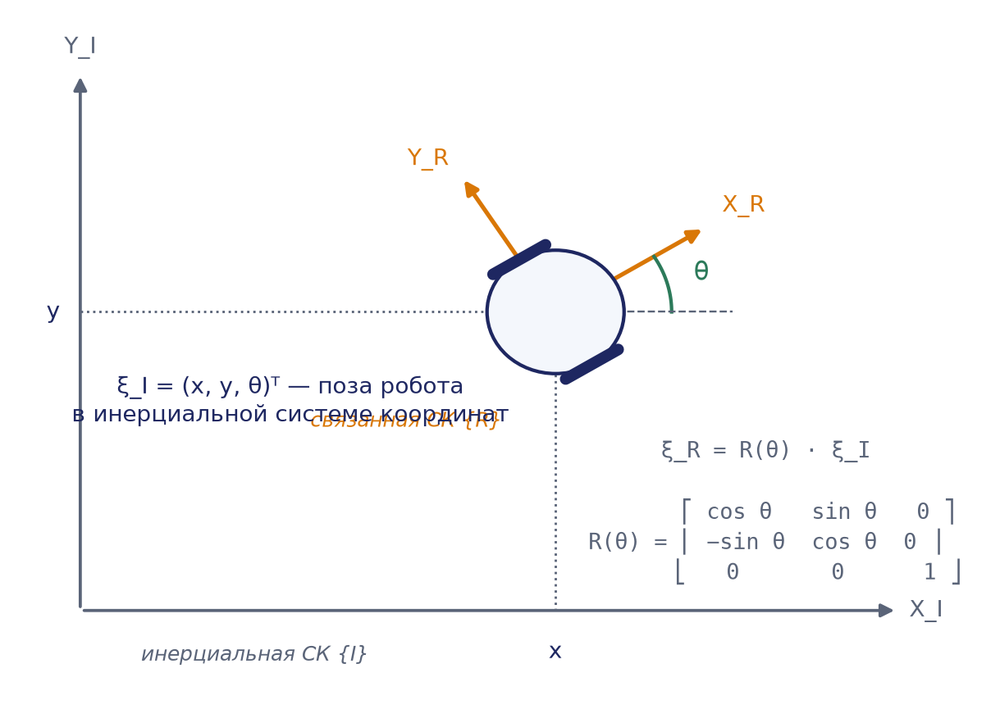
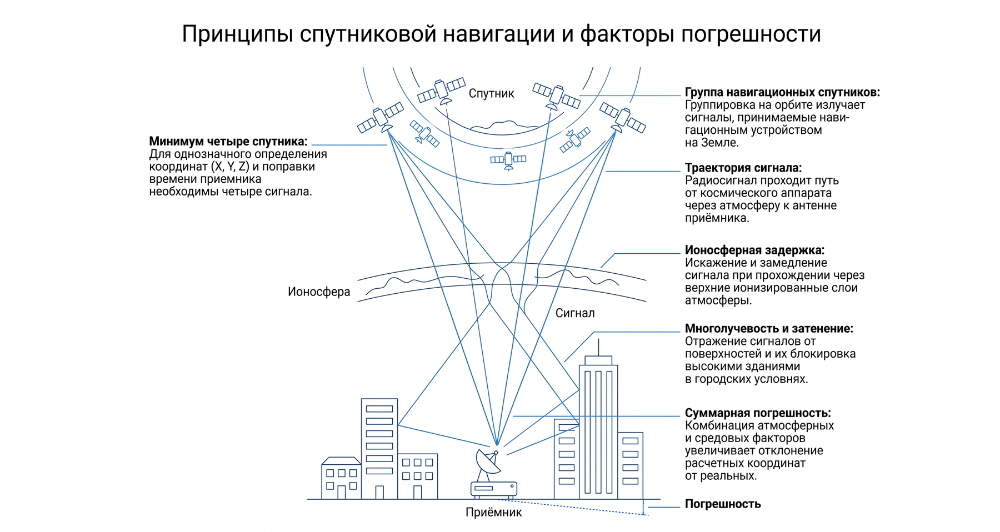
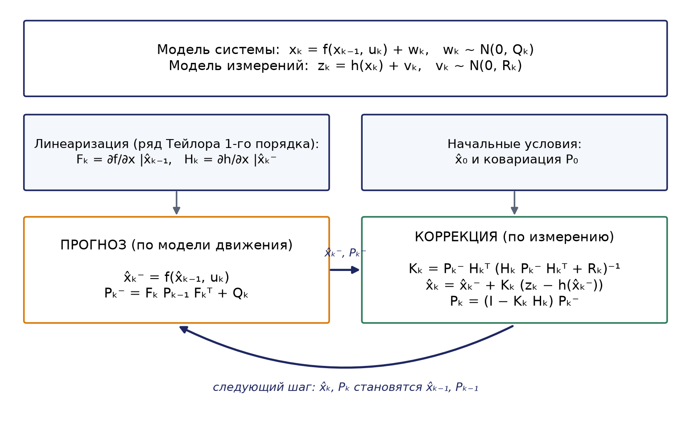
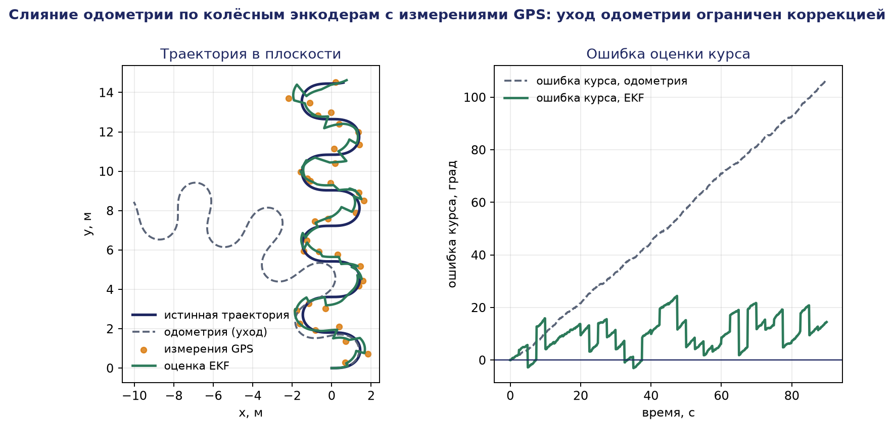

# Глава 11. Навигация и ориентация в недетерминированной среде для распределённых робототехнических систем

## 11.1. Проблема навигации в условиях неопределённости

### 11.1.1. Постановка задачи навигации

Навигация мобильного робота традиционно разбивается на три взаимосвязанные подзадачи, сформулированные ещё в классических работах по автономным мобильным системам: «где я нахожусь?» (локализация), «как выглядит окружающий мир?» (картографирование) и «как добраться до цели?» (планирование движения). В детерминированной, полностью известной среде эти задачи допускают точные алгоритмические решения. Однако реальные условия эксплуатации распределённых робототехнических систем (РРТС) — городская среда, зоны чрезвычайных ситуаций, сельскохозяйственные угодья, помещения с людьми — являются недетерминированными: состояние среды заранее неизвестно, изменяется во времени, а результаты действий робота и показания его сенсоров подвержены случайным возмущениям.

Недетерминированность проявляется на нескольких уровнях: шум измерений (сенсор возвращает значение, отличающееся от истинного на случайную величину), неопределённость действия (команда «проехать один метр» из-за проскальзывания колёс и погрешностей приводов исполняется лишь приблизительно), динамика среды (препятствия появляются и движутся, а поведение пешеходов, транспорта и других роботов не поддаётся точному прогнозу) и, в распределённых системах, неопределённость коммуникации: сообщения доставляются с задержками, теряются, а топология сети связи меняется по мере движения роботов.

Из перечисленного следует фундаментальный вывод, лежащий в основе современной вероятностной робототехники: состояние робота и среды принципиально не может быть известно точно, и вместо детерминированной оценки следует оперировать распределением вероятностей над множеством возможных состояний. Такое распределение называют доверительным состоянием (belief) и обозначают $\mathit{bel}(x_t) = p(x_t \mid z_1:_t, u_1:_t)$, где $x_t$ — состояние в момент $t, z_1:_t$ — история измерений, $u_1:_t$ — история управляющих воздействий.

### 11.1.2. Специфика распределённых систем

В РРТС задача навигации приобретает дополнительные измерения. Группа роботов может совместно использовать сенсорные данные, взаимно уточнять оценки положений (кооперативная локализация), объединять локальные карты в глобальную (распределённый SLAM) и согласовывать траектории. С другой стороны, каждый сосед по группе является динамическим препятствием, а объединение данных агентов с несогласованными системами координат и коррелированными ошибками требует специальных методов. Настоящая глава последовательно рассматривает компоненты этой задачи: сенсорику и комплексирование данных, вероятностную локализацию, SLAM в одиночном и распределённом вариантах, планирование пути, избегание столкновений и координацию группового движения.

## 11.2. Сенсорные системы и восприятие среды

### 11.2.1. Классификация сенсоров

Сенсоры мобильных роботов принято делить на проприоцептивные, измеряющие внутреннее состояние самого робота (скорости вращения колёс, ускорения, ориентацию), и экстероцептивные, воспринимающие внешнюю среду (дальности до объектов, изображения, радиосигналы). Другая ось классификации — активные сенсоры, излучающие энергию в среду и анализирующие отклик (лидар, сонар, радар), и пассивные, регистрирующие естественные сигналы (камеры, магнитометры). Для навигации принципиально важно, что ни один класс сенсоров не является самодостаточным: проприоцептивные датчики накапливают ошибку со временем, а экстероцептивные подвержены влиянию условий наблюдения, поэтому основой восприятия всегда служит комплексирование разнородных данных.

### 11.2.2. Лидары

Лидар (LiDAR, Light Detection and Ranging) измеряет расстояние до объектов по времени пролёта лазерного импульса: $r = c\cdot \Delta t/2$, где $c$ — скорость света, $\Delta t$ — время между излучением импульса и приёмом отражённого сигнала. Вращающаяся оптическая система формирует веер лучей, и за один оборот сканера получается «скан» — множество точек в полярных координатах $(r_i, \theta_i)$, легко переводимых в декартовы. Многолучевые трёхмерные лидары (16–128 лучей) строят плотные облака точек, описывающие геометрию сцены.

Достоинства лидаров — высокая точность дальности (единицы сантиметров на десятках метров), прямое получение метрики и независимость от освещённости; недостатки — стоимость и масса (критично для малых БПЛА), чувствительность к осадкам и туману, трудности с зеркальными и прозрачными поверхностями. Лидарные сканы служат основным входом сеточного SLAM и алгоритмов сопоставления сканов (scan matching, ICP).

### 11.2.3. Камеры и системы технического зрения

Камеры дают наиболее информационно насыщенные данные: текстуру, цвет, семантику сцены. Монокулярная камера сама по себе не измеряет глубину — восстановление трёхмерной структуры возможно лишь с точностью до масштаба по последовательности кадров (structure from motion). Стереокамеры вычисляют глубину по диспаратности $d$: для пары камер с базой $b$ и фокусным расстоянием $f$ глубина точки $Z = f\cdot b/d$, откуда видно, что ошибка растёт квадратично с удалением объекта. RGB-D камеры (структурированная подсветка или времяпролётные матрицы, как в Microsoft Kinect или Intel RealSense) выдают попиксельную карту глубины напрямую, но обычно ограничены дальностью в несколько метров и работают преимущественно в помещениях.

Преимущества камер — низкая стоимость, малая масса, богатство информации, пригодность для распознавания объектов, знаков и людей методами глубокого обучения. Недостатки — зависимость от освещения, деградация при слабой текстуре сцены (однотонные стены), высокая вычислительная стоимость извлечения геометрии. На камерах строится обширный класс алгоритмов визуальной одометрии и визуального SLAM (ORB-SLAM и его развития).

### 11.2.4. Инерциальные измерительные устройства и одометрия

Инерциальный измерительный блок (IMU) объединяет трёхосевые гироскопы (угловые скорости $\omega$), акселерометры (кажущиеся ускорения $a$) и часто магнитометры (ориентация относительно магнитного поля Земли). Интегрирование угловой скорости даёт ориентацию, двойное интегрирование ускорений — перемещение. Главное достоинство IMU — высокая частота обновления (сотни герц — единицы килогерц) и полная автономность; главный недостаток — дрейф: ошибки смещения нуля и шума интегрируются, и погрешность позиции растёт квадратично со временем. Поэтому IMU применяется только в связке с корректирующими источниками.

Колёсная одометрия оценивает перемещение по счётчикам оборотов колёс. Для дифференциального привода с радиусом колёс $R$ и колеёй $L$ приращения пути и курса выражаются как $\Delta s = R(\Delta \varphi_r + \Delta \varphi_l)/2$ и $\Delta \theta = R(\Delta \varphi_r - \Delta \varphi_l)/L$. Одометрия проста и дёшева, но страдает от проскальзывания и систематических ошибок геометрии; её ошибка также неограниченно накапливается.



### 11.2.5. Спутниковая и радионавигация, УВБ

Глобальные навигационные спутниковые системы (GPS, ГЛОНАСС) дают абсолютные координаты с ошибкой в единицы метров (сантиметры в режиме RTK), однако сигнал недоступен в помещениях, тоннелях и «городских каньонах», где переотражения порождают грубые выбросы. Для помещений и локальных полигонов широко применяется сверхширокополосная радионавигация (УВБ, Ultra-Wideband): стационарные якоря и метки на роботах обмениваются наносекундными импульсами, и по времени распространения вычисляются дальности с точностью 10–30 см; позиция находится мультилатерацией. УВБ-дальнометрия ценна для РРТС ещё и тем, что позволяет измерять взаимные расстояния между самими роботами, что напрямую используется в кооперативной локализации. Радары, измеряющие дальность и радиальную скорость по эффекту Доплера, устойчивы к осадкам и незаменимы в беспилотном транспорте для сопровождения движущихся целей.



### 11.2.6. Комплексирование сенсорных данных

Комплексирование (sensor fusion) — объединение измерений разнородных сенсоров в единую согласованную оценку состояния. Математическим фундаментом комплексирования служат байесовские фильтры, рассматриваемые в разделе 11.3: модель движения строится по быстрым проприоцептивным данным (IMU, одометрия), а коррекция выполняется по медленным, но не дрейфующим экстероцептивным измерениям (лидар, камера, GNSS, УВБ). Типичные конфигурации: одометрия + лидар для наземных платформ в помещениях; IMU + GNSS + радар + камера для беспилотных автомобилей; IMU + стереокамера (визуально-инерциальная одометрия) для дронов.

Существенной инженерной стороной комплексирования является геометрическое согласование: показания каждого сенсора заданы в его собственной системе координат, и перед объединением их необходимо привести к единой связанной системе робота, а затем — к глобальной. Для этого используются однородные матрицы преобразования $4\times 4$, объединяющие поворот и перенос, а для представления ориентаций в трёхмерном пространстве — кватернионы $q = (w, x, y, z)$, свободные от вырождений типа «складывания рамок» (gimbal lock), свойственных углам Эйлера. Не менее важна временная синхронизация: измерения должны сопоставляться по единой шкале времени с учётом задержек обработки, иначе комплексирование вносит систематические ошибки, особенно при быстром движении.

## 11.3. Вероятностная локализация

### 11.3.1. Байесовский фильтр

Пусть $x_t$ — вектор состояния робота (для плоского случая обычно $x_t = (x, y, \theta)^T$), $u_t$ — управляющее воздействие, $z_t$ — измерение. Вероятностная модель движения $p(x_t \mid x_{t-1}, u_t)$ описывает, куда робот может попасть из состояния $x_{t-1}$ при команде $u_t$; модель наблюдения $p(z_t \mid x_t)$ — какие измерения вероятны в состоянии $x_t$. Байесовский фильтр рекуррентно пересчитывает доверительное состояние $\mathit{bel}(x_t)$ в два шага.

Шаг предсказания (интегрирование модели движения):

```math
\mathit{bel}^-(x_t) = \int p(x_t \mid x_{t-1}, u_t) \cdot \mathit{bel}(x_{t-1}) dx_{t-1}
```

Шаг коррекции (учёт измерения по правилу Байеса):

```math
\mathit{bel}(x_t) = \eta \cdot p(z_t \mid x_t) \cdot \mathit{bel}^-(x_t),
```

где $\eta$ — нормирующий множитель, обеспечивающий единичный интеграл плотности. Предсказание, как правило, «размывает» распределение (неопределённость движения добавляется), коррекция — «сжимает» его (информация измерения уменьшает неопределённость). Все практические алгоритмы локализации — фильтр Калмана, его нелинейные расширения и фильтр частиц — являются конкретными вычислительными реализациями этой общей схемы, различающимися способом представления $\mathit{bel}(x_t)$.

### 11.3.2. Фильтр Калмана

Фильтр Калмана (ФК) — точная реализация байесовского фильтра для линейно-гауссовской системы, в которой распределения остаются нормальными и полностью описываются средним $\hat{x}$ и ковариационной матрицей $P$. Модель системы:

```math
\begin{gathered} x_k = A\cdot x_{k-1} + B\cdot u_k + w_k, \quad w_k \sim N(0, Q) \cr z_k = H\cdot x_k + v_k, \quad v_k \sim N(0, R) \end{gathered}
```

где A — матрица перехода, B — матрица управления, $H$ — матрица наблюдения, $Q$ и $R$ — ковариации шумов процесса и измерения. Уравнения предсказания:

```math
\begin{gathered} \hat{x}_k^- = A\cdot \hat{x}_{k-1} + B\cdot u_k \cr P_k^- = A\cdot P_{k-1}\cdot A^T + Q \end{gathered}
```

Уравнения коррекции:

```math
\begin{gathered} K_k = P_k^-\cdot H^T\cdot(H\cdot P_k^-\cdot H^T + R)^{-1} \cr \hat{x}_k = \hat{x}_k^- + K_k\cdot(z_k - H\cdot \hat{x}_k^-) \cr P_k = (I - K_k\cdot H)\cdot P_k^- \end{gathered}
```

Матрица $K_k$ называется коэффициентом усиления Калмана и определяет вес, с которым невязка измерения (инновация) $z_k - H\cdot \hat{x}_k^-$ корректирует прогноз. Если измерения точны ($R$ мало), $K_k$ близок к единичному масштабу и оценка «доверяет» измерению; если точен прогноз ($P_k^-$ мало), коррекция мала. ФК оптимален в смысле минимума среднеквадратичной ошибки для линейных гауссовских систем и вычислительно чрезвычайно эффективен, что делает его стандартным инструментом комплексирования IMU с GNSS и одометрией.

### 11.3.3. Численный пример: шаг фильтра Калмана в одномерном случае

Рассмотрим робота, движущегося вдоль прямой. Состояние — координата $x$. Модель движения тривиальна: $x_k = x_{k-1} + u_k + w_k (A = 1, B = 1)$, измеряется сама координата: $z_k = x_k + v_k (H = 1)$. Пусть дисперсия шума движения $Q = 0{,}04$ м², дисперсия шума дальномера $R = 0{,}09$ м². Начальная оценка: $\hat{x}_0 = 2{,}0$ м, $P_0 = 0{,}25$ м². Робот получает команду $u_k = 1{,}0$ м, после чего дальномер выдаёт $z_k = 3{,}25$ м.

Предсказание:
$\hat{x}_k^- = 1\cdot 2{,}0 + 1\cdot 1{,}0 = 3{,}0$ м;
$P_k^- = 1\cdot 0{,}25\cdot 1 + 0{,}04 = 0{,}29$ м².

Неопределённость выросла с 0,25 до 0,29 м² — движение добавило шум.

Коррекция. Усиление Калмана:
$K_k = 0{,}29 / (0{,}29 + 0{,}09) = 0{,}29 / 0{,}38 \approx 0{,}763$.

Инновация: $z_k - \hat{x}_k^- = 3{,}25 - 3{,}0 = 0{,}25$ м. Обновлённая оценка:
$\hat{x}_k = 3{,}0 + 0{,}763\cdot 0{,}25 \approx 3{,}19$ м;
$P_k = (1 - 0{,}763)\cdot 0{,}29 \approx 0{,}0687$ м².

Итог показателен: апостериорная дисперсия 0,069 м² меньше и дисперсии прогноза (0,29), и дисперсии измерения (0,09) — объединение двух независимых источников информации всегда точнее каждого из них. Оценка 3,19 м лежит между прогнозом 3,0 м и измерением 3,25 м, ближе к измерению, поскольку в данном такте измерение точнее прогноза. Именно этот механизм взвешивания в многомерном варианте и обеспечивает комплексирование данных лидара, одометрии и IMU.

### 11.3.4. Расширенный фильтр Калмана

Реальные модели робота нелинейны: например, кинематика плоского движения $x_k = x_{k-1} + v\cdot \Delta t\cdot \cos \theta, y_k = y_{k-1} + v\cdot \Delta t\cdot \sin \theta, \theta_k = \theta_{k-1} + \omega \cdot \Delta t$, а измерение дальности до ориентира $r = \sqrt{(m_x - x)^2 + (mᵧ - y)^2}$. Расширенный фильтр Калмана (EKF) применяет схему ФК к нелинейным функциям $g(\cdot)$ (движение) и $h(\cdot)$ (наблюдение), линеаризуя их разложением в ряд Тейлора первого порядка вокруг текущей оценки. В уравнениях ФК матрицы A и $H$ заменяются якобианами $G_k = \partial g/\partial x \mid \hat{_x}_{k-1}$ и $H_k = \partial h/\partial x \mid \hat{_x}_k^-$:

```math
\begin{gathered} \hat{x}_k^- = g(\hat{x}_{k-1}, u_k); \quad P_k^- = G_k\cdot P_{k-1}\cdot G_k^T + Q \cr K_k = P_k^-\cdot H_k^T\cdot(H_k\cdot P_k^-\cdot H_k^T + R)^{-1} \cr \hat{x}_k = \hat{x}_k^- + K_k\cdot(z_k - h(\hat{x}_k^-)); \quad P_k = (I - K_k\cdot H_k)\cdot P_k^- \end{gathered}
```



EKF унаследовал эффективность ФК и стал рабочей лошадкой навигационных систем, однако линеаризация корректна лишь при малых отклонениях от точки разложения: при большой начальной неопределённости или сильной нелинейности фильтр может расходиться. Кроме того, EKF принципиально унимодален — он представляет доверие одной гауссианой и не способен отслеживать несколько конкурирующих гипотез о положении робота. Частично эти ограничения снимает сигма-точечный (unscented) фильтр Калмана (UKF), аппроксимирующий распределение детерминированным набором точек без вычисления якобианов, однако унимодальность остаётся.

### 11.3.5. Фильтр частиц и локализация Монте-Карло

Фильтр частиц представляет доверительное состояние не аналитически, а эмпирически — множеством из $M$ взвешенных выборок («частиц») $\lbrace(x^{(i)}, w^{(i)}) \rbrace$, каждая из которых является гипотезой о состоянии робота. Такое представление аппроксимирует произвольные, в том числе многомодальные распределения, и не требует линейности моделей. Один такт фильтра включает три операции: перенос каждой частицы по вероятностной модели движения (с добавлением случайного шума), взвешивание частиц по правдоподобию текущего измерения $w^{(i)} = p(z_t \mid x^{(i)})$ и ресэмплинг — повторную выборку частиц с вероятностями, пропорциональными весам, концентрирующую вычислительный ресурс в областях высокого правдоподобия.

```
Алгоритм Particle_Filter(Xₜ₋₁, uₜ, zₜ):
    X̄ₜ ← ∅;  Xₜ ← ∅
    для i = 1 … M:
        x⁽ⁱ⁾ ← выборка из p(xₜ | x⁽ⁱ⁾ₜ₋₁, uₜ)      // предсказание
        w⁽ⁱ⁾ ← p(zₜ | x⁽ⁱ⁾)                        // взвешивание
        X̄ₜ ← X̄ₜ ∪ {(x⁽ⁱ⁾, w⁽ⁱ⁾)}
    нормировать веса: Σᵢ w⁽ⁱ⁾ = 1
    для i = 1 … M:                                // ресэмплинг
        выбрать индекс j с вероятностью w⁽ʲ⁾
        Xₜ ← Xₜ ∪ {x⁽ʲ⁾}
    вернуть Xₜ
```

Применение фильтра частиц к локализации по известной карте называется локализацией Монте-Карло (MCL). MCL решает не только задачу сопровождения позиции (position tracking), но и глобальную локализацию — определение положения при полностью неизвестной начальной позиции: частицы изначально рассеиваются по всей карте, и по мере поступления измерений выживают лишь гипотезы, согласующиеся с наблюдениями. Модификация с впрыском случайных частиц (augmented MCL) справляется даже с «проблемой похищенного робота» — внезапным переносом платформы в другое место. Платой за универсальность является вычислительная стоимость, растущая с размерностью состояния и требуемой точностью: на практике используются тысячи — десятки тысяч частиц.

### 11.3.6. Сравнение методов локализации

| Критерий | Фильтр Калмана / EKF | UKF | Фильтр частиц (MCL) |
|---|---|---|---|
| Представление belief | Гауссиана $(\hat{x}, P)$ | Гауссиана через сигма-точки | Множество взвешенных частиц |
| Нелинейные модели | Линеаризация (якобианы) | Без якобианов, точнее EKF | Произвольные модели |
| Многомодальность | Нет | Нет | Да |
| Глобальная локализация | Нет | Нет | Да |
| Вычислительная стоимость | Низкая, $O(n^2)-O(n^3)$ | Умеренная | Высокая, растёт с числом частиц |
| Типичное применение | Комплексирование IMU/GNSS/одометрии | Сильно нелинейная динамика | Локализация по карте, «похищенный робот» |

## 11.4. Одновременная локализация и картографирование (SLAM)

### 11.4.1. Постановка задачи

Локализация по известной карте и построение карты при известной траектории — задачи сравнительно простые. Однако в неизвестной среде робот не имеет ни того ни другого: чтобы строить карту, нужно знать своё положение, а чтобы локализоваться — нужна карта. Задача одновременной локализации и картографирования (SLAM, Simultaneous Localization and Mapping) состоит в совместной оценке траектории робота и карты $m$ по данным измерений и управлений. В вероятностной формулировке различают онлайн-SLAM — оценку апостериорного распределения $p(x_t, m \mid z_1:_t, u_1:_t)$ текущей позы и карты, и полный SLAM — оценку всей траектории $p(x_1:_t, m \mid z_1:_t, u_1:_t)$. Ключевая трудность SLAM в том, что ошибки позы и ошибки карты коррелированы: неверно оценив своё положение, робот занесёт в карту смещённые ориентиры, которые затем будут искажать локализацию. Вторая фундаментальная проблема — ассоциация данных: сопоставление текущего наблюдения с уже известными элементами карты, включая распознавание замыкания цикла (loop closure) — возврата в ранее посещённое место, позволяющего «стянуть» накопленную ошибку.

Карты представляются в двух основных формах: карты признаков (features) — набор координат точечных ориентиров, и сеточные карты занятости (occupancy grid), где каждой ячейке приписывается вероятность быть занятой препятствием. Сеточные карты удобны для планирования пути и строятся преимущественно по лидарным данным.

### 11.4.2. EKF-SLAM

Исторически первым практическим решением стал EKF-SLAM. Идея состоит в расширении вектора состояния: наряду с позой робота в него включаются координаты всех наблюдённых ориентиров, $y = (x, y, \theta, m_{1x}, m_1ᵧ, \ldots, m_{nx}, m_nᵧ)^T$, и к этому объединённому вектору применяется расширенный фильтр Калмана. Ковариационная матрица $P$ размера $(3 + 2n) \times(3 + 2n)$ хранит не только неопределённости позы и каждого ориентира, но и все взаимные корреляции, благодаря которым повторное наблюдение одного ориентира уточняет оценки всех остальных. Именно в этих корреляциях заключена сила метода — и его слабость: стоимость шага коррекции квадратична по числу ориентиров, $O(n^2)$, что ограничивает применимость EKF-SLAM картами из сотен признаков. Дополнительные уязвимости — чувствительность к ошибкам ассоциации данных (единственная неверная ассоциация может разрушить всю оценку) и накопление ошибок линеаризации на длинных траекториях.

### 11.4.3. Графовый SLAM

Современным стандартом для полной задачи SLAM является графовая формулировка (graph-based SLAM). Вершинами графа служат позы робота в последовательные моменты времени (и, при картах признаков, позиции ориентиров), рёбрами — ограничения: одометрические (между соседними позами), сенсорные (между позой и ориентиром или между двумя позами, связанными сопоставлением сканов) и ограничения замыкания циклов. Каждое ребро задаёт ожидаемое относительное преобразование и его информативность (обратную ковариацию $\Omega_{ij}$). Оценка траектории сводится к задаче нелинейных наименьших квадратов:

```math
x^{*} = \arg\min \Sigma \langle i,j\rangle e_{ij}(x_i, x_j)^T \cdot \Omega_{ij} \cdot e_{ij}(x_i, x_j),
```

где $e_{ij}$ — невязка между предсказанным и измеренным относительным положением вершин. Разреженность графа (каждая поза связана лишь с немногими другими) позволяет решать задачу итерационными методами Гаусса–Ньютона или Левенберга–Марквардта с разреженной алгеброй за время, близкое к линейному; на этом принципе построены широко используемые библиотеки g2o, GTSAM, Ceres. Архитектурно графовые системы делятся на фронтенд, который строит граф — обрабатывает сенсорные данные, выполняет ассоциацию и детектирует замыкания циклов, и бэкенд, оптимизирующий граф. Инкрементальные варианты (iSAM2) обновляют решение по мере роста графа без полной переоптимизации.

### 11.4.4. FastSLAM и практические системы

FastSLAM использует факторизацию Рао–Блэквелла: апостериорное распределение представляется как $p(x_1:_t, m \mid z_1:_t, u_1:_t) = p(x_1:_t \mid z_1:_t, u_1:_t) \cdot \Pi_n p(m_n \mid x_1:_t, z_1:_t)$ — при известной траектории оценки ориентиров становятся условно независимыми. Траектория оценивается фильтром частиц, а внутри каждой частицы каждый ориентир сопровождается собственным малым EKF размера $2\times 2$. Сложность обновления составляет $O(M\cdot \log n)$, метод устойчив к ошибкам ассоциации (каждая частица может нести собственную гипотезу ассоциации) и хорошо масштабируется на большие карты. На той же идее Рао–Блэквеллизованного фильтра частиц построен алгоритм GMapping — де-факто стандарт сеточного лидарного SLAM в экосистеме ROS, применяющий тщательно построенное распределение предложений и адаптивный ресэмплинг для сокращения числа частиц. Среди визуальных систем эталонной стала ORB-SLAM — графовая система на признаках ORB (Oriented FAST and Rotated BRIEF) с параллельными потоками трекинга, локального картографирования и замыкания циклов, работающая с монокулярными, стерео- и RGB-D камерами.

### 11.4.5. Кооперативная локализация

В распределённой системе роботы могут уточнять оценки положений друг друга, обмениваясь взаимными наблюдениями: робот A, измерив дальность и пеленг до робота B (лидаром, камерой или УВБ-радиомодулем), получает информацию, связывающую их позы. Формально взаимное измерение zᴬᴮ = h(xᴬ, xᴮ) + v включается в общий байесовский фильтр по объединённому состоянию группы. Централизованная реализация (единый EKF по всем роботам) даёт оптимальную оценку, но не масштабируется и уязвима к отказу центра. Децентрализованные схемы сталкиваются с тонкой проблемой: после первого же обмена оценки роботов становятся коррелированными, и повторный учёт той же информации («инцест данных», double counting) ведёт к самоуверенности фильтра — занижению ковариации при реальном росте ошибки. Отслеживать взаимные корреляции точно в распределённой постановке дорого, поэтому применяется консервативное объединение — ковариационное пересечение (Covariance Intersection), гарантирующее состоятельность оценки без знания корреляций: объединённая информационная матрица берётся как выпуклая комбинация $P^{-1} = \omega \cdot P_a^{-1} + (1-\omega)\cdot P_b^{-1}, \omega \in [0, 1]$. Практическая ценность кооперативной локализации особенно высока, когда лишь часть группы имеет доступ к абсолютным измерениям (например, GNSS доступна одному роботу на открытом участке): его информация через цепочку взаимных наблюдений «просачивается» ко всем агентам.

### 11.4.6. Распределённый и мультиробототехнический SLAM

Мультиробототехнический SLAM объединяет карты, строимые несколькими роботами, в единую глобальную. Центральные подзадачи: определение относительных преобразований между системами координат роботов (по взаимным наблюдениям, по совпадению фрагментов карт — межроботные замыкания циклов), обмен данными в условиях ограниченной связи и распределённая оптимизация общего графа поз. В графовой постановке карта группы — это единый граф, содержащий траектории всех роботов и межроботные рёбра; его оптимизацию можно вести централизованно (роботы отправляют подграфы на сервер) либо распределённо, когда роботы итеративно обмениваются только оценками пограничных вершин и решают свои подзадачи локально (методы распределённого градиентного спуска, ADMM). Для экономии канала связи передаются не сырые сканы, а компактные дескрипторы мест и ключевые кадры. Устойчивость к ложным межроботным замыканиям циклов обеспечивается робастными методами проверки взаимной согласованности ограничений: одно неверное ребро способно исказить всю объединённую карту, поэтому современные системы распределённого SLAM включают этап отбраковки выбросов до оптимизации.

## 11.5. Планирование пути и траекторий

### 11.5.1. Постановка задачи и классификация методов

Задача планирования пути: в конфигурационном пространстве C робота найти непрерывный путь из начальной конфигурации $\text{q_start}$ в целевую $q_{\mathrm{goal}}$, целиком лежащий в свободном подпространстве $C_{\mathrm{free}}$ (вне препятствий) и оптимизирующий заданный критерий — длину, время, энергозатраты, гладкость или их комбинацию. Для мобильного робота на плоскости конфигурация — это (x, y) или $(x, y, \theta)$; для манипуляторов и БПЛА размерность выше. Методы планирования делятся на комбинаторные (точные, на явном представлении $C_{\mathrm{free}}$), сеточные графовые (дискретизация пространства и поиск на графе: A*, D* Lite), выборочные (sampling-based: PRM, RRT, RRT*), потенциальные (искусственные поля) и оптимизационные (формулировка траектории как задачи оптимизации, например TEB). Отдельно различают глобальное планирование — построение маршрута по всей известной карте, и локальное — оперативную генерацию исполнимой траектории в окрестности робота с учётом свежих данных о препятствиях и динамики платформы; в практических навигационных стеках оба уровня работают совместно.

### 11.5.2. Алгоритм A*

$A^{*}$ — классический алгоритм поиска кратчайшего пути на графе, направляемый эвристикой. Для каждой вершины $n$ поддерживаются стоимость достигнутого пути $g(n)$ от старта и эвристическая оценка $h(n)$ расстояния до цели; вершины раскрываются в порядке возрастания $f(n) = g(n) + h(n)$. Если эвристика допустима (не завышает истинную стоимость; для сетки — евклидово или манхэттенское расстояние), $A^{*}$ гарантированно находит оптимальный путь, раскрывая при этом значительно меньше вершин, чем алгоритм Дейкстры.

```
Алгоритм A*(start, goal):
    OPEN ← {start};  CLOSED ← ∅
    g(start) ← 0;  f(start) ← h(start)
    пока OPEN ≠ ∅:
        n ← вершина из OPEN с минимальным f(n)
        если n = goal: вернуть путь, восстановленный по parent
        переместить n из OPEN в CLOSED
        для каждого соседа s вершины n, s ∉ препятствия:
            g_new ← g(n) + c(n, s)
            если s ∈ CLOSED и g_new ≥ g(s): продолжить
            если s ∉ OPEN или g_new < g(s):
                g(s) ← g_new;  f(s) ← g(s) + h(s)
                parent(s) ← n
                добавить s в OPEN (или обновить приоритет)
    вернуть ОТКАЗ  // путь не существует
```

Проиллюстрируем первую итерацию на сетке $4\times 4$ с 4-связностью, стоимостью шага 1 и манхэттенской эвристикой $h = \lvert \Delta x\rvert + \lvert \Delta y\rvert$. Старт $S = (0, 0)$, цель $G = (3, 3)$, препятствия в ячейках (1, 1) и (2, 1). Раскрываем $S$: соседи (1, 0) и (0, 1). Для $(1, 0): g = 1, h = \lvert 3-1\rvert + \lvert 3-0\rvert = 5, f = 6$. Для $(0, 1): g = 1, h = 5, f = 6$. Оба попадают в OPEN с равным $f = 6$; пусть выбрана (0, 1). Её соседи: (0, 2) с $g = 2, h = 4, f = 6$ и (1, 1) — препятствие, пропускается. Далее раскрытие продолжается вдоль левого края, поскольку клетки за препятствиями получают большие $g$; итоговый оптимальный путь $S \to(0{,}1) \to(0{,}2) \to(1{,}2) \to(2{,}2) \to(3{,}2) \to(3{,}3)$ имеет длину 6, что совпадает с $h(S) = 6$ — эвристика здесь точна, и $A^{*}$ раскрывает почти исключительно вершины оптимального пути.

### 11.5.3. Инкрементальный поиск: D* Lite

В недетерминированной среде карта уточняется по ходу движения: сенсоры обнаруживают препятствия, отсутствовавшие в исходной карте. Полный перезапуск $A^{*}$ после каждого обновления расточителен. Алгоритм D* Lite (Кёниг, Лихачёв) решает задачу инкрементально: он ведёт поиск от цели к текущей позиции робота и при изменении стоимостей рёбер (обнаружении или исчезновении препятствий) пересчитывает лишь те вершины, оценки которых стали несогласованными, повторно используя остальную часть дерева поиска. На практике это даёт ускорение на один-два порядка по сравнению с повторным полным поиском, что и сделало D* и его варианты стандартом навигации планетоходов и роботов в неизвестных средах.

### 11.5.4. Выборочные методы: PRM, RRT и RRT*

При высокой размерности конфигурационного пространства сеточная дискретизация невозможна (проклятие размерности), и применяются методы случайной выборки. Вероятностная дорожная карта (PRM) на этапе подготовки генерирует случайные конфигурации в $C_{\mathrm{free}}$, соединяет близкие пары локальным планировщиком с проверкой столкновений и получает граф-«дорожную сеть», по которому затем отвечает на множество запросов поиском $A^{*}$. PRM эффективна в статических средах при многократных запросах.

Быстро исследующее случайное дерево (RRT) строится для единственного запроса: от $\text{q_start}$ растёт дерево, на каждой итерации выбирается случайная точка $q_{\mathrm{rand}}$, находится ближайшая вершина дерева $q_{\mathrm{near}}$ и дерево расширяется от неё на шаг $\varepsilon$ в направлении $q_{\mathrm{rand}}$ (с проверкой отсутствия столкновений). Ключевое свойство RRT — смещение роста в сторону неисследованных областей: вероятность расширения вершины пропорциональна объёму её ячейки Вороного, поэтому дерево быстро покрывает пространство. RRT вероятностно полон (вероятность найти существующий путь стремится к единице), легко учитывает дифференциальные ограничения (расширение выполняется интегрированием допустимых управлений), но найденный путь не оптимален и обычно требует сглаживания. Модификация RRT* (Караман, Фраццоли) добавляет две операции — выбор наилучшего родителя среди вершин в окрестности новой точки и перепривязку (rewiring) соседей через новую вершину, если это сокращает их стоимость, — и обеспечивает асимптотическую оптимальность: с ростом числа итераций стоимость найденного пути сходится к оптимальной.

### 11.5.5. Метод искусственных потенциальных полей

Метод потенциальных полей трактует робота как частицу в искусственном силовом поле: цель создаёт притягивающий потенциал, препятствия — отталкивающий, и робот движется по антиградиенту суммарного потенциала $U(q) = U_{\mathrm{att}}(q) + U_{\mathrm{rep}}(q)$. Типичный притягивающий потенциал квадратичен:

```math
U_{\mathrm{att}}(q) = \tfrac{1}{2} \cdot k_{\mathrm{att}} \cdot \rho_{\mathrm{goal}}^2(q), \quad F_{\mathrm{att}}(q) = -\nabla U_{\mathrm{att}} = -k_{\mathrm{att}} \cdot(q - q_{\mathrm{goal}}),
```

где $\rho_{\mathrm{goal}}(q)$ — расстояние до цели, $k_{\mathrm{att}}$ — коэффициент притяжения. Отталкивающий потенциал действует лишь в зоне влияния препятствия радиуса $\rho_0$:

```math
U_{\mathrm{rep}}(q) = \tfrac{1}{2} \cdot k_{\mathrm{rep}} \cdot(1/\rho(q) - 1/\rho_0)^2 \quad \text{ при } \rho(q) \le \rho_0; \quad U_{\mathrm{rep}}(q) = 0 \text{ при } \rho(q) > \rho_0,
```

где $\rho(q)$ — расстояние до ближайшего препятствия. Соответствующая сила $F_{\mathrm{rep}} = k_{\mathrm{rep}} \cdot(1/\rho - 1/\rho_0) \cdot(1/\rho^2) \cdot \nabla \rho$ быстро растёт при приближении к препятствию. Метод предельно прост, вычислительно дёшев и естественно реактивен — пригоден для работы в реальном времени по сырым сенсорным данным. Его принципиальный недостаток — локальные минимумы суммарного потенциала: в конфигурациях, где притяжение и отталкивание уравновешиваются (например, перед вогнутым препятствием или в узком проходе), робот застревает, не достигнув цели. Известны также осцилляции в коридорах и вблизи препятствий. Поэтому потенциальные поля используют как локальный слой поверх глобального планировщика либо в модификациях с гарантиями (навигационные функции), свободных от локальных минимумов, но требующих специального построения.

### 11.5.6. Учёт кинематики и динамики. Сравнение планировщиков

Геометрический путь ещё не является исполнимой траекторией: колёсный робот с дифференциальным приводом не может двигаться вбок (неголономная связь), автомобиль имеет минимальный радиус поворота, БПЛА — ограничения по ускорениям. Кинодинамическое планирование строит траекторию сразу в пространстве состояний с учётом уравнений движения (кинодинамический RRT, решётки состояний с примитивами движения), либо геометрический путь постобрабатывается: сглаживается и параметризуется по времени с соблюдением ограничений скоростей и ускорений. Оптимизационный подход Timed Elastic Band (TEB) деформирует исходную траекторию, минимизируя функционал из времени движения, отклонения от пути, зазора до препятствий и нарушения кинодинамических ограничений, и хорошо показывает себя в динамических средах как локальный планировщик.

| Метод | Тип | Оптимальность | Динамические среды | Высокая размерность | Типичная роль |
|---|---|---|---|---|---|
| $A^{*}$ | Сеточный поиск | Оптимален (при допустимой $h$) | Полный перезапуск | Плохо (проклятие размерности) | Глобальный планировщик |
| D* Lite | Инкрементальный поиск | Оптимален | Эффективный перерасчёт | Плохо | Глобальный, неизвестная среда |
| PRM | Выборочный, multi-query | Асимптотически (PRM*) | Слабо | Хорошо | Статические среды, манипуляторы |
| RRT / RRT* | Выборочный, single-query | RRT — нет; RRT* — асимптотически | Средне (перепланирование) | Хорошо | БПЛА, кинодинамика |
| Потенциальные поля | Реактивный | Нет (локальные минимумы) | Отлично | Хорошо | Локальный слой |
| TEB | Оптимизационный | Локально оптимален | Отлично | Средне | Локальный планировщик |

## 11.6. Избегание столкновений и координация движения в группе

### 11.6.1. Специфика многороботного избегания столкновений

Когда в общем рабочем пространстве движутся десятки роботов, каждый из них является для остальных динамическим препятствием особого рода: в отличие от пассивных объектов, соседи сами принимают решения об уклонении. Игнорирование этого факта порождает две проблемы: осцилляции (два робота, симметрично уклоняющиеся друг от друга, колеблются, зеркально повторяя манёвры) и чрезмерную консервативность. Методы группового избегания делятся на реактивные (решение принимается по текущим наблюдениям), прогнозирующие (учёт предсказанных траекторий) и координированные (явный обмен планами и договорённости о приоритетах).

### 11.6.2. Препятствия по скорости (Velocity Obstacles)

Метод препятствий по скорости (VO) переносит рассуждение из пространства позиций в пространство скоростей. Для робота A и препятствия B, движущегося со скоростью $v_B$, препятствие по скорости $\mathrm{VO}_{A \mid B}$ — это множество скоростей $v_A$, выбор которых приведёт к столкновению в будущем при сохранении текущих скоростей:

```math
\mathrm{VO}_{A \mid B} = \lbrace v_A \mid \exists t > 0: p_A + (v_A - v_B)\cdot t \in B \oplus(-A) \rbrace,
```

где $B \oplus(-A)$ — сумма Минковского, «раздувающая» препятствие на форму робота. Геометрически VO — конус в пространстве скоростей с вершиной, смещённой на $v_B$. Робот выбирает скорость вне объединения конусов всех соседей, ближайшую к предпочтительной скорости (направленной к цели). Прямое применение VO к паре взаимно уклоняющихся роботов вызывает упомянутые осцилляции: каждый предполагает, что другой не изменит скорость, оба уклоняются, ситуация становится безопасной, оба возвращаются к прежним скоростям — и цикл повторяется.

### 11.6.3. Взаимные препятствия по скорости и ORCA

Взаимное препятствие по скорости (RVO) устраняет осцилляции, предполагая, что оба участника берут на себя по половине манёвра уклонения. Дальнейшим развитием стал алгоритм ORCA (Optimal Reciprocal Collision Avoidance): для каждой пары роботов строится полуплоскость разрешённых скоростей $\mathrm{ORCA}_{A \mid B}$ — линейное ограничение, гарантирующее отсутствие столкновения в горизонте $\tau$ при условии, что сосед выполняет симметричное ограничение. Пересечение полуплоскостей по всем соседям образует выпуклое множество допустимых скоростей, и выбор новой скорости сводится к задаче линейного программирования малой размерности — поиску ближайшей к предпочтительной скорости точки выпуклого множества. ORCA полностью децентрализован, не требует коммуникации (достаточно наблюдать позиции и скорости соседей), даёт гарантии отсутствия столкновений для голономных агентов и масштабируется на тысячи агентов, благодаря чему стал стандартом как в симуляции толп, так и в роевой робототехнике. Ограничения метода: базовая формулировка предполагает голономную кинематику и точные наблюдения; для дифференциального привода, автомобильной кинематики и шумных данных разработаны соответствующие расширения (NH-ORCA и др.).

### 11.6.4. Координированное избегание и разрешение конфликтов

При наличии связи роботы могут обмениваться намерениями — планируемыми траекториями — и разрешать конфликты явно. Приоритетное планирование упорядочивает роботов и планирует траектории последовательно: каждый следующий робот рассматривает траектории предыдущих как движущиеся препятствия в пространстве-времени. Договорные механизмы разыгрывают право проезда локально: роботы, чьи планы конфликтуют, проводят переговоры (обмен предложениями, аукцион за приоритет) и корректируют траектории проигравших. В структурированных средах (склады с сотнями мобильных роботов) применяются алгоритмы многоагентного поиска путей (MAPF), в частности поиск с разрешением конфликтов (CBS), находящий согласованный набор бесконфликтных траекторий, оптимальный по суммарной стоимости. Практические системы комбинируют уровни: глобальный MAPF или приоритетное планирование поверх локального реактивного слоя (ORCA, TEB), страхующего от несовершенства исполнения и непредвиденных препятствий.

### 11.6.5. Формирование и поддержание формаций

Задача формационного управления — организовать движение группы с сохранением заданной геометрической конфигурации (клин, линия, кольцо), что востребовано в мониторинге территорий, совместной транспортировке, поисково-спасательных операциях и сельском хозяйстве. В схеме «лидер — последователь» лидер отслеживает маршрут, а каждый последователь поддерживает заданное относительное положение, используя закон управления вида

```math
u_i = k_p\cdot(p_{\mathrm{leader}} + d_i - p_i) + k_v\cdot(v_{\mathrm{leader}} - v_i),
```

где $d_i$ — желаемое смещение $i$-го робота относительно лидера, $k_p$ и $k_v$ — коэффициенты позиционной и скоростной обратной связи. Схема проста и наглядна, но лидер является единой точкой отказа, а ошибки распространяются вниз по цепочке. Иерархические структуры (лидеры подгрупп) смягчают проблему масштабирования. Полностью распределённые методы задают формацию через желаемые расстояния или относительные позиции между соседями по графу формации и реализуют управление на основе локальной информации; сюда же примыкают методы виртуальной структуры (формация как жёсткое виртуальное тело) и потенциальные методы, в которых пары роботов связаны «пружинами» притяжения-отталкивания с равновесием на заданной дистанции.

### 11.6.6. Согласование и роевое поведение

Математическим фундаментом распределённой координации служат алгоритмы согласования (consensus): протоколы, приводящие локальные переменные агентов (курс, скорость, оценку времени, оценку координаты цели) к общему значению исключительно через обмен с соседями по графу связи. Дискретный протокол среднего согласования имеет вид

```math
x_i(t+1) = x_i(t) + \sum_{j \in N_i} a_{ij}\cdot(x_j(t) - x_i(t)),
```

где $N_i$ — множество соседей агента $i, a_{ij} > 0$ — весовые коэффициенты. Классический результат теории согласования: если объединение графов связи периодически содержит остовное ориентированное дерево (сеть «достаточно связна» во времени), состояния всех агентов сходятся к общему значению; для сбалансированных графов — к среднему начальных состояний. Скорость сходимости определяется алгебраической связностью графа (вторым собственным числом лапласиана). Протоколы согласования устойчивы к асинхронности, задержкам и переменной топологии при соответствующих модификациях, что делает их пригодными для реальных сетей с потерями пакетов.

На согласовании и локальных правилах строится роевое поведение. Классические правила Рейнольдса — разделение (не сближаться чрезмерно с соседями), выравнивание (согласовывать скорость со средней скоростью соседей) и сплочение (стремиться к центру масс соседей) — объединяются в управлении вида $u_i = c_1\cdot f_{\mathrm{sep}} + c_2\cdot f_{\mathrm{align}} + c_3\cdot f_{\mathrm{coh}}$, где веса $c_1, c_2, c_3$ задают характер коллективного движения. Строгие варианты алгоритмов флокинга (Ольфати-Сабер) дополняют правила навигационной обратной связью к цели и слагаемым обхода препятствий и обладают доказанными свойствами сходимости. Для навигационной задачи роя существенно, что когерентное движение и распределённое избегание столкновений возникают из локальных взаимодействий без центрального контроллера — система масштабируется и деградирует плавно при отказе отдельных агентов.

## 11.7. Навигация как принятие решений при неопределённости

### 11.7.1. Марковские модели принятия решений

Планирование в разделе 11.5 предполагало, что состояние робота известно, а действия исполняются точно. Последовательное принятие решений при стохастических действиях описывается марковским процессом принятия решений (MDP): множество состояний $S$, действий A, вероятности переходов p(s' | s, a) и функция вознаграждения $r(s, a)$. Решением MDP является политика $\pi(s)$ — отображение состояний в действия, максимизирующее ожидаемое суммарное дисконтированное вознаграждение; она находится итерацией по ценности через уравнение Беллмана:

```math
V(s) = \max_a [ r(s, a) + \gamma \cdot \sum_s' p(s' \mid s, a)\cdot V(s') ],
```

где $\gamma \in(0, 1)$ — коэффициент дисконтирования. В навигационном контексте MDP-политика — это «универсальный план»: для каждого состояния заранее известно наилучшее действие, поэтому случайные отклонения исполнения не требуют перепланирования.

### 11.7.2. Частично наблюдаемые процессы (POMDP)

Если состояние известно не точно, а лишь через шумные наблюдения, модель обобщается до частично наблюдаемого марковского процесса принятия решений (POMDP): добавляются множество наблюдений $Z$ и модель наблюдения p(z | s'). Политика POMDP отображает в действия уже не состояния, а доверительные состояния $b$ — распределения вероятностей над $S$, обновляемые байесовским фильтром после каждого действия и наблюдения. POMDP — концептуально наиболее полная постановка навигации в недетерминированной среде: она объединяет локализацию, планирование и даже активное восприятие, поскольку оптимальная политика автоматически включает информационно-собирающие действия (подъехать к ориентиру, чтобы уточнить позицию, прежде чем входить в узкий проход). Платой за общность является вычислительная сложность: точное решение POMDP неразрешимо в общем случае (пространство доверительных состояний непрерывно и высокоразмерно), поэтому на практике применяются приближённые точечные методы (PBVI, SARSOP), онлайн-планировщики на основе дерева поиска Монте-Карло (POMCP, DESPOT) и эвристические упрощения — например, планирование в предположении максимально правдоподобного состояния с перепланированием при расхождении. Для РРТС POMDP-постановка расширяется до децентрализованной (Dec-POMDP), сложность которой ещё выше; практические системы поэтому используют иерархические декомпозиции: вероятностная локализация и локальные реактивные слои внизу, детерминированное планирование по наиболее вероятной карте наверху.

## 11.8. Практические примеры

### 11.8.1. Навигация беспилотного автомобиля

Беспилотный автомобиль работает в среде максимальной сложности: плотный трафик, пешеходы с трудно предсказуемым поведением, светофоры, разметка, осадки, смена освещения. Сенсорный комплект типичной платформы включает 3D-лидары (геометрия сцены, локализация), камеры кругового обзора (знаки, разметка, светофоры, классификация объектов), радары (дальности и скорости целей в любую погоду), GNSS с RTK и высокочастотный IMU. Локализация выполняется относительно заранее построенных карт высокого разрешения (HD-карт): текущий лидарный скан сопоставляется с картой, и результат комплексируется с GNSS/IMU в EKF, обеспечивая сантиметровую точность, необходимую для удержания полосы.

 Стек планирования иерархичен: глобальный маршрут строится поиском по дорожному графу (A* и его варианты), поведенческий уровень выбирает манёвры (перестроение, обгон, проезд перекрёстка) с учётом правил движения, локальный уровень генерирует гладкую кинодинамически исполнимую траекторию (решётки состояний, оптимизационные методы, TEB-подобные подходы) с горизонтом в несколько секунд. Ключевую роль играет прогнозирование поведения других участников: методы машинного обучения предсказывают распределения будущих траекторий автомобилей и пешеходов, и планировщик оценивает риск вдоль собственной траектории. Взаимодействие нескольких беспилотных автомобилей (V2V-коммуникация) переводит задачу в класс распределённых: обмен намерениями позволяет согласовывать проезд перекрёстков без светофоров и двигаться в плотных автоколоннах.

### 11.8.2. Навигация БПЛА и роёв дронов

Дрон движется в трёхмерном пространстве среди зданий, деревьев и линий электропередачи при жёстких ограничениях массы, энергопотребления и вычислительных ресурсов. Тяжёлые лидары заменяются лёгкими твердотельными дальномерами, стереокамерами и визуально-инерциальной одометрией (VIO): совместная оптимизация визуальных признаков и данных IMU даёт оценку движения с высокой частотой и малым дрейфом даже без GNSS. Ультразвуковые и инфракрасные дальномеры страхуют от близких препятствий и обеспечивают посадку. Картографирование ведётся в трёхмерных структурах (октодеревья, OctoMap; воксельные карты расстояний ESDF), планирование — методами RRT*/PRM в трёх измерениях с последующей оптимизацией гладких полиномиальных или B-сплайновых траекторий, минимизирующих рывок с соблюдением динамических ограничений квадрокоптера. В роевых конфигурациях к одиночной навигации добавляются кооперативная локализация по взаимным УВБ-дальностям, распределённое построение общей карты, формационное управление и взаимное избегание столкновений (ORCA в трёхмерном варианте, распределённая оптимизация траекторий). Продемонстрированные полёты плотных роёв в лесу показывают зрелость связки VIO + ESDF-карты + распределённая траекторная оптимизация. Характерный практический приём — разнесение ролей: часть аппаратов с лучшими сенсорами картографирует и служит «якорями» локализации, остальные используют разделяемую карту, экономя собственные ресурсы.

## Выводы по главе

Навигация в недетерминированной среде строится на вероятностном фундаменте: состояние робота представляется распределением вероятностей, которое рекуррентно обновляется байесовским фильтром по моделям движения и наблюдения. Фильтр Калмана и EKF дают эффективное гауссовское приближение и служат основой комплексирования сенсорных данных; фильтр частиц снимает ограничения линейности и унимодальности ценой вычислительной стоимости и решает задачу глобальной локализации. Задача SLAM объединяет локализацию и картографирование; её современные решения — графовая оптимизация (в том числе инкрементальная) и Рао–Блэквеллизованные фильтры частиц (FastSLAM, GMapping), а визуальный SLAM переносит те же принципы на камеры. В распределённых системах кооперативная локализация по взаимным наблюдениям и распределённый SLAM повышают точность и покрытие группы, требуя при этом корректной работы с корреляциями оценок и ограничениями связи. Планирование пути опирается на графовый поиск ($A^{*}$, инкрементальный D* Lite), выборочные методы (PRM, RRT, RRT*) и потенциальные поля; исполнимость траекторий обеспечивается учётом кинодинамических ограничений. Взаимное избегание столкновений в группе эффективно решается в пространстве скоростей (VO, ORCA), а групповое движение — формационным управлением, протоколами согласования и правилами роевого поведения. Наиболее полной моделью навигации при неопределённости является POMDP, приближения которого, встроенные в иерархические архитектуры, реализованы в беспилотных автомобилях и роях БПЛА.

## Вопросы для самопроверки

1. В чём проявляется недетерминированность среды для мобильного робота и почему она делает необходимым вероятностное представление состояния?
2. Сравните лидары, камеры и УВБ-системы по точности, условиям применимости и характеру получаемой информации. Почему ни один сенсор не самодостаточен для навигации?
3. Запишите уравнения предсказания и коррекции байесовского фильтра и поясните смысл каждого шага.
4. Выведите, как изменится коэффициент усиления Калмана $K_k$ при $R \to 0$ и при $R \to \infty$, и дайте физическую интерпретацию обоих предельных случаев.
5. Чем расширенный фильтр Калмана отличается от линейного и какие ограничения накладывает линеаризация? В каких ситуациях предпочтителен фильтр частиц?
6. Почему в задаче SLAM ошибки оценки позы и карты коррелированы и как замыкание цикла уменьшает накопленную ошибку?
7. Сравните EKF-SLAM, графовый SLAM и FastSLAM по вычислительной сложности, устойчивости к ошибкам ассоциации данных и масштабируемости.
8. Что такое «инцест данных» в кооперативной локализации и как метод ковариационного пересечения обеспечивает состоятельность объединённой оценки?
9. Сформулируйте условия оптимальности $A^{*}$, объясните преимущество D* Lite в частично известной среде и укажите, почему метод потенциальных полей не гарантирует достижения цели.
10. Опишите построение препятствия по скорости VO и объясните, за счёт чего ORCA устраняет осцилляции взаимного уклонения и сводит выбор скорости к задаче линейного программирования.

## Задания

1. Реализуйте одномерный фильтр Калмана для оценки координаты робота по модели из подраздела 11.3.3. Промоделируйте 50 тактов движения с истинной траекторией, зашумлённой одометрией ($Q = 0{,}04$ м²) и зашумлённым дальномером ($R = 0{,}09$ м²). Постройте графики истинной координаты, «чистой» одометрической оценки и оценки фильтра; сравните среднеквадратичные ошибки. Исследуйте поведение фильтра при занижении и завышении $R$ в 10 раз.
2. Реализуйте алгоритм $A^{*}$ на сетке $20\times 20$ с произвольно расставленными препятствиями (8-связность, стоимость диагонального шага $\sqrt{2}$). Сравните число раскрытых вершин при нулевой эвристике (алгоритм Дейкстры), манхэттенской и евклидовой эвристиках. Затем смоделируйте обнаружение нового препятствия на найденном пути и оцените затраты на полное перепланирование; поясните, какой выигрыш дал бы инкрементальный алгоритм типа D* Lite.
3. Реализуйте локализацию Монте-Карло для робота на плоской карте с несколькими ориентирами: робот измеряет дальности до ориентиров с гауссовским шумом. Продемонстрируйте глобальную локализацию (равномерная начальная выборка частиц), исследуйте зависимость точности и устойчивости от числа частиц (100, 1000, 10000) и промоделируйте «похищение робота» с впрыском случайных частиц.
4. В симуляционной среде (Gazebo + ROS 2 либо собственная 2D-симуляция) реализуйте движение группы из 4–6 роботов: (а) поддержание клиновидной формации методом «лидер — последователь»; (б) взаимное избегание столкновений при встречном движении двух групп по алгоритму ORCA или методом взаимных потенциальных полей. Проанализируйте поведение системы при отказе лидера и при задержках обмена данными между агентами.

## Литература

1. Thrun S., Burgard W., Fox D. Probabilistic Robotics. — Cambridge, MA: MIT Press, 2005.
2. Siegwart R., Nourbakhsh I. R., Scaramuzza D. Introduction to Autonomous Mobile Robots. — 2nd ed. — Cambridge, MA: MIT Press, 2011.
3. LaValle S. M. Planning Algorithms. — Cambridge: Cambridge University Press, 2006.
4. Durrant-Whyte H., Bailey T. Simultaneous Localization and Mapping: Part I // IEEE Robotics & Automation Magazine. — 2006. — Vol. 13, No. 2. — P. 99–110.
5. Grisetti G., Kümmerle R., Stachniss C., Burgard W. A Tutorial on Graph-Based SLAM // IEEE Intelligent Transportation Systems Magazine. — 2010. — Vol. 2, No. 4. — P. 31–43.
6. Montemerlo M., Thrun S., Koller D., Wegbreit B. FastSLAM: A Factored Solution to the Simultaneous Localization and Mapping Problem // Proc. AAAI National Conference on Artificial Intelligence. — 2002. — P. 593–598.
7. Koenig S., Likhachev M. Fast Replanning for Navigation in Unknown Terrain // IEEE Transactions on Robotics. — 2005. — Vol. 21, No. 3. — P. 354–363.
8. Karaman S., Frazzoli E. Sampling-Based Algorithms for Optimal Motion Planning // The International Journal of Robotics Research. — 2011. — Vol. 30, No. 7. — P. 846–894.
9. Van den Berg J., Guy S. J., Lin M., Manocha D. Reciprocal n-Body Collision Avoidance // Robotics Research: The 14th International Symposium ISRR. — Springer, 2011. — P. 3–19.
10. Olfati-Saber R. Flocking for Multi-Agent Dynamic Systems: Algorithms and Theory // IEEE Transactions on Automatic Control. — 2006. — Vol. 51, No. 3. — P. 401–420.
11. Bullo F., Cortés J., Martínez S. Distributed Control of Robotic Networks. — Princeton: Princeton University Press, 2009.
12. Mur-Artal R., Montiel J. M. M., Tardós J. D. ORB-SLAM: A Versatile and Accurate Monocular SLAM System // IEEE Transactions on Robotics. — 2015. — Vol. 31, No. 5. — P. 1147–1163.
