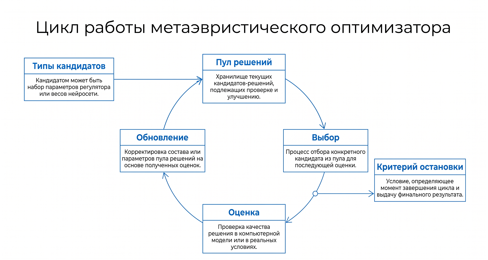
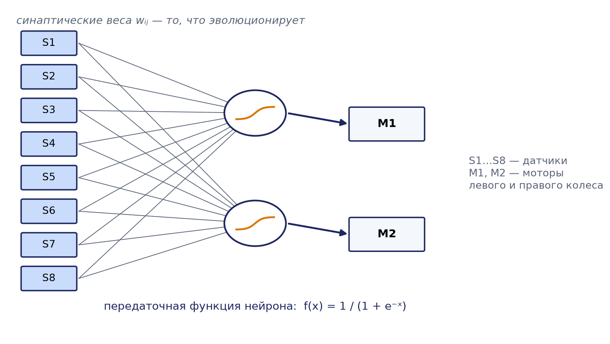

# Глава 12. Эволюционные алгоритмы и адаптивные системы в управлении распределёнными робототехническими системами

Эволюционные вычисления представляют собой самостоятельное научное направление на стыке теории оптимизации, теории вероятностей, биологии и информатики. Их привлекательность для управления распределёнными робототехническими системами (РРТС) обусловлена тем, что естественная эволюция сама по себе есть распределённый, параллельный и децентрализованный процесс адаптации популяции агентов к среде. В настоящей главе рассматриваются теоретические основы эволюционных алгоритмов, их важнейшие разновидности, а также приложения к синтезу и адаптации поведения роботов и роёв роботов. Особое внимание уделяется тем свойствам эволюционного поиска, которые делают его пригодным для задач, где градиентные и аналитические методы неприменимы: многоэкстремальность целевой функции, разрывность, отсутствие явной аналитической формы, зашумлённость измерений и изменчивость среды во времени.

## 12.1. Принципы эволюционных вычислений

### 12.1.1. Метафора естественного отбора и общая схема

Эволюционные алгоритмы (ЭА) — это класс стохастических методов оптимизации и поиска, вдохновлённых механизмами естественного отбора, наследственной изменчивости и выживания наиболее приспособленных. В основе их лежит идея дарвиновской эволюции: популяция особей, каждая из которых кодирует потенциальное решение задачи, подвергается циклическому воздействию отбора и генетических операторов, в результате чего средняя приспособленность популяции возрастает от поколения к поколению.

Формально задача оптимизации ставится как поиск такого элемента x* из пространства поиска S, при котором целевая функция f: S → ℝ достигает экстремума, то есть f(x*) ≥ f(x) для всех x ∈ S в задаче максимизации. Эволюционный алгоритм не гарантирует нахождение глобального оптимума за конечное число шагов, однако при корректной настройке параметров он с высокой вероятностью находит решения, близкие к оптимальным, обходя многочисленные локальные экстремумы за счёт поддержания разнообразия популяции и стохастического характера поиска.

Ключевыми понятиями теории эволюционных вычислений являются следующие. Популяция — конечный набор из μ особей (индивидов), представляющих одновременно исследуемые точки пространства поиска. Особь описывается генотипом — внутренним закодированным представлением, и фенотипом — соответствующим ему решением в терминах исходной задачи. Функция приспособленности (фитнес-функция) отображает фенотип в скалярную оценку качества и определяет вероятность участия особи в воспроизводстве. Генетические операторы — селекция, рекомбинация (кроссовер) и мутация — порождают новые особи на основе имеющихся.

### 12.1.2. Обобщённый цикл эволюционного алгоритма

Все разновидности эволюционных алгоритмов реализуют единый обобщённый цикл, различаясь конкретной реализацией отдельных шагов. Цикл включает следующие этапы. На этапе инициализации формируется начальная популяция, как правило случайным равномерным разбросом особей по пространству поиска, что обеспечивает широкий охват области определения. Затем производится оценка: для каждой особи вычисляется значение функции приспособленности; этот шаг обычно является наиболее вычислительно затратным, особенно в робототехнике, где оценка требует прогона симуляции или физического испытания. На этапе селекции отбираются особи-родители, причём предпочтение отдаётся более приспособленным. Операторы рекомбинации и мутации порождают потомков — новую совокупность решений. На этапе замещения формируется популяция следующего поколения из родителей и потомков. Наконец, проверяется критерий остановки: исчерпание отпущенного числа поколений, достижение заданного уровня приспособленности, стагнация (отсутствие улучшения в течение нескольких поколений) или исчерпание вычислительного бюджета.

Важнейшим методологическим принципом эволюционного поиска является баланс между исследованием (exploration) — широким сканированием пространства поиска — и использованием (exploitation) — уточнением найденных хороших решений. Чрезмерное давление отбора приводит к преждевременной сходимости, когда популяция теряет разнообразие и застревает в локальном оптимуме; недостаточное давление превращает поиск в случайное блуждание. Настройка параметров ЭА во многом сводится к управлению этим балансом.

## 12.2. Генетические алгоритмы

### 12.2.1. Кодирование решений

Генетические алгоритмы (ГА) — наиболее известная и исторически ранняя разновидность эволюционных алгоритмов, предложенная Джоном Холландом в начале 1970-х годов. Классический канонический ГА использует бинарное кодирование, при котором каждая особь представляется строкой битов фиксированной длины — хромосомой. Отдельная позиция хромосомы называется геном, а конкретное значение гена — аллелью.

Для кодирования вещественного параметра x, изменяющегося на отрезке [a, b], с помощью L бит используется соотношение: целочисленное значение, представленное битовой строкой, обозначим d (оно принадлежит диапазону от 0 до 2^L − 1), тогда декодированное вещественное значение вычисляется как x = a + d · (b − a) / (2^L − 1). Число бит L определяет разрешающую способность кодирования: шаг дискретизации составляет (b − a) / (2^L − 1). Наряду с прямым бинарным кодированием применяется код Грея, в котором соседние по значению числа отличаются ровно одним битом; это устраняет так называемые «хэммингговы обрывы», когда небольшое изменение фенотипа требует изменения многих бит.

Помимо бинарного, широко используются вещественное кодирование (хромосома есть вектор действительных чисел, что естественно для непрерывной оптимизации), целочисленное и перестановочное кодирование. Последнее применяется в комбинаторных задачах, например в задаче коммивояжёра или маршрутизации, где хромосома есть перестановка индексов точек. Выбор кодирования критически влияет на эффективность: он должен обеспечивать локальность — близость генотипов должна соответствовать близости фенотипов и приспособленностей.

### 12.2.2. Операторы селекции

Селекция определяет, какие особи получат право на воспроизводство. Пропорциональная селекция (метод рулетки) назначает каждой i-й особи вероятность выбора, пропорциональную её приспособленности: p_i = f_i / Σ f_j, где суммирование ведётся по всем особям популяции. Наглядно это соответствует колесу рулетки, сектора которого имеют площади, пропорциональные приспособленностям. Недостаток метода — чувствительность к масштабу значений фитнеса: если одна особь имеет приспособленность, многократно превосходящую остальные, она быстро вытесняет прочие, вызывая преждевременную сходимость; на поздних же стадиях, когда приспособленности выравниваются, давление отбора почти исчезает. Для преодоления этого применяют масштабирование фитнеса и ранговую селекцию, при которой вероятность зависит не от абсолютного значения, а от ранга особи в отсортированной популяции.

Турнирная селекция — наиболее популярный на практике метод в силу простоты и устойчивости. Из популяции случайно выбирается k особей (обычно k = 2 или 3), и победителем — родителем — становится особь с наибольшей приспособленностью в этой группе. Размер турнира k регулирует давление отбора: чем больше k, тем сильнее преимущество высокоприспособленных особей. Турнирная селекция инвариантна к монотонным преобразованиям функции приспособленности и не требует нормировки, что делает её удобной в задачах с зашумлённой или динамической оценкой.

Отдельного упоминания заслуживает элитизм — механизм, при котором заранее заданное число лучших особей (элита) переносится в следующее поколение без изменений. Элитизм гарантирует, что найденное наилучшее решение не будет утрачено вследствие стохастичности операторов, и заметно ускоряет сходимость. Однако чрезмерная элита снижает разнообразие, поэтому её размер обычно составляет единицы процентов от численности популяции.

### 12.2.3. Кроссовер и мутация

Оператор кроссовера (рекомбинации) комбинирует генетический материал двух родителей, порождая одного или двух потомков. Одноточечный кроссовер выбирает случайную точку разрыва хромосом и обменивает хвостовые части родителей. Например, для родителей 11111 и 00000 при точке разрыва после третьего гена потомки будут 11100 и 00011. Двухточечный и, в общем случае, многоточечный кроссовер используют несколько точек разрыва. Равномерный (униформный) кроссовер независимо для каждого гена решает по случайному правилу, от какого родителя наследуется аллель. Для вещественного кодирования применяют арифметический кроссовер, где потомок есть выпуклая комбинация родителей: c = α · p₁ + (1 − α) · p₂, где α — случайный коэффициент из интервала [0, 1], а также имитацию бинарного кроссовера (SBX). Вероятность применения кроссовера p_c обычно задаётся высокой — в пределах 0,6–0,95.

Мутация вносит случайные локальные изменения, поддерживая разнообразие популяции и обеспечивая теоретическую возможность достижения любой точки пространства поиска. В бинарном ГА побитовая мутация инвертирует каждый бит независимо с малой вероятностью p_m, часто выбираемой равной 1/L, где L — длина хромосомы; тогда в среднем в хромосоме мутирует один ген. Для вещественного кодирования используют гауссову мутацию: к значению гена прибавляется случайная величина, распределённая нормально с нулевым средним и заданным стандартным отклонением σ. Мутация играет роль механизма исследования; чрезмерно высокая её интенсивность разрушает накопленную информацию и превращает поиск в случайный, слишком низкая — не позволяет выбраться из локальных оптимумов.

### 12.2.4. Схема-теорема Холланда

Теоретическое обоснование работоспособности генетических алгоритмов даёт схема-теорема Холланда (теорема о схемах). Схемой H называется шаблон, описывающий подмножество хромосом с совпадающими значениями в фиксированных позициях; в бинарном алфавите схема записывается символами из множества {0, 1, *}, где символ * («не важно») допускает любое значение. Например, схема 1**0 описывает все четырёхбитные строки, начинающиеся на 1 и оканчивающиеся на 0. Порядком схемы o(H) называют число фиксированных (не звёздочных) позиций, а определяющей длиной δ(H) — расстояние между крайними фиксированными позициями.

Теорема о схемах утверждает, что число представителей короткой, низкопорядковой схемы с приспособленностью выше средней растёт в популяции приблизительно экспоненциально от поколения к поколению. Формально математическое ожидание числа m(H) представителей схемы H в следующем поколении оценивается снизу выражением: m(H, t+1) ≥ m(H, t) · [f(H) / f̄] · [1 − p_c · δ(H)/(L−1) − o(H) · p_m], где f(H) — средняя приспособленность представителей схемы, f̄ — средняя приспособленность популяции, p_c и p_m — вероятности кроссовера и мутации. Множитель f(H)/f̄ отражает действие отбора, а выражение в скобках — вероятность того, что схема не будет разрушена операторами кроссовера и мутации. Из теоремы вытекает так называемая гипотеза строительных блоков: ГА эффективно комбинирует короткие фрагменты хромосом с высокой приспособленностью, «строительные блоки», собирая из них решения возрастающего качества. Несмотря на известную критику и последующие уточнения, теорема о схемах остаётся важным концептуальным объяснением того, почему эволюционный поиск способен работать существенно эффективнее слепого перебора.

### 12.2.5. Псевдокод генетического алгоритма

Обобщённая структура канонического генетического алгоритма с элитизмом и турнирной селекцией приведена ниже.

```
Алгоритм ГА (максимизация f)
Вход: размер популяции N, вероятности p_c, p_m,
      размер турнира k, размер элиты E, макс. число поколений G
1.  P ← случайная популяция из N хромосом
2.  вычислить f(x) для каждой x из P
3.  для t = 1 .. G:
4.      P_new ← E лучших особей популяции P            // элитизм
5.      пока |P_new| < N:
6.          родитель1 ← турнирная_селекция(P, k)
7.          родитель2 ← турнирная_селекция(P, k)
8.          если random() < p_c:
9.              потомок ← кроссовер(родитель1, родитель2)
10.         иначе:
11.             потомок ← копия(родитель1)
12.         потомок ← мутация(потомок, p_m)
13.         добавить потомок в P_new
14.     P ← P_new
15.     вычислить f(x) для новых особей P
16.     если выполнен критерий остановки: прервать
17. вернуть лучшую найденную особь
```

### 12.2.6. Разобранный численный пример

Рассмотрим задачу максимизации функции f(x) = x² на множестве целых x ∈ [0, 31]. Очевидное аналитическое решение x* = 31 с f = 961; проследим, как к нему приближается ГА, чтобы проиллюстрировать работу операторов вручную. Целые числа диапазона [0, 31] кодируются пятибитными строками (2⁵ = 32 значения).

Пусть начальная популяция из четырёх особей, полученная случайно, имеет вид: особь A = 01101 (x = 13, f = 169), особь B = 11000 (x = 24, f = 576), особь C = 01000 (x = 8, f = 64), особь D = 10011 (x = 19, f = 361). Сумма приспособленностей популяции равна 169 + 576 + 64 + 361 = 1170, средняя приспособленность f̄ = 292,5.

Применим пропорциональную (рулеточную) селекцию. Вероятности отбора составляют: для A p = 169/1170 ≈ 0,144; для B p ≈ 0,492; для C p ≈ 0,055; для D p ≈ 0,309. Ожидаемое число копий каждой особи (произведение вероятности на численность 4) равно приблизительно 0,58 для A, 1,97 для B, 0,22 для C и 1,23 для D. Таким образом, наиболее приспособленная особь B ожидаемо получает около двух копий, слабая особь C почти наверняка выбывает. Пусть в результате розыгрыша рулетки в брачный пул попали особи B, D, B, A.

Проведём одноточечный кроссовер над парами (B, D) и (B, A). Для первой пары B = 11000 и D = 10011 выберем точку разрыва после четвёртого гена: потомки — 11001 (x = 25, f = 625) и 10010 (x = 18, f = 324). Для второй пары B = 11000 и A = 01101 выберем точку разрыва после второго гена: потомки — 11101 (x = 29, f = 841) и 01000 (x = 8, f = 64). Новая популяция до мутации: 11001, 10010, 11101, 01000.

Применим побитовую мутацию с малой вероятностью; пусть случайно мутирует один бит — в особи 01000 инвертируется старший бит, давая 11000 (x = 24, f = 576). Итоговая популяция первого поколения потомков: 11001 (f = 625), 10010 (f = 324), 11101 (f = 841), 11000 (f = 576). Сумма приспособленностей возросла до 2366, средняя приспособленность увеличилась с 292,5 до 591,5, а наилучшая особь достигла значения f = 841 против прежних 576. Таким образом, всего за одно поколение популяция заметно приблизилась к оптимуму, что демонстрирует направленный характер эволюционного поиска: отбор концентрирует материал вокруг перспективных особей, кроссовер комбинирует их удачные фрагменты (старшие единичные биты), а мутация вносит разнообразие. Повторение цикла ещё на несколько поколений с высокой вероятностью приведёт популяцию к особи 11111 (x = 31).

## 12.3. Эволюционные стратегии и дифференциальная эволюция

### 12.3.1. Эволюционные стратегии

Эволюционные стратегии (ЭС) разработаны в 1960-х годах в Германии Инго Рехенбергом и Хансом-Паулем Швефелем и изначально ориентированы на оптимизацию в непрерывных пространствах. Особь в ЭС представляется вектором вещественных чисел, а основным генетическим оператором служит гауссова мутация. Простейшая стратегия (1+1)-ЭС оперирует единственным родителем, порождая одного потомка добавлением нормального шума; потомок замещает родителя, если оказывается не хуже. Классическое правило одной пятой Рехенберга регулирует величину шага мутации σ: если доля успешных мутаций (приводящих к улучшению) превышает 1/5, σ следует увеличивать, если меньше — уменьшать; это простейшая форма самонастройки.

Многочленные стратегии обозначаются символами μ и λ, где μ — число родителей, λ — число порождаемых потомков. В стратегии (μ + λ) следующее поколение отбирается из объединения родителей и потомков, что обеспечивает элитарность — лучшие решения не теряются. В стратегии (μ, λ), где обязательно λ > μ, следующее поколение формируется только из потомков, а родители полностью отбрасываются. Неэлитарная схема (μ, λ) на первый взгляд менее эффективна, но она лучше приспособлена к динамическим и зашумлённым задачам и к самонастройке параметров мутации, поскольку не сохраняет устаревшие решения и позволяет «забывать» случайно завышенные оценки приспособленности.

Отличительная черта ЭС — самоадаптация параметров стратегии. Наряду с координатами решения в хромосому включаются сами параметры мутации (стандартные отклонения σ по каждой координате, а в развитых вариантах и углы поворота, задающие корреляции). Эти параметры эволюционируют совместно с решением: сначала мутируют шаги, затем в соответствии с ними мутируют переменные задачи. В результате алгоритм автоматически подстраивает масштаб и направление поиска к локальной геометрии функции приспособленности.

Вершиной развития эволюционных стратегий является метод CMA-ES (Covariance Matrix Adaptation Evolution Strategy), предложенный Николаусом Хансеном. В нём мутации порождаются из многомерного нормального распределения, ковариационная матрица которого адаптируется по мере поиска на основе истории успешных шагов. Адаптация ковариационной матрицы позволяет алгоритму фактически восстанавливать локальную кривизну функции (подобно оценке обратного гессиана в квазиньютоновских методах), эффективно решая плохо обусловленные, неразделимые и овражные задачи. CMA-ES считается одним из наиболее мощных методов безградиентной непрерывной оптимизации и широко применяется, в частности, для настройки контроллеров роботов.

### 12.3.2. Дифференциальная эволюция

Дифференциальная эволюция (Differential Evolution, DE), предложенная Райнером Сторном и Кеннетом Прайсом в 1990-х годах, — простой и эффективный метод оптимизации в непрерывных пространствах, оперирующий популяцией вещественных векторов. Ключевая идея состоит в порождении мутантного вектора путём добавления к одному вектору популяции масштабированной разности двух других случайно выбранных векторов. В базовой схеме DE/rand/1 мутантный вектор формируется как v = x_r1 + F · (x_r2 − x_r3), где x_r1, x_r2, x_r3 — три различных случайно выбранных вектора популяции, а F — масштабирующий коэффициент из интервала примерно [0,4; 1,0]. Затем производится биномиальный или экспоненциальный кроссовер мутантного вектора с текущим (целевым) вектором, управляемый вероятностью кроссовера CR. Наконец, пробный вектор замещает целевой в следующем поколении, если его приспособленность не хуже (жадный отбор).

Замечательным свойством дифференциальной эволюции является самомасштабируемость шага: разностный вектор автоматически подстраивает величину возмущения под текущий разброс популяции. На ранних поколениях, когда популяция рассеяна, шаги велики (широкое исследование), а по мере сходимости популяция сжимается и шаги уменьшаются, обеспечивая точное уточнение решения. DE отличается малым числом управляющих параметров, простотой реализации и хорошей устойчивостью, что сделало её одним из наиболее популярных методов для инженерной оптимизации, включая идентификацию параметров моделей роботов и настройку регуляторов.

## 12.4. Генетическое программирование и многокритериальная оптимизация

### 12.4.1. Генетическое программирование

Генетическое программирование (ГП), развитое Джоном Козой в начале 1990-х годов, распространяет идеи эволюционного поиска на пространство самих программ или, шире, символьных структур переменной сложности. Если генетический алгоритм эволюционирует значения параметров, то генетическое программирование эволюционирует структуру и логику решения. Классическая форма ГП представляет особь в виде синтаксического дерева, внутренние узлы которого суть функции (арифметические операции, логические операторы, управляющие конструкции, элементарные действия робота), а листья — терминалы (константы, переменные, датчики). Такое дерево может интерпретироваться как выражение, программа или управляющий закон.

Операторы ГП действуют на деревьях. Кроссовер обменивает случайно выбранные поддеревья двух родителей, мутация заменяет случайное поддерево вновь сгенерированным. Функция приспособленности оценивает, насколько хорошо программа выполняет целевую задачу, например насколько точно она аппроксимирует заданный набор данных (символьная регрессия) или насколько эффективно управляет роботом. Характерной проблемой ГП является раздувание (bloat) — неограниченный рост размеров деревьев без соответствующего улучшения приспособленности; для борьбы с ним вводят штраф за сложность (парсимония) или ограничения на глубину дерева. Генетическое программирование применяется для автоматического синтеза управляющих законов, деревьев поведения и правил принятия решений в робототехнике, когда структура решения заранее неизвестна.

### 12.4.2. Многокритериальная оптимизация и Парето-фронт

Многие прикладные задачи управления РРТС по своей природе многокритериальны: требуется одновременно минимизировать энергозатраты и время выполнения задания, максимизировать площадь покрытия и надёжность связи, повысить скорость движения и снизить риск столкновений. Эти цели, как правило, конфликтуют, и не существует единственного решения, оптимального по всем критериям сразу. Для формализации применяется понятие доминирования по Парето: решение x доминирует решение y, если x не хуже y по всем критериям и строго лучше хотя бы по одному. Множество недоминируемых решений называется множеством Парето, а его образ в пространстве критериев — фронтом Парето. Задача многокритериальной оптимизации состоит в аппроксимации этого фронта: получении набора компромиссных решений, из которого лицо, принимающее решения, выбирает окончательный вариант с учётом предпочтений.

Эволюционные алгоритмы естественным образом подходят для многокритериальной оптимизации, поскольку оперируют популяцией и способны за один прогон аппроксимировать весь фронт Парето. Наиболее известным методом является NSGA-II (Non-dominated Sorting Genetic Algorithm II), предложенный Каляанмоем Дебом с соавторами. Алгоритм основан на двух механизмах. Первый — быстрая недоминируемая сортировка: популяция разбивается на фронты по уровням доминирования (первый фронт — недоминируемые решения, второй — недоминируемые среди оставшихся и так далее), и решения из более высоких фронтов получают предпочтение при отборе. Второй — оценка скученности (crowding distance): для сохранения разнообразия вдоль фронта предпочтение отдаётся решениям, расположенным в менее плотно заселённых участках, что предотвращает скучивание популяции и обеспечивает равномерное покрытие фронта. NSGA-II использует элитизм, объединяя родителей и потомков перед отбором, и отличается хорошей вычислительной эффективностью. Полученный набор недоминируемых решений позволяет инженеру наглядно видеть компромиссы между конфликтующими целями и осознанно выбирать конфигурацию системы.

### 12.4.3. Сравнение эволюционных методов

Сопоставление рассмотренных семейств методов приведено в таблице 12.1.

| Метод | Тип пространства | Представление | Основной оператор | Характерное применение |
|-------|------------------|---------------|-------------------|------------------------|
| Генетический алгоритм | дискретное/смешанное | битовая или вещественная строка | кроссовер + мутация | комбинаторная оптимизация, маршрутизация |
| Эволюционная стратегия | непрерывное | вектор вещественных чисел | гауссова мутация, самоадаптация σ | настройка непрерывных параметров |
| CMA-ES | непрерывное | вектор + ковариационная матрица | адаптация ковариации | плохо обусловленные, овражные задачи |
| Дифференциальная эволюция | непрерывное | вектор вещественных чисел | разностная мутация | инженерная оптимизация, идентификация |
| Генетическое программирование | пространство программ | синтаксическое дерево | обмен поддеревьями | синтез контроллеров, символьная регрессия |
| NSGA-II | много критериев | вектор + ранг Парето | сортировка + скученность | многокритериальные компромиссы |

Ни один метод не превосходит остальные на всех задачах — это следствие теоремы об отсутствии бесплатных завтраков (No Free Lunch), утверждающей, что усреднённая по всем возможным задачам производительность любых двух алгоритмов поиска одинакова. Практический вывод состоит в необходимости согласовывать выбор и настройку метода с особенностями конкретной задачи: типом пространства поиска, гладкостью и мультимодальностью функции, стоимостью её вычисления и требованиями к времени отклика.

## 12.5. Адаптация в реальном времени

### 12.5.1. Необходимость адаптации в динамических средах

Робототехнические системы, действующие в реальном мире, сталкиваются со средой, которая непредсказуемо изменяется: появляются новые препятствия, меняются цели, деградируют сенсоры и приводы, изменяются характеристики поверхности и освещённости. Статически синтезированный контроллер, оптимальный в момент проектирования, со временем теряет эффективность. Адаптация в реальном времени позволяет системе изменять своё поведение «на лету», без остановки и полного переобучения, поддерживая работоспособность в изменяющихся условиях. В контексте эволюционных вычислений это означает переход от однократной оффлайн-оптимизации к непрерывному эволюционному процессу, протекающему в течение всего срока функционирования системы.

### 12.5.2. Обучение на месте и онлайн-алгоритмы

Различают два принципиальных режима применения эволюционных и обучающих методов. Оффлайн-обучение (обучение вне контура) выполняется заранее, обычно в симуляции, где можно безопасно и быстро оценить множество вариантов; результат — готовый контроллер, разворачиваемый на роботе. Онлайн-обучение (обучение в контуре, обучение на месте) протекает непосредственно во время эксплуатации: система обучается на текущем потоке данных и опыте, обновляя своё поведение по мере поступления информации. Преимущество онлайн-подхода — способность реагировать на непредвиденные изменения и постепенно улучшать производительность; плата за это — необходимость обучаться на реальных, потенциально небезопасных пробах и жёсткие ограничения на вычисления.



Смежными являются онлайн-алгоритмы в узком смысле — методы, обрабатывающие данные по мере поступления и обновляющие модель инкрементально. К ним относятся онлайн-градиентный спуск и онлайн-обучение с подкреплением. Эволюционные методы могут сочетаться с ними: например, эволюция настраивает структуру и начальные параметры контроллера оффлайн, а онлайн-обучение с подкреплением дообучает его в конкретных условиях эксплуатации. Такая гибридизация всё чаще рассматривается как перспективное направление, объединяющее глобальный характер эволюционного поиска с выборочной эффективностью градиентных методов.

### 12.5.3. Вызовы адаптации в реальном времени

Адаптация в реальном времени сопряжена с рядом принципиальных трудностей. Во-первых, ограниченность вычислительных ресурсов бортовых процессоров не позволяет содержать большие популяции и выполнять множество оценок за короткое время. Во-вторых, требование быстрого отклика вступает в противоречие со стохастической, итеративной природой эволюционного поиска, требующего многих поколений для сходимости. В-третьих, возникает проблема стабильности и пластичности: система должна усваивать новое, не разрушая накопленный опыт (катастрофическое забывание). В-четвёртых, оценка приспособленности в реальном времени зашумлена и нестационарна, поскольку среда меняется в ходе самой оценки. Наконец, при обучении на физических роботах остро стоит вопрос безопасности проб, для чего применяют защитные ограничения, обучение в симуляции с последующим переносом и консервативные стратегии исследования.

## 12.6. Эволюционная робототехника

### 12.6.1. Эволюция контроллеров

Эволюционная робототехника (Evolutionary Robotics) — область, применяющая эволюционные алгоритмы для автоматического синтеза управляющих систем, а иногда и морфологии роботов. Основополагающий подход изложен в работах Стефано Нольфи и Дарио Флореано. Идея состоит в том, чтобы не программировать поведение робота вручную, а задать функцию приспособленности, выражающую желаемую цель на высоком уровне (например, «пройти как можно дальше», «собрать как можно больше объектов», «избежать столкновений»), и позволить эволюционному процессу самому найти контроллер, эту цель реализующий. Контроллер чаще всего представляется искусственной нейронной сетью, а эволюционируемым генотипом являются веса её связей, кодируемые в хромосоме.



Преимуществом подхода является то, что проектировщик освобождается от необходимости детально предписывать, как именно робот должен решать задачу; эволюция нередко обнаруживает неочевидные, экономные и робастные решения, использующие тонкое взаимодействие тела робота, контроллера и среды (воплощённое, embodied, познание). Обратной стороной является слабая интерпретируемость контроллеров и дороговизна оценки, поскольку прогон каждой особи требует симуляции или физического испытания. Отдельной фундаментальной проблемой является разрыв реальности (reality gap) — расхождение между поведением контроллера в симуляции и на реальном роботе из-за неточности моделей физики и сенсорики; для его преодоления применяют внесение шума в симуляцию, рандомизацию параметров среды и заключительное дообучение на аппаратуре.

### 12.6.2. Нейроэволюция и алгоритм NEAT

Нейроэволюция — направление, в котором эволюционным путём создаются искусственные нейронные сети: оптимизируются как весовые коэффициенты, так и топология сети. Наиболее известным методом эволюции топологий является NEAT (NeuroEvolution of Augmenting Topologies), предложенный Кеннетом Стэнли и Ристо Мииккулайненом. NEAT решает три ключевые проблемы нейроэволюции. Первая — проблема конкурирующих соглашений (competing conventions), когда одна и та же функциональная сеть может быть закодирована разными способами, что делает кроссовер разрушительным; NEAT вводит исторические маркеры (innovation numbers), помечающие каждый ген связи моментом его возникновения, что позволяет корректно выравнивать хромосомы разной структуры при рекомбинации.

Вторая проблема — защита структурных инноваций: вновь добавленный узел или связь поначалу обычно ухудшает приспособленность, и без защиты такое нововведение немедленно вытесняется отбором. NEAT применяет видообразование (speciation): популяция разбивается на виды по мере генетической схожести, и конкуренция за выживание происходит преимущественно внутри вида, что даёт инновациям время «созреть». Третья идея — усложнение от простого (complexification): эволюция стартует с минимальных сетей без скрытых узлов и постепенно наращивает сложность топологии только по мере необходимости, что удерживает размерность пространства поиска малой на ранних стадиях и повышает эффективность. NEAT и его развитие HyperNEAT широко применяются для синтеза контроллеров роботов, стратегий в играх и других задач, где заранее не известна необходимая архитектура сети.

## 12.7. Адаптивные и самоорганизующиеся системы в роях роботов

### 12.7.1. Самоорганизация и эволюция в роях

Самоорганизующиеся системы — системы, в которых упорядоченное глобальное поведение возникает из локальных взаимодействий множества компонентов без централизованного управления. Рой роботов является характерным примером: каждый робот следует простым локальным правилам, руководствуясь ограниченным восприятием ближайшего окружения и локальной коммуникацией, а согласованное коллективное поведение — агрегация, формирование строя, коллективный транспорт, распределённый поиск, покрытие территории — возникает как эмерджентное свойство системы. Эволюционные алгоритмы позволяют автоматически синтезировать такие локальные правила, оптимизируя их по глобальному коллективному критерию, тогда как ручное проектирование правил, приводящих к нужному коллективному эффекту, крайне затруднительно из-за сложной связи между микро- и макроуровнями поведения.

При эволюции роевого поведения важен способ формирования приспособленности. При командном отборе приспособленность назначается всей группе одинаково по коллективному результату, что способствует кооперации, но затрудняет распределение заслуг между особями. При индивидуальном отборе каждая особь оценивается по собственному вкладу, что ускоряет отбор, но может препятствовать возникновению альтруистичной кооперации. Выбор между гомогенными роями (все роботы несут идентичный, совместно эволюционирующий контроллер) и гетерогенными (роботы могут специализироваться, неся различные контроллеры) определяет способность роя к разделению труда.


### 12.7.2. Онлайн-, оффлайн-эволюция и embodied evolution

По месту и времени протекания эволюционного процесса в роях выделяют несколько парадигм. Оффлайн-эволюция протекает централизованно и заранее, обычно в симуляции: контроллеры эволюционируют на внешнем компьютере, лучшие затем загружаются в роботов. Этот подход прост и позволяет использовать большие популяции, но не даёт адаптации во время эксплуатации и страдает от разрыва реальности.

Онлайн-эволюция протекает во время работы роя, непосредственно на роботах, обеспечивая непрерывную адаптацию к изменяющейся среде и отказам. Особую форму онлайн-эволюции в роях составляет воплощённая эволюция (embodied evolution), концепция которой предложена в работах Уотсона, Фикичи и Полака. В embodied evolution эволюционный процесс полностью децентрализован и распределён по самому рою: не существует внешнего управляющего компьютера, а роль генетических операторов исполняют сами роботы. Каждый робот несёт собственный геном (контроллер), а обмен генетическим материалом происходит при физических встречах роботов: сблизившись, роботы обмениваются частями своих геномов посредством локальной беспроводной связи, причём вероятность передачи генома пропорциональна текущей приспособленности робота (например, накопленной «энергии» как мере успешности). Мутация применяется локально к получаемым геномам. Таким образом, отбор, рекомбинация и мутация протекают распределённо и асинхронно, в темпе взаимодействий роя, а популяция физически совпадает с самим роем роботов. Такая схема замечательно согласуется с самой природой РРТС: она масштабируема, устойчива к отказам отдельных роботов и не требует централизованной инфраструктуры.

Среди конкретных алгоритмов онлайн-эволюции в роях можно назвать (1+1)-ONLINE-EA, при котором каждый робот поддерживает пару «родитель — претендент» и локально сравнивает их приспособленность, а также mEDEA (medea) — минималистичный распределённый алгоритм, в котором роботы распространяют свои геномы среди встреченных соседей, а выживание генома определяется его способностью к распространению, то есть косвенно — способностью робота-носителя оставаться работоспособным и встречать других. Эти алгоритмы демонстрируют, как из чисто локальных, эгоистичных на первый взгляд правил распространения геномов возникает коллективная адаптация роя к среде.

### 12.7.3. Адаптивная маршрутизация и координация

Классическим прикладным примером эволюционной адаптации в РРТС является динамическая маршрутизация в изменяющейся среде — поиск оптимальных маршрутов для группы роботов при появлении заторов, препятствий и изменении целей. Генетический алгоритм с перестановочным или путевым кодированием эволюционирует маршруты, оценивая их по длине, времени прохождения и безопасности, а онлайн-адаптация состоит в продолжении эволюции при поступлении новой информации о среде, причём прежнее решение служит хорошим начальным приближением, ускоряя перепланирование. Аналогично эволюционные методы применяются для распределения задач между роботами, координации движений и формирования строёв, где многокритериальный характер целей делает уместным применение алгоритмов типа NSGA-II. Сопоставление режимов эволюции в роях приведено в таблице 12.2.

| Критерий | Оффлайн-эволюция | Онлайн-эволюция | Embodied evolution |
|----------|------------------|-----------------|--------------------|
| Место процесса | внешний компьютер | на роботах | распределённо по рою |
| Время процесса | до эксплуатации | во время работы | во время работы |
| Управление | централизованное | локальное/централизованное | полностью децентрализованное |
| Адаптация к изменениям | отсутствует | есть | есть |
| Разрыв реальности | значителен | мал | отсутствует |
| Масштабируемость | ограничена | средняя | высокая |
| Стоимость проб | низкая (симуляция) | высокая (реальные пробы) | высокая (реальные пробы) |

## Выводы по главе

Эволюционные алгоритмы образуют универсальное и гибкое семейство методов стохастической оптимизации, вдохновлённых естественным отбором, и применимы к задачам, где традиционные аналитические и градиентные методы неэффективны из-за многоэкстремальности, разрывности, отсутствия явной аналитической формы или зашумлённости целевой функции. Генетические алгоритмы, оперирующие популяцией закодированных решений посредством селекции, кроссовера и мутации, теоретически обоснованы схема-теоремой Холланда и гипотезой строительных блоков. Эволюционные стратегии, включая мощный метод CMA-ES, и дифференциальная эволюция ориентированы на непрерывные пространства и отличаются механизмами самоадаптации шага поиска. Генетическое программирование распространяет эволюционный поиск на пространство программ и структур, а многокритериальные алгоритмы, в первую очередь NSGA-II, позволяют за один прогон аппроксимировать фронт Парето компромиссных решений.

Для распределённых робототехнических систем особую ценность представляет эволюционная робототехника, автоматизирующая синтез контроллеров, в том числе нейроэволюционных (алгоритм NEAT), и парадигмы онлайн- и воплощённой эволюции в роях. Именно в роях роботов эволюционные вычисления обретают свою наиболее естественную форму: распределённый, децентрализованный, масштабируемый и отказоустойчивый процесс адаптации, физически совпадающий с самой популяцией роботов. Ключевыми практическими вызовами остаются вычислительная стоимость оценки приспособленности, разрыв реальности между симуляцией и аппаратурой, а также обеспечение баланса между исследованием и использованием и безопасность проб при обучении на месте. Перспективным направлением является гибридизация эволюционных методов с обучением с подкреплением и глубоким обучением.

## Вопросы для самопроверки

1. Каковы основные компоненты эволюционного алгоритма и в чём различие между генотипом и фенотипом особи?
2. В чём состоят достоинства и недостатки рулеточной и турнирной селекции? Как размер турнира влияет на давление отбора?
3. Что такое элитизм и как он влияет на сходимость и разнообразие популяции?
4. Сформулируйте схема-теорему Холланда. Что означают порядок и определяющая длина схемы и как они входят в оценку выживаемости схемы?
5. Чем стратегия отбора (μ + λ) отличается от (μ, λ) и в каких условиях предпочтительна каждая из них?
6. Какова основная идея адаптации ковариационной матрицы в методе CMA-ES и какие задачи он позволяет эффективно решать?
7. Как формируется мутантный вектор в дифференциальной эволюции и почему говорят о самомасштабируемости её шага?
8. Что такое доминирование по Парето и фронт Парето? Какие два механизма лежат в основе алгоритма NSGA-II?
9. Какие проблемы нейроэволюции решает алгоритм NEAT и с помощью каких средств (исторические маркеры, видообразование, усложнение от простого)?
10. В чём суть парадигмы воплощённой эволюции (embodied evolution) и почему она хорошо согласуется с природой роёв роботов?

## Задания

1. Реализуйте канонический генетический алгоритм с бинарным кодированием, турнирной селекцией, одноточечным кроссовером и побитовой мутацией для максимизации функции f(x) = x·sin(10π·x) + 1 на отрезке x ∈ [0, 1]. Исследуйте зависимость скорости и качества сходимости от размера популяции, вероятностей кроссовера и мутации и наличия элитизма; постройте графики динамики наилучшей и средней приспособленности по поколениям.

2. Для непрерывной тестовой функции (например, функции Растригина или Розенброка нескольких переменных) сравните на равном вычислительном бюджете три метода: генетический алгоритм с вещественным кодированием, дифференциальную эволюцию и эволюционную стратегию с самоадаптацией. Проанализируйте различия в скорости сходимости и устойчивости к попаданию в локальные оптимумы.

3. Разработайте симуляцию роя мобильных агентов (например, средствами Python), реализующую онлайн-эволюцию правил поведения в задаче коллективного поиска цели или покрытия территории. Продемонстрируйте улучшение коллективной эффективности роя во времени, приведите параметры алгоритма и обсудите влияние командного и индивидуального отбора на кооперацию.

4. Постройте двухкритериальную задачу планирования маршрута мобильного робота (минимизация длины пути и минимизация риска столкновений) и решите её алгоритмом NSGA-II. Постройте аппроксимацию фронта Парето и обсудите компромиссы между критериями, а также способ выбора итогового решения.

## Литература

1. Holland J. H. Adaptation in Natural and Artificial Systems. — Ann Arbor: University of Michigan Press, 1975.
2. Goldberg D. E. Genetic Algorithms in Search, Optimization, and Machine Learning. — Reading, MA: Addison-Wesley, 1989.
3. Eiben A. E., Smith J. E. Introduction to Evolutionary Computing. — 2nd ed. — Berlin: Springer, 2015.
4. Mitchell M. An Introduction to Genetic Algorithms. — Cambridge, MA: MIT Press, 1996.
5. Nolfi S., Floreano D. Evolutionary Robotics: The Biology, Intelligence, and Technology of Self-Organizing Machines. — Cambridge, MA: MIT Press, 2000.
6. Fogel D. B. Evolutionary Computation: Toward a New Philosophy of Machine Intelligence. — 3rd ed. — Hoboken, NJ: Wiley-IEEE Press, 2006.
7. Deb K. Multi-Objective Optimization Using Evolutionary Algorithms. — Chichester: John Wiley & Sons, 2001.
8. Deb K., Pratap A., Agarwal S., Meyarivan T. A Fast and Elitist Multiobjective Genetic Algorithm: NSGA-II // IEEE Transactions on Evolutionary Computation. — 2002. — Vol. 6, No. 2. — P. 182–197.
9. Stanley K. O., Miikkulainen R. Evolving Neural Networks through Augmenting Topologies // Evolutionary Computation. — 2002. — Vol. 10, No. 2. — P. 99–127.
10. Hansen N., Ostermeier A. Completely Derandomized Self-Adaptation in Evolution Strategies // Evolutionary Computation. — 2001. — Vol. 9, No. 2. — P. 159–195.
11. Koza J. R. Genetic Programming: On the Programming of Computers by Means of Natural Selection. — Cambridge, MA: MIT Press, 1992.
12. Гладков Л. А., Курейчик В. В., Курейчик В. М. Генетические алгоритмы. — 2-е изд. — М.: ФИЗМАТЛИТ, 2010.
