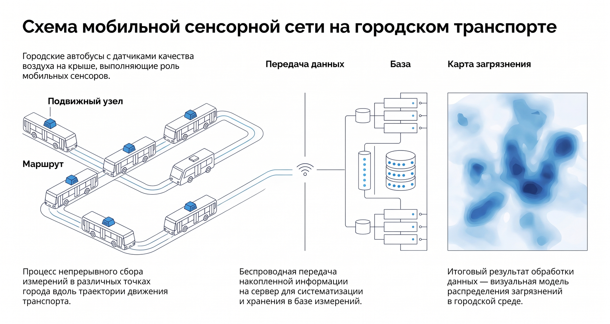
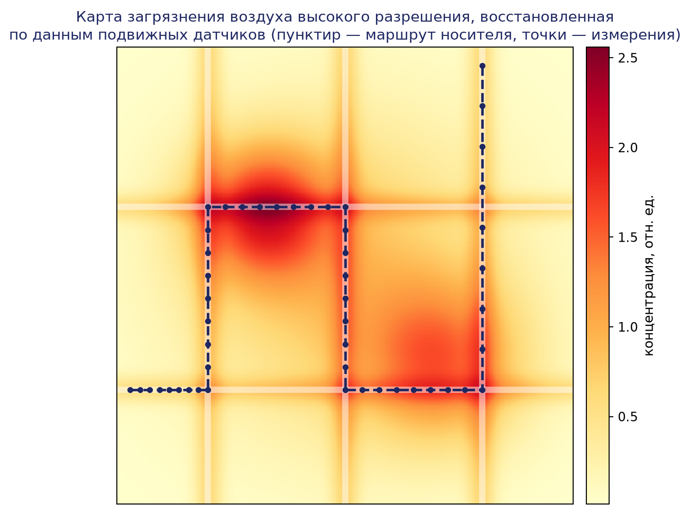

# Глава 17. Перспективы развития распределённых робототехнических систем и новые направления исследований

## 17.1. Введение

Заключительная глава пособия посвящена анализу перспективных направлений развития распределённых робототехнических систем (РРТС). Предметная область, рассмотренная в предыдущих главах — архитектуры мультиагентных систем, коммуникационные протоколы, алгоритмы координации, распределённое планирование и коллективное восприятие, — в настоящее время переживает период интенсивной трансформации. Её движущими силами выступают, с одной стороны, прогресс в области машинного обучения и, в частности, больших языковых и мультимодальных моделей, а с другой — развитие сетевой и вычислительной инфраструктуры: облачных платформ, периферийных (edge) вычислений, сетей пятого и шестого поколений.

Одновременно расширяется спектр применений: гетерогенные группы роботов осваивают трёхсредные сценарии «воздух — земля — вода», коллективы микророботов приближаются к практическому использованию в медицине, а рои малых космических аппаратов становятся штатным инструментом дистанционного зондирования и перспективным средством планетных исследований. Рост автономности систем обостряет этические и правовые вопросы: проблему распределения ответственности, допустимость автономных систем вооружения, требования к сертификации и стандартизации.

Изложение в данной главе носит обзорно-аналитический характер: для каждого направления рассматриваются базовые концепции, достигнутые результаты и нерешённые научные проблемы. Поскольку прогнозирование развития технологий сопряжено со значительной неопределённостью, акцент делается не на футурологических сценариях, а на тенденциях, уже подтверждённых экспериментальными и промышленными результатами.

## 17.2. Модели машинного обучения основания в управлении робототехническими системами

### 17.2.1. Большие языковые модели как компонент системы управления

Большие языковые модели (large language models, LLM), обученные на обширных текстовых корпусах, продемонстрировали способность к декомпозиции задач, планированию последовательностей действий и рассуждению на естественном языке. В робототехнике эти свойства используются прежде всего на верхнем, задачном уровне иерархии управления: языковая модель преобразует команду, сформулированную человеком в свободной форме («собери со стола посуду и отнеси на кухню»), в последовательность элементарных действий, исполняемых нижележащими контроллерами.

Характерным примером такого подхода стала система SayCan (Google, 2022), в которой языковая модель предлагает возможные действия, а обученные функции ценности («affordance functions») оценивают их физическую выполнимость в текущей обстановке. Тем самым частично решается ключевая проблема применения LLM в робототехнике — проблема заземления (grounding): языковая модель, обученная на текстах, не имеет собственного представления о физическом мире и может предлагать действия, невыполнимые или небезопасные в конкретной ситуации.

Для распределённых систем LLM-агенты представляют особый интерес как средство координации. Естественный язык может служить универсальным протоколом взаимодействия гетерогенных агентов: роботы различных производителей, обладающие различными наборами способностей, способны согласовывать распределение подзадач посредством диалога, опосредованного языковыми моделями. Экспериментальные работы по мультиагентному диалоговому планированию (в частности, фреймворки типа RoCo и аналогичные) показывают принципиальную осуществимость такой схемы, однако её надёжность, вычислительная стоимость и предсказуемость пока далеки от требований промышленной эксплуатации.

### 17.2.2. Мультимодальные и VLA-модели

Следующим шагом стало создание мультимодальных моделей, объединяющих обработку языка, изображений и, в ряде случаев, непосредственно управляющих сигналов. Модель PaLM-E (Google, 2023) представляет собой «воплощённую» (embodied) языковую модель: в единую трансформерную архитектуру наряду с текстовыми токенами подаются кодированные представления изображений с бортовых камер и данные о состоянии робота, а выходом является текстовый план действий.

Модели класса VLA (vision-language-action) идут дальше: они порождают не текстовый план, а непосредственно команды управления. Модель RT-2 (Robotic Transformer 2, Google DeepMind, 2023) обучена совместно на веб-данных «изображение — текст» и на траекториях телеуправления манипулятором; действия робота представлены как последовательности токенов в том же словаре, что и текст. Ключевым результатом стала демонстрация переноса семантических знаний из веб-корпуса в моторные навыки: робот выполняет команды, объекты и понятия которых не встречались в робототехнических обучающих данных. Развитием этой линии стали открытые модели (OpenVLA, серия $\pi$ от Physical Intelligence и др.) и коллективные наборы данных типа Open X-Embodiment, объединяющие траектории десятков различных робототехнических платформ.

Для РРТС значимость VLA-моделей двояка. Во-первых, единая модель, применимая к разным воплощениям (cross-embodiment), упрощает построение гетерогенных групп: агенты с различной кинематикой могут использовать общую «политику основания», дообученную под конкретную платформу. Во-вторых, коллективный сбор данных группой роботов и централизованное дообучение общей модели образуют естественный цикл коллективного обучения, реализуемый через облачную инфраструктуру (см. § 17.3).

### 17.2.3. Нерешённые проблемы

К нерешённым научным проблемам данного направления относятся: недостаточная надёжность и склонность моделей к «галлюцинациям», недопустимым в контурах управления физическими объектами; высокая вычислительная стоимость инференса, затрудняющая работу в реальном времени на бортовых вычислителях; отсутствие формальных гарантий безопасности и методов верификации нейросетевых политик; ограниченность и дороговизна робототехнических обучающих данных по сравнению с текстовыми и визуальными корпусами. Отдельной проблемой является согласованность поведения множества агентов, управляемых стохастическими моделями: предсказуемость коллективного поведения таких систем пока не имеет удовлетворительного теоретического описания.

## 17.3. Облачная и туманная робототехника

### 17.3.1. Концепция облачной робототехники

Термин «облачная робототехника» (cloud robotics), введённый Дж. Куффнером в 2010 г., обозначает архитектурный подход, при котором часть вычислений, хранения данных и знаний робототехнической системы выносится во внешнюю облачную инфраструктуру. В обзоре Кехоу и соавторов (2015) выделены четыре основных механизма, которые облако предоставляет роботам: доступ к большим данным (карты, модели объектов, траектории); облачные вычисления по требованию (планирование движений, обработка изображений); коллективное обучение (обмен опытом между роботами); краудсорсинг и удалённое привлечение человека-оператора в затруднительных ситуациях.

Для распределённых систем облачная архитектура особенно естественна: облако выступает общей средой обмена знаниями и глобальной координации, тогда как локальные контуры реактивного управления остаются на борту. Классическими примерами являются проекты RoboEarth (общая база знаний для роботов) и Rapyuta — облачная платформа, развившаяся впоследствии в коммерческие решения для управления парками складских роботов.

Наглядным примером современной распределённой киберфизической системы облачного типа служат мобильные сенсорные сети экологического мониторинга. В проекте OpenSense (EPFL, Лозанна) недорогие датчики газовых загрязнителей $(\mathrm{CO}, \mathrm{NO}_2, O_3, \mathrm{CO}_2)$, взвешенных частиц (LDSA), температуры и влажности были размещены на десяти городских автобусах, использующих маршрутную сеть общественного транспорта как источник мобильности, а бортовое питание — как источник энергии, что снимает жёсткие энергетические ограничения стационарных узлов и позволяет применять сотовую связь (GPRS) для непрерывной выгрузки данных. Собранные потоки измерений (с геопривязкой по GPS) агрегируются на серверной стороне, где выполняется калибровка датчиков и статистическое моделирование. За три года эксплуатации система накопила один из крупнейших наборов данных о городском качестве воздуха и стала пионером в использовании общественного транспорта для мобильных сенсорных сетей.

Ключевая особенность подхода — переход от разрежённой сети дорогих стационарных станций к плотному мобильному покрытию, дополняемому объясняющими переменными (данные о землепользовании, метеорология, интенсивность движения, прокси-загрязнители). Статистические модели — от лог-линейной регрессии до искусственных нейронных сетей и гауссовских процессов — восстанавливают поле загрязнения в точках и в моменты времени, где прямые измерения отсутствуют, и строят карты загрязнения воздуха города высокого пространственного разрешения. Такая система иллюстрирует все ключевые черты облачной РРТС: мобильные распределённые узлы восприятия, облачную агрегацию, коллективную обработку данных и превращение разрозненных измерений в целостную картину среды.

### 17.3.2. Периферийные вычисления и континуум «облако — туман — край»

Принципиальным ограничением чисто облачной схемы являются задержки и ненадёжность канала связи: контуры управления с жёсткими требованиями реального времени (стабилизация, предотвращение столкновений) не могут зависеть от удалённого центра обработки данных. Ответом стало развитие периферийных (edge computing) и туманных (fog computing) вычислений — размещения вычислительных ресурсов вблизи источников данных: на самом роботе, на локальном сервере цеха, на базовой станции сотовой сети (концепция MEC, multi-access edge computing).

В результате формируется вычислительный континуум, в котором задачи распределяются по уровням в соответствии с их требованиями к задержке и объёму вычислений: реактивное управление (миллисекунды) — на борту; коллективное восприятие и локальная координация группы (десятки миллисекунд) — на периферийном сервере; построение глобальных карт, обучение моделей, аналитика (секунды и более) — в облаке. Задача оптимального разгрузки вычислений (computation offloading) — динамического выбора места исполнения каждой задачи с учётом состояния сети и загрузки узлов — представляет собой активную область исследований на стыке робототехники и распределённых вычислений.

### 17.3.3. Сети 5G/6G как инфраструктура РРТС

Сети пятого поколения (5G) впервые проектировались с учётом требований машинных коммуникаций. Для РРТС значимы три их режима: eMBB (широкополосная передача — потоковая передача видео и облаков точек), URLLC (сверхнадёжная связь с малой задержкой, порядка единиц миллисекунд, — контуры телеуправления и координации) и mMTC (массовые подключения — плотные сенсорные сети и крупные рои). Механизм сетевого сегментирования (network slicing) позволяет выделять робототехническим приложениям виртуальные сегменты сети с гарантированными характеристиками, а частные сети 5G становятся типовым решением для промышленных площадок.

Исследования сетей шестого поколения (6G) ориентированы на субмиллисекундные задержки, интеграцию связи и сенсорики (ISAC — использование радиоканала одновременно для передачи данных и радиолокационного восприятия среды), терагерцовые диапазоны и встроенные в сеть сервисы искусственного интеллекта. Для РРТС это открывает перспективу сетей, «осознающих» физическую обстановку, однако следует учитывать, что стандартизация 6G ожидается не ранее конца 2020-х годов, и конкретный облик технологии остаётся предметом исследований.

### 17.3.4. Пример: архитектура облачной распределённой РРТС

В качестве структурированного примера рассмотрим обобщённую архитектуру облачной системы управления парком мобильных роботов логистического центра.

**Уровень 1 — бортовой (робот, задержки < 10 мс).** На каждом роботе исполняются: контуры стабилизации и следования траектории; локальное обнаружение препятствий по данным лидара и камер; аварийные реакции (безусловная остановка). Программная платформа — ROS 2 с DDS в качестве промежуточного слоя; критичные узлы работают автономно при потере связи.

**Уровень 2 — периферийный (сервер цеха, задержки 10–50 мс).** Периферийный сервер, соединённый с роботами по частной сети 5G или Wi-Fi 6, выполняет: слияние данных восприятия от группы роботов (коллективная карта динамических препятствий); диспетчеризацию перекрёстков и узких проходов; локальное перепланирование маршрутов; буферизацию телеметрии.

**Уровень 3 — облачный (ЦОД, задержки 100 мс и более).** В облаке размещаются: глобальный планировщик заданий (распределение заказов по роботам методами решения задач назначения); система управления парком (fleet management) и цифровой двойник склада; конвейер машинного обучения — сбор эпизодов, дообучение моделей восприятия и их поэтапное развёртывание на роботов (OTA-обновления); долговременное хранилище и аналитика.

**Сквозные подсистемы:** безопасность (взаимная аутентификация узлов, шифрование каналов, сегментация сети); мониторинг качества связи с деградацией функций при её ухудшении; журналирование для последующего разбора инцидентов.

Данная архитектура иллюстрирует общий принцип: автономность каждого уровня по отношению к вышестоящим. Отказ облака не должен останавливать локальную работу, отказ периферийного сервера — движение отдельного робота в безопасном режиме.

## 17.4. Цифровые двойники и симуляция

### 17.4.1. Роль симуляции в разработке РРТС

Разработка и верификация распределённых робототехнических систем в натурных экспериментах затруднена стоимостью оборудования, рисками повреждений и невозможностью воспроизведения редких ситуаций. Поэтому симуляция стала неотъемлемым элементом жизненного цикла РРТС: от отладки алгоритмов координации на сотнях виртуальных агентов до обучения нейросетевых политик с последующим переносом на реальные системы.

Концепция цифрового двойника (digital twin) расширяет традиционную симуляцию: цифровой двойник — это виртуальная модель системы, синхронизируемая с физическим оригиналом потоками данных в течение всей эксплуатации. Применительно к РРТС цифровой двойник производственной площадки или склада позволяет прогнозировать последствия управленческих решений, обнаруживать деградацию оборудования и тестировать обновления программного обеспечения до их развёртывания («shadow testing»).

### 17.4.2. Проблема переноса «симуляция — реальность»

Центральной научной проблемой направления является разрыв между симуляцией и реальностью (sim-to-real gap): политики, обученные в виртуальной среде, теряют качество при переносе на физические системы из-за неточности моделей динамики, трения, сенсорных шумов и внешних возмущений. Основные подходы к сокращению разрыва: рандомизация параметров среды при обучении (domain randomization), при которой политика становится робастной к вариациям модели; системная идентификация и калибровка симулятора по данным реальной системы; смешанное обучение на симулированных и реальных данных; адаптация в реальном времени. Несмотря на заметные успехи (в частности, в обучении локомоции шагающих роботов), универсального решения проблема не имеет, и для распределённых систем она усугубляется необходимостью адекватного моделирования каналов связи и асинхронности агентов.

### 17.4.3. Сравнение программных платформ

В таблице 17.1 сопоставлены наиболее распространённые симуляторы, применяемые при разработке РРТС.

Таблица 17.1 — Сравнительная характеристика симуляторов для распределённых робототехнических систем

| Характеристика | Gazebo (новое поколение) | NVIDIA Isaac Sim | Webots | ARGoS |
|---|---|---|---|---|
| Лицензия | открытая (Apache 2.0) | проприетарная, бесплатная для разработки | открытая (Apache 2.0) | открытая (MIT) |
| Основное назначение | универсальная симуляция, экосистема ROS/ROS 2 | фотореалистичная симуляция, обучение ИИ, синтетические данные | образование, прототипирование, соревнования | крупномасштабные рои (тысячи агентов) |
| Физические движки | DART, Bullet и др. | PhysX (GPU-ускорение) | собственный (на основе ODE) | модульные, упрощённые |
| Фотореализм рендеринга | средний | высокий (RTX, трассировка лучей) | средний | низкий |
| Масштабируемость по числу роботов | десятки | десятки–сотни (GPU) | десятки | тысячи–десятки тысяч |
| Интеграция с ROS 2 | нативная | развитая (мосты) | развитая | ограниченная |
| Обучение с подкреплением | через внешние обёртки | встроенные средства (Isaac Lab) | через внешние обёртки | ограниченно |
| Требования к аппаратуре | умеренные | высокие (GPU NVIDIA RTX) | умеренные | низкие |

Выбор платформы определяется задачей: для исследования алгоритмов роевого поведения на тысячах агентов целесообразен ARGoS с его иерархией упрощённых физических моделей; для генерации фотореалистичных синтетических данных и обучения политик восприятия — Isaac Sim; для сквозной отладки программного стека ROS 2 — Gazebo; для учебных задач и быстрого прототипирования — Webots.

## 17.5. Модульная и реконфигурируемая робототехника

Модульные самореконфигурируемые робототехнические системы (self-reconfigurable modular robots) состоят из унифицированных модулей, способных механически соединяться друг с другом и изменять топологию соединений, образуя конфигурации под текущую задачу: змеевидную — для перемещения в узких каналах, шагающую — для пересечённой местности, манипуляционную — для работы с объектами. Классическими исследовательскими платформами являются системы PolyBot, M-TRAN, SuperBot, ATRON, а также кубические модули M-Blocks (MIT), реконфигурирующиеся за счёт инерционных маховиков.

С позиций теории РРТС модульный робот представляет собой предельный случай распределённой системы: каждый модуль — автономный агент с собственным вычислителем, приводами и локальной связью с соседями, а «робот» в целом — результат их координации. Ключевые научные задачи направления: распределённое планирование реконфигурации (поиск последовательности элементарных перемещений модулей из одной конфигурации в другую — задача высокой вычислительной сложности); распределённое управление движением переменной кинематической структуры; проектирование надёжных и энергоэффективных межмодульных соединителей (механических, электрических, информационных). Практическое внедрение сдерживается стоимостью и надёжностью соединителей, однако идеи модульности в ослабленной форме — быстрая механическая и программная реконфигурация под задачу — уже широко применяются в промышленной робототехнике.

## 17.6. Микро- и наноробототехника

### 17.6.1. Коллективы микророботов

Микроробототехника изучает управляемые устройства с характерными размерами от единиц миллиметров до единиц микрометров. На этих масштабах доминируют вязкие силы и поверхностные взаимодействия, а размещение на борту источников энергии, вычислителей и радиосвязи, как правило, невозможно. Поэтому микророботы обычно приводятся в движение и управляются внешними полями — магнитными, акустическими, световыми, — а «интеллект» системы реализуется во внешнем контуре наблюдения и управления.

Особенность управления коллективом микророботов состоит в том, что внешнее поле действует на всех агентов одновременно (глобальный вход при множестве управляемых объектов); индивидуализация движения достигается за счёт неоднородности самих агентов, градиентов поля или взаимодействий агентов между собой и со средой. Это порождает специфический класс задач управления недоопределёнными ансамблями, сближающий микроробототехнику с теорией управления распределёнными системами и роевой робототехникой. Показательно, что и на макроуровне роевые платформы (например, коллектив из тысячи роботов Kilobot, продемонстрировавший программируемую самосборку двумерных форм) служат моделью для отработки алгоритмов, которые в перспективе предполагается воспроизводить на микромасштабе.

### 17.6.2. Медицинские применения и ограничения

Наиболее обсуждаемым применением микро- и наноробототехники является медицина: адресная доставка лекарственных средств к опухолям, тромболизис, малоинвазивная хирургия, забор проб в труднодоступных отделах организма. Экспериментально продемонстрированы магнитоуправляемые спиральные микроплавуны, микророботы на основе модифицированных клеток и бактерий (биогибридные системы), рои магнитных наночастиц, коллективно перемещающиеся по сосудистому руслу лабораторных животных.

Вместе с тем следует трезво оценивать состояние области: подавляющая часть результатов получена in vitro или на животных моделях; нерешёнными остаются проблемы визуализации микроагентов в глубине тканей, биосовместимости и биодеградации материалов, точного управления в условиях кровотока, а также клинической сертификации. Переход к медицинской практике потребует ещё многих лет междисциплинарных исследований.

## 17.7. Гетерогенные группы и новые области применения

### 17.7.1. Мультисредные гетерогенные системы

Гетерогенные РРТС объединяют агентов с различными способностями, что позволяет использовать их взаимодополняемость: беспилотные летательные аппараты (БПЛА) обеспечивают обзор и ретрансляцию связи, наземные роботы — грузоподъёмность и длительность работы, надводные и подводные аппараты — действия в водной среде. Типовые сценарии «воздух — земля»: воздушная разведка с построением карты, по которой наземные роботы планируют маршруты; посадка и подзарядка БПЛА на наземных платформах-носителях. В морских применениях связка «надводное судно — автономные подводные аппараты» решает проблему навигации и связи под водой: судно служит акустическим ретранслятором и навигационным маяком.

Научные проблемы гетерогенных групп концентрируются вокруг распределения задач с учётом различий способностей (обобщения задачи назначения, аукционные и рыночные механизмы), согласования разнородных представлений среды (кросс-модальное сопоставление карт, построенных с воздуха и с земли) и организации связи между средами (в частности, через границу «вода — воздух», где радиоканал неприменим).

### 17.7.2. Космические применения

Космонавтика является естественной областью применения распределённых архитектур: отказоустойчивость за счёт избыточности здесь ценнее, чем в любой земной системе. Выделяются три направления. Во-первых, группировки и рои малых спутников: многоспутниковые системы связи и дистанционного зондирования уже эксплуатируются в составе сотен и тысяч аппаратов, а исследовательские работы направлены на автономное поддержание конфигурации строя, распределённую интерферометрию и обслуживание аппаратов на орбите. Во-вторых, планетные миссии: демонстрация вертолёта Ingenuity, работавшего в паре с марсоходом Perseverance, стала первым практическим примером гетерогенной группы «воздух — земля» на другой планете; прорабатываются концепции роёв малых аппаратов для картографирования пещер и лавовых трубок Луны и Марса. В-третьих, распределённое строительство и обслуживание: сборка крупногабаритных конструкций группами орбитальных манипуляционных роботов.

Специфика космических РРТС — большие задержки связи с Землёй, исключающие телеуправление; жёсткие ограничения по массе, энергетике и радиационной стойкости вычислителей; невозможность ремонта, что делает космос требовательным полигоном для алгоритмов распределённой автономии.

### 17.7.3. Самовосстанавливающиеся и самособирающиеся системы

Идеи самосборки и самовосстановления переносят в робототехнику принципы, наблюдаемые в живых системах. Различают: программируемую самосборку — автономное образование заданной структуры из множества простых элементов (продемонстрирована на роях Kilobot, на самособирающихся модульных плотах и летающих платформах); функциональное самовосстановление — способность системы сохранять выполнение миссии при отказах элементов за счёт перераспределения функций (свойство, присущее правильно спроектированным роевым алгоритмам); материальное самовосстановление — применение полимеров и эластомеров, восстанавливающих целостность после повреждений, в конструкциях мягких роботов. На системном уровне ключевым понятием является деградация с сохранением функции (graceful degradation): распределённая архитектура должна гарантировать, что отказ доли агентов приводит к пропорциональному снижению производительности, а не к катастрофическому отказу. Формальные методы анализа и синтеза таких гарантий для больших коллективов остаются открытой научной задачей.

## 17.8. Этические, правовые и социальные аспекты

### 17.8.1. Проблема ответственности

Рост автономности РРТС обостряет вопрос о распределении ответственности за ущерб, причинённый действиями системы. Традиционные правовые конструкции (вина оператора, ответственность производителя за дефект) плохо приложимы к системам, поведение которых формируется обучением на данных и коллективным взаимодействием множества агентов: конкретное решение может не сводиться к дефекту отдельного компонента или ошибке отдельного лица. В литературе эта ситуация обозначается как «разрыв ответственности» (responsibility gap). Обсуждаемые подходы включают режимы строгой (безвиновной) ответственности оператора высокорисковых систем, обязательное страхование, требования к журналированию («чёрные ящики» роботов) для реконструкции причин инцидентов, а также требования объяснимости алгоритмов принятия решений. Для распределённых систем проблема усложняется тем, что причинная цепочка инцидента может проходить через взаимодействие агентов разных владельцев и производителей.

### 17.8.2. Автономные системы вооружения

Особое место в этических дискуссиях занимают смертоносные автономные системы вооружения (lethal autonomous weapon systems, LAWS) — системы, способные выбирать и поражать цели без участия человека. Технологии роевой робототехники и распределённой координации имеют очевидное двойное назначение, что налагает на исследователей обязанность осознавать возможные применения результатов. Международная дискуссия ведётся с 2014 г. в рамках Конвенции ООН о конкретных видах обычного оружия (группа правительственных экспертов по LAWS); центральным является принцип сохранения «значимого человеческого контроля» (meaningful human control) над применением силы. Юридически обязывающий международный договор к настоящему времени не принят; ряд государств и научных ассоциаций выступает за превентивный запрет, другие — за регулирование через существующие нормы международного гуманитарного права. Ключевые аргументы дискуссии: проблемы соблюдения принципов различения и соразмерности, риск снижения порога применения силы, риски эскалации при взаимодействии автономных систем противостоящих сторон.

### 17.8.3. Регулирование и стандартизация

Нормативная база робототехники формируется на двух уровнях. Первый — законодательное регулирование: Регламент ЕС об искусственном интеллекте (AI Act, принят в 2024 г.) вводит риск-ориентированный подход, относя системы ИИ в составе критической инфраструктуры и ряда робототехнических применений к высокорисковым с соответствующими требованиями к менеджменту рисков, качеству данных, прозрачности и человеческому надзору; обновлённые директивы ЕС о машинах и о продуктовой ответственности прямо распространяются на системы с машинным обучением. Второй уровень — техническая стандартизация: стандарты безопасности промышленных (ISO 10218) и коллаборативных (ISO/TS 15066) роботов, персональных роботов (ISO 13482), беспилотных авиационных систем (нормативная база сертификации и правила эксплуатации БАС, включая концепцию U-space в Европе), а также этически ориентированные стандарты (BS 8611, серия IEEE 7000). Существенный пробел — отсутствие зрелых стандартов именно для мультиагентных и роевых систем: методики верификации и сертификации коллективного поведения, возникающего из локальных взаимодействий, находятся в стадии исследований. Это одно из наиболее практически значимых направлений будущей работы: без методов сертификации эмерджентного поведения массовое внедрение роевых систем в ответственных применениях невозможно.

### 17.8.4. Кибербезопасность и конфиденциальность

Распределённость увеличивает поверхность атаки: каналы связи между агентами, облачные интерфейсы, цепочки поставок программного обеспечения. Специфические для РРТС угрозы включают подмену сообщений координации (ведущую к рассогласованию строя или столкновениям), атаки типа «византийских» агентов (внедрение в коллектив узлов, сообщающих ложные данные), подавление и подмену сигналов спутниковой навигации, атаки на модели машинного обучения (состязательные примеры, отравление обучающих данных). Контрмеры — взаимная аутентификация, шифрование, византийски устойчивые протоколы консенсуса, обнаружение аномалий — рассматривались в предыдущих главах; здесь подчеркнём тенденцию: требования безопасности становятся частью нормативных условий допуска систем в эксплуатацию. Сбор роботами данных о людях подпадает под законодательство о персональных данных (GDPR и национальные аналоги), что требует встраивания механизмов минимизации и анонимизации данных уже на этапе проектирования (privacy by design).

## 17.9. Рынок и организационные аспекты развития

### 17.9.1. Структура и динамика рынка

Коммерческое значение РРТС наиболее очевидно в трёх сегментах. Первый — складская и логистическая робототехника: парки автономных мобильных роботов (AMR), исчисляемые сотнями единиц на объект, стали массовым продуктом, а платформы управления парками и стандарты интероперабельности (например, интерфейс VDA 5050 для связи роботов разных производителей с единой системой управления) — самостоятельным рынком. Второй — сервисные применения: инспекция инфраструктуры группами БПЛА, координированные группы сельскохозяйственных машин, доставка. Третий — модель «робот как услуга» (RaaS), снижающая порог внедрения за счёт замены капитальных затрат операционными и органично сочетающаяся с облачной архитектурой управления. Количественные прогнозы рыночных объёмов, публикуемые аналитическими агентствами, существенно расходятся и должны восприниматься критически; надёжнее судить по устойчивым структурным тенденциям — росту доли программного обеспечения и сервисов в стоимости решений и смещению конкуренции от аппаратных платформ к платформам управления и данным.

### 17.9.2. Направления развития: сводная характеристика

Таблица 17.2 обобщает рассмотренные направления по степени зрелости и характеру основных барьеров.

Таблица 17.2 — Направления развития РРТС: зрелость и барьеры

| Направление | Уровень зрелости | Горизонт широкого внедрения | Основные барьеры |
|---|---|---|---|
| Облачное управление парками роботов | промышленная эксплуатация | уже внедряется | интероперабельность, безопасность |
| Периферийные вычисления, частные 5G | ранняя промышленная эксплуатация | ближайшие годы | стоимость инфраструктуры, интеграция |
| Цифровые двойники производств | пилотные и промышленные проекты | ближайшие годы | стоимость моделирования, сопровождение моделей |
| VLA-модели и LLM-агенты в управлении | исследования и демонстрации | среднесрочный | надёжность, верификация, данные, вычисления |
| Гетерогенные группы (воздух—земля—вода) | полевые эксперименты, отдельные внедрения | среднесрочный | связь, автономность, регулирование |
| Модульные самореконфигурируемые роботы | лабораторные исследования | долгосрочный | соединители, планирование реконфигурации |
| Медицинская микроробототехника | лабораторные исследования, опыты на животных | долгосрочный | визуализация, биосовместимость, сертификация |
| Космические рои и планетные группы | демонстрационные миссии | средне- и долгосрочный | автономность, радиационная стойкость, стоимость |

### 17.9.3. Междисциплинарность и подготовка кадров

Развитие РРТС носит выраженно междисциплинарный характер: теория управления и распределённые вычисления соседствуют с машинным обучением, сетевыми технологиями, биологией, правом и этикой. Соответственно меняются требования к подготовке специалистов: наряду с классическими дисциплинами в образовательные программы входят распределённые системы и сети, машинное обучение, кибербезопасность и основы нормативного регулирования. Значимую роль играет взаимодействие университетов с индустрией — совместные лаборатории, соревнования (RoboCup, челленджи DARPA) и открытые экосистемы (ROS 2, открытые симуляторы и наборы данных), снижающие порог входа в исследования.

## Выводы по главе

1. Определяющей тенденцией развития РРТС является конвергенция робототехники с технологиями машинного обучения и сетевой инфраструктурой. Большие языковые и мультимодальные модели (SayCan, PaLM-E, RT-2 и последующие VLA-модели) переносят в робототехнику семантические знания из веб-масштабных корпусов, однако их надёжность, верифицируемость и вычислительная эффективность остаются нерешёнными проблемами.
2. Архитектурной нормой становится вычислительный континуум «борт — периферия — облако» с распределением функций по требованиям к задержке и обеспечением автономности нижних уровней при отказах верхних; сети 5G (и в перспективе 6G) выступают инфраструктурной основой такого распределения.
3. Симуляция и цифровые двойники — неотъемлемая часть жизненного цикла РРТС; выбор платформы (Gazebo, Isaac Sim, Webots, ARGoS) определяется задачей, а центральной научной проблемой остаётся перенос результатов из симуляции в реальность.
4. Расширение предметной области идёт по линиям модульной и реконфигурируемой робототехники, микро- и наноробототехники, гетерогенных мультисредных групп и космических применений; общими для них являются проблемы автономности, связи и отказоустойчивости, а свойства самосборки и деградации с сохранением функции становятся проектными требованиями.
5. Этико-правовой контур — распределение ответственности, регулирование автономных систем вооружения, риск-ориентированное законодательство (AI Act), техническая стандартизация — развивается медленнее технологий; отсутствие методов сертификации эмерджентного коллективного поведения является ключевым барьером внедрения роевых систем в ответственных применениях.
6. Рыночное развитие смещает центр стоимости от аппаратных платформ к программному обеспечению управления, данным и сервисным моделям; междисциплинарная подготовка кадров становится условием развития области.

## Вопросы для самопроверки

1. В чём состоит проблема заземления (grounding) при использовании больших языковых моделей в управлении роботами и как она частично решается в системах типа SayCan?
2. Чем VLA-модели (например, RT-2) принципиально отличаются от применения языковой модели в качестве планировщика верхнего уровня?
3. Какие четыре основных механизма предоставляет облачная инфраструктура робототехническим системам согласно классическому обзору облачной робототехники?
4. Как распределяются функции управления между бортовым, периферийным и облачным уровнями и каким принципом определяется это распределение?
5. Какие режимы сетей 5G (eMBB, URLLC, mMTC) соответствуют каким задачам распределённых робототехнических систем?
6. Что такое разрыв «симуляция — реальность» и какие подходы применяются для его сокращения?
7. По каким критериям следует выбирать симулятор (Gazebo, Isaac Sim, Webots, ARGoS) для конкретной задачи разработки РРТС?
8. Почему управление коллективом микророботов внешними полями порождает специфический класс задач управления и в чём его особенность?
9. Что понимается под «разрывом ответственности» применительно к автономным распределённым системам и какие правовые механизмы предлагаются для его преодоления?
10. Почему сертификация эмерджентного поведения роевых систем представляет особую трудность по сравнению с сертификацией традиционных робототехнических систем?

## Задания

1. **Аналитический обзор.** Выберите одно из направлений, рассмотренных в главе (VLA-модели, медицинская микроробототехника, модульные роботы, космические рои). Подготовьте письменный обзор (8–10 страниц) текущего состояния исследований по 10–15 научным публикациям последних пяти лет: ключевые результаты, применяемые методы, экспериментальные платформы, нерешённые проблемы. Завершите обзор собственной аргументированной оценкой горизонта практического внедрения.
2. **Проектное задание.** Разработайте эскизную архитектуру облачно-периферийной системы управления гетерогенной группой (например, 2 БПЛА и 4 наземных робота для инспекции промышленной площадки) по образцу § 17.3.4: распределите функции по уровням «борт — периферия — облако», обоснуйте требования к задержкам и пропускной способности каналов, опишите поведение системы при потере связи с каждым из уровней.
3. **Эссе по этике и праву.** Рассмотрите сценарий: рой доставочных БПЛА, управляемый облачной системой с обученными нейросетевыми компонентами, вследствие рассогласования координации причиняет ущерб третьим лицам. Проанализируйте распределение ответственности между оператором, производителем платформы, разработчиком программного обеспечения и поставщиком облачного сервиса; соотнесите анализ с риск-ориентированным подходом Регламента ЕС об ИИ и требованиями журналирования. Объём — 4–6 страниц, с опорой на источники.
4. **Практикум по симуляции.** В выбранном симуляторе (Webots, Gazebo или ARGoS) реализуйте сценарий коллективного покрытия территории группой из 5–10 роботов; исследуйте деградацию показателя покрытия при последовательном «отказе» 20 %, 40 % и 60 % агентов и оцените, обеспечивает ли ваш алгоритм деградацию с сохранением функции. Оформите результаты в виде краткого отчёта с графиками.

## Литература

1. Kehoe B., Patil S., Abbeel P., Goldberg K. A Survey of Research on Cloud Robotics and Automation // IEEE Transactions on Automation Science and Engineering. 2015. Vol. 12, No. 2. P. 398–409.
2. Brohan A., Brown N., Carbajal J. et al. RT-2: Vision-Language-Action Models Transfer Web Knowledge to Robotic Control // Proceedings of the 7th Conference on Robot Learning (CoRL). 2023.
3. Driess D., Xia F., Sajjadi M. S. M. et al. PaLM-E: An Embodied Multimodal Language Model // Proceedings of the 40th International Conference on Machine Learning (ICML). 2023.
4. Ahn M., Brohan A., Brown N. et al. Do As I Can, Not As I Say: Grounding Language in Robotic Affordances // Proceedings of the 6th Conference on Robot Learning (CoRL). 2022.
5. Yim M., Shen W.-M., Salemi B. et al. Modular Self-Reconfigurable Robot Systems: Grand Challenges of Robotics // IEEE Robotics & Automation Magazine. 2007. Vol. 14, No. 1. P. 43–52.
6. Rubenstein M., Cornejo A., Nagpal R. Programmable Self-Assembly in a Thousand-Robot Swarm // Science. 2014. Vol. 345, No. 6198. P. 795–799.
7. Sitti M. Mobile Microrobotics. Cambridge, MA: MIT Press, 2017.
8. Nelson B. J., Kaliakatsos I. K., Abbott J. J. Microrobots for Minimally Invasive Medicine // Annual Review of Biomedical Engineering. 2010. Vol. 12. P. 55–85.
9. Brambilla M., Ferrante E., Birattari M., Dorigo M. Swarm Robotics: A Review from the Swarm Engineering Perspective // Swarm Intelligence. 2013. Vol. 7, No. 1. P. 1–41.
10. Tobin J., Fong R., Ray A. et al. Domain Randomization for Transferring Deep Neural Networks from Simulation to the Real World // Proceedings of IEEE/RSJ IROS. 2017. P. 23–30.
11. Winfield A. F., Jirotka M. Ethical Governance Is Essential to Building Trust in Robotics and Artificial Intelligence Systems // Philosophical Transactions of the Royal Society A. 2018. Vol. 376, No. 2133.
12. Siciliano B., Khatib O. (eds.) Springer Handbook of Robotics. 2nd ed. Cham: Springer, 2016.
