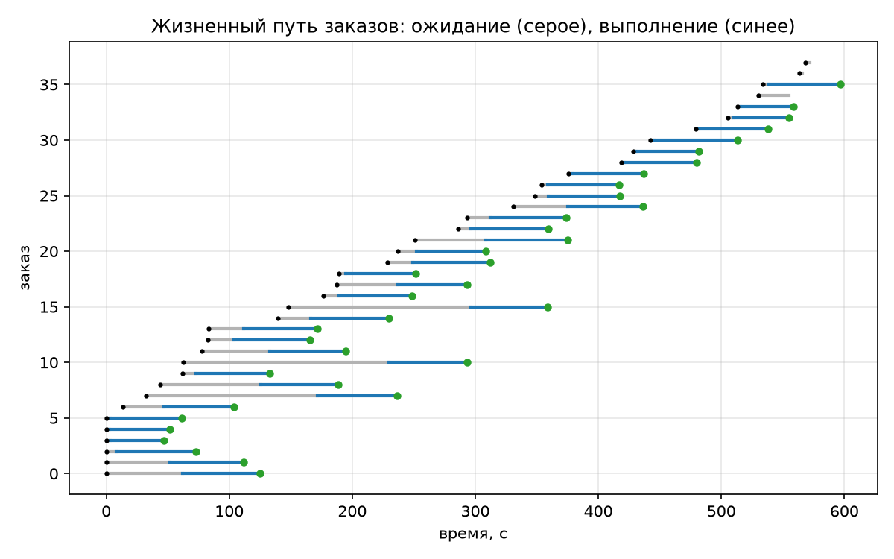
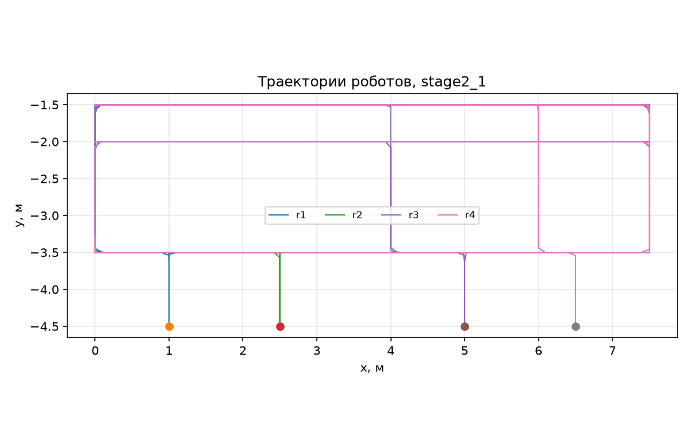

# Пример отчёта по домашнему заданию (этапы 1–2)

> **Что это.** Образец полноты и стиля: так выглядят разделы, числа и объяснения в принятом отчёте. Пример сделан на **эталонном решении** и на конфигурации по умолчанию (4 робота, вместимость пакета 3, дальность радио 4 м, поток 0,05 заказа в секунду), поэтому числа в вашем отчёте будут другими — у вас свой вариант и своё зерно. Копировать текст примера нельзя: совпадающие формулировки на защите разбираются отдельно.
>
> Пример охватывает этапы 1 и 2. Этапы 3 и 4 в отчёте оформляются так же: постановка — что сделано — числа — объяснение.

---

## 1. Задача и требования

Группа из четырёх мобильных роботов обслуживает склад 10 × 16 клеток по 0,5 м: заказы «забрать груз на станции приёмки P1…P3 — доставить на станцию отгрузки D1…D3» появляются пуассоновским потоком со средней интенсивностью 0,05 заказа в секунду (3 заказа в минуту) и заранее не известны.

Распределённость системы означает три вещи. Во-первых, решение о том, кто выполняет заказ, принимают сами роботы, обмениваясь состояниями по радио с дальностью 4 м. Во-вторых, ни один узел не имеет полной картины: складская система публикует список открытых заказов, но не назначает исполнителей. В-третьих, отказ любого робота не останавливает остальных.

Проверяемые требования — Р1…Р6 из задания. В этом отчёте проверены Р1, Р2, Р5 и Р6; Р3 (отсутствие конфликтов путей) и Р4 (возврат заказов отказавшего) относятся к этапу 3 и здесь только измерены как исходное состояние.

## 2. Исходные данные

| Параметр | Значение |
|---|---|
| Вариант, зерно | пример, `seed = 1` |
| Роботов | 4 (r1…r4), стоянки H1, H2, H3, H4 |
| Вместимость пакета CBBA, дисконт | 3 заказа, λ = 0,98 |
| Дальность радио, потери, задержка | 4 м, 0 %, 0,05 с |
| Скорость робота, время погрузки | 0,3 м/с, 3 с |
| Поток заказов | 0,05 1/с, 6 заказов в начальной партии |
| Длительность прогона | 600 с модельного времени, ускорение 8× |
| Версии | Ubuntu 24.04, ROS 2 Jazzy, Python 3.12 |

## 3. Этап 1. Архитектура и модель

### 3.1. Четыре уровня управления

Система собрана из четырёх уровней; каждый уровень живёт в своём узле ROS 2, и это позволяет менять уровни независимо — на этапе 4 заменяется только исполнительный.

| Уровень | Узел | Вход | Выход |
|---|---|---|---|
| логический | `cbba` | `/fleet/orders`, состояния соседей по радио | `assign` — закреплённый заказ |
| стратегический | `executor` | `assign`, результаты действий | действия `goto`, `handle`; события `/fleet/events` |
| тактический | (этап 3) `traffic` | заявки соседей по радио | действие `drive` |
| исполнительный | симулятор `sim2d` (этап 4 — Nav2 в Webots) | `drive` | движение робота, `pose` |

Обмен разделён сознательно: **по радио** идёт только то, что роботы решают между собой (состояния CBBA, заявки на клетки) — с ограниченной дальностью, потерями и задержкой; **по складской сети** идут публикация заказов и отчёты о выполнении. Это не нарушает распределённости: источник заказов играет роль системы управления складом, он не выбирает исполнителя и не разрешает конфликты. Если его выключить, уже выданные заказы будут выполнены.

### 3.2. Склад

Карта задана в `warehouse.yaml`: три ряда стеллажей, сквозные проходы, станции приёмки на левом краю, отгрузки — на правом, стоянки — в нижнем ряду. Клетка (r, c) соответствует точке (c · 0,5; −r · 0,5) м, робот считается в клетке, если он ближе к её центру, чем к соседним.

Расстояния между станциями считаются не по прямой, а по кратчайшему пути на сетке (`Warehouse.distance`, A* с кэшированием): для оценки маршрута в CBBA это принципиально — прямая проходит сквозь стеллажи и занижает время в полтора-два раза.

### 3.3. Метрики

| Метрика | Как считается | Зачем |
|---|---|---|
| пропускная способность, заказ/мин | доставлено / длительность | основной показатель склада |
| время выполнения заказа, с | от появления до доставки | качество обслуживания |
| ожидание закрепления, с | от появления до взятия в работу | загруженность флота |
| двойные закрепления | число заказов, взятых в работу двумя роботами | нарушение Р1 |
| конфликты путей | число событий «два робота в одной клетке» | нарушение Р3 |

Все метрики считает узел `order_source` и пишет в `result.json` и `orders.csv`; траектории — в `positions.csv`.

### 3.4. План испытаний

Три конфигурации по три зерна (1, 2, 3), прогон 600 с модельного времени: этап 2 (без координации движения), этап 3 (резервирование клеток), этап 3 с отказом робота r2 на 300-й секунде. В этом отчёте приведены результаты первой конфигурации и, для сравнения, итог второй.

## 4. Этап 2. Распределение заказов и поведение робота

### 4.1. CBBA на потоке заказов

Каждый робот держит пакет (до трёх заказов), маршрут их объезда и два вектора: известную наибольшую ставку по каждому заказу и известного победителя. Раз в 0,5 с агент дополняет пакет, сливает своё знание с состояниями соседей и рассылает результат.

Ставка — предельная выгода: насколько вырастет оценка маршрута Σ R · λ^t при лучшей вставке заказа, где t — время прибытия с учётом того, где робот освободится и когда. Дисконт λ = 0,98 означает, что заказ, выполненный через 100 с, стоит 0,98¹⁰⁰ ≈ 0,13 своей награды: далёкие заказы обесцениваются, и робот берёт ближние — именно это свойство (убывающая предельная выгода) требуется CBBA для сходимости.

Три отличия от ПР3, продиктованные потоком заказов:

1. **Появление.** Новый заказ приходит в `/fleet/orders`, добавляется со ставкой 0 и без победителя.
2. **Закрепление.** Когда робот берёт заказ в работу, заказ выходит из аукциона: он попадает в множество `committed`, которое рассылается вместе с состоянием. Сосед, узнав об этом, убирает заказ из своего пакета. Без этого два робота продолжали бы торговаться за уже выполняемый заказ.
3. **Момент закрепления.** Робот закрепляет заказ, только если он свободен, выиграл первый заказ маршрута и выигрыш держится не меньше 2 с (`commit_after`), и не раньше чем через 3 с после старта (прогрев: до первого обмена соседи «не существуют»). Это плата за распределённость: мгновенное закрепление даёт двойные закрепления, слишком долгое ожидание — простой.

### 4.2. Автомат исполнителя

Автомат нарисован до кода (рисунок 1) и затем реализован один в один.

```
            order                arrived              handled
  IDLE ─────────────► TO_PICKUP ─────────► LOADING ──────────┐
   ▲  ◄── no_orders ──┐   │ nav_failed(≤N): goto             │
   │                  │   │ nav_failed(>N): release          ▼
 TO_HOME ◄─ no_orders │   └──────────────────────────► TO_DROP
   │  arrived         │                                  │ arrived
   └──────────────────┘                                  ▼
                                                     UNLOADING
                          stop (из любого состояния)      │ handled: delivered
                                   ▼                      ▼
                                FAILED ◄── reset ───────► IDLE
```

Рисунок 1 — Состояния исполнителя

Два решения, которые видно в таблице переходов:

- **До погрузки и после погрузки отказ навигации обрабатывается по-разному.** Не доехав до приёмки, робот повторяет попытку один раз, а затем возвращает заказ в аукцион: заказ ничей, его может взять сосед. Не доехав до отгрузки, робот повторяет попытку без ограничения: груз уже на борту, вернуть его в аукцион нельзя — это был бы «потерянный» заказ, числящийся открытым, но физически лежащий на роботе.
- **Аварийный останов не отменяет обязательств.** По `stop` робот переходит в FAILED; если груз ещё не взят, заказ освобождается, если взят — остаётся за роботом, и после `reset` робот доставляет его. Так требование Р1 выполняется и при отказах.

### 4.3. Результаты этапа 2

Таблица 1 — Прогоны без координации движения (600 с, три зерна)

| Зерно | Создано | Доставлено | Заказ/мин | Время выполнения, с (среднее / наибольшее) | Ожидание закрепления, с | Двойных закреплений | Конфликтов путей |
|---|---|---|---|---|---|---|---|
| 1 | 38 | 35 | 3,50 | 90,7 / 230,8 | 30,3 | 1 | 116 |
| 2 | 26 | 23 | 2,30 | 68,1 / 125,0 | 12,0 | 1 | 24 |
| 3 | 29 | 27 | 2,70 | 75,2 / 116,5 | 15,8 | 2 | 32 |
| среднее | 31 | 28,3 | 2,84 | 78,0 / 157,4 | 19,4 | 1,3 | 57,3 |



Рисунок 2 — Жизненный путь заказов (зерно 1): ожидание закрепления (серое) и выполнение (синее)



Рисунок 3 — Траектории роботов за прогон (зерно 1)

**Пропускная способность.** При зерне 1 поступило 38 заказов (3,8 в минуту) и доставлено 35 — 3,5 заказа в минуту; к концу прогона открытых заказов не осталось, очередь не растёт. Разброс между зёрнами объясняется потоком: пуассоновский поток при среднем 3 заказа в минуту дал от 26 до 38 заказов за прогон, и доставлено было почти всё поступившее. Среднее время выполнения 90,7 с складывается из ожидания закрепления (30,3 с) и собственно выполнения (60,4 с). Второе почти совпадает с расчётом: средний путь «стоянка → приёмка → отгрузка» на этой карте 13,5 м, при 0,3 м/с это 45 с, плюс 6 с на погрузку и разгрузку, плюс маневрирование — 55–60 с.

**Ожидание закрепления** — не задержка алгоритма, а следствие загрузки: заказ ждёт, пока освободится робот. Это видно и по разбросу: при 38 заказах ожидание 30,3 с, при 26 заказах — 12,0 с, то есть оно растёт вместе с потоком, а не с числом роботов. На рисунке 2 серые отрезки длиннее в начале прогона, когда шесть заказов начальной партии делятся между четырьмя роботами.

**Двойное закрепление (Р1).** За прогон — одно-два (по зёрнам: 1, 1, 2). При зерне 1 это заказ o034, который закрепили r4 и r2. Причина не в ошибке алгоритма, а в связности: при дальности радио 4 м робот у станции P1 и робот у D3 друг друга не слышат (диагональ склада 8,8 м), граф связи распадается, и оба считают себя победителями. Это ровно то условие, при котором CBBA теряет гарантию бесконфликтности (§10.4.3 пособия: требуется связный граф связи). Проверка гипотезы: те же три прогона с дальностью радио 8 м (диагональ склада перекрыта полностью) — двойных закреплений **ни одного** при том же числе доставленных заказов (36, 23, 27 против 35, 23, 27). Инженерных решения три: увеличить дальность связи, ввести ретрансляцию через соседей (★2) или разрешать уже возникший конфликт закрепления по старшинству (★1). В самой системе сделано другое, более дешёвое: робот закрепляет заказ, только когда все свежие соседи подтвердили его выигрыш свежим сообщением, — это убирает двойные закрепления от задержек, но не спасает, когда сосед вне зоны связи.

**Конфликты путей (Р3).** 116 событий «два робота в одной клетке» за 600 с — роботы на этом этапе проезжают друг сквозь друга, потому что координации движения ещё нет. Это и есть постановка задачи этапа 3; заодно число даёт масштаб: без координации на складе происходило бы столкновение каждые 5 секунд (в среднем по трём зёрнам — каждые 10 секунд).

**Требование Р6 (воспроизводимость).** Два прогона с одним зерном дали одинаковые заказы и одинаковые метрики; при изменении зерна меняется поток заказов, но не поведение системы.

## 5. Выводы по этапам 1–2

1. Флот из четырёх роботов справляется с потоком до 3,8 заказа в минуту: доставлено 35 из 38 поступивших заказов, очередь к концу прогона пуста. Узкое место — не алгоритм распределения, а время проезда.
2. Ожидание закрепления (30 с при наибольшем потоке) вдвое меньше времени выполнения (60 с) и падает до 12 с при меньшем потоке: распределение не является узким местом при такой загрузке.
3. Требование Р1 нарушается при дальности радио 4 м: связность графа обмена — не «деталь связи», а условие корректности CBBA.
4. Без координации движения система непригодна физически: 106 конфликтов за 10 минут.
5. Разделение уровней оправдало себя: логика распределения не знает, кто везёт робота, — это позволит на этапе 4 подставить Nav2 без правок.

## Приложение А. Воспроизведение

```bash
git checkout hw2
cd urrts_ws && colcon build --symlink-install && source install/setup.bash
python3 -m pytest src/urrts_fleet/test -q
ros2 launch urrts_bringup fleet_sim.launch.py seed:=1 duration:=600 time_scale:=8 \
    log_dir:=~/urrts_logs/e2_1
python3 plot_run.py ~/urrts_logs/e2_1 --out reports/hw/figures
```
